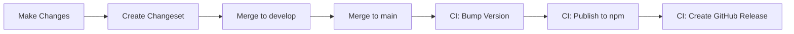
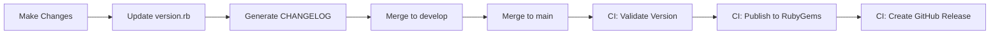

# Versioning & Release Guide

This monorepo uses independent versioning for JavaScript and Ruby packages, allowing each to have its own release cycle.

## Overview

- **JavaScript Package**: Automated versioning with [Changesets](https://github.com/changesets/changesets)
- **Ruby Package**: Manual versioning with automated CHANGELOG generation
- **Base Branch**: `develop` (all PRs and changesets target this branch)
- **Release Branch**: `main` (releases happen from this branch)

## Current Versions

- JavaScript (npm): `0.2.0`
- Ruby (gem): `0.1.0`

## JavaScript Package Versioning

### JavaScript Quick Start

```bash
# 1. Make your changes
# 2. Create a changeset
pnpm changeset

# 3. Follow the prompts to describe your changes
# 4. Commit the changeset file
git add .changeset/*.md
git commit -m "chore: add changeset"

# 5. Push and merge to develop
git push origin your-branch

# 6. When ready to release, merge develop to main
# The CI will automatically:
#   - Bump version in package.json
#   - Update CHANGELOG.md
#   - Publish to npm
#   - Create GitHub release
```

### Changeset Types

- **patch**: Bug fixes, small changes (0.1.0 → 0.1.1)
- **minor**: New features, backward compatible (0.1.0 → 0.2.0)
- **major**: Breaking changes (0.1.0 → 1.0.0)

### Commands

```bash
# Check what versions will be released
pnpm release:status

# Preview upcoming releases
pnpm release:preview

# Verify release requirements
pnpm release:check

# Create version bump (normally done by CI)
pnpm release:version
```

## Ruby Package Versioning

### Ruby Quick Start

```bash
# 1. Update version in version.rb
vim packages/ruby/lib/nats_pubsub/version.rb
# Change VERSION = '0.1.0' to VERSION = '0.2.0'

# 2. Generate CHANGELOG entry (automatic mode)
pnpm ruby:changelog

# OR use interactive mode
pnpm ruby:changelog:interactive

# 3. Commit changes
git add packages/ruby/lib/nats_pubsub/version.rb
git add packages/ruby/CHANGELOG.md
git commit -m "chore: bump ruby version to 0.2.0"

# 4. Push and merge to develop, then main
# The CI will automatically:
#   - Validate version bump
#   - Build gem
#   - Publish to RubyGems
#   - Create GitHub release
```

### CHANGELOG Generation

The `ruby-changelog.sh` script helps maintain changelogs:

**Automatic Mode** (generates from git history):

```bash
./scripts/ruby-changelog.sh
# or
pnpm ruby:changelog
```

**Interactive Mode** (prompts for details):

```bash
./scripts/ruby-changelog.sh -i
# or
pnpm ruby:changelog:interactive
```

**Specific Version**:

```bash
./scripts/ruby-changelog.sh 0.2.0
```

### Manual CHANGELOG Editing

You can always edit [packages/ruby/CHANGELOG.md](packages/ruby/CHANGELOG.md) manually:

```markdown
## [0.2.0] - 2025-01-17

### Added

- New feature X
- Support for Y

### Fixed

- Bug in Z component
```

## Version Validation

Pre-commit hooks automatically validate version changes:

```bash
# Manually validate versions
pnpm validate:versions

# Or run directly
./scripts/validate-versions.sh
```

The validator checks:

- ✅ Semver format (X.Y.Z)
- ✅ Version increments (new > old)
- ✅ Changesets for JS version bumps
- ⚠️ CHANGELOG updates for Ruby version bumps

## Release Workflow

### For JavaScript Package



1. Create feature branch from `develop`
2. Make changes and create changeset: `pnpm changeset`
3. Commit and push changeset file
4. Create PR to `develop`
5. Merge to `develop`
6. When ready, merge `develop` to `main`
7. CI automatically publishes

### For Ruby Package



1. Create feature branch from `develop`
2. Make changes
3. Update `packages/ruby/lib/nats_pubsub/version.rb`
4. Generate CHANGELOG: `pnpm ruby:changelog`
5. Commit and push
6. Create PR to `develop`
7. Merge to `develop`
8. When ready, merge `develop` to `main`
9. CI automatically publishes

## Release Checklist

Before releasing:

- [ ] All tests pass
- [ ] Build succeeds
- [ ] Version bumped correctly
- [ ] CHANGELOG updated
- [ ] No uncommitted changes
- [ ] On `main` branch
- [ ] Security audit passed

Run the automated check:

```bash
pnpm release:check
```

## Git Tags

Tags follow this format:

- JavaScript: `javascript-v0.2.0`
- Ruby: `ruby-v0.1.0`

CI automatically creates tags during release.

## GitHub Releases

Each release creates:

- Git tag
- GitHub Release with notes
- Published package (npm/RubyGems)
- Build artifacts (for Ruby gem)

## Troubleshooting

### Changeset not detected

```bash
# Check changeset status
pnpm changeset:status

# List changesets
ls -la .changeset/*.md
```

### Version validation fails

```bash
# Check current versions
pnpm release:status

# Validate manually
pnpm validate:versions
```

### Publishing fails

Check:

1. Credentials configured (NPM_TOKEN, RubyGems OIDC)
2. Version doesn't exist on registry
3. Build artifacts present
4. No network issues

```bash
# Verify npm package
npm view nats-pubsub

# Verify Ruby gem
gem list -r nats_pubsub
```

## Configuration Files

- [.changeset/config.json](.changeset/config.json) - Changesets configuration
- [pnpm-workspace.yaml](pnpm-workspace.yaml) - Workspace packages
- [.github/workflows/release.yml](.github/workflows/release.yml) - Release automation
- [scripts/](scripts/) - Helper scripts

## Best Practices

1. **Always create changesets** for JavaScript changes
2. **Update CHANGELOG** when bumping Ruby version
3. **Test locally** before pushing
4. **Use semantic versioning** correctly
5. **Keep changes atomic** - one logical change per commit
6. **Review release notes** before publishing

## References

- [Changesets Documentation](https://github.com/changesets/changesets)
- [Semantic Versioning](https://semver.org/)
- [Keep a Changelog](https://keepachangelog.com/)
- [Conventional Commits](https://www.conventionalcommits.org/)
