# NatsPubsub Architecture Guide

This comprehensive guide explores the architecture of NatsPubsub, including system design, component breakdown, message flow, reliability patterns, and design decisions.

## Table of Contents

- [Overview](#overview)
- [System Architecture](#system-architecture)
- [Component Architecture](#component-architecture)
- [Message Flow Architecture](#message-flow-architecture)
- [Reliability Patterns](#reliability-patterns)
- [Stream and Consumer Architecture](#stream-and-consumer-architecture)
- [Connection Management](#connection-management)
- [Concurrency Model](#concurrency-model)
- [Topology Management](#topology-management)
- [Design Decisions](#design-decisions)
- [Scaling Architecture](#scaling-architecture)
- [Deployment Architectures](#deployment-architectures)

---

## Overview

NatsPubsub is a production-ready pub/sub library built on NATS JetStream, designed with reliability, scalability, and developer experience as core principles.

### Architecture Principles

1. **Reliability First**: Built-in patterns for message delivery guarantees
2. **Declarative API**: Clean, intuitive interfaces for publishers and subscribers
3. **SOLID Principles**: Modular, testable, and maintainable code
4. **Polyglot Design**: Ruby and JavaScript implementations with full interoperability
5. **Cloud-Native**: Designed for distributed microservices architectures

### High-Level Architecture

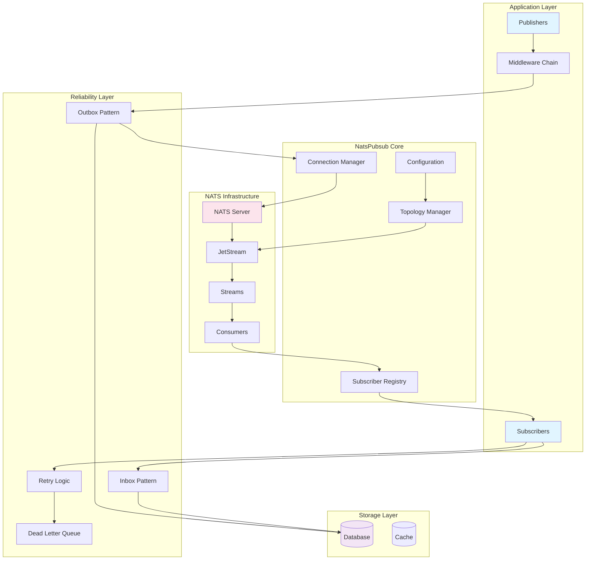
```mermaid
graph TB
    subgraph "Application Layer"
        PUB[Publishers]
        SUB[Subscribers]
        MW[Middleware Chain]
    end

    subgraph "NatsPubsub Core"
        CFG[Configuration]
        CONN[Connection Manager]
        TOP[Topology Manager]
        REG[Subscriber Registry]
    end

    subgraph "Reliability Layer"
        OUTBOX[Outbox Pattern]
        INBOX[Inbox Pattern]
        DLQ[Dead Letter Queue]
        RETRY[Retry Logic]
    end

    subgraph "NATS Infrastructure"
        NATS[NATS Server]
        JS[JetStream]
        STREAM[Streams]
        CONS[Consumers]
    end

    subgraph "Storage Layer"
        DB[(Database)]
        CACHE[(Cache)]
    end

    PUB --> MW
    MW --> OUTBOX
    OUTBOX --> CONN
    CONN --> NATS
    NATS --> JS
    JS --> STREAM
    STREAM --> CONS
    CONS --> REG
    REG --> SUB
    SUB --> INBOX
    SUB --> RETRY
    RETRY --> DLQ

    OUTBOX --> DB
    INBOX --> DB
    CFG --> TOP
    TOP --> JS

    style PUB fill:#e1f5ff
    style SUB fill:#e1f5ff
    style NATS fill:#fce4ec
    style DB fill:#f3e5f5
```

---

## System Architecture

### Layered Architecture

NatsPubsub follows a layered architecture pattern:

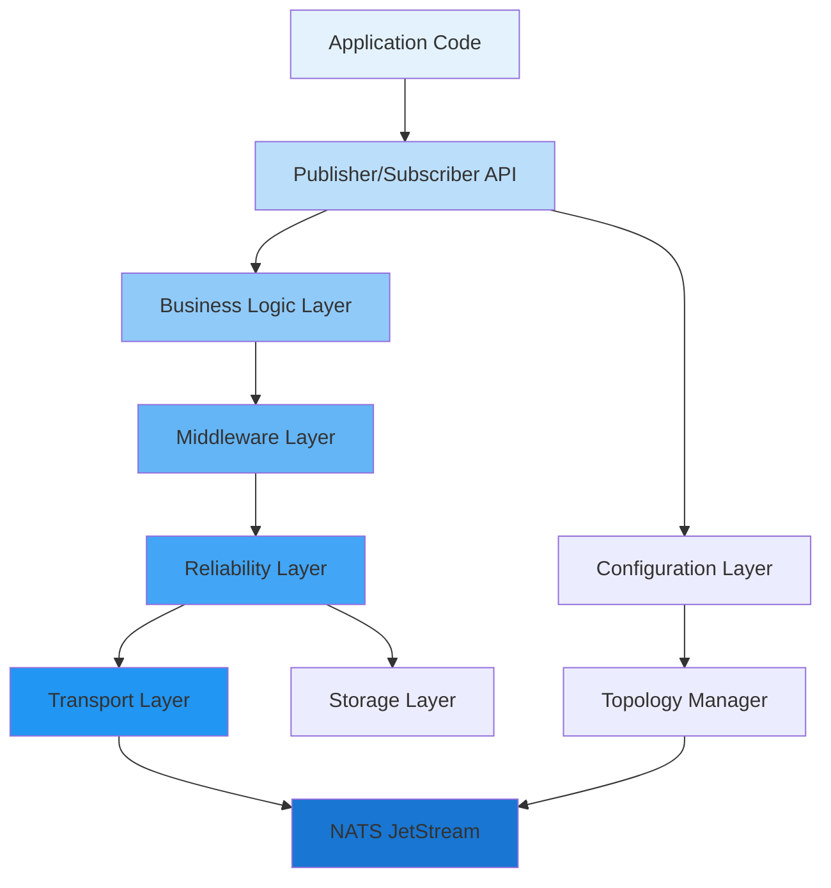
```mermaid
graph TD
    A[Application Code] --> B[Publisher/Subscriber API]
    B --> C[Business Logic Layer]
    C --> D[Middleware Layer]
    D --> E[Reliability Layer]
    E --> F[Transport Layer]
    F --> G[NATS JetStream]

    B --> H[Configuration Layer]
    H --> I[Topology Manager]
    I --> G

    E --> J[Storage Layer]

    style A fill:#e3f2fd
    style B fill:#bbdefb
    style C fill:#90caf9
    style D fill:#64b5f6
    style E fill:#42a5f5
    style F fill:#2196f3
    style G fill:#1976d2
```

#### Layer Responsibilities

1. **Application Layer**
   - Business logic
   - Message handlers
   - Domain models

2. **API Layer**
   - Publisher interface
   - Subscriber interface
   - Fluent APIs

3. **Business Logic Layer**
   - Message validation
   - Schema enforcement
   - Business rules

4. **Middleware Layer**
   - Logging
   - Metrics
   - Tracing
   - Error handling

5. **Reliability Layer**
   - Inbox/Outbox patterns
   - DLQ handling
   - Retry logic
   - Circuit breakers

6. **Transport Layer**
   - Connection management
   - Subject routing
   - Message serialization

7. **Storage Layer**
   - Database persistence
   - Cache management
   - State storage

---

## Component Architecture

### Core Components

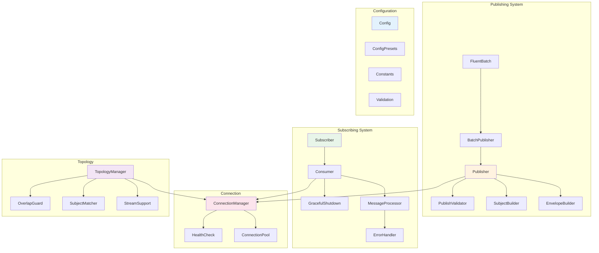
```mermaid
graph TB
    subgraph "Publishing System"
        P1[Publisher]
        P2[BatchPublisher]
        P3[FluentBatch]
        P4[EnvelopeBuilder]
        P5[SubjectBuilder]
        P6[PublishValidator]
    end

    subgraph "Subscribing System"
        S1[Subscriber]
        S2[Consumer]
        S3[MessageProcessor]
        S4[ErrorHandler]
        S5[GracefulShutdown]
    end

    subgraph "Configuration"
        C1[Config]
        C2[ConfigPresets]
        C3[Constants]
        C4[Validation]
    end

    subgraph "Connection"
        N1[ConnectionManager]
        N2[ConnectionPool]
        N3[HealthCheck]
    end

    subgraph "Topology"
        T1[TopologyManager]
        T2[StreamSupport]
        T3[SubjectMatcher]
        T4[OverlapGuard]
    end

    P1 --> P4
    P1 --> P5
    P1 --> P6
    P2 --> P1
    P3 --> P2

    S1 --> S2
    S2 --> S3
    S3 --> S4
    S2 --> S5

    P1 --> N1
    S2 --> N1
    N1 --> N2
    N1 --> N3

    T1 --> N1
    T1 --> T2
    T1 --> T3
    T1 --> T4

    style P1 fill:#fff3e0
    style S1 fill:#e8f5e9
    style C1 fill:#e3f2fd
    style N1 fill:#fce4ec
    style T1 fill:#f3e5f5
```

### Publisher Component

**Responsibilities:**

- Message publishing
- Subject building
- Envelope creation
- Validation
- Error handling

**Design Pattern:** Strategy Pattern

```typescript
// Publisher uses strategy pattern for different publish types
class Publisher {
  private connectionManager: ConnectionManager;
  private envelopeBuilder: EnvelopeBuilder;
  private subjectBuilder: SubjectBuilder;
  private validator: PublishValidator;

  // Strategy: Publish to topic
  async publishToTopic(topic: string, message: any): Promise<PublishResult>;

  // Strategy: Publish to multiple topics
  async publishToMultipleTopics(
    params: MultiTopicParams,
  ): Promise<MultiTopicPublishResult>;

  // Strategy: Publish with domain/resource/action
  async publishDomainResourceAction(
    params: DomainResourceActionParams,
  ): Promise<PublishResult>;
}
```

**Key Features:**

- Dependency injection for testability
- Fluent API for batch operations
- Automatic subject building
- Message envelope wrapping
- Validation before publish

### Subscriber Component

**Responsibilities:**

- Message consumption
- Message processing
- Error handling
- Acknowledgment
- Retry logic

**Design Pattern:** Template Method Pattern

```typescript
// Subscriber uses template method pattern
abstract class Subscriber {
  // Template method
  async call(
    event: Record<string, unknown>,
    metadata: EventMetadata,
  ): Promise<void> {
    // 1. Pre-processing (implemented by base class)
    await this.preProcess(metadata);

    // 2. Handle (implemented by subclass)
    await this.handle(event, metadata);

    // 3. Post-processing (implemented by base class)
    await this.postProcess(metadata);
  }

  // Hook method - must be implemented by subclass
  abstract handle(
    event: Record<string, unknown>,
    metadata: EventMetadata,
  ): Promise<void>;
}
```

**Key Features:**

- Declarative subscription syntax
- Automatic consumer creation
- Concurrent message processing
- Middleware support
- Error boundaries

### Consumer Component

**Responsibilities:**

- JetStream consumer management
- Message fetching
- Concurrency control
- Backpressure handling
- Graceful shutdown

**Design Pattern:** Observer Pattern

```typescript
class Consumer {
  private subscriptions: Map<string, ConsumerSubscription>;
  private processing: Set<string>;
  private concurrency: number;

  // Observer pattern - notify on message
  async startConsuming(subscriber: Subscriber): Promise<void> {
    // Create consumer
    const consumer = await this.createConsumer(subscriber);

    // Observe messages
    for await (const msg of consumer) {
      await this.processMessage(msg, subscriber);
    }
  }
}
```

### Configuration Component

**Responsibilities:**

- Configuration management
- Preset application
- Validation
- Environment detection

**Design Pattern:** Singleton Pattern

```typescript
// Configuration singleton
class Config {
  private static instance: Config;
  private config: NatsPubsubConfig;

  public static getInstance(): Config {
    if (!Config.instance) {
      Config.instance = new Config();
    }
    return Config.instance;
  }

  public configure(options: Partial<NatsPubsubConfig>): void;
  public configureWithPreset(
    preset: PresetName,
    overrides?: Partial<NatsPubsubConfig>,
  ): void;
  public get(): NatsPubsubConfig;
  public validate(): void;
}
```

### Connection Manager

**Responsibilities:**

- NATS connection lifecycle
- Connection pooling
- Reconnection logic
- Health checking

**Design Pattern:** Object Pool Pattern

```typescript
class ConnectionManager {
  private connection: NatsConnection | null;
  private reconnecting: boolean;
  private healthCheckInterval: NodeJS.Timeout;

  async connect(): Promise<void>;
  async disconnect(): Promise<void>;
  async reconnect(): Promise<void>;
  getJetStream(): JetStreamClient;
  isHealthy(): boolean;
}
```

### Topology Manager

**Responsibilities:**

- Stream creation
- Consumer setup
- Subject routing
- Overlap detection

**Design Pattern:** Builder Pattern

```typescript
class TopologyManager {
  private streamManager: StreamManager;
  private consumerManager: ConsumerManager;
  private overlapGuard: OverlapGuard;

  async ensureStream(config: StreamConfig): Promise<void>;
  async ensureConsumer(config: ConsumerConfig): Promise<void>;
  async validateTopology(): Promise<ValidationResult>;
}
```

---

## Message Flow Architecture

### Publishing Flow

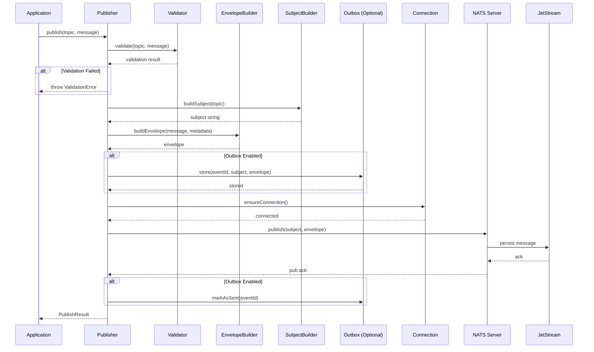
```mermaid
sequenceDiagram
    participant App as Application
    participant Pub as Publisher
    participant Val as Validator
    participant Env as EnvelopeBuilder
    participant Sub as SubjectBuilder
    participant Out as Outbox (Optional)
    participant Conn as Connection
    participant NATS as NATS Server
    participant JS as JetStream

    App->>Pub: publish(topic, message)
    Pub->>Val: validate(topic, message)
    Val-->>Pub: validation result

    alt Validation Failed
        Pub-->>App: throw ValidationError
    end

    Pub->>Sub: buildSubject(topic)
    Sub-->>Pub: subject string

    Pub->>Env: buildEnvelope(message, metadata)
    Env-->>Pub: envelope

    alt Outbox Enabled
        Pub->>Out: store(eventId, subject, envelope)
        Out-->>Pub: stored
    end

    Pub->>Conn: ensureConnection()
    Conn-->>Pub: connected

    Pub->>NATS: publish(subject, envelope)
    NATS->>JS: persist message
    JS-->>NATS: ack
    NATS-->>Pub: pub ack

    alt Outbox Enabled
        Pub->>Out: markAsSent(eventId)
    end

    Pub-->>App: PublishResult
```

### Subscribing Flow

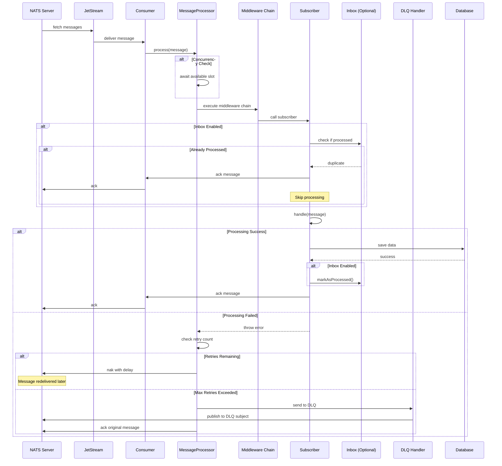
```mermaid
sequenceDiagram
    participant NATS as NATS Server
    participant JS as JetStream
    participant Cons as Consumer
    participant Proc as MessageProcessor
    participant MW as Middleware Chain
    participant Sub as Subscriber
    participant Inbox as Inbox (Optional)
    participant DLQ as DLQ Handler
    participant DB as Database

    NATS->>JS: fetch messages
    JS->>Cons: deliver message

    Cons->>Proc: process(message)

    alt Concurrency Check
        Proc->>Proc: await available slot
    end

    Proc->>MW: execute middleware chain

    MW->>Sub: call subscriber

    alt Inbox Enabled
        Sub->>Inbox: check if processed

        alt Already Processed
            Inbox-->>Sub: duplicate
            Sub->>Cons: ack message
            Cons->>NATS: ack
            Note over Sub: Skip processing
        end
    end

    Sub->>Sub: handle(message)

    alt Processing Success
        Sub->>DB: save data
        DB-->>Sub: success

        alt Inbox Enabled
            Sub->>Inbox: markAsProcessed()
        end

        Sub->>Cons: ack message
        Cons->>NATS: ack
    else Processing Failed
        Sub-->>Proc: throw error
        Proc->>Proc: check retry count

        alt Retries Remaining
            Proc->>NATS: nak with delay
            Note over NATS: Message redelivered later
        else Max Retries Exceeded
            Proc->>DLQ: send to DLQ
            DLQ->>NATS: publish to DLQ subject
            Proc->>NATS: ack original message
        end
    end
```

### Batch Publishing Flow

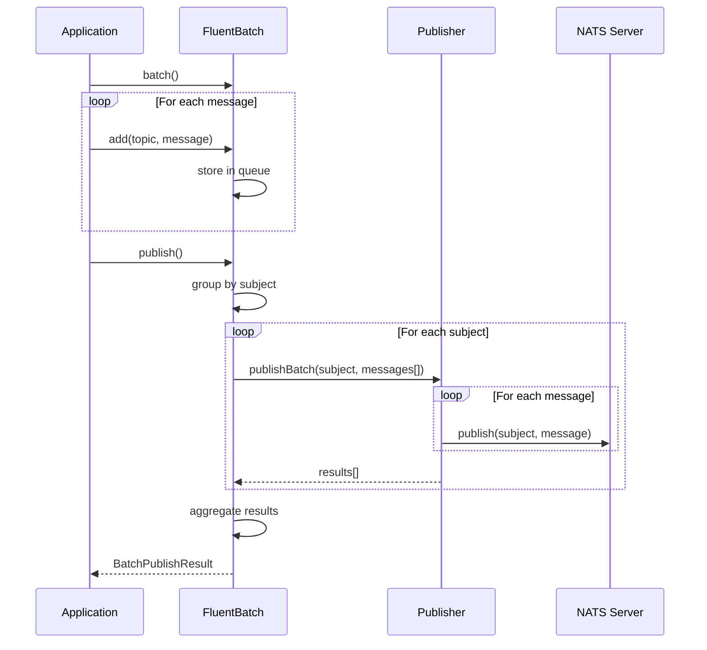
```mermaid
sequenceDiagram
    participant App as Application
    participant Batch as FluentBatch
    participant Pub as Publisher
    participant NATS as NATS Server

    App->>Batch: batch()

    loop For each message
        App->>Batch: add(topic, message)
        Batch->>Batch: store in queue
    end

    App->>Batch: publish()

    Batch->>Batch: group by subject

    loop For each subject
        Batch->>Pub: publishBatch(subject, messages[])

        loop For each message
            Pub->>NATS: publish(subject, message)
        end

        Pub-->>Batch: results[]
    end

    Batch->>Batch: aggregate results
    Batch-->>App: BatchPublishResult
```

---

## Reliability Patterns

### Outbox Pattern Architecture

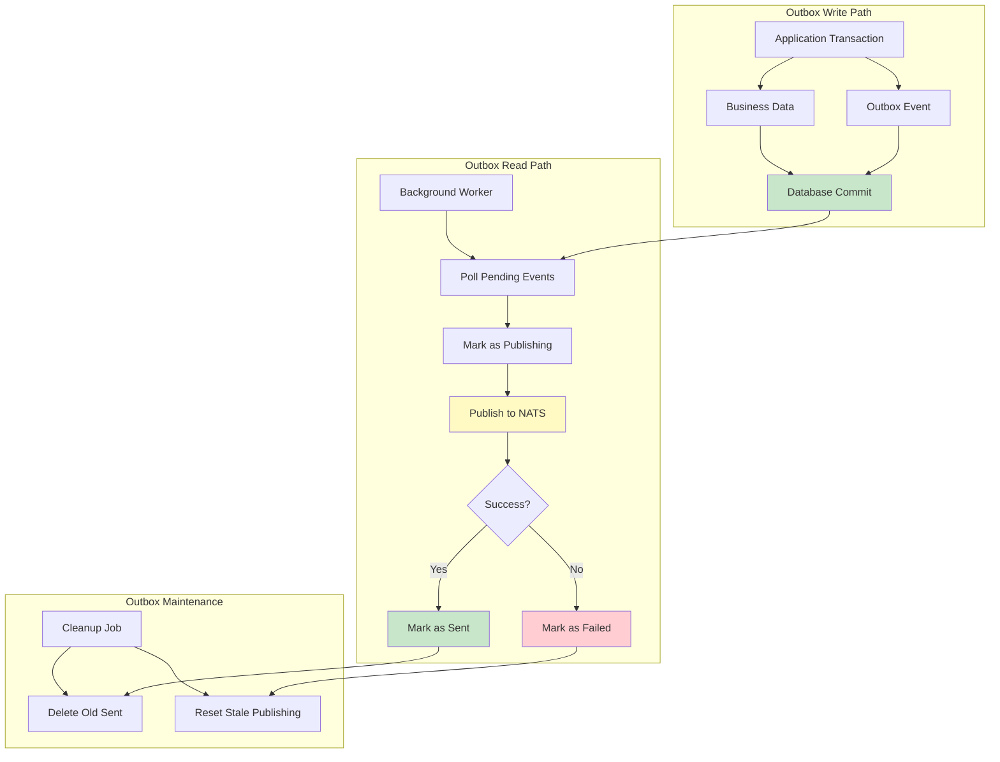
```mermaid
graph TB
    subgraph "Outbox Write Path"
        A[Application Transaction] --> B[Business Data]
        A --> C[Outbox Event]
        B --> D[Database Commit]
        C --> D
    end

    subgraph "Outbox Read Path"
        E[Background Worker] --> F[Poll Pending Events]
        F --> G[Mark as Publishing]
        G --> H[Publish to NATS]
        H --> I{Success?}
        I -->|Yes| J[Mark as Sent]
        I -->|No| K[Mark as Failed]
    end

    subgraph "Outbox Maintenance"
        L[Cleanup Job] --> M[Delete Old Sent]
        L --> N[Reset Stale Publishing]
    end

    D --> F
    J --> M
    K --> N

    style D fill:#c8e6c9
    style H fill:#fff9c4
    style J fill:#c8e6c9
    style K fill:#ffcdd2
```

**Components:**

1. **Outbox Repository**: Database access layer
2. **Outbox Publisher**: Publishing coordinator
3. **Background Worker**: Processes pending events
4. **Cleanup Service**: Maintains table health

**Guarantees:**

- At-least-once delivery
- Transactional consistency
- Ordering within transaction
- Automatic retry on failure

### Inbox Pattern Architecture

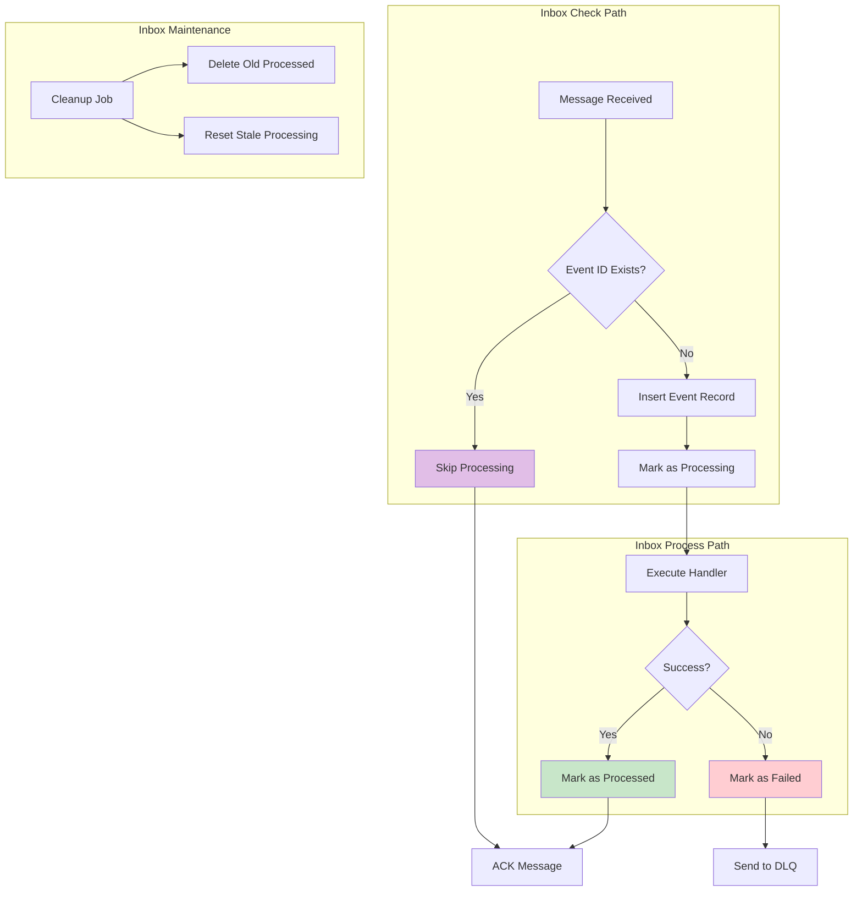
```mermaid
graph TB
    subgraph "Inbox Check Path"
        A[Message Received] --> B{Event ID Exists?}
        B -->|Yes| C[Skip Processing]
        B -->|No| D[Insert Event Record]
        D --> E[Mark as Processing]
    end

    subgraph "Inbox Process Path"
        E --> F[Execute Handler]
        F --> G{Success?}
        G -->|Yes| H[Mark as Processed]
        G -->|No| I[Mark as Failed]
    end

    subgraph "Inbox Maintenance"
        J[Cleanup Job] --> K[Delete Old Processed]
        J --> L[Reset Stale Processing]
    end

    C --> M[ACK Message]
    H --> M
    I --> N[Send to DLQ]

    style H fill:#c8e6c9
    style I fill:#ffcdd2
    style C fill:#e1bee7
```

**Components:**

1. **Inbox Repository**: Database access layer
2. **Inbox Processor**: Deduplication coordinator
3. **Cleanup Service**: Maintains table health

**Guarantees:**

- Exactly-once processing
- Idempotent operations
- Duplicate detection
- Processing history

### DLQ Architecture

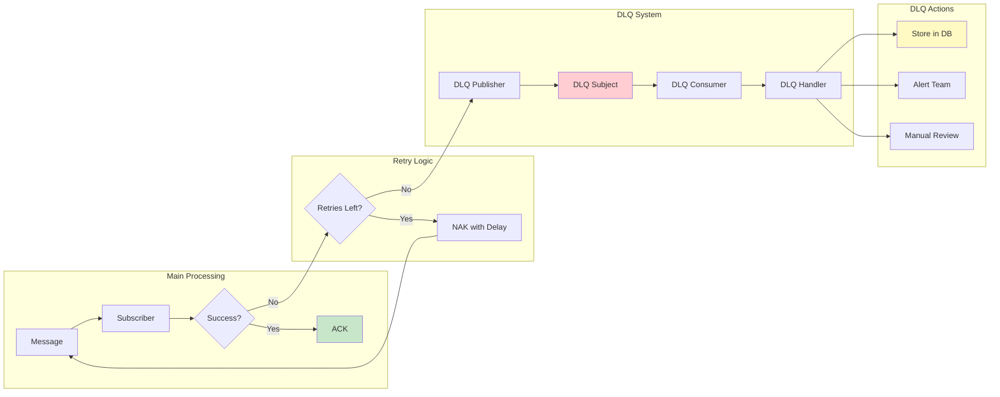
```mermaid
graph LR
    subgraph "Main Processing"
        A[Message] --> B[Subscriber]
        B --> C{Success?}
        C -->|Yes| D[ACK]
    end

    subgraph "Retry Logic"
        C -->|No| E{Retries Left?}
        E -->|Yes| F[NAK with Delay]
        F --> A
    end

    subgraph "DLQ System"
        E -->|No| G[DLQ Publisher]
        G --> H[DLQ Subject]
        H --> I[DLQ Consumer]
        I --> J[DLQ Handler]
    end

    subgraph "DLQ Actions"
        J --> K[Store in DB]
        J --> L[Alert Team]
        J --> M[Manual Review]
    end

    style D fill:#c8e6c9
    style H fill:#ffcdd2
    style K fill:#fff9c4
```

**Components:**

1. **DLQ Publisher**: Sends failed messages to DLQ
2. **DLQ Consumer**: Processes DLQ messages
3. **DLQ Handler**: Custom failure handling
4. **DLQ Storage**: Persistent failed message storage

**Features:**

- Automatic retry exhaustion detection
- Metadata preservation
- Failure reason tracking
- Manual replay capability

---

## Stream and Consumer Architecture

### Stream Hierarchy

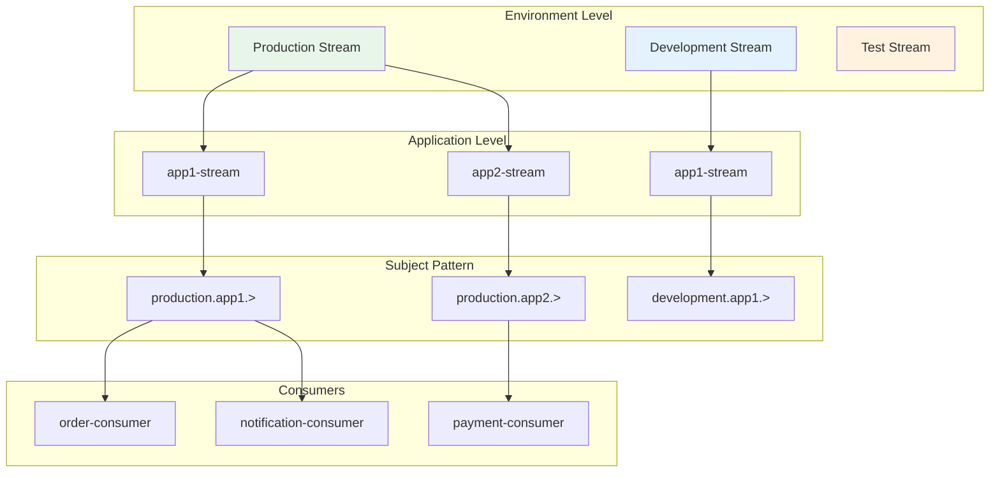
```mermaid
graph TB
    subgraph "Environment Level"
        PROD[Production Stream]
        DEV[Development Stream]
        TEST[Test Stream]
    end

    subgraph "Application Level"
        PROD --> PROD_APP1[app1-stream]
        PROD --> PROD_APP2[app2-stream]
        DEV --> DEV_APP1[app1-stream]
    end

    subgraph "Subject Pattern"
        PROD_APP1 --> S1["production.app1.>"]
        PROD_APP2 --> S2["production.app2.>"]
        DEV_APP1 --> S3["development.app1.>"]
    end

    subgraph "Consumers"
        S1 --> C1[order-consumer]
        S1 --> C2[notification-consumer]
        S2 --> C3[payment-consumer]
    end

    style PROD fill:#e8f5e9
    style DEV fill:#e3f2fd
    style TEST fill:#fff3e0
```

### Consumer Types

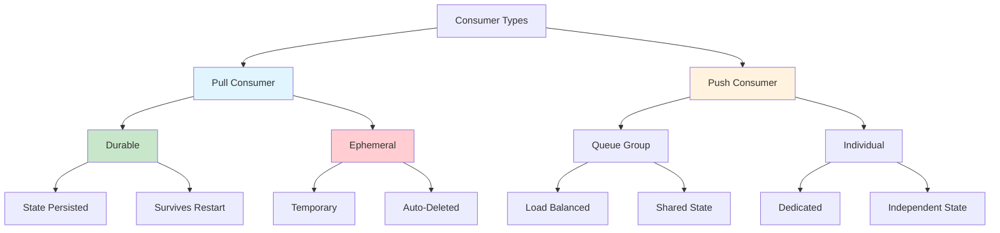
```mermaid
graph TD
    A[Consumer Types] --> B[Pull Consumer]
    A --> C[Push Consumer]

    B --> B1[Durable]
    B --> B2[Ephemeral]

    C --> C1[Queue Group]
    C --> C2[Individual]

    B1 --> D1[State Persisted]
    B1 --> D2[Survives Restart]

    B2 --> E1[Temporary]
    B2 --> E2[Auto-Deleted]

    C1 --> F1[Load Balanced]
    C1 --> F2[Shared State]

    C2 --> G1[Dedicated]
    C2 --> G2[Independent State]

    style B fill:#e1f5ff
    style C fill:#fff3e0
    style B1 fill:#c8e6c9
    style B2 fill:#ffcdd2
```

**NatsPubsub Uses:**

- **Pull Consumers**: For controlled message fetching
- **Durable**: For persistent subscriptions
- **Batch Fetching**: For high throughput

### Stream Configuration

```typescript
interface StreamConfig {
  name: string; // Stream name
  subjects: string[]; // Subject patterns
  retention: "limits" | "interest" | "workqueue";
  storage: "file" | "memory";
  replicas: number; // Replication factor
  maxMsgs: number; // Max messages
  maxBytes: number; // Max storage
  maxAge: number; // Message TTL (nanoseconds)
  maxMsgSize: number; // Max message size
  duplicateWindow: number; // Duplicate detection window
}
```

**Example:**

```typescript
const streamConfig: StreamConfig = {
  name: "production-events-stream",
  subjects: ["production.app.>"],
  retention: "interest", // Delete after all consumers ACK
  storage: "file", // Persistent storage
  replicas: 3, // High availability
  maxMsgs: 1000000, // 1M messages max
  maxBytes: 10 * 1024 * 1024 * 1024, // 10GB
  maxAge: 7 * 24 * 3600 * 1e9, // 7 days
  maxMsgSize: 1024 * 1024, // 1MB per message
  duplicateWindow: 2 * 60 * 1e9, // 2 minutes
};
```

### Consumer Configuration

```typescript
interface ConsumerConfig {
  durable_name: string; // Consumer name
  filter_subject: string; // Subject filter
  deliver_policy:
    | "all"
    | "last"
    | "new"
    | "by_start_sequence"
    | "by_start_time";
  ack_policy: "explicit" | "none" | "all";
  ack_wait: number; // ACK timeout (nanoseconds)
  max_deliver: number; // Max delivery attempts
  max_ack_pending: number; // Max unacked messages
  replay_policy: "instant" | "original";
}
```

**Example:**

```typescript
const consumerConfig: ConsumerConfig = {
  durable_name: "order-processor",
  filter_subject: "production.app.order.*",
  deliver_policy: "all", // Deliver all messages
  ack_policy: "explicit", // Explicit ACK required
  ack_wait: 30 * 1e9, // 30 seconds
  max_deliver: 5, // 5 attempts
  max_ack_pending: 100, // 100 concurrent messages
  replay_policy: "instant", // Deliver as fast as possible
};
```

---

## Connection Management

### Connection Lifecycle

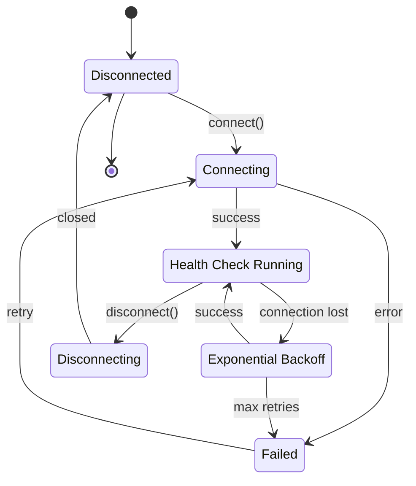
```mermaid
stateDiagram-v2
    [*] --> Disconnected
    Disconnected --> Connecting: connect()
    Connecting --> Connected: success
    Connecting --> Failed: error
    Failed --> Connecting: retry
    Connected --> Reconnecting: connection lost
    Reconnecting --> Connected: success
    Reconnecting --> Failed: max retries
    Connected --> Disconnecting: disconnect()
    Disconnecting --> Disconnected: closed
    Disconnected --> [*]

    Connected: Health Check Running
    Reconnecting: Exponential Backoff
```

### Connection Pool

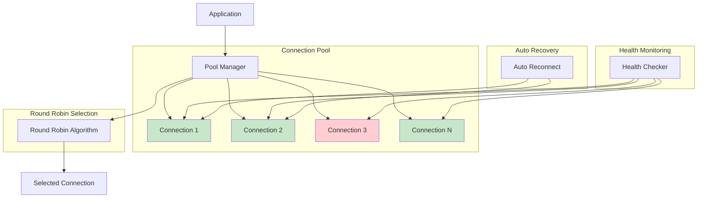
```mermaid
graph TB
    subgraph "Connection Pool"
        P1[Pool Manager]
        P1 --> C1[Connection 1]
        P1 --> C2[Connection 2]
        P1 --> C3[Connection 3]
        P1 --> CN[Connection N]
    end

    subgraph "Round Robin Selection"
        RR[Round Robin Algorithm]
    end

    subgraph "Health Monitoring"
        HC[Health Checker]
        HC --> C1
        HC --> C2
        HC --> C3
        HC --> CN
    end

    subgraph "Auto Recovery"
        AR[Auto Reconnect]
        AR --> C1
        AR --> C2
    end

    APP[Application] --> P1
    P1 --> RR
    RR --> SELECT[Selected Connection]

    style C1 fill:#c8e6c9
    style C2 fill:#c8e6c9
    style C3 fill:#ffcdd2
    style CN fill:#c8e6c9
```

**Features:**

- Round-robin connection selection
- Automatic health checking
- Connection recovery
- Graceful degradation

### Health Check System

```typescript
class HealthCheckSystem {
  private checks: Map<string, HealthCheck>;

  // Register health checks
  registerCheck(name: string, check: HealthCheck): void;

  // Run all health checks
  async runChecks(): Promise<HealthStatus>;

  // Individual checks
  async checkConnection(): Promise<boolean>;
  async checkJetStream(): Promise<boolean>;
  async checkDatabase(): Promise<boolean>;
  async checkDependencies(): Promise<boolean>;
}
```

**Health Check Types:**

1. **Liveness**: Is the service running?
2. **Readiness**: Can the service handle requests?
3. **Startup**: Has initialization completed?

---

## Concurrency Model

### Message Processing Concurrency

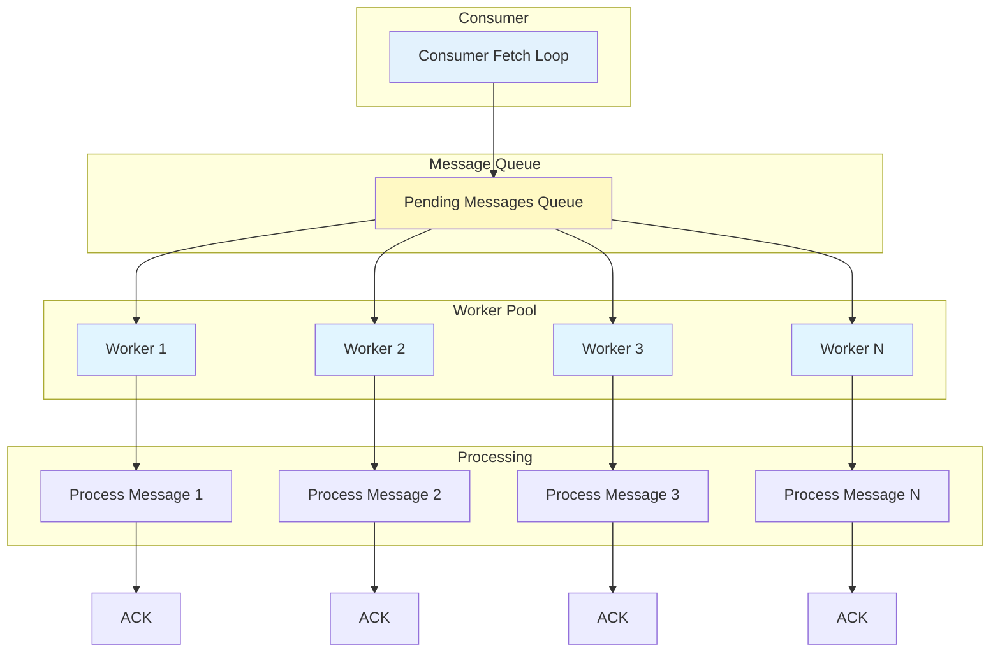
```mermaid
graph TB
    subgraph "Consumer"
        C[Consumer Fetch Loop]
    end

    subgraph "Message Queue"
        Q[Pending Messages Queue]
        C --> Q
    end

    subgraph "Worker Pool"
        W1[Worker 1]
        W2[Worker 2]
        W3[Worker 3]
        WN[Worker N]
    end

    subgraph "Processing"
        P1[Process Message 1]
        P2[Process Message 2]
        P3[Process Message 3]
        PN[Process Message N]
    end

    Q --> W1
    Q --> W2
    Q --> W3
    Q --> WN

    W1 --> P1
    W2 --> P2
    W3 --> P3
    WN --> PN

    P1 --> ACK1[ACK]
    P2 --> ACK2[ACK]
    P3 --> ACK3[ACK]
    PN --> ACKN[ACK]

    style C fill:#e3f2fd
    style Q fill:#fff9c4
    style W1 fill:#e1f5ff
    style W2 fill:#e1f5ff
    style W3 fill:#e1f5ff
    style WN fill:#e1f5ff
```

### Concurrency Control

```typescript
class ConcurrencyController {
  private concurrency: number;
  private processing: number = 0;
  private queue: Array<() => Promise<void>> = [];

  async acquire(): Promise<void> {
    while (this.processing >= this.concurrency) {
      await this.waitForSlot();
    }
    this.processing++;
  }

  release(): void {
    this.processing--;
    this.processQueue();
  }

  async execute<T>(fn: () => Promise<T>): Promise<T> {
    await this.acquire();
    try {
      return await fn();
    } finally {
      this.release();
    }
  }
}
```

### Backpressure Handling

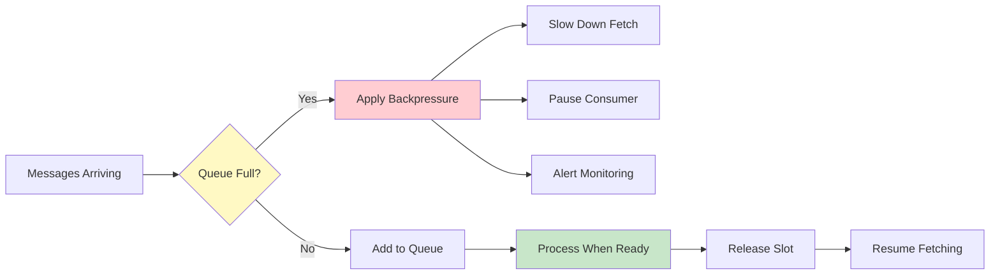
```mermaid
graph LR
    A[Messages Arriving] --> B{Queue Full?}
    B -->|No| C[Add to Queue]
    B -->|Yes| D[Apply Backpressure]

    D --> E[Slow Down Fetch]
    D --> F[Pause Consumer]
    D --> G[Alert Monitoring]

    C --> H[Process When Ready]
    H --> I[Release Slot]
    I --> J[Resume Fetching]

    style B fill:#fff9c4
    style D fill:#ffcdd2
    style H fill:#c8e6c9
```

---

## Topology Management

### Topology Initialization

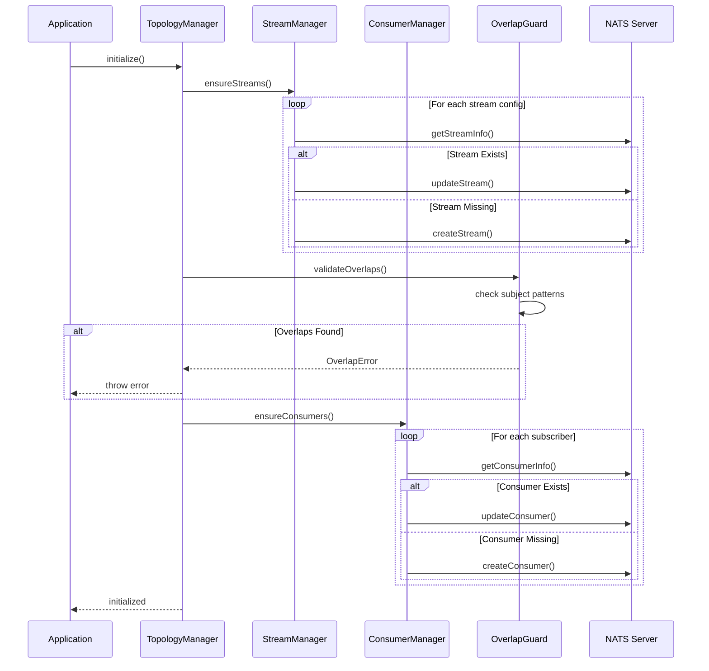
```mermaid
sequenceDiagram
    participant App as Application
    participant TM as TopologyManager
    participant SM as StreamManager
    participant CM as ConsumerManager
    participant OG as OverlapGuard
    participant NATS as NATS Server

    App->>TM: initialize()

    TM->>SM: ensureStreams()

    loop For each stream config
        SM->>NATS: getStreamInfo()

        alt Stream Exists
            SM->>NATS: updateStream()
        else Stream Missing
            SM->>NATS: createStream()
        end
    end

    TM->>OG: validateOverlaps()
    OG->>OG: check subject patterns

    alt Overlaps Found
        OG-->>TM: OverlapError
        TM-->>App: throw error
    end

    TM->>CM: ensureConsumers()

    loop For each subscriber
        CM->>NATS: getConsumerInfo()

        alt Consumer Exists
            CM->>NATS: updateConsumer()
        else Consumer Missing
            CM->>NATS: createConsumer()
        end
    end

    TM-->>App: initialized
```

### Overlap Detection

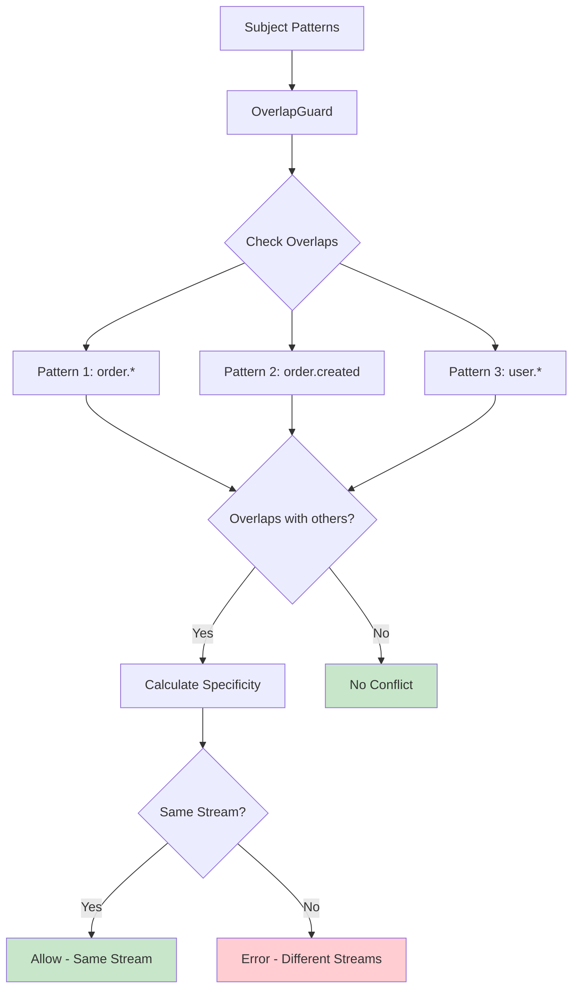
```mermaid
graph TB
    A[Subject Patterns] --> B[OverlapGuard]

    B --> C{Check Overlaps}

    C --> D["Pattern 1: order.*"]
    C --> E["Pattern 2: order.created"]
    C --> F["Pattern 3: user.*"]

    D --> G{Overlaps with others?}
    E --> G
    F --> G

    G -->|Yes| H[Calculate Specificity]
    G -->|No| I[No Conflict]

    H --> J{Same Stream?}
    J -->|Yes| K[Allow - Same Stream]
    J -->|No| L[Error - Different Streams]

    style L fill:#ffcdd2
    style K fill:#c8e6c9
    style I fill:#c8e6c9
```

**Examples:**

```typescript
// ✅ Valid: Same stream, different specificity
const subscribers = [
  { subject: "production.app.order.*", stream: "orders" },
  { subject: "production.app.order.created", stream: "orders" },
];

// ❌ Invalid: Different streams, overlapping subjects
const subscribers = [
  { subject: "production.app.order.*", stream: "orders" },
  { subject: "production.app.order.created", stream: "events" },
];
// Error: Subject overlap detected across different streams
```

---

## Design Decisions

### Why JetStream?

**Decision**: Use NATS JetStream instead of core NATS

**Rationale:**

1. **Persistence**: Messages persisted to disk/memory
2. **Delivery Guarantees**: At-least-once, exactly-once capable
3. **Stream Replay**: Consumers can replay message history
4. **Acknowledgments**: Explicit message acknowledgment
5. **Consumer Management**: Durable consumers survive restarts

**Tradeoffs:**

- ✅ Reliability and guarantees
- ✅ Message persistence
- ✅ Consumer state management
- ❌ Slightly higher latency
- ❌ More complex setup

### Why Pull Consumers?

**Decision**: Use pull consumers instead of push consumers

**Rationale:**

1. **Backpressure Control**: Application controls fetch rate
2. **Horizontal Scaling**: Easy to scale consumers
3. **Fair Distribution**: Even load across consumers
4. **Batch Fetching**: Efficient bulk processing

**Tradeoffs:**

- ✅ Better control and scaling
- ✅ Simpler load balancing
- ✅ No callback complexity
- ❌ Application must poll
- ❌ More application code

### Why Inbox/Outbox?

**Decision**: Built-in support for Inbox/Outbox patterns

**Rationale:**

1. **Reliability**: Solve dual-write problem
2. **Idempotency**: Exactly-once processing guarantees
3. **Best Practice**: Industry-standard patterns
4. **Database Agnostic**: Works with any database

**Tradeoffs:**

- ✅ Strong guarantees
- ✅ Production-ready
- ✅ Well-understood patterns
- ❌ Additional database tables
- ❌ Background workers needed

### Why Declarative API?

**Decision**: Declarative subscriber syntax with decorators

**Rationale:**

1. **Developer Experience**: Clean, intuitive syntax
2. **Discoverability**: Easy to find subscriptions in codebase
3. **Type Safety**: Full TypeScript support
4. **Convention**: Follows framework conventions (NestJS, Rails)

**Example:**

```typescript
// Declarative - Clear and concise
@topicSubscriber("order.created")
class OrderSubscriber {
  async handle(message: OrderMessage) {
    // Process order
  }
}

// vs Imperative - More boilerplate
const subscription = await nc.subscribe("order.created");
for await (const msg of subscription) {
  const message = JSON.parse(msg.data);
  // Process order
  msg.ack();
}
```

### Why Environment Prefixing?

**Decision**: Automatic environment prefixing of subjects

**Format**: `{env}.{app}.{topic}`

**Rationale:**

1. **Isolation**: Prevent cross-environment message leaks
2. **Multi-Tenancy**: Multiple apps on same NATS cluster
3. **Safety**: Dev/staging can't affect production
4. **Organization**: Clear ownership of subjects

**Example:**

```typescript
// Configuration
NatsPubsub.configure({
  env: "production",
  appName: "orders",
});

// Publishing to 'order.created' becomes:
// Subject: production.orders.order.created
```

### Why Middleware?

**Decision**: Middleware chain for cross-cutting concerns

**Rationale:**

1. **Separation of Concerns**: Keep handlers focused
2. **Composability**: Mix and match middleware
3. **Reusability**: Share logic across subscribers
4. **Testability**: Test middleware in isolation

**Example:**

```typescript
// Middleware composition
NatsPubsub.use(new LoggingMiddleware());
NatsPubsub.use(new MetricsMiddleware());
NatsPubsub.use(new TracingMiddleware());
NatsPubsub.use(new ValidationMiddleware());

// Clean subscriber
@topicSubscriber("order.created")
class OrderSubscriber {
  // No logging, metrics, or tracing code
  async handle(message: OrderMessage) {
    // Pure business logic
  }
}
```

---

## Scaling Architecture

### Horizontal Scaling

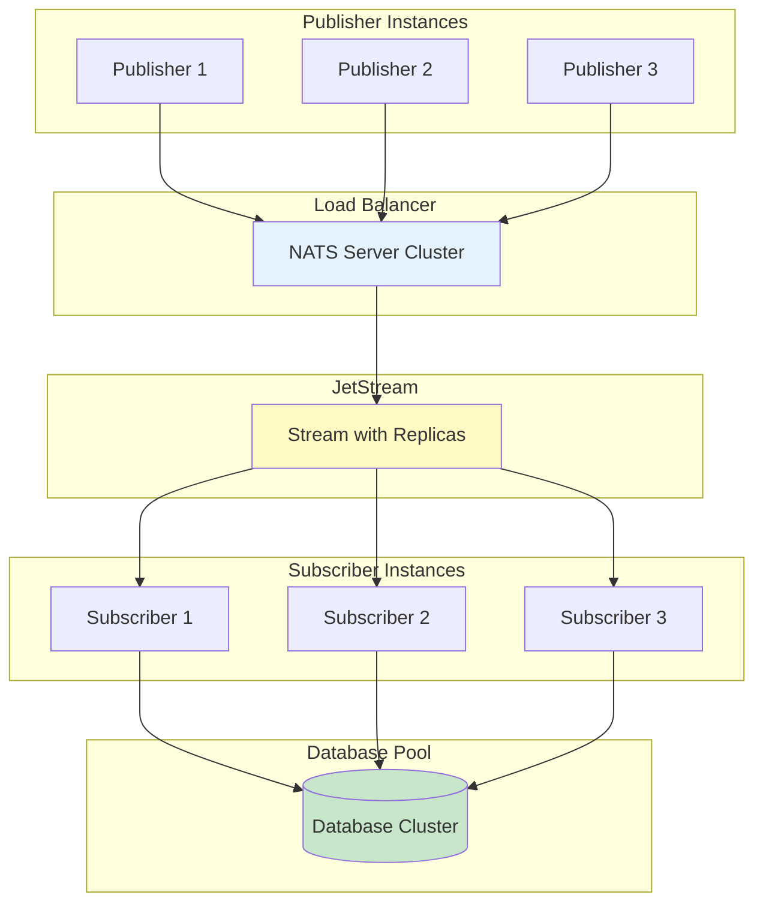
```mermaid
graph TB
    subgraph "Load Balancer"
        LB[NATS Server Cluster]
    end

    subgraph "Publisher Instances"
        P1[Publisher 1]
        P2[Publisher 2]
        P3[Publisher 3]
    end

    subgraph "JetStream"
        JS[Stream with Replicas]
    end

    subgraph "Subscriber Instances"
        S1[Subscriber 1]
        S2[Subscriber 2]
        S3[Subscriber 3]
    end

    subgraph "Database Pool"
        DB[(Database Cluster)]
    end

    P1 --> LB
    P2 --> LB
    P3 --> LB

    LB --> JS

    JS --> S1
    JS --> S2
    JS --> S3

    S1 --> DB
    S2 --> DB
    S3 --> DB

    style LB fill:#e3f2fd
    style JS fill:#fff9c4
    style DB fill:#c8e6c9
```

**Scaling Publishers:**

- Add more publisher instances
- Each instance publishes independently
- NATS handles load distribution

**Scaling Subscribers:**

- Add more subscriber instances
- Pull consumers automatically distribute work
- Each instance processes subset of messages

### Vertical Scaling

```typescript
// Increase concurrency per instance
NatsPubsub.configure({
  concurrency: 50, // More concurrent message processing
  perMessageConcurrency: 10, // More concurrent operations per message
  batchSize: 100, // Larger batches
});

// Increase database pool
const pool = new Pool({
  max: 50, // More database connections
  min: 10,
});
```

### Geographic Distribution

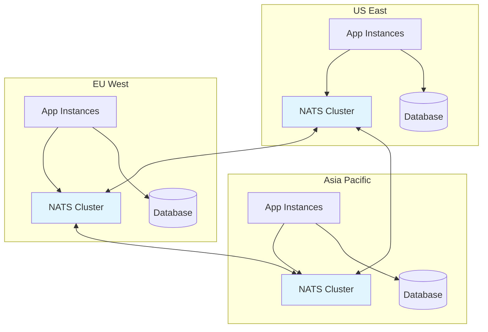
```mermaid
graph TB
    subgraph "US East"
        US_NATS[NATS Cluster]
        US_APP[App Instances]
        US_DB[(Database)]
    end

    subgraph "EU West"
        EU_NATS[NATS Cluster]
        EU_APP[App Instances]
        EU_DB[(Database)]
    end

    subgraph "Asia Pacific"
        AP_NATS[NATS Cluster]
        AP_APP[App Instances]
        AP_DB[(Database)]
    end

    US_NATS <--> EU_NATS
    EU_NATS <--> AP_NATS
    AP_NATS <--> US_NATS

    US_APP --> US_NATS
    EU_APP --> EU_NATS
    AP_APP --> AP_NATS

    US_APP --> US_DB
    EU_APP --> EU_DB
    AP_APP --> AP_DB

    style US_NATS fill:#e1f5ff
    style EU_NATS fill:#e1f5ff
    style AP_NATS fill:#e1f5ff
```

**Features:**

- NATS super-cluster for global distribution
- Local processing reduces latency
- Data sovereignty compliance
- Disaster recovery

---

## Deployment Architectures

### Single Application

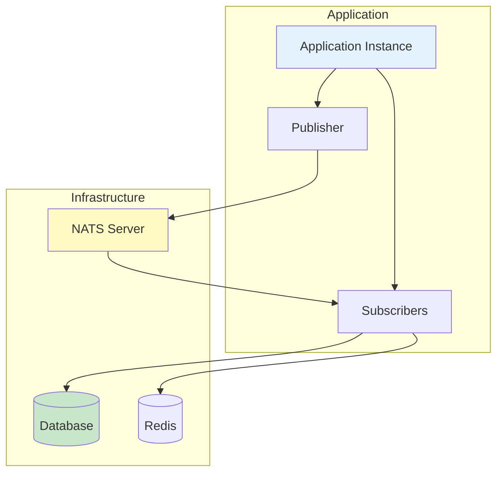
```mermaid
graph TB
    subgraph "Application"
        APP[Application Instance]
        PUB[Publisher]
        SUB[Subscribers]
    end

    subgraph "Infrastructure"
        NATS[NATS Server]
        DB[(Database)]
        CACHE[(Redis)]
    end

    APP --> PUB
    APP --> SUB
    PUB --> NATS
    NATS --> SUB
    SUB --> DB
    SUB --> CACHE

    style APP fill:#e3f2fd
    style NATS fill:#fff9c4
    style DB fill:#c8e6c9
```

**Use Case:**

- Small applications
- Development/testing
- Single service architecture

### Microservices

```mermaid
graph TB
    subgraph "Order Service"
        OS_APP[Order App]
        OS_PUB[Publisher]
        OS_SUB[Subscribers]
        OS_DB[(Orders DB)]
    end

    subgraph "Payment Service"
        PS_APP[Payment App]
        PS_PUB[Publisher]
        PS_SUB[Subscribers]
        PS_DB[(Payments DB)]
    end

    subgraph "Notification Service"
        NS_APP[Notification App]
        NS_SUB[Subscribers]
        NS_DB[(Notifications DB)]
    end

    subgraph "Shared Infrastructure"
        NATS[NATS Cluster]
    end

    OS_APP --> OS_PUB
    OS_APP --> OS_SUB
    OS_PUB --> NATS
    NATS --> OS_SUB

    PS_APP --> PS_PUB
    PS_APP --> PS_SUB
    PS_PUB --> NATS
    NATS --> PS_SUB

    NS_APP --> NS_SUB
    NATS --> NS_SUB

    OS_SUB --> OS_DB
    PS_SUB --> PS_DB
    NS_SUB --> NS_DB

    style NATS fill:#fff9c4
```

**Use Case:**

- Distributed systems
- Service isolation
- Independent scaling

### Event-Driven Architecture

```mermaid
graph TB
    subgraph "Command Services"
        C1[Order Service]
        C2[Payment Service]
        C3[Inventory Service]
    end

    subgraph "Event Bus"
        NATS[NATS JetStream]
        STREAMS[Multiple Streams]
    end

    subgraph "Query Services"
        Q1[Order Query Service]
        Q2[Analytics Service]
        Q3[Reporting Service]
    end

    subgraph "Projection Stores"
        DB1[(Orders View DB)]
        DB2[(Analytics DB)]
        DB3[(Reports DB)]
    end

    C1 --> NATS
    C2 --> NATS
    C3 --> NATS

    NATS --> STREAMS

    STREAMS --> Q1
    STREAMS --> Q2
    STREAMS --> Q3

    Q1 --> DB1
    Q2 --> DB2
    Q3 --> DB3

    style NATS fill:#fff9c4
    style STREAMS fill:#e1f5ff
```

**Use Case:**

- CQRS pattern
- Event sourcing
- Real-time analytics
- Audit logging

### Serverless Architecture

```mermaid
graph TB
    subgraph "Event Sources"
        API[API Gateway]
        WEBHOOK[Webhooks]
        SCHEDULE[Scheduled Tasks]
    end

    subgraph "Functions"
        F1[Lambda Function 1]
        F2[Lambda Function 2]
        F3[Lambda Function 3]
    end

    subgraph "NATS Infrastructure"
        NATS[NATS Server]
        JS[JetStream]
    end

    subgraph "Storage"
        S3[(S3 Buckets)]
        DDB[(DynamoDB)]
    end

    API --> F1
    WEBHOOK --> F2
    SCHEDULE --> F3

    F1 --> NATS
    F2 --> NATS
    F3 --> NATS

    NATS --> JS
    JS --> F1
    JS --> F2
    JS --> F3

    F1 --> S3
    F2 --> DDB
    F3 --> S3

    style NATS fill:#fff9c4
    style F1 fill:#e1f5ff
    style F2 fill:#e1f5ff
    style F3 fill:#e1f5ff
```

**Use Case:**

- Serverless applications
- Cost optimization
- Auto-scaling workloads

---

## Related Documentation

### Core Guides

- [Internals Deep Dive](./internals.md) - Implementation details
- [Custom Repositories](./custom-repositories.md) - Building custom storage
- [Security Guide](./security.md) - Security best practices

### Integration Guides

- [Rails Integration](../integrations/rails.md) - Ruby on Rails setup
- [Express Integration](../integrations/express.md) - Express.js setup
- [NestJS Integration](../integrations/nestjs.md) - NestJS setup

### Pattern Guides

- [Inbox/Outbox Pattern](../patterns/inbox-outbox.md) - Reliability patterns
- [DLQ Pattern](../patterns/dlq.md) - Dead letter queue
- [Event Sourcing](../patterns/event-sourcing.md) - Event-driven design

---

**Navigation:**

- [Next: Internals →](./internals.md)
- [Back to Documentation Home](../index.md)
