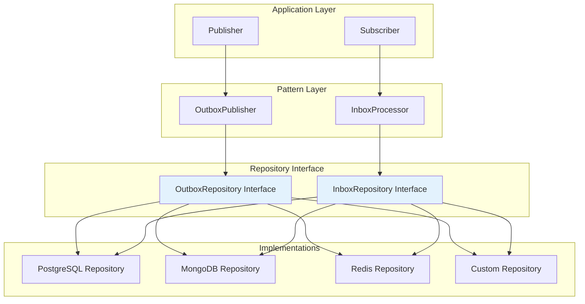

# Custom Repository Implementation Guide

This comprehensive guide covers implementing custom repositories for NatsPubsub's Inbox and Outbox patterns, including interfaces, implementations for various databases, and best practices.

## Table of Contents

- [Overview](#overview)
- [Repository Interfaces](#repository-interfaces)
- [Outbox Repository Implementation](#outbox-repository-implementation)
- [Inbox Repository Implementation](#inbox-repository-implementation)
- [PostgreSQL Implementation](#postgresql-implementation)
- [MySQL Implementation](#mysql-implementation)
- [MongoDB Implementation](#mongodb-implementation)
- [Redis Implementation](#redis-implementation)
- [DynamoDB Implementation](#dynamodb-implementation)
- [Testing Custom Repositories](#testing-custom-repositories)
- [Performance Optimization](#performance-optimization)
- [Best Practices](#best-practices)

---

## Overview

NatsPubsub provides repository interfaces for Inbox and Outbox patterns, allowing you to implement custom storage backends for your specific needs.

### Why Custom Repositories?

- **Database Choice**: Use your preferred database (PostgreSQL, MongoDB, Redis, etc.)
- **Performance**: Optimize queries for your workload
- **Cost**: Use managed services or cost-effective solutions
- **Compliance**: Meet specific data residency requirements
- **Integration**: Integrate with existing database infrastructure

### Architecture



---

## Repository Interfaces

### Outbox Repository Interface

```typescript
export interface OutboxEvent {
  eventId: string;
  subject: string;
  payload: string;
  headers?: string;
  status: "pending" | "publishing" | "sent" | "failed";
  enqueuedAt: Date;
  sentAt?: Date;
  errorMessage?: string;
}

export interface OutboxRepository {
  /**
   * Find or create an outbox event
   * Should be idempotent - if event_id exists, return existing
   */
  findOrCreate(params: Partial<OutboxEvent>): Promise<OutboxEvent>;

  /**
   * Mark event as sent
   */
  markAsSent(eventId: string): Promise<void>;

  /**
   * Mark event as publishing (in-progress)
   */
  markAsPublishing(eventId: string): Promise<void>;

  /**
   * Mark event as failed
   */
  markAsFailed(eventId: string, errorMessage: string): Promise<void>;

  /**
   * Find pending events
   */
  findPending(options?: { limit?: number }): Promise<OutboxEvent[]>;

  /**
   * Cleanup old sent events
   */
  cleanup(olderThanDays: number): Promise<number>;

  /**
   * Reset stale events (stuck in 'publishing')
   */
  resetStale(staleMinutes: number): Promise<number>;

  /**
   * Get count by status (for monitoring)
   */
  getCountByStatus?(): Promise<Record<string, number>>;
}
```

### Inbox Repository Interface

```typescript
export interface InboxEvent {
  eventId: string;
  subject: string;
  payload: string;
  headers?: string;
  stream?: string;
  streamSeq?: number;
  status: "processing" | "processed" | "failed";
  receivedAt: Date;
  processedAt?: Date;
  deliveries: number;
  errorMessage?: string;
}

export interface InboxRepository {
  /**
   * Find or create an inbox event
   * Should be idempotent - if event_id exists, return existing
   */
  findOrCreate(params: Partial<InboxEvent>): Promise<InboxEvent>;

  /**
   * Mark event as processed
   */
  markAsProcessed(eventId: string): Promise<void>;

  /**
   * Mark event as failed
   */
  markAsFailed(eventId: string, errorMessage: string): Promise<void>;

  /**
   * Check if event is already processed
   */
  isProcessed(eventId: string): Promise<boolean>;

  /**
   * Cleanup old processed events
   */
  cleanup(olderThanDays: number): Promise<number>;

  /**
   * Reset stale events (stuck in 'processing')
   */
  resetStale(staleMinutes: number): Promise<number>;

  /**
   * Get count by status (for monitoring)
   */
  getCountByStatus?(): Promise<Record<string, number>>;
}
```

---

## Outbox Repository Implementation

### Base Implementation Pattern

```typescript
import { OutboxRepository, OutboxEvent } from "nats-pubsub";

export class CustomOutboxRepository implements OutboxRepository {
  constructor(
    private db: DatabaseConnection,
    private logger?: Logger,
  ) {}

  async findOrCreate(params: Partial<OutboxEvent>): Promise<OutboxEvent> {
    // 1. Try to insert new event
    try {
      return await this.insert(params);
    } catch (error) {
      // 2. If duplicate key, fetch existing
      if (this.isDuplicateKeyError(error)) {
        return await this.findByEventId(params.eventId!);
      }
      throw error;
    }
  }

  async markAsSent(eventId: string): Promise<void> {
    await this.updateStatus(eventId, "sent", { sentAt: new Date() });
  }

  async markAsPublishing(eventId: string): Promise<void> {
    await this.updateStatus(eventId, "publishing");
  }

  async markAsFailed(eventId: string, errorMessage: string): Promise<void> {
    await this.updateStatus(eventId, "failed", { errorMessage });
  }

  async findPending(options?: { limit?: number }): Promise<OutboxEvent[]> {
    const limit = options?.limit || 100;
    return await this.query({
      status: "pending",
      orderBy: "enqueued_at",
      limit,
    });
  }

  async cleanup(olderThanDays: number): Promise<number> {
    const cutoffDate = new Date();
    cutoffDate.setDate(cutoffDate.getDate() - olderThanDays);

    return await this.delete({
      status: "sent",
      sentAtBefore: cutoffDate,
    });
  }

  async resetStale(staleMinutes: number): Promise<number> {
    const cutoffTime = new Date();
    cutoffTime.setMinutes(cutoffTime.getMinutes() - staleMinutes);

    return await this.update(
      {
        status: "publishing",
        enqueuedAtBefore: cutoffTime,
      },
      { status: "pending" },
    );
  }

  async getCountByStatus(): Promise<Record<string, number>> {
    return await this.groupCount("status");
  }

  // Helper methods (implement based on your database)
  private async insert(params: Partial<OutboxEvent>): Promise<OutboxEvent> {
    throw new Error("Not implemented");
  }

  private async findByEventId(eventId: string): Promise<OutboxEvent> {
    throw new Error("Not implemented");
  }

  private async updateStatus(
    eventId: string,
    status: string,
    extra?: Record<string, any>,
  ): Promise<void> {
    throw new Error("Not implemented");
  }

  private async query(criteria: any): Promise<OutboxEvent[]> {
    throw new Error("Not implemented");
  }

  private async delete(criteria: any): Promise<number> {
    throw new Error("Not implemented");
  }

  private async update(criteria: any, updates: any): Promise<number> {
    throw new Error("Not implemented");
  }

  private async groupCount(field: string): Promise<Record<string, number>> {
    throw new Error("Not implemented");
  }

  private isDuplicateKeyError(error: any): boolean {
    throw new Error("Not implemented");
  }
}
```

---

## Inbox Repository Implementation

### Base Implementation Pattern

```typescript
import { InboxRepository, InboxEvent } from "nats-pubsub";

export class CustomInboxRepository implements InboxRepository {
  constructor(
    private db: DatabaseConnection,
    private logger?: Logger,
  ) {}

  async findOrCreate(params: Partial<InboxEvent>): Promise<InboxEvent> {
    // 1. Try to insert new event
    try {
      return await this.insert({
        ...params,
        status: "processing",
        receivedAt: new Date(),
      });
    } catch (error) {
      // 2. If duplicate key, fetch existing
      if (this.isDuplicateKeyError(error)) {
        return await this.findByEventId(params.eventId!);
      }
      throw error;
    }
  }

  async markAsProcessed(eventId: string): Promise<void> {
    await this.updateStatus(eventId, "processed", {
      processedAt: new Date(),
    });
  }

  async markAsFailed(eventId: string, errorMessage: string): Promise<void> {
    await this.updateStatus(eventId, "failed", { errorMessage });
  }

  async isProcessed(eventId: string): Promise<boolean> {
    const event = await this.findByEventId(eventId);
    return event?.status === "processed";
  }

  async cleanup(olderThanDays: number): Promise<number> {
    const cutoffDate = new Date();
    cutoffDate.setDate(cutoffDate.getDate() - olderThanDays);

    return await this.delete({
      status: "processed",
      processedAtBefore: cutoffDate,
    });
  }

  async resetStale(staleMinutes: number): Promise<number> {
    const cutoffTime = new Date();
    cutoffTime.setMinutes(cutoffTime.getMinutes() - staleMinutes);

    return await this.update(
      {
        status: "processing",
        receivedAtBefore: cutoffTime,
      },
      {
        status: "failed",
        errorMessage: "Processing timeout",
      },
    );
  }

  async getCountByStatus(): Promise<Record<string, number>> {
    return await this.groupCount("status");
  }

  // Helper methods (implement based on your database)
  private async insert(params: Partial<InboxEvent>): Promise<InboxEvent> {
    throw new Error("Not implemented");
  }

  private async findByEventId(eventId: string): Promise<InboxEvent | null> {
    throw new Error("Not implemented");
  }

  private async updateStatus(
    eventId: string,
    status: string,
    extra?: Record<string, any>,
  ): Promise<void> {
    throw new Error("Not implemented");
  }

  private async delete(criteria: any): Promise<number> {
    throw new Error("Not implemented");
  }

  private async update(criteria: any, updates: any): Promise<number> {
    throw new Error("Not implemented");
  }

  private async groupCount(field: string): Promise<Record<string, number>> {
    throw new Error("Not implemented");
  }

  private isDuplicateKeyError(error: any): boolean {
    throw new Error("Not implemented");
  }
}
```

---

## PostgreSQL Implementation

### Schema

```sql
-- Outbox table
CREATE TABLE nats_outbox_events (
  event_id VARCHAR(255) PRIMARY KEY,
  subject VARCHAR(500) NOT NULL,
  payload TEXT NOT NULL,
  headers TEXT,
  status VARCHAR(50) NOT NULL DEFAULT 'pending',
  enqueued_at TIMESTAMP NOT NULL DEFAULT NOW(),
  sent_at TIMESTAMP,
  error_message TEXT,
  created_at TIMESTAMP NOT NULL DEFAULT NOW(),
  updated_at TIMESTAMP NOT NULL DEFAULT NOW()
);

CREATE INDEX idx_outbox_status_enqueued ON nats_outbox_events(status, enqueued_at);
CREATE INDEX idx_outbox_sent_at ON nats_outbox_events(sent_at) WHERE sent_at IS NOT NULL;

-- Inbox table
CREATE TABLE nats_inbox_events (
  event_id VARCHAR(255) PRIMARY KEY,
  subject VARCHAR(500) NOT NULL,
  payload TEXT NOT NULL,
  headers TEXT,
  stream VARCHAR(255),
  stream_seq BIGINT,
  status VARCHAR(50) NOT NULL DEFAULT 'processing',
  received_at TIMESTAMP NOT NULL DEFAULT NOW(),
  processed_at TIMESTAMP,
  deliveries INTEGER DEFAULT 1,
  error_message TEXT,
  created_at TIMESTAMP NOT NULL DEFAULT NOW(),
  updated_at TIMESTAMP NOT NULL DEFAULT NOW()
);

CREATE UNIQUE INDEX idx_inbox_stream_seq ON nats_inbox_events(stream, stream_seq)
  WHERE stream IS NOT NULL;
CREATE INDEX idx_inbox_status_processed ON nats_inbox_events(status, processed_at);
CREATE INDEX idx_inbox_received_at ON nats_inbox_events(received_at);
```

### Implementation with pg

```typescript
import { Pool } from "pg";
import {
  OutboxRepository,
  OutboxEvent,
  InboxRepository,
  InboxEvent,
} from "nats-pubsub";

export class PostgresOutboxRepository implements OutboxRepository {
  constructor(private pool: Pool) {}

  async findOrCreate(params: Partial<OutboxEvent>): Promise<OutboxEvent> {
    const query = `
      INSERT INTO nats_outbox_events (
        event_id, subject, payload, headers, status, enqueued_at
      ) VALUES ($1, $2, $3, $4, $5, $6)
      ON CONFLICT (event_id) DO NOTHING
      RETURNING *
    `;

    const values = [
      params.eventId,
      params.subject,
      params.payload,
      params.headers,
      "pending",
      new Date(),
    ];

    const result = await this.pool.query(query, values);

    if (result.rows.length > 0) {
      return this.mapRow(result.rows[0]);
    }

    // Event already exists, fetch it
    const fetchQuery = "SELECT * FROM nats_outbox_events WHERE event_id = $1";
    const fetchResult = await this.pool.query(fetchQuery, [params.eventId]);
    return this.mapRow(fetchResult.rows[0]);
  }

  async markAsSent(eventId: string): Promise<void> {
    const query = `
      UPDATE nats_outbox_events
      SET status = 'sent', sent_at = $1, updated_at = $1
      WHERE event_id = $2
    `;
    await this.pool.query(query, [new Date(), eventId]);
  }

  async markAsPublishing(eventId: string): Promise<void> {
    const query = `
      UPDATE nats_outbox_events
      SET status = 'publishing', updated_at = $1
      WHERE event_id = $2
    `;
    await this.pool.query(query, [new Date(), eventId]);
  }

  async markAsFailed(eventId: string, errorMessage: string): Promise<void> {
    const query = `
      UPDATE nats_outbox_events
      SET status = 'failed', error_message = $1, updated_at = $2
      WHERE event_id = $3
    `;
    await this.pool.query(query, [errorMessage, new Date(), eventId]);
  }

  async findPending(options?: { limit?: number }): Promise<OutboxEvent[]> {
    const limit = options?.limit || 100;
    const query = `
      SELECT * FROM nats_outbox_events
      WHERE status = 'pending'
      ORDER BY enqueued_at ASC
      LIMIT $1
    `;

    const result = await this.pool.query(query, [limit]);
    return result.rows.map((row) => this.mapRow(row));
  }

  async cleanup(olderThanDays: number): Promise<number> {
    const cutoffDate = new Date();
    cutoffDate.setDate(cutoffDate.getDate() - olderThanDays);

    const query = `
      DELETE FROM nats_outbox_events
      WHERE status = 'sent' AND sent_at < $1
    `;

    const result = await this.pool.query(query, [cutoffDate]);
    return result.rowCount || 0;
  }

  async resetStale(staleMinutes: number): Promise<number> {
    const cutoffTime = new Date();
    cutoffTime.setMinutes(cutoffTime.getMinutes() - staleMinutes);

    const query = `
      UPDATE nats_outbox_events
      SET status = 'pending', updated_at = $1
      WHERE status = 'publishing' AND enqueued_at < $2
    `;

    const result = await this.pool.query(query, [new Date(), cutoffTime]);
    return result.rowCount || 0;
  }

  async getCountByStatus(): Promise<Record<string, number>> {
    const query = `
      SELECT status, COUNT(*) as count
      FROM nats_outbox_events
      GROUP BY status
    `;

    const result = await this.pool.query(query);
    const counts: Record<string, number> = {};

    for (const row of result.rows) {
      counts[row.status] = parseInt(row.count);
    }

    return counts;
  }

  private mapRow(row: any): OutboxEvent {
    return {
      eventId: row.event_id,
      subject: row.subject,
      payload: row.payload,
      headers: row.headers,
      status: row.status,
      enqueuedAt: row.enqueued_at,
      sentAt: row.sent_at,
      errorMessage: row.error_message,
    };
  }
}

export class PostgresInboxRepository implements InboxRepository {
  constructor(private pool: Pool) {}

  async findOrCreate(params: Partial<InboxEvent>): Promise<InboxEvent> {
    const query = `
      INSERT INTO nats_inbox_events (
        event_id, subject, payload, headers, stream, stream_seq,
        status, received_at, deliveries
      ) VALUES ($1, $2, $3, $4, $5, $6, $7, $8, $9)
      ON CONFLICT (event_id) DO NOTHING
      RETURNING *
    `;

    const values = [
      params.eventId,
      params.subject,
      params.payload,
      params.headers,
      params.stream,
      params.streamSeq,
      "processing",
      new Date(),
      params.deliveries || 1,
    ];

    const result = await this.pool.query(query, values);

    if (result.rows.length > 0) {
      return this.mapRow(result.rows[0]);
    }

    // Event already exists, fetch it
    const fetchQuery = "SELECT * FROM nats_inbox_events WHERE event_id = $1";
    const fetchResult = await this.pool.query(fetchQuery, [params.eventId]);
    return this.mapRow(fetchResult.rows[0]);
  }

  async markAsProcessed(eventId: string): Promise<void> {
    const query = `
      UPDATE nats_inbox_events
      SET status = 'processed', processed_at = $1, updated_at = $1
      WHERE event_id = $2
    `;
    await this.pool.query(query, [new Date(), eventId]);
  }

  async markAsFailed(eventId: string, errorMessage: string): Promise<void> {
    const query = `
      UPDATE nats_inbox_events
      SET status = 'failed', error_message = $1, updated_at = $2
      WHERE event_id = $3
    `;
    await this.pool.query(query, [errorMessage, new Date(), eventId]);
  }

  async isProcessed(eventId: string): Promise<boolean> {
    const query = `
      SELECT 1 FROM nats_inbox_events
      WHERE event_id = $1 AND status = 'processed'
    `;

    const result = await this.pool.query(query, [eventId]);
    return result.rows.length > 0;
  }

  async cleanup(olderThanDays: number): Promise<number> {
    const cutoffDate = new Date();
    cutoffDate.setDate(cutoffDate.getDate() - olderThanDays);

    const query = `
      DELETE FROM nats_inbox_events
      WHERE status = 'processed' AND processed_at < $1
    `;

    const result = await this.pool.query(query, [cutoffDate]);
    return result.rowCount || 0;
  }

  async resetStale(staleMinutes: number): Promise<number> {
    const cutoffTime = new Date();
    cutoffTime.setMinutes(cutoffTime.getMinutes() - staleMinutes);

    const query = `
      UPDATE nats_inbox_events
      SET status = 'failed', error_message = 'Processing timeout', updated_at = $1
      WHERE status = 'processing' AND received_at < $2
    `;

    const result = await this.pool.query(query, [new Date(), cutoffTime]);
    return result.rowCount || 0;
  }

  async getCountByStatus(): Promise<Record<string, number>> {
    const query = `
      SELECT status, COUNT(*) as count
      FROM nats_inbox_events
      GROUP BY status
    `;

    const result = await this.pool.query(query);
    const counts: Record<string, number> = {};

    for (const row of result.rows) {
      counts[row.status] = parseInt(row.count);
    }

    return counts;
  }

  private mapRow(row: any): InboxEvent {
    return {
      eventId: row.event_id,
      subject: row.subject,
      payload: row.payload,
      headers: row.headers,
      stream: row.stream,
      streamSeq: row.stream_seq,
      status: row.status,
      receivedAt: row.received_at,
      processedAt: row.processed_at,
      deliveries: row.deliveries,
      errorMessage: row.error_message,
    };
  }
}
```

---

## MySQL Implementation

### Schema

```sql
-- Outbox table
CREATE TABLE nats_outbox_events (
  event_id VARCHAR(255) PRIMARY KEY,
  subject VARCHAR(500) NOT NULL,
  payload LONGTEXT NOT NULL,
  headers TEXT,
  status VARCHAR(50) NOT NULL DEFAULT 'pending',
  enqueued_at TIMESTAMP NOT NULL DEFAULT CURRENT_TIMESTAMP,
  sent_at TIMESTAMP NULL,
  error_message TEXT,
  created_at TIMESTAMP NOT NULL DEFAULT CURRENT_TIMESTAMP,
  updated_at TIMESTAMP NOT NULL DEFAULT CURRENT_TIMESTAMP ON UPDATE CURRENT_TIMESTAMP,
  INDEX idx_outbox_status_enqueued (status, enqueued_at),
  INDEX idx_outbox_sent_at (sent_at)
) ENGINE=InnoDB DEFAULT CHARSET=utf8mb4 COLLATE=utf8mb4_unicode_ci;

-- Inbox table
CREATE TABLE nats_inbox_events (
  event_id VARCHAR(255) PRIMARY KEY,
  subject VARCHAR(500) NOT NULL,
  payload LONGTEXT NOT NULL,
  headers TEXT,
  stream VARCHAR(255),
  stream_seq BIGINT,
  status VARCHAR(50) NOT NULL DEFAULT 'processing',
  received_at TIMESTAMP NOT NULL DEFAULT CURRENT_TIMESTAMP,
  processed_at TIMESTAMP NULL,
  deliveries INT DEFAULT 1,
  error_message TEXT,
  created_at TIMESTAMP NOT NULL DEFAULT CURRENT_TIMESTAMP,
  updated_at TIMESTAMP NOT NULL DEFAULT CURRENT_TIMESTAMP ON UPDATE CURRENT_TIMESTAMP,
  UNIQUE KEY idx_inbox_stream_seq (stream, stream_seq),
  INDEX idx_inbox_status_processed (status, processed_at),
  INDEX idx_inbox_received_at (received_at)
) ENGINE=InnoDB DEFAULT CHARSET=utf8mb4 COLLATE=utf8mb4_unicode_ci;
```

### Implementation with mysql2

```typescript
import mysql from "mysql2/promise";
import { OutboxRepository, OutboxEvent } from "nats-pubsub";

export class MySQLOutboxRepository implements OutboxRepository {
  constructor(private pool: mysql.Pool) {}

  async findOrCreate(params: Partial<OutboxEvent>): Promise<OutboxEvent> {
    const conn = await this.pool.getConnection();

    try {
      // Try insert with INSERT IGNORE
      const insertQuery = `
        INSERT IGNORE INTO nats_outbox_events (
          event_id, subject, payload, headers, status, enqueued_at
        ) VALUES (?, ?, ?, ?, 'pending', NOW())
      `;

      await conn.execute(insertQuery, [
        params.eventId,
        params.subject,
        params.payload,
        params.headers,
      ]);

      // Fetch the event (either just inserted or already existing)
      const [rows] = await conn.execute(
        "SELECT * FROM nats_outbox_events WHERE event_id = ?",
        [params.eventId],
      );

      return this.mapRow((rows as any[])[0]);
    } finally {
      conn.release();
    }
  }

  async markAsSent(eventId: string): Promise<void> {
    const query = `
      UPDATE nats_outbox_events
      SET status = 'sent', sent_at = NOW()
      WHERE event_id = ?
    `;
    await this.pool.execute(query, [eventId]);
  }

  async markAsPublishing(eventId: string): Promise<void> {
    const query = `
      UPDATE nats_outbox_events
      SET status = 'publishing'
      WHERE event_id = ?
    `;
    await this.pool.execute(query, [eventId]);
  }

  async markAsFailed(eventId: string, errorMessage: string): Promise<void> {
    const query = `
      UPDATE nats_outbox_events
      SET status = 'failed', error_message = ?
      WHERE event_id = ?
    `;
    await this.pool.execute(query, [errorMessage, eventId]);
  }

  async findPending(options?: { limit?: number }): Promise<OutboxEvent[]> {
    const limit = options?.limit || 100;
    const query = `
      SELECT * FROM nats_outbox_events
      WHERE status = 'pending'
      ORDER BY enqueued_at ASC
      LIMIT ?
    `;

    const [rows] = await this.pool.execute(query, [limit]);
    return (rows as any[]).map((row) => this.mapRow(row));
  }

  async cleanup(olderThanDays: number): Promise<number> {
    const query = `
      DELETE FROM nats_outbox_events
      WHERE status = 'sent'
        AND sent_at < DATE_SUB(NOW(), INTERVAL ? DAY)
    `;

    const [result] = await this.pool.execute(query, [olderThanDays]);
    return (result as any).affectedRows || 0;
  }

  async resetStale(staleMinutes: number): Promise<number> {
    const query = `
      UPDATE nats_outbox_events
      SET status = 'pending'
      WHERE status = 'publishing'
        AND enqueued_at < DATE_SUB(NOW(), INTERVAL ? MINUTE)
    `;

    const [result] = await this.pool.execute(query, [staleMinutes]);
    return (result as any).affectedRows || 0;
  }

  async getCountByStatus(): Promise<Record<string, number>> {
    const query = `
      SELECT status, COUNT(*) as count
      FROM nats_outbox_events
      GROUP BY status
    `;

    const [rows] = await this.pool.execute(query);
    const counts: Record<string, number> = {};

    for (const row of rows as any[]) {
      counts[row.status] = parseInt(row.count);
    }

    return counts;
  }

  private mapRow(row: any): OutboxEvent {
    return {
      eventId: row.event_id,
      subject: row.subject,
      payload: row.payload,
      headers: row.headers,
      status: row.status,
      enqueuedAt: row.enqueued_at,
      sentAt: row.sent_at,
      errorMessage: row.error_message,
    };
  }
}
```

---

## MongoDB Implementation

### Schema

```typescript
// No explicit schema required for MongoDB, but here's a suggested structure

interface OutboxDocument {
  _id: string; // Use event_id as _id
  subject: string;
  payload: string;
  headers?: string;
  status: "pending" | "publishing" | "sent" | "failed";
  enqueuedAt: Date;
  sentAt?: Date;
  errorMessage?: string;
}

interface InboxDocument {
  _id: string; // Use event_id as _id
  subject: string;
  payload: string;
  headers?: string;
  stream?: string;
  streamSeq?: number;
  status: "processing" | "processed" | "failed";
  receivedAt: Date;
  processedAt?: Date;
  deliveries: number;
  errorMessage?: string;
}
```

### Implementation with MongoDB

```typescript
import { MongoClient, Collection } from "mongodb";
import { OutboxRepository, OutboxEvent } from "nats-pubsub";

export class MongoOutboxRepository implements OutboxRepository {
  private collection: Collection;

  constructor(
    private client: MongoClient,
    dbName: string,
  ) {
    this.collection = this.client.db(dbName).collection("nats_outbox_events");
    this.ensureIndexes();
  }

  private async ensureIndexes(): Promise<void> {
    await this.collection.createIndex({ status: 1, enqueuedAt: 1 });
    await this.collection.createIndex({ sentAt: 1 });
  }

  async findOrCreate(params: Partial<OutboxEvent>): Promise<OutboxEvent> {
    const doc = {
      _id: params.eventId,
      subject: params.subject,
      payload: params.payload,
      headers: params.headers,
      status: "pending",
      enqueuedAt: new Date(),
    };

    try {
      await this.collection.insertOne(doc);
      return this.mapDoc(doc);
    } catch (error: any) {
      if (error.code === 11000) {
        // Duplicate key, fetch existing
        const existing = await this.collection.findOne({ _id: params.eventId });
        return this.mapDoc(existing);
      }
      throw error;
    }
  }

  async markAsSent(eventId: string): Promise<void> {
    await this.collection.updateOne(
      { _id: eventId },
      {
        $set: {
          status: "sent",
          sentAt: new Date(),
        },
      },
    );
  }

  async markAsPublishing(eventId: string): Promise<void> {
    await this.collection.updateOne(
      { _id: eventId },
      { $set: { status: "publishing" } },
    );
  }

  async markAsFailed(eventId: string, errorMessage: string): Promise<void> {
    await this.collection.updateOne(
      { _id: eventId },
      {
        $set: {
          status: "failed",
          errorMessage,
        },
      },
    );
  }

  async findPending(options?: { limit?: number }): Promise<OutboxEvent[]> {
    const limit = options?.limit || 100;

    const docs = await this.collection
      .find({ status: "pending" })
      .sort({ enqueuedAt: 1 })
      .limit(limit)
      .toArray();

    return docs.map((doc) => this.mapDoc(doc));
  }

  async cleanup(olderThanDays: number): Promise<number> {
    const cutoffDate = new Date();
    cutoffDate.setDate(cutoffDate.getDate() - olderThanDays);

    const result = await this.collection.deleteMany({
      status: "sent",
      sentAt: { $lt: cutoffDate },
    });

    return result.deletedCount || 0;
  }

  async resetStale(staleMinutes: number): Promise<number> {
    const cutoffTime = new Date();
    cutoffTime.setMinutes(cutoffTime.getMinutes() - staleMinutes);

    const result = await this.collection.updateMany(
      {
        status: "publishing",
        enqueuedAt: { $lt: cutoffTime },
      },
      { $set: { status: "pending" } },
    );

    return result.modifiedCount || 0;
  }

  async getCountByStatus(): Promise<Record<string, number>> {
    const result = await this.collection
      .aggregate([
        {
          $group: {
            _id: "$status",
            count: { $sum: 1 },
          },
        },
      ])
      .toArray();

    const counts: Record<string, number> = {};
    for (const doc of result) {
      counts[doc._id] = doc.count;
    }

    return counts;
  }

  private mapDoc(doc: any): OutboxEvent {
    return {
      eventId: doc._id,
      subject: doc.subject,
      payload: doc.payload,
      headers: doc.headers,
      status: doc.status,
      enqueuedAt: doc.enqueuedAt,
      sentAt: doc.sentAt,
      errorMessage: doc.errorMessage,
    };
  }
}
```

---

## Redis Implementation

### Implementation with ioredis

```typescript
import Redis from "ioredis";
import { OutboxRepository, OutboxEvent } from "nats-pubsub";

export class RedisOutboxRepository implements OutboxRepository {
  constructor(private redis: Redis) {}

  async findOrCreate(params: Partial<OutboxEvent>): Promise<OutboxEvent> {
    const key = `outbox:${params.eventId}`;
    const exists = await this.redis.exists(key);

    if (exists) {
      const data = await this.redis.hgetall(key);
      return this.deserialize(data);
    }

    const event: OutboxEvent = {
      eventId: params.eventId!,
      subject: params.subject!,
      payload: params.payload!,
      headers: params.headers,
      status: "pending",
      enqueuedAt: new Date(),
    };

    // Store in hash
    await this.redis.hset(key, this.serialize(event));

    // Add to pending list
    await this.redis.zadd("outbox:pending", Date.now(), params.eventId!);

    // Set TTL (e.g., 30 days)
    await this.redis.expire(key, 30 * 24 * 3600);

    return event;
  }

  async markAsSent(eventId: string): Promise<void> {
    const key = `outbox:${eventId}`;

    await this.redis.hset(key, {
      status: "sent",
      sentAt: new Date().toISOString(),
    });

    // Remove from pending list
    await this.redis.zrem("outbox:pending", eventId);

    // Add to sent list
    await this.redis.zadd("outbox:sent", Date.now(), eventId);
  }

  async markAsPublishing(eventId: string): Promise<void> {
    const key = `outbox:${eventId}`;
    await this.redis.hset(key, "status", "publishing");
  }

  async markAsFailed(eventId: string, errorMessage: string): Promise<void> {
    const key = `outbox:${eventId}`;

    await this.redis.hset(key, {
      status: "failed",
      errorMessage,
    });

    // Remove from pending list
    await this.redis.zrem("outbox:pending", eventId);

    // Add to failed list
    await this.redis.zadd("outbox:failed", Date.now(), eventId);
  }

  async findPending(options?: { limit?: number }): Promise<OutboxEvent[]> {
    const limit = options?.limit || 100;

    // Get pending event IDs
    const eventIds = await this.redis.zrange("outbox:pending", 0, limit - 1);

    // Fetch events
    const events: OutboxEvent[] = [];
    for (const eventId of eventIds) {
      const key = `outbox:${eventId}`;
      const data = await this.redis.hgetall(key);

      if (Object.keys(data).length > 0) {
        events.push(this.deserialize(data));
      }
    }

    return events;
  }

  async cleanup(olderThanDays: number): Promise<number> {
    const cutoffTime = Date.now() - olderThanDays * 24 * 3600 * 1000;

    // Get old sent event IDs
    const eventIds = await this.redis.zrangebyscore(
      "outbox:sent",
      "-inf",
      cutoffTime,
    );

    if (eventIds.length === 0) {
      return 0;
    }

    // Delete events
    const pipeline = this.redis.pipeline();

    for (const eventId of eventIds) {
      pipeline.del(`outbox:${eventId}`);
    }

    pipeline.zremrangebyscore("outbox:sent", "-inf", cutoffTime);

    await pipeline.exec();

    return eventIds.length;
  }

  async resetStale(staleMinutes: number): Promise<number> {
    const cutoffTime = Date.now() - staleMinutes * 60 * 1000;

    // Find events in publishing state with old timestamps
    const pendingIds = await this.redis.zrangebyscore(
      "outbox:pending",
      "-inf",
      cutoffTime,
    );

    let resetCount = 0;

    for (const eventId of pendingIds) {
      const key = `outbox:${eventId}`;
      const status = await this.redis.hget(key, "status");

      if (status === "publishing") {
        await this.redis.hset(key, "status", "pending");
        resetCount++;
      }
    }

    return resetCount;
  }

  async getCountByStatus(): Promise<Record<string, number>> {
    const pending = await this.redis.zcard("outbox:pending");
    const sent = await this.redis.zcard("outbox:sent");
    const failed = await this.redis.zcard("outbox:failed");

    return {
      pending: pending || 0,
      sent: sent || 0,
      failed: failed || 0,
    };
  }

  private serialize(event: OutboxEvent): Record<string, string> {
    return {
      eventId: event.eventId,
      subject: event.subject,
      payload: event.payload,
      headers: event.headers || "",
      status: event.status,
      enqueuedAt: event.enqueuedAt.toISOString(),
      sentAt: event.sentAt?.toISOString() || "",
      errorMessage: event.errorMessage || "",
    };
  }

  private deserialize(data: Record<string, string>): OutboxEvent {
    return {
      eventId: data.eventId,
      subject: data.subject,
      payload: data.payload,
      headers: data.headers || undefined,
      status: data.status as any,
      enqueuedAt: new Date(data.enqueuedAt),
      sentAt: data.sentAt ? new Date(data.sentAt) : undefined,
      errorMessage: data.errorMessage || undefined,
    };
  }
}
```

---

## DynamoDB Implementation

### Table Schema

```typescript
// Outbox Table
{
  TableName: 'NatsOutboxEvents',
  KeySchema: [
    { AttributeName: 'eventId', KeyType: 'HASH' }
  ],
  AttributeDefinitions: [
    { AttributeName: 'eventId', AttributeType: 'S' },
    { AttributeName: 'status', AttributeType: 'S' },
    { AttributeName: 'enqueuedAt', AttributeType: 'N' }
  ],
  GlobalSecondaryIndexes: [
    {
      IndexName: 'StatusEnqueuedIndex',
      KeySchema: [
        { AttributeName: 'status', KeyType: 'HASH' },
        { AttributeName: 'enqueuedAt', KeyType: 'RANGE' }
      ],
      Projection: { ProjectionType: 'ALL' }
    }
  ]
}
```

### Implementation

```typescript
import { DynamoDBClient } from "@aws-sdk/client-dynamodb";
import {
  DynamoDBDocumentClient,
  PutCommand,
  GetCommand,
  UpdateCommand,
  QueryCommand,
  DeleteCommand,
} from "@aws-sdk/lib-dynamodb";
import { OutboxRepository, OutboxEvent } from "nats-pubsub";

export class DynamoDBOutboxRepository implements OutboxRepository {
  private docClient: DynamoDBDocumentClient;
  private tableName: string;

  constructor(client: DynamoDBClient, tableName: string = "NatsOutboxEvents") {
    this.docClient = DynamoDBDocumentClient.from(client);
    this.tableName = tableName;
  }

  async findOrCreate(params: Partial<OutboxEvent>): Promise<OutboxEvent> {
    const item = {
      eventId: params.eventId,
      subject: params.subject,
      payload: params.payload,
      headers: params.headers,
      status: "pending",
      enqueuedAt: Date.now(),
    };

    try {
      // Try to insert (conditional on eventId not existing)
      await this.docClient.send(
        new PutCommand({
          TableName: this.tableName,
          Item: item,
          ConditionExpression: "attribute_not_exists(eventId)",
        }),
      );

      return this.mapItem(item);
    } catch (error: any) {
      if (error.name === "ConditionalCheckFailedException") {
        // Event already exists, fetch it
        const result = await this.docClient.send(
          new GetCommand({
            TableName: this.tableName,
            Key: { eventId: params.eventId },
          }),
        );

        return this.mapItem(result.Item);
      }
      throw error;
    }
  }

  async markAsSent(eventId: string): Promise<void> {
    await this.docClient.send(
      new UpdateCommand({
        TableName: this.tableName,
        Key: { eventId },
        UpdateExpression: "SET #status = :status, sentAt = :sentAt",
        ExpressionAttributeNames: {
          "#status": "status",
        },
        ExpressionAttributeValues: {
          ":status": "sent",
          ":sentAt": Date.now(),
        },
      }),
    );
  }

  async markAsPublishing(eventId: string): Promise<void> {
    await this.docClient.send(
      new UpdateCommand({
        TableName: this.tableName,
        Key: { eventId },
        UpdateExpression: "SET #status = :status",
        ExpressionAttributeNames: {
          "#status": "status",
        },
        ExpressionAttributeValues: {
          ":status": "publishing",
        },
      }),
    );
  }

  async markAsFailed(eventId: string, errorMessage: string): Promise<void> {
    await this.docClient.send(
      new UpdateCommand({
        TableName: this.tableName,
        Key: { eventId },
        UpdateExpression: "SET #status = :status, errorMessage = :error",
        ExpressionAttributeNames: {
          "#status": "status",
        },
        ExpressionAttributeValues: {
          ":status": "failed",
          ":error": errorMessage,
        },
      }),
    );
  }

  async findPending(options?: { limit?: number }): Promise<OutboxEvent[]> {
    const limit = options?.limit || 100;

    const result = await this.docClient.send(
      new QueryCommand({
        TableName: this.tableName,
        IndexName: "StatusEnqueuedIndex",
        KeyConditionExpression: "#status = :status",
        ExpressionAttributeNames: {
          "#status": "status",
        },
        ExpressionAttributeValues: {
          ":status": "pending",
        },
        Limit: limit,
      }),
    );

    return (result.Items || []).map((item) => this.mapItem(item));
  }

  async cleanup(olderThanDays: number): Promise<number> {
    const cutoffTime = Date.now() - olderThanDays * 24 * 3600 * 1000;

    // Query sent events older than cutoff
    const result = await this.docClient.send(
      new QueryCommand({
        TableName: this.tableName,
        IndexName: "StatusEnqueuedIndex",
        KeyConditionExpression: "#status = :status AND enqueuedAt < :cutoff",
        ExpressionAttributeNames: {
          "#status": "status",
        },
        ExpressionAttributeValues: {
          ":status": "sent",
          ":cutoff": cutoffTime,
        },
      }),
    );

    const items = result.Items || [];

    // Delete items
    for (const item of items) {
      await this.docClient.send(
        new DeleteCommand({
          TableName: this.tableName,
          Key: { eventId: item.eventId },
        }),
      );
    }

    return items.length;
  }

  async resetStale(staleMinutes: number): Promise<number> {
    const cutoffTime = Date.now() - staleMinutes * 60 * 1000;

    // Query publishing events older than cutoff
    const result = await this.docClient.send(
      new QueryCommand({
        TableName: this.tableName,
        IndexName: "StatusEnqueuedIndex",
        KeyConditionExpression: "#status = :status AND enqueuedAt < :cutoff",
        ExpressionAttributeNames: {
          "#status": "status",
        },
        ExpressionAttributeValues: {
          ":status": "publishing",
          ":cutoff": cutoffTime,
        },
      }),
    );

    const items = result.Items || [];

    // Update to pending
    for (const item of items) {
      await this.docClient.send(
        new UpdateCommand({
          TableName: this.tableName,
          Key: { eventId: item.eventId },
          UpdateExpression: "SET #status = :status",
          ExpressionAttributeNames: {
            "#status": "status",
          },
          ExpressionAttributeValues: {
            ":status": "pending",
          },
        }),
      );
    }

    return items.length;
  }

  async getCountByStatus(): Promise<Record<string, number>> {
    // DynamoDB doesn't have a direct COUNT by status
    // You'd need to query each status separately or use a different approach
    const statuses = ["pending", "publishing", "sent", "failed"];
    const counts: Record<string, number> = {};

    for (const status of statuses) {
      const result = await this.docClient.send(
        new QueryCommand({
          TableName: this.tableName,
          IndexName: "StatusEnqueuedIndex",
          KeyConditionExpression: "#status = :status",
          ExpressionAttributeNames: {
            "#status": "status",
          },
          ExpressionAttributeValues: {
            ":status": status,
          },
          Select: "COUNT",
        }),
      );

      counts[status] = result.Count || 0;
    }

    return counts;
  }

  private mapItem(item: any): OutboxEvent {
    return {
      eventId: item.eventId,
      subject: item.subject,
      payload: item.payload,
      headers: item.headers,
      status: item.status,
      enqueuedAt: new Date(item.enqueuedAt),
      sentAt: item.sentAt ? new Date(item.sentAt) : undefined,
      errorMessage: item.errorMessage,
    };
  }
}
```

---

## Testing Custom Repositories

### Test Suite Template

```typescript
import { OutboxRepository, OutboxEvent } from "nats-pubsub";

describe("CustomOutboxRepository", () => {
  let repository: OutboxRepository;

  beforeEach(async () => {
    repository = new YourCustomOutboxRepository(/* config */);
    await clearDatabase();
  });

  describe("findOrCreate", () => {
    it("should create new event", async () => {
      const params = {
        eventId: "test-123",
        subject: "test.subject",
        payload: JSON.stringify({ data: "test" }),
      };

      const event = await repository.findOrCreate(params);

      expect(event.eventId).toBe("test-123");
      expect(event.status).toBe("pending");
      expect(event.enqueuedAt).toBeInstanceOf(Date);
    });

    it("should return existing event on duplicate", async () => {
      const params = {
        eventId: "test-123",
        subject: "test.subject",
        payload: JSON.stringify({ data: "test" }),
      };

      const event1 = await repository.findOrCreate(params);
      const event2 = await repository.findOrCreate(params);

      expect(event1.eventId).toBe(event2.eventId);
      expect(event1.enqueuedAt).toEqual(event2.enqueuedAt);
    });
  });

  describe("markAsSent", () => {
    it("should update status to sent", async () => {
      const event = await createTestEvent();

      await repository.markAsSent(event.eventId);

      const updated = await repository.findOrCreate({
        eventId: event.eventId,
      });
      expect(updated.status).toBe("sent");
      expect(updated.sentAt).toBeInstanceOf(Date);
    });
  });

  describe("findPending", () => {
    it("should return pending events", async () => {
      await createTestEvent({ eventId: "1", status: "pending" });
      await createTestEvent({ eventId: "2", status: "sent" });
      await createTestEvent({ eventId: "3", status: "pending" });

      const pending = await repository.findPending();

      expect(pending).toHaveLength(2);
      expect(pending.every((e) => e.status === "pending")).toBe(true);
    });

    it("should respect limit", async () => {
      for (let i = 0; i < 10; i++) {
        await createTestEvent({ eventId: `event-${i}` });
      }

      const pending = await repository.findPending({ limit: 5 });

      expect(pending).toHaveLength(5);
    });

    it("should order by enqueued_at", async () => {
      const event1 = await createTestEvent({ eventId: "1" });
      await delay(10);
      const event2 = await createTestEvent({ eventId: "2" });
      await delay(10);
      const event3 = await createTestEvent({ eventId: "3" });

      const pending = await repository.findPending();

      expect(pending[0].eventId).toBe("1");
      expect(pending[1].eventId).toBe("2");
      expect(pending[2].eventId).toBe("3");
    });
  });

  describe("cleanup", () => {
    it("should delete old sent events", async () => {
      const oldDate = new Date();
      oldDate.setDate(oldDate.getDate() - 10);

      await createTestEvent({
        eventId: "old",
        status: "sent",
        sentAt: oldDate,
      });

      await createTestEvent({
        eventId: "recent",
        status: "sent",
        sentAt: new Date(),
      });

      const deleted = await repository.cleanup(7);

      expect(deleted).toBe(1);

      const remaining = await getAllEvents();
      expect(remaining.find((e) => e.eventId === "old")).toBeUndefined();
      expect(remaining.find((e) => e.eventId === "recent")).toBeDefined();
    });
  });

  describe("resetStale", () => {
    it("should reset stuck publishing events", async () => {
      const oldDate = new Date();
      oldDate.setMinutes(oldDate.getMinutes() - 10);

      await createTestEvent({
        eventId: "stale",
        status: "publishing",
        enqueuedAt: oldDate,
      });

      await createTestEvent({
        eventId: "recent",
        status: "publishing",
        enqueuedAt: new Date(),
      });

      const reset = await repository.resetStale(5);

      expect(reset).toBe(1);

      const events = await getAllEvents();
      const stale = events.find((e) => e.eventId === "stale");
      const recent = events.find((e) => e.eventId === "recent");

      expect(stale?.status).toBe("pending");
      expect(recent?.status).toBe("publishing");
    });
  });

  describe("getCountByStatus", () => {
    it("should return counts grouped by status", async () => {
      await createTestEvent({ eventId: "1", status: "pending" });
      await createTestEvent({ eventId: "2", status: "pending" });
      await createTestEvent({ eventId: "3", status: "sent" });
      await createTestEvent({ eventId: "4", status: "failed" });

      const counts = await repository.getCountByStatus!();

      expect(counts.pending).toBe(2);
      expect(counts.sent).toBe(1);
      expect(counts.failed).toBe(1);
    });
  });
});
```

---

## Performance Optimization

### Batch Operations

```typescript
class OptimizedOutboxRepository implements OutboxRepository {
  async findPending(options?: { limit?: number }): Promise<OutboxEvent[]> {
    // Use connection pooling
    const conn = await this.pool.connect();

    try {
      // Use prepared statements
      const stmt = await conn.prepare(`
        SELECT * FROM nats_outbox_events
        WHERE status = $1
        ORDER BY enqueued_at ASC
        LIMIT $2
      `);

      const result = await stmt.execute(["pending", options?.limit || 100]);
      return result.rows.map((row) => this.mapRow(row));
    } finally {
      conn.release();
    }
  }
}
```

### Indexing

```sql
-- Covering index for findPending query
CREATE INDEX idx_outbox_pending_covering
  ON nats_outbox_events(status, enqueued_at)
  INCLUDE (event_id, subject, payload, headers)
  WHERE status = 'pending';

-- Partial index for cleanup
CREATE INDEX idx_outbox_cleanup
  ON nats_outbox_events(sent_at)
  WHERE status = 'sent';
```

### Partitioning

```sql
-- Partition by status for better query performance
CREATE TABLE nats_outbox_events (
  ...
) PARTITION BY LIST (status);

CREATE TABLE nats_outbox_events_pending PARTITION OF nats_outbox_events
  FOR VALUES IN ('pending');

CREATE TABLE nats_outbox_events_sent PARTITION OF nats_outbox_events
  FOR VALUES IN ('sent');

CREATE TABLE nats_outbox_events_failed PARTITION OF nats_outbox_events
  FOR VALUES IN ('failed');
```

---

## Best Practices

### 1. Idempotency

Always implement findOrCreate atomically:

```typescript
// ✅ Good: Atomic upsert
async findOrCreate(params: Partial<OutboxEvent>): Promise<OutboxEvent> {
  return await this.db.query(`
    INSERT INTO nats_outbox_events (...) VALUES (...)
    ON CONFLICT (event_id) DO NOTHING
    RETURNING *
  `);
}

// ❌ Bad: Separate check and insert
async findOrCreate(params: Partial<OutboxEvent>): Promise<OutboxEvent> {
  const existing = await this.db.query('SELECT * WHERE event_id = ?');
  if (existing) return existing;
  return await this.db.query('INSERT INTO ...');
}
```

### 2. Transaction Safety

Use transactions for consistency:

```typescript
async markAsProcessed(eventId: string): Promise<void> {
  await this.db.transaction(async (trx) => {
    await trx.query('UPDATE nats_inbox_events SET status = ? WHERE event_id = ?', [
      'processed',
      eventId,
    ]);
    // Other related updates
  });
}
```

### 3. Error Handling

```typescript
async findOrCreate(params: Partial<OutboxEvent>): Promise<OutboxEvent> {
  try {
    return await this.insert(params);
  } catch (error) {
    if (this.isDuplicateKeyError(error)) {
      return await this.findByEventId(params.eventId!);
    }

    this.logger.error('Failed to create outbox event', {
      error,
      params,
    });

    throw new RepositoryError('Failed to create outbox event', { cause: error });
  }
}
```

### 4. Monitoring

```typescript
class MonitoredRepository implements OutboxRepository {
  private metrics: MetricsClient;

  async findOrCreate(params: Partial<OutboxEvent>): Promise<OutboxEvent> {
    const start = Date.now();

    try {
      const result = await this.repository.findOrCreate(params);

      this.metrics.recordLatency("outbox.findOrCreate", Date.now() - start);
      this.metrics.incrementCounter("outbox.findOrCreate.success");

      return result;
    } catch (error) {
      this.metrics.incrementCounter("outbox.findOrCreate.error");
      throw error;
    }
  }
}
```

---

## Related Documentation

- [Architecture Guide](./architecture.md) - System architecture
- [Internals Guide](./internals.md) - Internal implementation details
- [Inbox/Outbox Pattern](../patterns/inbox-outbox.md) - Pattern documentation
- [Database Integration](../integrations/databases.md) - Database setup guides

---

**Navigation:**

- [← Previous: Internals](./internals.md)
- [Next: Security →](./security.md)
- [Back to Documentation Home](../index.md)
