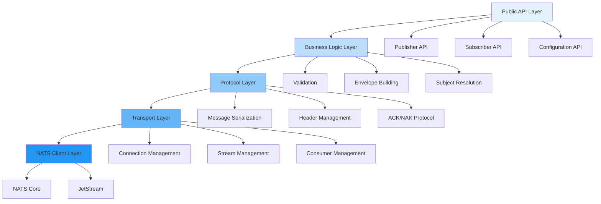
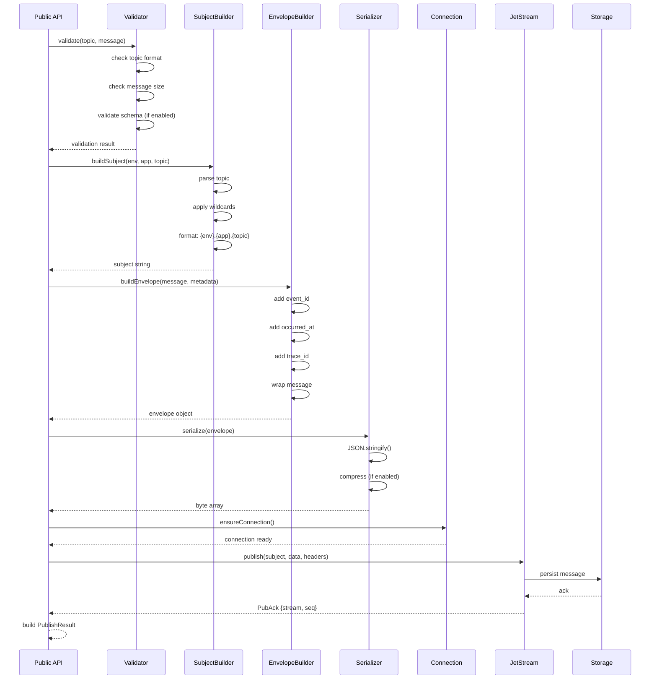
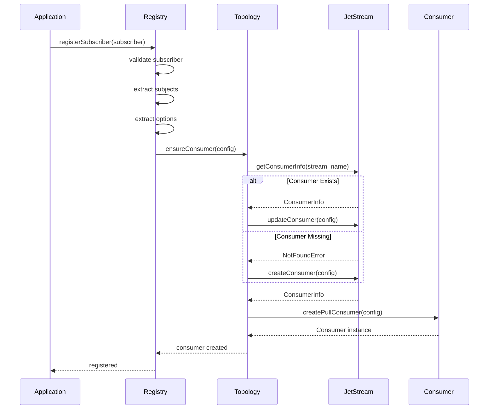
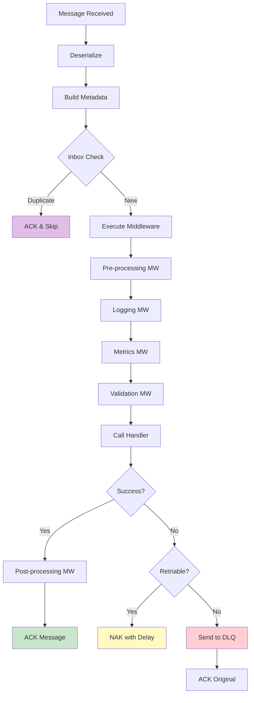
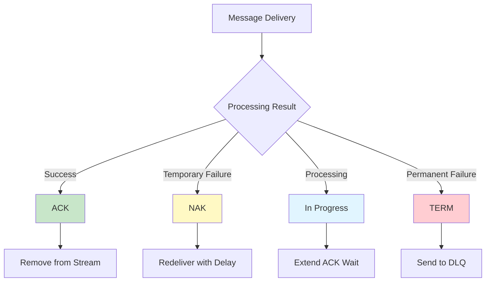

# NatsPubsub Internals

This comprehensive guide provides a deep dive into the internal workings of NatsPubsub, including publishing mechanisms, subscribing mechanics, message formats, acknowledgment protocols, and performance optimizations.

## Table of Contents

- [Overview](#overview)
- [Publishing Internals](#publishing-internals)
- [Subscribing Internals](#subscribing-internals)
- [Message Envelope Structure](#message-envelope-structure)
- [Acknowledgment Protocol](#acknowledgment-protocol)
- [Retry Mechanism](#retry-mechanism)
- [Connection Pooling Internals](#connection-pooling-internals)
- [Memory Management](#memory-management)
- [Performance Optimizations](#performance-optimizations)
- [Serialization and Deserialization](#serialization-and-deserialization)
- [Error Handling Internals](#error-handling-internals)
- [Middleware Pipeline](#middleware-pipeline)

---

## Overview

NatsPubsub is built on several layers of abstraction, each optimized for performance, reliability, and developer experience.

### Architecture Layers



---

## Publishing Internals

### Publishing Pipeline



### Subject Building Algorithm

**Input:**

- Environment: `production`
- App name: `orders`
- Topic: `order.created`

**Algorithm:**

```typescript
function buildSubject(env: string, app: string, topic: string): string {
  // 1. Normalize inputs
  const normalizedEnv = env.toLowerCase().trim();
  const normalizedApp = app
    .toLowerCase()
    .trim()
    .replace(/[^a-z0-9-]/g, "-");
  const normalizedTopic = topic.toLowerCase().trim();

  // 2. Validate components
  if (!normalizedEnv || !normalizedApp || !normalizedTopic) {
    throw new Error("Invalid subject components");
  }

  // 3. Handle wildcards
  // Single level wildcard: * -> *
  // Multi level wildcard: > -> >
  const topicParts = normalizedTopic.split(".");
  const validatedParts = topicParts.map((part) => {
    if (part === "*" || part === ">") return part;
    if (!/^[a-z0-9-]+$/.test(part)) {
      throw new Error(`Invalid topic part: ${part}`);
    }
    return part;
  });

  // 4. Build subject
  return `${normalizedEnv}.${normalizedApp}.${validatedParts.join(".")}`;
}

// Example:
buildSubject("production", "orders", "order.created");
// Returns: "production.orders.order.created"
```

### Envelope Construction

**Envelope Structure:**

```typescript
interface MessageEnvelope {
  event_id: string; // Unique identifier
  occurred_at: string; // ISO 8601 timestamp
  message: Record<string, unknown>; // Actual payload
  metadata?: {
    trace_id?: string; // Distributed tracing
    correlation_id?: string; // Request correlation
    causation_id?: string; // Causal relationship
    user_id?: string; // User context
    [key: string]: unknown; // Custom metadata
  };
}
```

**Building Algorithm:**

```typescript
class EnvelopeBuilder {
  constructor(private appName: string) {}

  buildEnvelope(
    message: Record<string, unknown>,
    options?: {
      eventId?: string;
      occurredAt?: Date;
      traceId?: string;
      metadata?: Record<string, unknown>;
    },
  ): MessageEnvelope {
    // 1. Generate or use provided event ID
    const eventId = options?.eventId || this.generateEventId();

    // 2. Set timestamp
    const occurredAt = options?.occurredAt || new Date();

    // 3. Extract trace context (from global context, headers, etc.)
    const traceId = options?.traceId || this.extractTraceId();

    // 4. Build envelope
    const envelope: MessageEnvelope = {
      event_id: eventId,
      occurred_at: occurredAt.toISOString(),
      message,
    };

    // 5. Add metadata if present
    if (options?.metadata || traceId) {
      envelope.metadata = {
        ...options?.metadata,
        trace_id: traceId,
        app_name: this.appName,
      };
    }

    return envelope;
  }

  private generateEventId(): string {
    // Use UUIDv4 or custom ID generation
    return `${this.appName}-${Date.now()}-${Math.random().toString(36).substr(2, 9)}`;
  }

  private extractTraceId(): string | undefined {
    // Extract from async local storage, continuation-local-storage, etc.
    return undefined;
  }
}
```

### Message Serialization

```typescript
class MessageSerializer {
  serialize(envelope: MessageEnvelope): Uint8Array {
    // 1. Convert to JSON
    const json = JSON.stringify(envelope);

    // 2. Compress if enabled
    if (this.compressionEnabled && json.length > this.compressionThreshold) {
      return this.compress(json);
    }

    // 3. Convert to bytes
    return new TextEncoder().encode(json);
  }

  deserialize(data: Uint8Array): MessageEnvelope {
    // 1. Check if compressed
    if (this.isCompressed(data)) {
      data = this.decompress(data);
    }

    // 2. Convert to string
    const json = new TextDecoder().decode(data);

    // 3. Parse JSON
    return JSON.parse(json) as MessageEnvelope;
  }

  private compress(data: string): Uint8Array {
    // Use gzip, zlib, or other compression
    return gzip(Buffer.from(data));
  }

  private decompress(data: Uint8Array): Uint8Array {
    // Decompress
    return gunzip(data);
  }

  private isCompressed(data: Uint8Array): boolean {
    // Check magic bytes for gzip
    return data[0] === 0x1f && data[1] === 0x8b;
  }
}
```

### JetStream Publishing

```typescript
async publishToJetStream(
  subject: string,
  data: Uint8Array,
  options: {
    msgID?: string;
    headers?: Record<string, string>;
    timeout?: number;
  }
): Promise<PubAck> {
  const js = this.connection.jetstream();

  // 1. Build headers
  const headers = this.buildHeaders(options.headers, options.msgID);

  // 2. Publish with timeout
  const pubAck = await Promise.race([
    js.publish(subject, data, {
      msgID: options.msgID,
      headers,
    }),
    this.timeout(options.timeout || 5000),
  ]);

  // 3. Verify acknowledgment
  if (!pubAck.stream || !pubAck.seq) {
    throw new Error('Invalid publish acknowledgment');
  }

  return pubAck;
}

private buildHeaders(
  customHeaders?: Record<string, string>,
  msgID?: string
): Headers {
  const headers = headers();

  // Add message ID for deduplication
  if (msgID) {
    headers.set('Nats-Msg-Id', msgID);
  }

  // Add custom headers
  if (customHeaders) {
    Object.entries(customHeaders).forEach(([key, value]) => {
      headers.set(key, value);
    });
  }

  // Add metadata
  headers.set('Nats-Published-At', new Date().toISOString());

  return headers;
}
```

---

## Subscribing Internals

### Consumer Creation



### Message Fetching Loop

```typescript
class Consumer {
  private processing = new Set<string>();
  private concurrency: number;
  private batchSize: number;

  async startConsuming(subscriber: Subscriber): Promise<void> {
    const consumer = await this.createPullConsumer(subscriber);

    // Main fetch loop
    while (!this.stopping) {
      try {
        // 1. Check available capacity
        const availableSlots = this.concurrency - this.processing.size;
        if (availableSlots <= 0) {
          await this.waitForCapacity();
          continue;
        }

        // 2. Fetch batch of messages
        const batch = Math.min(availableSlots, this.batchSize);
        const messages = await consumer.fetch({
          max_messages: batch,
          expires: 30000, // 30 seconds
        });

        // 3. Process messages concurrently
        for await (const msg of messages) {
          // Don't await - process in background
          this.processMessage(msg, subscriber);
        }
      } catch (error) {
        this.handleFetchError(error);
        await this.backoff();
      }
    }
  }

  private async processMessage(
    msg: JsMsg,
    subscriber: Subscriber,
  ): Promise<void> {
    const msgId = this.getMessageId(msg);
    this.processing.add(msgId);

    try {
      // 1. Deserialize message
      const envelope = this.deserialize(msg.data);

      // 2. Build metadata
      const metadata = this.buildMetadata(msg, envelope);

      // 3. Execute middleware chain
      await this.middlewareChain.execute(
        envelope.message,
        metadata,
        async () => {
          // 4. Call subscriber handler
          await subscriber.handle(envelope.message, metadata);
        },
      );

      // 5. ACK message
      msg.ack();
    } catch (error) {
      // 6. Handle error (retry or DLQ)
      await this.handleProcessingError(msg, error);
    } finally {
      this.processing.delete(msgId);
    }
  }

  private buildMetadata(msg: JsMsg, envelope: MessageEnvelope): EventMetadata {
    const info = msg.info;

    return {
      subject: msg.subject,
      eventId: envelope.event_id,
      occurredAt: new Date(envelope.occurred_at),
      receivedAt: new Date(),
      stream: info.stream,
      streamSeq: info.streamSequence,
      consumerSeq: info.consumerSequence,
      deliveries: info.delivered,
      pending: info.pending,
      headers: this.extractHeaders(msg),
      ...envelope.metadata,
    };
  }
}
```

### Message Processing Pipeline



### Concurrent Processing

```typescript
class ConcurrentProcessor {
  private slots: Semaphore;
  private processing: Map<string, Promise<void>>;

  constructor(concurrency: number) {
    this.slots = new Semaphore(concurrency);
    this.processing = new Map();
  }

  async process(
    messageId: string,
    handler: () => Promise<void>,
  ): Promise<void> {
    // 1. Acquire slot
    await this.slots.acquire();

    // 2. Create processing promise
    const promise = (async () => {
      try {
        await handler();
      } finally {
        // 3. Release slot
        this.slots.release();
        this.processing.delete(messageId);
      }
    })();

    // 4. Track processing
    this.processing.set(messageId, promise);

    return promise;
  }

  async waitForCompletion(): Promise<void> {
    await Promise.all(Array.from(this.processing.values()));
  }

  getProcessingCount(): number {
    return this.processing.size;
  }
}

class Semaphore {
  private available: number;
  private waiting: Array<() => void> = [];

  constructor(private capacity: number) {
    this.available = capacity;
  }

  async acquire(): Promise<void> {
    if (this.available > 0) {
      this.available--;
      return;
    }

    // Wait for availability
    return new Promise((resolve) => {
      this.waiting.push(resolve);
    });
  }

  release(): void {
    const next = this.waiting.shift();
    if (next) {
      next();
    } else {
      this.available++;
    }
  }
}
```

---

## Message Envelope Structure

### Envelope Format

```typescript
interface MessageEnvelope {
  // Core fields
  event_id: string; // Unique identifier for idempotency
  occurred_at: string; // ISO 8601 timestamp
  message: Record<string, unknown>; // Actual payload

  // Optional metadata
  metadata?: {
    // Tracing
    trace_id?: string; // Distributed tracing ID
    span_id?: string; // Span ID for tracing
    parent_span_id?: string; // Parent span ID

    // Correlation
    correlation_id?: string; // Request correlation
    causation_id?: string; // Event causation

    // Context
    user_id?: string; // User context
    tenant_id?: string; // Multi-tenancy
    session_id?: string; // Session context

    // Application
    app_name?: string; // Source application
    app_version?: string; // Application version
    environment?: string; // Environment (prod, dev, etc.)

    // Custom
    [key: string]: unknown;
  };
}
```

### Example Envelopes

**Simple Message:**

```json
{
  "event_id": "order-123-1234567890",
  "occurred_at": "2025-01-17T10:30:00.000Z",
  "message": {
    "order_id": "ORD-123",
    "customer_id": "CUST-456",
    "total": 99.99,
    "status": "pending"
  }
}
```

**Rich Message with Metadata:**

```json
{
  "event_id": "payment-789-1234567891",
  "occurred_at": "2025-01-17T10:31:00.000Z",
  "message": {
    "payment_id": "PAY-789",
    "order_id": "ORD-123",
    "amount": 99.99,
    "currency": "USD",
    "status": "completed"
  },
  "metadata": {
    "trace_id": "abc123xyz789",
    "span_id": "span-001",
    "correlation_id": "req-123",
    "causation_id": "order-123-1234567890",
    "user_id": "user-456",
    "tenant_id": "tenant-001",
    "app_name": "payment-service",
    "app_version": "1.2.3",
    "environment": "production",
    "payment_method": "credit_card",
    "payment_provider": "stripe"
  }
}
```

### Envelope Size Optimization

```typescript
class EnvelopeOptimizer {
  // Estimate envelope size
  estimateSize(envelope: MessageEnvelope): number {
    return Buffer.from(JSON.stringify(envelope)).length;
  }

  // Optimize envelope by removing optional fields
  optimize(envelope: MessageEnvelope, maxSize: number): MessageEnvelope {
    let size = this.estimateSize(envelope);

    if (size <= maxSize) {
      return envelope;
    }

    // Remove optional metadata fields
    const optimized = { ...envelope };
    if (optimized.metadata) {
      // Remove in priority order (least important first)
      const removable = [
        "app_version",
        "session_id",
        "parent_span_id",
        "span_id",
      ];

      for (const field of removable) {
        if (size <= maxSize) break;
        delete optimized.metadata[field];
        size = this.estimateSize(optimized);
      }
    }

    if (size > maxSize) {
      throw new Error(`Message too large: ${size} bytes (max: ${maxSize})`);
    }

    return optimized;
  }
}
```

---

## Acknowledgment Protocol

### ACK Types



### ACK Implementation

```typescript
class AckHandler {
  async ack(msg: JsMsg): Promise<void> {
    try {
      // Acknowledge successful processing
      await msg.ack();
      this.metrics.incrementAcks();
    } catch (error) {
      this.logger.error("ACK failed", { error });
      throw error;
    }
  }

  async nak(msg: JsMsg, delay?: number): Promise<void> {
    try {
      if (delay) {
        // NAK with delay (exponential backoff)
        await msg.nakWithDelay(delay * 1000000000); // Convert to nanoseconds
      } else {
        // NAK immediately (instant retry)
        await msg.nak();
      }
      this.metrics.incrementNaks();
    } catch (error) {
      this.logger.error("NAK failed", { error });
      throw error;
    }
  }

  async term(msg: JsMsg): Promise<void> {
    try {
      // Terminate processing (permanent failure)
      await msg.term();
      this.metrics.incrementTerms();
    } catch (error) {
      this.logger.error("TERM failed", { error });
      throw error;
    }
  }

  async inProgress(msg: JsMsg): Promise<void> {
    try {
      // Extend ACK wait time
      await msg.working();
      this.metrics.incrementInProgress();
    } catch (error) {
      this.logger.error("In-progress update failed", { error });
      throw error;
    }
  }
}
```

### ACK Wait Extension

For long-running tasks:

```typescript
class LongRunningProcessor {
  async processWithProgress(
    msg: JsMsg,
    handler: () => Promise<void>,
  ): Promise<void> {
    const ackWait = 30000; // 30 seconds
    const progressInterval = 20000; // 20 seconds

    // Start progress heartbeat
    const heartbeat = setInterval(async () => {
      try {
        await msg.working();
        this.logger.debug("Extended ACK wait");
      } catch (error) {
        this.logger.error("Failed to extend ACK wait", { error });
      }
    }, progressInterval);

    try {
      // Process message
      await handler();
      // ACK on success
      await msg.ack();
    } catch (error) {
      // NAK on failure
      await msg.nak();
      throw error;
    } finally {
      clearInterval(heartbeat);
    }
  }
}
```

---

## Retry Mechanism

### Retry Strategy

```typescript
interface RetryConfig {
  maxAttempts: number;
  backoff: number[]; // Delays in milliseconds
  backoffMultiplier?: number; // For exponential backoff
  maxBackoff?: number; // Maximum delay
}

class RetryStrategy {
  constructor(private config: RetryConfig) {}

  shouldRetry(attempt: number): boolean {
    return attempt < this.config.maxAttempts;
  }

  getDelay(attempt: number): number {
    // Use configured backoff if available
    if (attempt < this.config.backoff.length) {
      return this.config.backoff[attempt];
    }

    // Calculate exponential backoff
    const base = this.config.backoff[this.config.backoff.length - 1] || 1000;
    const multiplier = this.config.backoffMultiplier || 2;
    const delay =
      base * Math.pow(multiplier, attempt - this.config.backoff.length);

    // Apply max backoff cap
    return Math.min(delay, this.config.maxBackoff || 60000);
  }
}

// Default configuration
const defaultRetry: RetryConfig = {
  maxAttempts: 5,
  backoff: [1000, 2000, 5000, 10000, 30000], // 1s, 2s, 5s, 10s, 30s
};
```

### Retry Implementation

```typescript
class RetryHandler {
  private strategy: RetryStrategy;

  async handleWithRetry(
    msg: JsMsg,
    handler: () => Promise<void>,
  ): Promise<void> {
    const info = msg.info;
    const attempt = info.delivered;

    try {
      await handler();
      await msg.ack();
    } catch (error) {
      if (this.strategy.shouldRetry(attempt)) {
        // Calculate delay
        const delay = this.strategy.getDelay(attempt);

        this.logger.warn("Processing failed, will retry", {
          attempt,
          delay,
          error: error.message,
        });

        // NAK with delay
        await msg.nakWithDelay(delay * 1000000); // Convert to nanoseconds
      } else {
        this.logger.error("Max retries exceeded", {
          attempt,
          error: error.message,
        });

        // Send to DLQ
        await this.sendToDLQ(msg, error);

        // ACK original message
        await msg.ack();
      }
    }
  }
}
```

### Retry Visualization

```mermaid
gantt
    title Message Retry Timeline
    dateFormat X
    axisFormat %Ss

    section Attempt 1
    Process   :a1, 0, 1s
    Fail      :crit, after a1, 0s
    Wait      :active, after a1, 1s

    section Attempt 2
    Process   :a2, after a1, 1s
    Fail      :crit, after a2, 0s
    Wait      :active, after a2, 2s

    section Attempt 3
    Process   :a3, after a2, 1s
    Fail      :crit, after a3, 0s
    Wait      :active, after a3, 5s

    section Attempt 4
    Process   :a4, after a3, 1s
    Fail      :crit, after a4, 0s
    Wait      :active, after a4, 10s

    section Attempt 5
    Process   :a5, after a4, 1s
    Fail      :crit, after a5, 0s
    To DLQ    :milestone, after a5, 0s
```



---

## Connection Pooling Internals

### Pool Architecture

```typescript
class ConnectionPool {
  private connections: NatsConnection[] = [];
  private available: NatsConnection[] = [];
  private inUse: Set<NatsConnection> = new Set();
  private waiting: Array<(conn: NatsConnection) => void> = [];

  private readonly minSize: number;
  private readonly maxSize: number;
  private size: number = 0;

  constructor(config: PoolConfig) {
    this.minSize = config.minSize || 2;
    this.maxSize = config.maxSize || 10;
  }

  async initialize(): Promise<void> {
    // Create minimum connections
    for (let i = 0; i < this.minSize; i++) {
      const conn = await this.createConnection();
      this.connections.push(conn);
      this.available.push(conn);
      this.size++;
    }
  }

  async acquire(): Promise<NatsConnection> {
    // Return available connection
    if (this.available.length > 0) {
      const conn = this.available.pop()!;
      this.inUse.add(conn);
      return conn;
    }

    // Create new connection if under max
    if (this.size < this.maxSize) {
      const conn = await this.createConnection();
      this.connections.push(conn);
      this.inUse.add(conn);
      this.size++;
      return conn;
    }

    // Wait for available connection
    return new Promise((resolve) => {
      this.waiting.push(resolve);
    });
  }

  release(conn: NatsConnection): void {
    this.inUse.delete(conn);

    // Give to waiting requester
    const next = this.waiting.shift();
    if (next) {
      this.inUse.add(conn);
      next(conn);
      return;
    }

    // Add back to available
    this.available.push(conn);
  }

  async destroy(): Promise<void> {
    // Close all connections
    await Promise.all(this.connections.map((conn) => conn.close()));

    this.connections = [];
    this.available = [];
    this.inUse.clear();
    this.size = 0;
  }
}
```

### Connection Health Monitoring

```typescript
class HealthMonitor {
  private healthChecks: Map<NatsConnection, HealthStatus> = new Map();
  private checkInterval: NodeJS.Timeout;

  startMonitoring(pool: ConnectionPool): void {
    this.checkInterval = setInterval(async () => {
      await this.checkAllConnections(pool);
    }, 10000); // Check every 10 seconds
  }

  private async checkAllConnections(pool: ConnectionPool): Promise<void> {
    for (const conn of pool.getConnections()) {
      const healthy = await this.checkConnection(conn);

      if (!healthy) {
        await this.handleUnhealthyConnection(conn, pool);
      }
    }
  }

  private async checkConnection(conn: NatsConnection): Promise<boolean> {
    try {
      // Check connection state
      if (conn.isClosed()) {
        return false;
      }

      // Ping NATS server
      await conn.flush();
      return true;
    } catch (error) {
      this.logger.error("Health check failed", { error });
      return false;
    }
  }

  private async handleUnhealthyConnection(
    conn: NatsConnection,
    pool: ConnectionPool,
  ): Promise<void> {
    this.logger.warn("Unhealthy connection detected, reconnecting");

    // Remove from pool
    pool.removeConnection(conn);

    try {
      // Close old connection
      await conn.close();
    } catch (error) {
      // Ignore close errors
    }

    // Create replacement
    try {
      const newConn = await pool.createConnection();
      pool.addConnection(newConn);
    } catch (error) {
      this.logger.error("Failed to create replacement connection", { error });
    }
  }

  stopMonitoring(): void {
    clearInterval(this.checkInterval);
  }
}
```

---

## Memory Management

### Memory Pool for Messages

```typescript
class MessagePool {
  private pool: Array<Uint8Array> = [];
  private readonly maxSize: number;
  private readonly bufferSize: number;

  constructor(maxSize: number = 100, bufferSize: number = 64 * 1024) {
    this.maxSize = maxSize;
    this.bufferSize = bufferSize;
  }

  acquire(): Uint8Array {
    // Reuse from pool
    const buffer = this.pool.pop();
    if (buffer) {
      return buffer;
    }

    // Allocate new buffer
    return new Uint8Array(this.bufferSize);
  }

  release(buffer: Uint8Array): void {
    if (this.pool.length < this.maxSize) {
      // Clear buffer
      buffer.fill(0);
      // Return to pool
      this.pool.push(buffer);
    }
    // Else let GC handle it
  }

  clear(): void {
    this.pool = [];
  }
}
```

### Garbage Collection Optimization

```typescript
class GCOptimizer {
  private readonly heapThreshold = 0.85; // 85% of max heap

  monitorMemory(): void {
    setInterval(() => {
      const usage = process.memoryUsage();
      const heapUsed = usage.heapUsed;
      const heapTotal = usage.heapTotal;
      const ratio = heapUsed / heapTotal;

      if (ratio > this.heapThreshold) {
        this.triggerGC();
      }
    }, 30000); // Check every 30 seconds
  }

  private triggerGC(): void {
    if (global.gc) {
      global.gc();
      this.logger.info("Triggered garbage collection");
    }
  }
}
```

### Memory-Efficient Processing

```typescript
class StreamProcessor {
  async processLargeDataset(query: string): Promise<void> {
    // Use streaming instead of loading all at once
    const stream = await this.database.stream(query);

    for await (const row of stream) {
      // Process one row at a time
      await this.processRow(row);

      // Allow GC between rows
      if (this.shouldYield()) {
        await this.yield();
      }
    }
  }

  private shouldYield(): boolean {
    // Yield every N iterations
    return this.iteration++ % 100 === 0;
  }

  private async yield(): Promise<void> {
    // Give event loop a chance to run
    await new Promise((resolve) => setImmediate(resolve));
  }
}
```

---

## Performance Optimizations

### Message Batching

```typescript
class BatchOptimizer {
  private batch: Array<Message> = [];
  private timer?: NodeJS.Timeout;
  private readonly maxBatchSize: number;
  private readonly maxWaitMs: number;

  constructor(maxBatchSize = 100, maxWaitMs = 1000) {
    this.maxBatchSize = maxBatchSize;
    this.maxWaitMs = maxWaitMs;
  }

  add(message: Message): void {
    this.batch.push(message);

    if (this.batch.length >= this.maxBatchSize) {
      this.flush();
    } else if (!this.timer) {
      this.timer = setTimeout(() => this.flush(), this.maxWaitMs);
    }
  }

  private async flush(): Promise<void> {
    if (this.batch.length === 0) return;

    clearTimeout(this.timer);
    this.timer = undefined;

    const toProcess = this.batch.splice(0);

    try {
      await this.processBatch(toProcess);
    } catch (error) {
      this.logger.error("Batch processing failed", { error });
    }
  }

  private async processBatch(messages: Message[]): Promise<void> {
    // Process all messages in parallel
    await Promise.all(messages.map((msg) => this.processMessage(msg)));
  }
}
```

### Caching Layer

```typescript
class CachingLayer {
  private cache: Map<string, CacheEntry> = new Map();
  private readonly maxSize: number;
  private readonly ttl: number;

  constructor(maxSize = 1000, ttl = 60000) {
    this.maxSize = maxSize;
    this.ttl = ttl;

    this.startCleanup();
  }

  get(key: string): any | null {
    const entry = this.cache.get(key);

    if (!entry) {
      return null;
    }

    // Check expiry
    if (Date.now() - entry.timestamp > this.ttl) {
      this.cache.delete(key);
      return null;
    }

    // Update access time for LRU
    entry.lastAccess = Date.now();

    return entry.value;
  }

  set(key: string, value: any): void {
    // Evict if at capacity
    if (this.cache.size >= this.maxSize) {
      this.evictOldest();
    }

    this.cache.set(key, {
      value,
      timestamp: Date.now(),
      lastAccess: Date.now(),
    });
  }

  private evictOldest(): void {
    let oldest: string | null = null;
    let oldestTime = Infinity;

    for (const [key, entry] of this.cache.entries()) {
      if (entry.lastAccess < oldestTime) {
        oldest = key;
        oldestTime = entry.lastAccess;
      }
    }

    if (oldest) {
      this.cache.delete(oldest);
    }
  }

  private startCleanup(): void {
    setInterval(() => {
      const now = Date.now();
      for (const [key, entry] of this.cache.entries()) {
        if (now - entry.timestamp > this.ttl) {
          this.cache.delete(key);
        }
      }
    }, this.ttl);
  }
}
```

---

## Serialization and Deserialization

### JSON Serialization

```typescript
class JSONSerializer {
  serialize(obj: any): Uint8Array {
    // Fast JSON stringify
    const json = JSON.stringify(obj);
    return new TextEncoder().encode(json);
  }

  deserialize(data: Uint8Array): any {
    const json = new TextDecoder().decode(data);
    return JSON.parse(json);
  }
}
```

### Protocol Buffers (Optional)

```typescript
// For high-performance scenarios
class ProtobufSerializer {
  serialize(message: any): Uint8Array {
    // Use protobuf for efficient serialization
    return MessageProto.encode(message).finish();
  }

  deserialize(data: Uint8Array): any {
    return MessageProto.decode(data);
  }
}
```

---

## Error Handling Internals

### Error Classification

```typescript
enum ErrorCategory {
  TRANSIENT = "transient", // Temporary, retry
  PERMANENT = "permanent", // Permanent, don't retry
  VALIDATION = "validation", // Invalid input
  INFRASTRUCTURE = "infrastructure", // System failure
}

class ErrorClassifier {
  classify(error: Error): ErrorCategory {
    // Network errors - transient
    if (this.isNetworkError(error)) {
      return ErrorCategory.TRANSIENT;
    }

    // Validation errors - permanent
    if (this.isValidationError(error)) {
      return ErrorCategory.PERMANENT;
    }

    // Database errors - check if transient
    if (this.isDatabaseError(error)) {
      return this.classifyDatabaseError(error);
    }

    // Default to permanent
    return ErrorCategory.PERMANENT;
  }

  private isNetworkError(error: Error): boolean {
    return (
      error.message.includes("ECONNREFUSED") ||
      error.message.includes("ETIMEDOUT") ||
      error.message.includes("ENOTFOUND")
    );
  }
}
```

---

## Middleware Pipeline

### Middleware Execution

```typescript
class MiddlewareChain {
  private middlewares: Middleware[] = [];

  use(middleware: Middleware): void {
    this.middlewares.push(middleware);
  }

  async execute(
    message: any,
    metadata: any,
    handler: () => Promise<void>,
  ): Promise<void> {
    let index = 0;

    const next = async (): Promise<void> => {
      if (index < this.middlewares.length) {
        const middleware = this.middlewares[index++];
        await middleware.call(message, metadata, next);
      } else {
        await handler();
      }
    };

    await next();
  }
}
```

---

## Related Documentation

- [Architecture Guide](./architecture.md) - System architecture
- [Custom Repositories](./custom-repositories.md) - Custom storage implementation
- [Security Guide](./security.md) - Security best practices
- [Performance Guide](../guides/performance.md) - Performance optimization

---

**Navigation:**

- [← Previous: Architecture](./architecture.md)
- [Next: Custom Repositories →](./custom-repositories.md)
- [Back to Documentation Home](../index.md)
