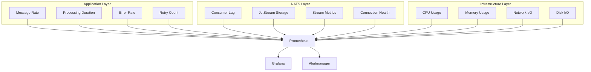

# Advanced Monitoring Setup

This comprehensive guide covers production-grade monitoring for NatsPubsub applications, including Prometheus, Grafana, DataDog, New Relic, high-cardinality metrics, and JetStream consumer lag analysis.

## Table of Contents

- [Overview](#overview)
- [Metrics Architecture](#metrics-architecture)
- [Prometheus Integration](#prometheus-integration)
  - [JavaScript/TypeScript Setup](#javascripttypescript-setup)
  - [Ruby Setup](#ruby-setup)
- [Grafana Dashboards](#grafana-dashboards)
- [DataDog Integration](#datadog-integration)
- [New Relic Integration](#new-relic-integration)
- [Consumer Lag Monitoring](#consumer-lag-monitoring)
- [High-Cardinality Metrics](#high-cardinality-metrics)
- [Alerting Rules](#alerting-rules)
- [Performance Metrics](#performance-metrics)
- [NATS Server Monitoring](#nats-server-monitoring)
- [Custom Metrics](#custom-metrics)
- [Best Practices](#best-practices)
- [Troubleshooting](#troubleshooting)

---

## Overview

Effective monitoring of NatsPubsub applications requires tracking multiple layers:



### Key Metrics

1. **Message Throughput**: Messages published/consumed per second
2. **Processing Latency**: Time taken to process messages
3. **Error Rates**: Failed message processing attempts
4. **Consumer Lag**: Messages waiting to be processed
5. **Resource Utilization**: CPU, memory, network usage

---

## Metrics Architecture

### Metric Types

```typescript
// Metric categories for NatsPubsub
export enum MetricType {
  // Counter: Monotonically increasing value
  COUNTER = "counter",

  // Gauge: Value that can go up or down
  GAUGE = "gauge",

  // Histogram: Distribution of values
  HISTOGRAM = "histogram",

  // Summary: Similar to histogram with percentiles
  SUMMARY = "summary",
}
```

### Standard Labels

```typescript
// Standard labels for all metrics
export interface StandardLabels {
  service: string; // Service name
  environment: string; // Environment (prod, staging, dev)
  topic: string; // NATS topic
  consumer: string; // Consumer name
  status: string; // success, failure, retry
  error_type?: string; // Type of error if failed
}
```

---

## Prometheus Integration

### JavaScript/TypeScript Setup

#### Installation

```bash
npm install prom-client
# or
pnpm add prom-client
```

#### Basic Configuration

```typescript
// src/monitoring/prometheus.ts
import { Registry, Counter, Histogram, Gauge } from "prom-client";
import express from "express";

export class PrometheusMetrics {
  private registry: Registry;

  // Message metrics
  public messagesPublished: Counter;
  public messagesConsumed: Counter;
  public messagesProcessed: Counter;
  public messagesFailed: Counter;

  // Performance metrics
  public messageProcessingDuration: Histogram;
  public messageSizeBytes: Histogram;

  // Consumer metrics
  public consumerLag: Gauge;
  public activeConsumers: Gauge;

  // Error metrics
  public errors: Counter;
  public retries: Counter;

  constructor() {
    this.registry = new Registry();
    this.initializeMetrics();
  }

  private initializeMetrics() {
    // Messages published counter
    this.messagesPublished = new Counter({
      name: "nats_messages_published_total",
      help: "Total number of messages published",
      labelNames: ["service", "environment", "topic", "status"],
      registers: [this.registry],
    });

    // Messages consumed counter
    this.messagesConsumed = new Counter({
      name: "nats_messages_consumed_total",
      help: "Total number of messages consumed",
      labelNames: ["service", "environment", "topic", "consumer"],
      registers: [this.registry],
    });

    // Messages processed counter
    this.messagesProcessed = new Counter({
      name: "nats_messages_processed_total",
      help: "Total number of messages processed",
      labelNames: ["service", "environment", "topic", "consumer", "status"],
      registers: [this.registry],
    });

    // Messages failed counter
    this.messagesFailed = new Counter({
      name: "nats_messages_failed_total",
      help: "Total number of failed messages",
      labelNames: ["service", "environment", "topic", "consumer", "error_type"],
      registers: [this.registry],
    });

    // Processing duration histogram
    this.messageProcessingDuration = new Histogram({
      name: "nats_message_processing_duration_seconds",
      help: "Message processing duration in seconds",
      labelNames: ["service", "environment", "topic", "consumer"],
      buckets: [0.001, 0.005, 0.01, 0.05, 0.1, 0.5, 1, 5, 10],
      registers: [this.registry],
    });

    // Message size histogram
    this.messageSizeBytes = new Histogram({
      name: "nats_message_size_bytes",
      help: "Message size in bytes",
      labelNames: ["service", "environment", "topic"],
      buckets: [100, 500, 1000, 5000, 10000, 50000, 100000],
      registers: [this.registry],
    });

    // Consumer lag gauge
    this.consumerLag = new Gauge({
      name: "nats_consumer_lag_messages",
      help: "Number of messages waiting to be processed",
      labelNames: ["service", "environment", "consumer", "stream"],
      registers: [this.registry],
    });

    // Active consumers gauge
    this.activeConsumers = new Gauge({
      name: "nats_active_consumers",
      help: "Number of active consumers",
      labelNames: ["service", "environment"],
      registers: [this.registry],
    });

    // Errors counter
    this.errors = new Counter({
      name: "nats_errors_total",
      help: "Total number of errors",
      labelNames: ["service", "environment", "error_type", "topic"],
      registers: [this.registry],
    });

    // Retries counter
    this.retries = new Counter({
      name: "nats_retries_total",
      help: "Total number of retry attempts",
      labelNames: ["service", "environment", "topic", "consumer"],
      registers: [this.registry],
    });
  }

  // Get metrics endpoint handler
  public async getMetrics(): Promise<string> {
    return this.registry.metrics();
  }

  // Start metrics server
  public startMetricsServer(port: number = 9090) {
    const app = express();

    app.get("/metrics", async (req, res) => {
      res.set("Content-Type", this.registry.contentType);
      res.end(await this.getMetrics());
    });

    app.get("/health", (req, res) => {
      res.json({ status: "ok" });
    });

    app.listen(port, () => {
      console.log(`Metrics server listening on port ${port}`);
    });
  }
}

// Singleton instance
export const metrics = new PrometheusMetrics();
```

#### Integration with NatsPubsub

```typescript
// src/monitoring/instrumentation.ts
import NatsPubsub from "nats-pubsub";
import { metrics } from "./prometheus";

export function instrumentNatsPubsub() {
  const config = NatsPubsub.getConfig();
  const labels = {
    service: config.appName,
    environment: config.env,
  };

  // Instrument publishing
  const originalPublish = NatsPubsub.publish.bind(NatsPubsub);
  NatsPubsub.publish = async (topic: string, message: any, options?: any) => {
    const startTime = Date.now();

    try {
      const result = await originalPublish(topic, message, options);

      // Record success metrics
      metrics.messagesPublished
        .labels({
          ...labels,
          topic,
          status: "success",
        })
        .inc();

      // Record message size
      const messageSize = JSON.stringify(message).length;
      metrics.messageSizeBytes
        .labels({
          ...labels,
          topic,
        })
        .observe(messageSize);

      return result;
    } catch (error) {
      // Record failure metrics
      metrics.messagesPublished
        .labels({
          ...labels,
          topic,
          status: "failure",
        })
        .inc();

      metrics.errors
        .labels({
          ...labels,
          error_type: error.constructor.name,
          topic,
        })
        .inc();

      throw error;
    } finally {
      // Record duration
      const duration = (Date.now() - startTime) / 1000;
      metrics.messageProcessingDuration
        .labels({
          ...labels,
          topic,
          consumer: "publisher",
        })
        .observe(duration);
    }
  };
}
```

#### Middleware for Subscribers

```typescript
// src/middleware/metrics-middleware.ts
import { Middleware, TopicMetadata } from "nats-pubsub";
import { metrics } from "../monitoring/prometheus";

export class MetricsMiddleware implements Middleware {
  async call(
    message: any,
    metadata: TopicMetadata,
    next: () => Promise<void>,
  ): Promise<void> {
    const startTime = Date.now();
    const config = NatsPubsub.getConfig();
    const labels = {
      service: config.appName,
      environment: config.env,
      topic: metadata.topic,
      consumer: metadata.consumer || "unknown",
    };

    // Record message consumed
    metrics.messagesConsumed.labels(labels).inc();

    try {
      // Process message
      await next();

      // Record success
      metrics.messagesProcessed
        .labels({
          ...labels,
          status: "success",
        })
        .inc();
    } catch (error) {
      // Record failure
      metrics.messagesProcessed
        .labels({
          ...labels,
          status: "failure",
        })
        .inc();

      metrics.messagesFailed
        .labels({
          ...labels,
          error_type: error.constructor.name,
        })
        .inc();

      metrics.errors
        .labels({
          ...labels,
          error_type: error.constructor.name,
        })
        .inc();

      // Check if retry
      if (metadata.deliveries > 1) {
        metrics.retries.labels(labels).inc();
      }

      throw error;
    } finally {
      // Record processing duration
      const duration = (Date.now() - startTime) / 1000;
      metrics.messageProcessingDuration.labels(labels).observe(duration);
    }
  }
}
```

### Ruby Setup

#### Installation

```ruby
# Gemfile
gem 'prometheus-client'
```

#### Basic Configuration

```ruby
# lib/monitoring/prometheus_metrics.rb
require 'prometheus/client'

module Monitoring
  class PrometheusMetrics
    attr_reader :registry, :messages_published, :messages_consumed,
                :messages_processed, :messages_failed,
                :message_processing_duration, :message_size_bytes,
                :consumer_lag, :active_consumers, :errors, :retries

    def initialize
      @registry = Prometheus::Client::Registry.new
      initialize_metrics
    end

    private

    def initialize_metrics
      # Messages published counter
      @messages_published = Prometheus::Client::Counter.new(
        :nats_messages_published_total,
        docstring: 'Total number of messages published',
        labels: [:service, :environment, :topic, :status]
      )
      @registry.register(@messages_published)

      # Messages consumed counter
      @messages_consumed = Prometheus::Client::Counter.new(
        :nats_messages_consumed_total,
        docstring: 'Total number of messages consumed',
        labels: [:service, :environment, :topic, :consumer]
      )
      @registry.register(@messages_consumed)

      # Messages processed counter
      @messages_processed = Prometheus::Client::Counter.new(
        :nats_messages_processed_total,
        docstring: 'Total number of messages processed',
        labels: [:service, :environment, :topic, :consumer, :status]
      )
      @registry.register(@messages_processed)

      # Messages failed counter
      @messages_failed = Prometheus::Client::Counter.new(
        :nats_messages_failed_total,
        docstring: 'Total number of failed messages',
        labels: [:service, :environment, :topic, :consumer, :error_type]
      )
      @registry.register(@messages_failed)

      # Processing duration histogram
      @message_processing_duration = Prometheus::Client::Histogram.new(
        :nats_message_processing_duration_seconds,
        docstring: 'Message processing duration in seconds',
        labels: [:service, :environment, :topic, :consumer],
        buckets: [0.001, 0.005, 0.01, 0.05, 0.1, 0.5, 1, 5, 10]
      )
      @registry.register(@message_processing_duration)

      # Message size histogram
      @message_size_bytes = Prometheus::Client::Histogram.new(
        :nats_message_size_bytes,
        docstring: 'Message size in bytes',
        labels: [:service, :environment, :topic],
        buckets: [100, 500, 1000, 5000, 10000, 50000, 100000]
      )
      @registry.register(@message_size_bytes)

      # Consumer lag gauge
      @consumer_lag = Prometheus::Client::Gauge.new(
        :nats_consumer_lag_messages,
        docstring: 'Number of messages waiting to be processed',
        labels: [:service, :environment, :consumer, :stream]
      )
      @registry.register(@consumer_lag)

      # Active consumers gauge
      @active_consumers = Prometheus::Client::Gauge.new(
        :nats_active_consumers,
        docstring: 'Number of active consumers',
        labels: [:service, :environment]
      )
      @registry.register(@active_consumers)

      # Errors counter
      @errors = Prometheus::Client::Counter.new(
        :nats_errors_total,
        docstring: 'Total number of errors',
        labels: [:service, :environment, :error_type, :topic]
      )
      @registry.register(@errors)

      # Retries counter
      @retries = Prometheus::Client::Counter.new(
        :nats_retries_total,
        docstring: 'Total number of retry attempts',
        labels: [:service, :environment, :topic, :consumer]
      )
      @registry.register(@retries)
    end

    public

    def metrics
      Prometheus::Client::Formats::Text.marshal(@registry)
    end
  end
end

# Singleton instance
$prometheus_metrics = Monitoring::PrometheusMetrics.new
```

#### Metrics Server

```ruby
# lib/monitoring/metrics_server.rb
require 'rack'
require 'prometheus/middleware/exporter'

module Monitoring
  class MetricsServer
    def self.start(port: 9090)
      app = Rack::Builder.new do
        use Prometheus::Middleware::Exporter, registry: $prometheus_metrics.registry

        map '/health' do
          run ->(_env) { [200, { 'Content-Type' => 'application/json' }, ['{"status":"ok"}']] }
        end
      end

      Rack::Handler::WEBrick.run app, Port: port
    end
  end
end
```

#### Middleware for Subscribers

```ruby
# lib/middleware/metrics_middleware.rb
module Middleware
  class MetricsMiddleware
    def call(message, context)
      start_time = Time.now
      labels = {
        service: NatsPubsub.config.app_name,
        environment: NatsPubsub.config.env,
        topic: context.topic,
        consumer: context.consumer || 'unknown'
      }

      # Record message consumed
      $prometheus_metrics.messages_consumed.increment(labels: labels)

      begin
        # Process message
        yield

        # Record success
        $prometheus_metrics.messages_processed.increment(
          labels: labels.merge(status: 'success')
        )
      rescue StandardError => e
        # Record failure
        $prometheus_metrics.messages_processed.increment(
          labels: labels.merge(status: 'failure')
        )

        $prometheus_metrics.messages_failed.increment(
          labels: labels.merge(error_type: e.class.name)
        )

        $prometheus_metrics.errors.increment(
          labels: labels.merge(error_type: e.class.name)
        )

        # Check if retry
        if context.deliveries > 1
          $prometheus_metrics.retries.increment(labels: labels)
        end

        raise
      ensure
        # Record processing duration
        duration = Time.now - start_time
        $prometheus_metrics.message_processing_duration.observe(
          duration,
          labels: labels
        )
      end
    end
  end
end
```

---

## Grafana Dashboards

### Dashboard Configuration

```json
{
  "dashboard": {
    "title": "NatsPubsub Monitoring",
    "tags": ["natspubsub", "messaging"],
    "timezone": "browser",
    "rows": [
      {
        "title": "Message Throughput",
        "panels": [
          {
            "title": "Messages Published/sec",
            "type": "graph",
            "targets": [
              {
                "expr": "rate(nats_messages_published_total{status=\"success\"}[5m])",
                "legendFormat": "{{topic}} - {{status}}"
              }
            ],
            "yaxes": [
              {
                "format": "ops",
                "label": "Messages/sec"
              }
            ]
          },
          {
            "title": "Messages Consumed/sec",
            "type": "graph",
            "targets": [
              {
                "expr": "rate(nats_messages_consumed_total[5m])",
                "legendFormat": "{{consumer}} - {{topic}}"
              }
            ]
          }
        ]
      },
      {
        "title": "Processing Performance",
        "panels": [
          {
            "title": "Processing Duration (p50, p95, p99)",
            "type": "graph",
            "targets": [
              {
                "expr": "histogram_quantile(0.50, rate(nats_message_processing_duration_seconds_bucket[5m]))",
                "legendFormat": "p50 - {{consumer}}"
              },
              {
                "expr": "histogram_quantile(0.95, rate(nats_message_processing_duration_seconds_bucket[5m]))",
                "legendFormat": "p95 - {{consumer}}"
              },
              {
                "expr": "histogram_quantile(0.99, rate(nats_message_processing_duration_seconds_bucket[5m]))",
                "legendFormat": "p99 - {{consumer}}"
              }
            ],
            "yaxes": [
              {
                "format": "s",
                "label": "Duration"
              }
            ]
          }
        ]
      },
      {
        "title": "Error Rates",
        "panels": [
          {
            "title": "Failed Messages/sec",
            "type": "graph",
            "targets": [
              {
                "expr": "rate(nats_messages_failed_total[5m])",
                "legendFormat": "{{consumer}} - {{error_type}}"
              }
            ],
            "alert": {
              "name": "High Error Rate",
              "conditions": [
                {
                  "evaluator": {
                    "params": [10],
                    "type": "gt"
                  },
                  "operator": {
                    "type": "and"
                  },
                  "query": {
                    "params": ["A", "5m", "now"]
                  },
                  "reducer": {
                    "type": "avg"
                  },
                  "type": "query"
                }
              ]
            }
          }
        ]
      },
      {
        "title": "Consumer Lag",
        "panels": [
          {
            "title": "Consumer Lag (Messages)",
            "type": "graph",
            "targets": [
              {
                "expr": "nats_consumer_lag_messages",
                "legendFormat": "{{consumer}} - {{stream}}"
              }
            ],
            "yaxes": [
              {
                "format": "short",
                "label": "Messages"
              }
            ]
          }
        ]
      }
    ]
  }
}
```

### Provisioning Dashboards

```yaml
# grafana/provisioning/dashboards/natspubsub.yml
apiVersion: 1

providers:
  - name: "NatsPubsub"
    orgId: 1
    folder: "Messaging"
    type: file
    disableDeletion: false
    updateIntervalSeconds: 10
    allowUiUpdates: true
    options:
      path: /etc/grafana/provisioning/dashboards/natspubsub
```

---

## DataDog Integration

### JavaScript/TypeScript Setup

```typescript
// src/monitoring/datadog.ts
import { StatsD } from "hot-shots";

export class DataDogMetrics {
  private statsd: StatsD;

  constructor() {
    this.statsd = new StatsD({
      host: process.env.DATADOG_AGENT_HOST || "localhost",
      port: parseInt(process.env.DATADOG_AGENT_PORT || "8125"),
      prefix: "natspubsub.",
      globalTags: {
        service: process.env.APP_NAME || "app",
        env: process.env.ENV || "development",
      },
    });
  }

  // Record message published
  public messagePublished(topic: string, success: boolean) {
    this.statsd.increment("messages.published", 1, {
      topic,
      status: success ? "success" : "failure",
    });
  }

  // Record message consumed
  public messageConsumed(topic: string, consumer: string) {
    this.statsd.increment("messages.consumed", 1, {
      topic,
      consumer,
    });
  }

  // Record processing duration
  public recordProcessingDuration(
    topic: string,
    consumer: string,
    duration: number,
  ) {
    this.statsd.timing("message.processing.duration", duration, {
      topic,
      consumer,
    });
  }

  // Record consumer lag
  public recordConsumerLag(consumer: string, stream: string, lag: number) {
    this.statsd.gauge("consumer.lag", lag, {
      consumer,
      stream,
    });
  }

  // Record error
  public recordError(topic: string, errorType: string) {
    this.statsd.increment("errors.total", 1, {
      topic,
      error_type: errorType,
    });
  }
}

export const datadogMetrics = new DataDogMetrics();
```

### Ruby Setup

```ruby
# lib/monitoring/datadog_metrics.rb
require 'datadog/statsd'

module Monitoring
  class DataDogMetrics
    attr_reader :statsd

    def initialize
      @statsd = Datadog::Statsd.new(
        ENV['DATADOG_AGENT_HOST'] || 'localhost',
        ENV['DATADOG_AGENT_PORT']&.to_i || 8125,
        namespace: 'natspubsub',
        tags: {
          service: ENV['APP_NAME'] || 'app',
          env: ENV['ENV'] || 'development'
        }
      )
    end

    def message_published(topic:, success:)
      @statsd.increment('messages.published', tags: {
        topic: topic,
        status: success ? 'success' : 'failure'
      })
    end

    def message_consumed(topic:, consumer:)
      @statsd.increment('messages.consumed', tags: {
        topic: topic,
        consumer: consumer
      })
    end

    def record_processing_duration(topic:, consumer:, duration:)
      @statsd.timing('message.processing.duration', duration, tags: {
        topic: topic,
        consumer: consumer
      })
    end

    def record_consumer_lag(consumer:, stream:, lag:)
      @statsd.gauge('consumer.lag', lag, tags: {
        consumer: consumer,
        stream: stream
      })
    end

    def record_error(topic:, error_type:)
      @statsd.increment('errors.total', tags: {
        topic: topic,
        error_type: error_type
      })
    end
  end
end

$datadog_metrics = Monitoring::DataDogMetrics.new
```

---

## New Relic Integration

### JavaScript/TypeScript Setup

```typescript
// src/monitoring/newrelic.ts
import newrelic from "newrelic";

export class NewRelicMetrics {
  // Record custom metric
  public recordMetric(name: string, value: number) {
    newrelic.recordMetric(name, value);
  }

  // Record custom event
  public recordEvent(eventType: string, attributes: Record<string, any>) {
    newrelic.recordCustomEvent(eventType, attributes);
  }

  // Track message processing
  public async trackMessageProcessing<T>(
    topic: string,
    consumer: string,
    fn: () => Promise<T>,
  ): Promise<T> {
    return newrelic.startBackgroundTransaction(
      `process-message-${topic}`,
      async () => {
        const startTime = Date.now();

        try {
          const result = await fn();

          // Record success
          this.recordEvent("MessageProcessed", {
            topic,
            consumer,
            status: "success",
            duration: Date.now() - startTime,
          });

          return result;
        } catch (error) {
          // Record error
          newrelic.noticeError(error, {
            topic,
            consumer,
          });

          this.recordEvent("MessageProcessed", {
            topic,
            consumer,
            status: "failure",
            error: error.message,
            duration: Date.now() - startTime,
          });

          throw error;
        }
      },
    );
  }
}

export const newrelicMetrics = new NewRelicMetrics();
```

---

## Consumer Lag Monitoring

### Lag Calculation

```typescript
// src/monitoring/consumer-lag.ts
import { JetStreamManager } from "nats";

export class ConsumerLagMonitor {
  private jsm: JetStreamManager;
  private interval: NodeJS.Timer | null = null;

  constructor(jsm: JetStreamManager) {
    this.jsm = jsm;
  }

  // Start monitoring consumer lag
  public start(intervalMs: number = 30000) {
    if (this.interval) {
      return;
    }

    this.interval = setInterval(async () => {
      await this.checkAllConsumers();
    }, intervalMs);

    // Initial check
    this.checkAllConsumers();
  }

  // Stop monitoring
  public stop() {
    if (this.interval) {
      clearInterval(this.interval);
      this.interval = null;
    }
  }

  // Check lag for all consumers
  private async checkAllConsumers() {
    try {
      const streams = await this.jsm.streams.list().next();

      for (const stream of streams) {
        const consumers = await this.jsm.consumers
          .list(stream.config.name)
          .next();

        for (const consumer of consumers) {
          const info = await this.jsm.consumers.info(
            stream.config.name,
            consumer.name,
          );

          const lag = info.num_pending;

          // Record lag metric
          metrics.consumerLag
            .labels({
              service: config.appName,
              environment: config.env,
              consumer: consumer.name,
              stream: stream.config.name,
            })
            .set(lag);

          // Alert if lag is too high
          if (lag > 1000) {
            console.warn(
              `High consumer lag detected: ${consumer.name} (${lag} messages)`,
            );
          }
        }
      }
    } catch (error) {
      console.error("Error checking consumer lag:", error);
    }
  }

  // Get lag for specific consumer
  public async getConsumerLag(
    streamName: string,
    consumerName: string,
  ): Promise<number> {
    try {
      const info = await this.jsm.consumers.info(streamName, consumerName);
      return info.num_pending;
    } catch (error) {
      console.error("Error getting consumer lag:", error);
      return 0;
    }
  }
}
```

### Ruby Implementation

```ruby
# lib/monitoring/consumer_lag_monitor.rb
module Monitoring
  class ConsumerLagMonitor
    def initialize(jetstream_manager)
      @jsm = jetstream_manager
      @thread = nil
    end

    def start(interval_seconds: 30)
      return if @thread&.alive?

      @thread = Thread.new do
        loop do
          check_all_consumers
          sleep interval_seconds
        end
      end

      # Initial check
      check_all_consumers
    end

    def stop
      @thread&.kill
      @thread = nil
    end

    private

    def check_all_consumers
      streams = @jsm.streams.list

      streams.each do |stream|
        consumers = @jsm.consumers.list(stream.config.name)

        consumers.each do |consumer|
          info = @jsm.consumers.info(stream.config.name, consumer.name)
          lag = info.num_pending

          # Record lag metric
          $prometheus_metrics.consumer_lag.set(
            lag,
            labels: {
              service: NatsPubsub.config.app_name,
              environment: NatsPubsub.config.env,
              consumer: consumer.name,
              stream: stream.config.name
            }
          )

          # Alert if lag is too high
          if lag > 1000
            Rails.logger.warn("High consumer lag detected: #{consumer.name} (#{lag} messages)")
          end
        end
      end
    rescue StandardError => e
      Rails.logger.error("Error checking consumer lag: #{e.message}")
    end

    public

    def consumer_lag(stream_name:, consumer_name:)
      info = @jsm.consumers.info(stream_name, consumer_name)
      info.num_pending
    rescue StandardError => e
      Rails.logger.error("Error getting consumer lag: #{e.message}")
      0
    end
  end
end
```

---

## High-Cardinality Metrics

### Best Practices

```typescript
// Avoid high-cardinality labels
// ❌ Bad: Using user_id as label (millions of unique values)
metrics.requests.labels({ user_id: "12345" }).inc();

// ✅ Good: Use aggregated metrics
metrics.requests.labels({ user_type: "premium" }).inc();

// ❌ Bad: Using event_id as label
metrics.events.labels({ event_id: "evt-abc-123" }).inc();

// ✅ Good: Use event_type instead
metrics.events.labels({ event_type: "order.created" }).inc();
```

### Label Guidelines

```typescript
export const LABEL_GUIDELINES = {
  // Low cardinality (good for labels)
  service: "fixed set of services",
  environment: "dev, staging, production",
  topic: "limited set of topics",
  status: "success, failure, retry",
  error_type: "limited set of error classes",

  // High cardinality (avoid as labels)
  user_id: "use aggregated user_type instead",
  order_id: "use order_type or order_status",
  event_id: "use event_type",
  timestamp: "use time-based aggregations",
  ip_address: "use region or country",
};
```

---

## Alerting Rules

### Prometheus Alert Rules

```yaml
# alerts/natspubsub.yml
groups:
  - name: natspubsub_alerts
    interval: 30s
    rules:
      # High error rate
      - alert: HighErrorRate
        expr: rate(nats_messages_failed_total[5m]) > 10
        for: 5m
        labels:
          severity: warning
        annotations:
          summary: "High error rate detected"
          description: "{{ $labels.consumer }} is experiencing {{ $value }} errors/sec"

      # High consumer lag
      - alert: HighConsumerLag
        expr: nats_consumer_lag_messages > 1000
        for: 10m
        labels:
          severity: warning
        annotations:
          summary: "High consumer lag detected"
          description: "Consumer {{ $labels.consumer }} has {{ $value }} pending messages"

      # Critical consumer lag
      - alert: CriticalConsumerLag
        expr: nats_consumer_lag_messages > 10000
        for: 5m
        labels:
          severity: critical
        annotations:
          summary: "Critical consumer lag"
          description: "Consumer {{ $labels.consumer }} has {{ $value }} pending messages"

      # Slow message processing
      - alert: SlowMessageProcessing
        expr: histogram_quantile(0.95, rate(nats_message_processing_duration_seconds_bucket[5m])) > 10
        for: 10m
        labels:
          severity: warning
        annotations:
          summary: "Slow message processing"
          description: "95th percentile processing time is {{ $value }}s for {{ $labels.consumer }}"

      # No messages processed
      - alert: NoMessagesProcessed
        expr: rate(nats_messages_processed_total[10m]) == 0
        for: 15m
        labels:
          severity: critical
        annotations:
          summary: "No messages being processed"
          description: "Consumer {{ $labels.consumer }} hasn't processed any messages in 15 minutes"

      # Consumer down
      - alert: ConsumerDown
        expr: nats_active_consumers == 0
        for: 5m
        labels:
          severity: critical
        annotations:
          summary: "No active consumers"
          description: "No active consumers in {{ $labels.environment }}"
```

### Alertmanager Configuration

```yaml
# alertmanager.yml
global:
  resolve_timeout: 5m
  slack_api_url: "YOUR_SLACK_WEBHOOK_URL"

route:
  group_by: ["alertname", "cluster", "service"]
  group_wait: 10s
  group_interval: 10s
  repeat_interval: 12h
  receiver: "slack-notifications"
  routes:
    - match:
        severity: critical
      receiver: "pagerduty"
      continue: true

receivers:
  - name: "slack-notifications"
    slack_configs:
      - channel: "#alerts"
        title: "NatsPubsub Alert"
        text: "{{ range .Alerts }}{{ .Annotations.description }}{{ end }}"

  - name: "pagerduty"
    pagerduty_configs:
      - service_key: "YOUR_PAGERDUTY_KEY"
```

---

## Performance Metrics

### Key Performance Indicators

```typescript
// src/monitoring/kpis.ts
export interface KPIs {
  // Throughput
  messagesPerSecond: number;
  bytesPerSecond: number;

  // Latency
  p50Latency: number;
  p95Latency: number;
  p99Latency: number;

  // Reliability
  successRate: number;
  errorRate: number;
  retryRate: number;

  // Consumer health
  averageLag: number;
  maxLag: number;
  activeConsumers: number;
}

export async function calculateKPIs(): Promise<KPIs> {
  // Query Prometheus for metrics
  const messagesPerSecond = await queryPrometheus(
    "rate(nats_messages_processed_total[5m])",
  );

  const p95Latency = await queryPrometheus(
    "histogram_quantile(0.95, rate(nats_message_processing_duration_seconds_bucket[5m]))",
  );

  const successRate = await queryPrometheus(
    'rate(nats_messages_processed_total{status="success"}[5m]) / rate(nats_messages_processed_total[5m])',
  );

  return {
    messagesPerSecond,
    p50Latency: await queryPrometheus("..."),
    p95Latency,
    p99Latency: await queryPrometheus("..."),
    successRate,
    errorRate: 1 - successRate,
    // ... other KPIs
  };
}
```

---

## NATS Server Monitoring

### Server Metrics

```bash
# Expose NATS server metrics
nats-server --http_port 8222

# Query metrics
curl http://localhost:8222/varz    # General metrics
curl http://localhost:8222/connz   # Connection metrics
curl http://localhost:8222/subsz   # Subscription metrics
curl http://localhost:8222/routez  # Route metrics
```

### Prometheus Exporter for NATS

```yaml
# docker-compose.yml
services:
  nats-exporter:
    image: natsio/prometheus-nats-exporter:latest
    command:
      - -varz
      - -connz
      - -subz
      - -routez
      - -serverz
      - http://nats:8222
    ports:
      - "7777:7777"
```

---

## Custom Metrics

### Application-Specific Metrics

```typescript
// src/monitoring/custom-metrics.ts
import { Counter, Histogram } from "prom-client";

export const customMetrics = {
  // Order-specific metrics
  ordersCreated: new Counter({
    name: "orders_created_total",
    help: "Total orders created",
    labelNames: ["status", "payment_method"],
  }),

  orderValue: new Histogram({
    name: "order_value_dollars",
    help: "Order value in dollars",
    buckets: [10, 50, 100, 500, 1000, 5000],
  }),

  // Payment-specific metrics
  paymentProcessingTime: new Histogram({
    name: "payment_processing_seconds",
    help: "Payment processing time",
    labelNames: ["provider", "status"],
    buckets: [0.1, 0.5, 1, 2, 5, 10],
  }),
};
```

---

## Best Practices

### 1. Metric Naming Conventions

```typescript
// Follow Prometheus naming conventions
// ✅ Good
nats_messages_published_total;
nats_message_processing_duration_seconds;
nats_consumer_lag_messages;

// ❌ Bad
messagesPublished;
processingTime;
lag;
```

### 2. Use Appropriate Metric Types

```typescript
// Counter: For values that only increase
metrics.messagesPublished.inc();

// Gauge: For values that can go up or down
metrics.consumerLag.set(100);

// Histogram: For distributions
metrics.processingDuration.observe(0.5);
```

### 3. Keep Labels Low-Cardinality

```typescript
// ✅ Good: ~10 unique values
labels: { environment: 'production', status: 'success' }

// ❌ Bad: millions of unique values
labels: { user_id: '12345', request_id: 'abc-def' }
```

### 4. Set Appropriate Buckets

```typescript
// For latency metrics (seconds)
buckets: [0.001, 0.005, 0.01, 0.05, 0.1, 0.5, 1, 5, 10];

// For message size (bytes)
buckets: [100, 500, 1000, 5000, 10000, 50000, 100000];
```

---

## Troubleshooting

### High Memory Usage from Metrics

```typescript
// Problem: Too many unique label combinations
// Solution: Reduce label cardinality

// ❌ Before
metrics.requests.labels({ user_id, order_id, session_id }).inc();

// ✅ After
metrics.requests.labels({ user_type, order_status }).inc();
```

### Missing Metrics

```bash
# Check if metrics endpoint is accessible
curl http://localhost:9090/metrics

# Verify Prometheus is scraping
# Check Prometheus targets: http://prometheus:9090/targets

# Check for errors in application logs
grep "metrics" app.log
```

### Stale Metrics

```typescript
// Clean up old metrics
setInterval(() => {
  // Remove metrics for inactive consumers
  metrics.consumerLag.reset();
}, 3600000); // Every hour
```

---

## Related Resources

- [Observability Guide](./observability.md)
- [Practical Monitoring Guide](../guides/monitoring.md)
- [Prometheus Documentation](https://prometheus.io/docs/)
- [Grafana Documentation](https://grafana.com/docs/)

---

**Navigation:**

- [Next: Observability](./observability.md)
- [Documentation Home](../index.md)
