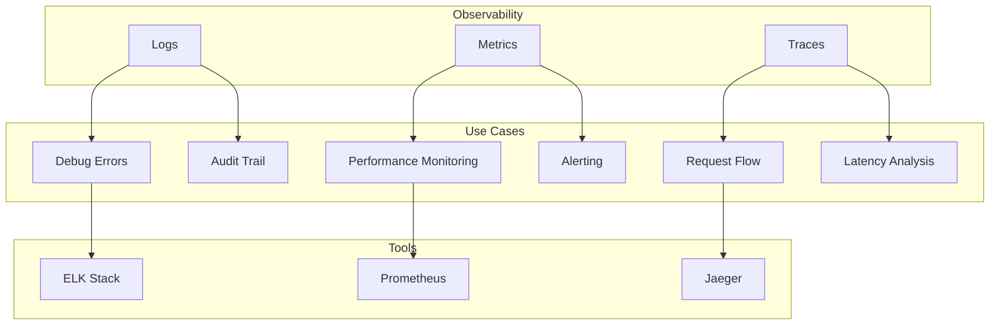

# Observability

Comprehensive guide to observability in NatsPubsub applications, covering logs, metrics, and distributed tracing with OpenTelemetry integration for production-grade monitoring.

## Table of Contents

- [Overview](#overview)
- [Observability Pillars](#observability-pillars)
  - [Logs](#logs)
  - [Metrics](#metrics)
  - [Traces](#traces)
- [OpenTelemetry Integration](#opentelemetry-integration)
  - [JavaScript Setup](#javascript-setup)
  - [Ruby Setup](#ruby-setup)
- [Distributed Tracing](#distributed-tracing)
  - [Trace Context Propagation](#trace-context-propagation)
  - [Spans and Attributes](#spans-and-attributes)
- [Structured Logging](#structured-logging)
  - [Log Levels and Formatting](#log-levels-and-formatting)
  - [Correlation IDs](#correlation-ids)
- [Metrics Collection](#metrics-collection)
  - [Application Metrics](#application-metrics)
  - [Business Metrics](#business-metrics)
- [Visualization Platforms](#visualization-platforms)
  - [Jaeger](#jaeger)
  - [Zipkin](#zipkin)
  - [Honeycomb](#honeycomb)
  - [New Relic](#new-relic)
  - [DataDog](#datadog)
- [Best Practices](#best-practices)
- [Troubleshooting](#troubleshooting)
- [Related Resources](#related-resources)

---

## Overview

**Observability** is the ability to understand the internal state of your system by examining its external outputs. For distributed messaging systems like NatsPubsub, observability is critical for:

- **Debugging**: Tracing message flow across services
- **Performance**: Identifying bottlenecks and latency issues
- **Reliability**: Detecting failures and anomalies
- **Business Insights**: Understanding usage patterns and trends

### The Three Pillars



---

## Observability Pillars

### Logs

**What**: Text records of discrete events that occurred in your system

**When to Use**:

- Debugging specific errors
- Audit trails
- Development troubleshooting

**Example Log Entry**:

```json
{
  "timestamp": "2025-01-17T10:30:45.123Z",
  "level": "info",
  "message": "Message published successfully",
  "service": "order-service",
  "trace_id": "abc-123",
  "span_id": "def-456",
  "topic": "order.created",
  "event_id": "evt-789",
  "duration_ms": 12
}
```

### Metrics

**What**: Numerical measurements of system behavior over time

**When to Use**:

- Performance monitoring
- Capacity planning
- Alerting on thresholds

**Example Metrics**:

- `messages_published_total` - Counter
- `message_processing_duration_seconds` - Histogram
- `consumer_lag_messages` - Gauge

### Traces

**What**: Records of request paths through your distributed system

**When to Use**:

- Understanding request flow
- Finding bottlenecks
- Analyzing latency

**Example Trace**:

```
Root Span: HTTP POST /orders
  ├─ Span: Publish order.created (5ms)
  ├─ Span: Database Insert (15ms)
  └─ Child Trace: order.created consumer
      ├─ Span: Reserve inventory (50ms)
      └─ Span: Send notification (25ms)
```

---

## OpenTelemetry Integration

[OpenTelemetry](https://opentelemetry.io/) is the industry-standard observability framework that provides vendor-neutral APIs and SDKs.

### JavaScript Setup

#### Installation

```bash
npm install @opentelemetry/api \
  @opentelemetry/sdk-node \
  @opentelemetry/auto-instrumentations-node \
  @opentelemetry/exporter-trace-otlp-http \
  @opentelemetry/exporter-metrics-otlp-http
```

#### Basic Configuration

```typescript
// instrumentation.ts
import { NodeSDK } from "@opentelemetry/sdk-node";
import { getNodeAutoInstrumentations } from "@opentelemetry/auto-instrumentations-node";
import { OTLPTraceExporter } from "@opentelemetry/exporter-trace-otlp-http";
import { OTLPMetricExporter } from "@opentelemetry/exporter-metrics-otlp-http";
import { PeriodicExportingMetricReader } from "@opentelemetry/sdk-metrics";

const sdk = new NodeSDK({
  serviceName: "order-service",
  traceExporter: new OTLPTraceExporter({
    url:
      process.env.OTEL_EXPORTER_OTLP_ENDPOINT ||
      "http://localhost:4318/v1/traces",
  }),
  metricReader: new PeriodicExportingMetricReader({
    exporter: new OTLPMetricExporter({
      url:
        process.env.OTEL_EXPORTER_OTLP_ENDPOINT ||
        "http://localhost:4318/v1/metrics",
    }),
    exportIntervalMillis: 60000, // Export every 60 seconds
  }),
  instrumentations: [
    getNodeAutoInstrumentations({
      "@opentelemetry/instrumentation-fs": {
        enabled: false, // Disable noisy file system instrumentation
      },
    }),
  ],
});

sdk.start();

// Graceful shutdown
process.on("SIGTERM", async () => {
  await sdk.shutdown();
  process.exit(0);
});

export default sdk;
```

#### NatsPubsub Integration

```typescript
// src/observability/nats-instrumentation.ts
import { trace, context, SpanStatusCode } from "@opentelemetry/api";
import NatsPubsub from "nats-pubsub";

const tracer = trace.getTracer("nats-pubsub");

// Instrument publishing
export function instrumentPublish() {
  const originalPublish = NatsPubsub.publish.bind(NatsPubsub);

  NatsPubsub.publish = async function (
    topic: string,
    message: any,
    options?: any,
  ) {
    const span = tracer.startSpan("nats.publish", {
      attributes: {
        "messaging.system": "nats",
        "messaging.destination": topic,
        "messaging.operation": "publish",
      },
    });

    try {
      // Inject trace context into message metadata
      const carrier = {};
      trace.getSpan(context.active())?.spanContext();

      const result = await originalPublish(topic, message, {
        ...options,
        trace_id: span.spanContext().traceId,
        span_id: span.spanContext().spanId,
      });

      span.setStatus({ code: SpanStatusCode.OK });
      return result;
    } catch (error) {
      span.recordException(error);
      span.setStatus({
        code: SpanStatusCode.ERROR,
        message: error.message,
      });
      throw error;
    } finally {
      span.end();
    }
  };
}

// Middleware for subscribers
import { Middleware, TopicMetadata } from "nats-pubsub";

export class TracingMiddleware implements Middleware {
  async call(
    message: any,
    metadata: TopicMetadata,
    next: () => Promise<void>,
  ): Promise<void> {
    const span = tracer.startSpan("nats.consume", {
      attributes: {
        "messaging.system": "nats",
        "messaging.destination": metadata.topic,
        "messaging.operation": "consume",
        "messaging.message_id": metadata.event_id,
      },
    });

    // Extract trace context from metadata
    if (metadata.trace_id) {
      // Link to parent trace
      span.addLink({
        traceId: metadata.trace_id,
        spanId: metadata.span_id || "",
      });
    }

    try {
      await context.with(trace.setSpan(context.active(), span), async () => {
        await next();
      });

      span.setStatus({ code: SpanStatusCode.OK });
    } catch (error) {
      span.recordException(error);
      span.setStatus({
        code: SpanStatusCode.ERROR,
        message: error.message,
      });
      throw error;
    } finally {
      span.end();
    }
  }
}

// Initialize
export function initializeObservability() {
  instrumentPublish();
  NatsPubsub.use(new TracingMiddleware());
}
```

### Ruby Setup

#### Installation

```ruby
# Gemfile
gem 'opentelemetry-sdk'
gem 'opentelemetry-exporter-otlp'
gem 'opentelemetry-instrumentation-all'
```

#### Configuration

```ruby
# config/initializers/opentelemetry.rb
require 'opentelemetry/sdk'
require 'opentelemetry/exporter/otlp'
require 'opentelemetry/instrumentation/all'

OpenTelemetry::SDK.configure do |c|
  c.service_name = 'order-service'
  c.service_version = '1.0.0'

  # Configure OTLP exporter
  c.add_span_processor(
    OpenTelemetry::SDK::Trace::Export::BatchSpanProcessor.new(
      OpenTelemetry::Exporter::OTLP::Exporter.new(
        endpoint: ENV['OTEL_EXPORTER_OTLP_ENDPOINT'] || 'http://localhost:4318/v1/traces'
      )
    )
  )

  # Auto-instrument common libraries
  c.use_all
end
```

#### NatsPubsub Integration

```ruby
# lib/observability/nats_instrumentation.rb
module Observability
  module NatsInstrumentation
    def self.tracer
      @tracer ||= OpenTelemetry.tracer_provider.tracer('nats-pubsub')
    end

    # Middleware for tracing
    class TracingMiddleware
      def call(message, context)
        span = Observability::NatsInstrumentation.tracer.start_span(
          'nats.consume',
          attributes: {
            'messaging.system' => 'nats',
            'messaging.destination' => context.topic,
            'messaging.operation' => 'consume',
            'messaging.message_id' => context.event_id
          }
        )

        # Extract trace context
        if context.trace_id
          span.add_link(
            OpenTelemetry::Trace::Link.new(
              OpenTelemetry::Trace::SpanContext.new(
                trace_id: context.trace_id,
                span_id: context.span_id || '0'
              )
            )
          )
        end

        begin
          OpenTelemetry::Trace.with_span(span) do
            yield
          end
          span.status = OpenTelemetry::Trace::Status.ok
        rescue StandardError => e
          span.record_exception(e)
          span.status = OpenTelemetry::Trace::Status.error(e.message)
          raise
        ensure
          span.finish
        end
      end
    end
  end
end

# Register middleware
NatsPubsub.configure do |config|
  config.middleware << Observability::NatsInstrumentation::TracingMiddleware.new
end
```

---

## Distributed Tracing

### Trace Context Propagation

Trace context must be propagated across service boundaries to maintain visibility into end-to-end request flows.

#### JavaScript Context Propagation

```typescript
// Publisher: Inject trace context
import { trace, context as otelContext } from "@opentelemetry/api";

async function publishWithTracing(topic: string, message: any) {
  const span = trace.getActiveSpan();

  await NatsPubsub.publish(topic, message, {
    trace_id: span?.spanContext().traceId,
    span_id: span?.spanContext().spanId,
    trace_flags: span?.spanContext().traceFlags,
  });
}

// Subscriber: Extract and continue trace
class OrderSubscriber extends Subscriber {
  async handle(message: any, metadata: TopicMetadata) {
    // Create new span linked to parent
    const span = tracer.startSpan("process-order", {
      links: [
        {
          context: {
            traceId: metadata.trace_id,
            spanId: metadata.span_id,
            traceFlags: metadata.trace_flags,
          },
        },
      ],
    });

    try {
      await otelContext.with(
        trace.setSpan(otelContext.active(), span),
        async () => {
          await this.processOrder(message);
        },
      );
    } finally {
      span.end();
    }
  }
}
```

#### Ruby Context Propagation

```ruby
# Publisher: Inject trace context
def publish_with_tracing(topic, message)
  span = OpenTelemetry::Trace.current_span

  NatsPubsub.publish(
    topic: topic,
    message: message,
    trace_id: span.context.hex_trace_id,
    span_id: span.context.hex_span_id
  )
end

# Subscriber: Extract and continue trace
class OrderSubscriber < NatsPubsub::Subscriber
  subscribe_to 'order.created'

  def handle(message, context)
    tracer = OpenTelemetry.tracer_provider.tracer('order-subscriber')

    span = tracer.start_span(
      'process-order',
      links: [
        OpenTelemetry::Trace::Link.new(
          OpenTelemetry::Trace::SpanContext.new(
            trace_id: context.trace_id
          )
        )
      ]
    )

    begin
      OpenTelemetry::Trace.with_span(span) do
        process_order(message)
      end
    ensure
      span.finish
    end
  end
end
```

### Spans and Attributes

#### Creating Custom Spans

```typescript
// JavaScript
import { trace, SpanStatusCode } from "@opentelemetry/api";

const tracer = trace.getTracer("order-service");

async function processOrder(orderId: string) {
  const span = tracer.startSpan("process-order", {
    attributes: {
      "order.id": orderId,
      "service.name": "order-service",
    },
  });

  try {
    // Add events to span
    span.addEvent("order-validation-started");
    await validateOrder(orderId);
    span.addEvent("order-validation-completed");

    // Add more attributes
    span.setAttribute("order.total", 99.99);
    span.setAttribute("order.items_count", 3);

    await saveOrder(orderId);

    span.setStatus({ code: SpanStatusCode.OK });
  } catch (error) {
    span.recordException(error);
    span.setStatus({
      code: SpanStatusCode.ERROR,
      message: error.message,
    });
    throw error;
  } finally {
    span.end();
  }
}
```

```ruby
# Ruby
tracer = OpenTelemetry.tracer_provider.tracer('order-service')

def process_order(order_id)
  span = tracer.start_span(
    'process-order',
    attributes: {
      'order.id' => order_id,
      'service.name' => 'order-service'
    }
  )

  begin
    span.add_event('order-validation-started')
    validate_order(order_id)
    span.add_event('order-validation-completed')

    span.set_attribute('order.total', 99.99)
    span.set_attribute('order.items_count', 3)

    save_order(order_id)

    span.status = OpenTelemetry::Trace::Status.ok
  rescue StandardError => e
    span.record_exception(e)
    span.status = OpenTelemetry::Trace::Status.error(e.message)
    raise
  ensure
    span.finish
  end
end
```

---

## Structured Logging

### Log Levels and Formatting

#### JavaScript Structured Logging

```typescript
// src/observability/logger.ts
import winston from "winston";
import { trace } from "@opentelemetry/api";

export const logger = winston.createLogger({
  level: process.env.LOG_LEVEL || "info",
  format: winston.format.combine(
    winston.format.timestamp(),
    winston.format.errors({ stack: true }),
    winston.format.json(),
  ),
  defaultMeta: {
    service: "order-service",
    environment: process.env.NODE_ENV,
  },
  transports: [
    new winston.transports.Console(),
    new winston.transports.File({
      filename: "logs/error.log",
      level: "error",
    }),
  ],
});

// Add trace context to logs
export function logWithTrace(level: string, message: string, meta?: any) {
  const span = trace.getActiveSpan();
  const spanContext = span?.spanContext();

  logger.log(level, message, {
    ...meta,
    trace_id: spanContext?.traceId,
    span_id: spanContext?.spanId,
  });
}
```

#### Ruby Structured Logging

```ruby
# lib/observability/logger.rb
require 'logger'
require 'json'

module Observability
  class StructuredLogger
    def initialize
      @logger = Logger.new(STDOUT)
      @logger.formatter = proc do |severity, datetime, progname, msg|
        log_entry = {
          timestamp: datetime.iso8601,
          level: severity.downcase,
          message: msg.is_a?(String) ? msg : msg[:message],
          service: ENV['SERVICE_NAME'] || 'app'
        }

        # Add trace context
        span = OpenTelemetry::Trace.current_span
        if span
          log_entry[:trace_id] = span.context.hex_trace_id
          log_entry[:span_id] = span.context.hex_span_id
        end

        log_entry.merge!(msg) if msg.is_a?(Hash)
        "#{log_entry.to_json}\n"
      end
    end

    def info(message, **fields)
      @logger.info({ message: message }.merge(fields))
    end
  end
end
```

### Correlation IDs

```typescript
// JavaScript Express middleware
app.use((req, res, next) => {
  req.correlationId = req.headers["x-correlation-id"] || uuidv4();
  res.setHeader("x-correlation-id", req.correlationId);
  next();
});

// Publish with correlation ID
await NatsPubsub.publish("order.created", orderData, {
  correlation_id: req.correlationId,
});
```

---

## Metrics Collection

### Application Metrics

```typescript
import { metrics } from "@opentelemetry/api";

const meter = metrics.getMeter("order-service");

const orderCounter = meter.createCounter("orders.created", {
  description: "Total orders created",
});

orderCounter.add(1, { payment_method: "credit_card" });
```

### Business Metrics

```typescript
const revenueCounter = meter.createCounter("revenue.total", {
  description: "Total revenue",
  unit: "USD",
});

revenueCounter.add(order.total, {
  product_category: order.category,
});
```

---

## Visualization Platforms

### Jaeger

```yaml
# docker-compose.yml
services:
  jaeger:
    image: jaegertracing/all-in-one:latest
    ports:
      - "16686:16686" # UI
      - "4318:4318" # OTLP HTTP
```

### Honeycomb

```typescript
const traceExporter = new OTLPTraceExporter({
  url: "https://api.honeycomb.io/v1/traces",
  headers: {
    "x-honeycomb-team": process.env.HONEYCOMB_API_KEY,
  },
});
```

---

## Best Practices

### 1. Sampling Strategies

```typescript
import { TraceIdRatioBasedSampler } from "@opentelemetry/sdk-trace-base";

const sdk = new NodeSDK({
  sampler: new TraceIdRatioBasedSampler(0.1), // 10% sampling
});
```

### 2. Structured Logging

```typescript
// Good
logger.info("Order created", { order_id: "ORD-123", total: 99.99 });

// Bad
logger.info(`Order ORD-123 created with total 99.99`);
```

### 3. Context Propagation

```typescript
await context.with(context.active(), async () => {
  await publishMessage();
});
```

---

## Troubleshooting

### Missing Traces

Check exporter configuration and SDK initialization:

```typescript
sdk
  .start()
  .then(() => console.log("OpenTelemetry started"))
  .catch((error) => console.error("Failed:", error));
```

---

## Related Resources

- [Advanced Monitoring](./monitoring.md)
- [Performance Guide](../guides/performance.md)
- [OpenTelemetry Documentation](https://opentelemetry.io/docs/)

---

**Navigation:**

- [Previous: Monitoring Setup](./monitoring.md)
- [Next: Security Best Practices](./security.md)
- [Documentation Home](../index.md)
