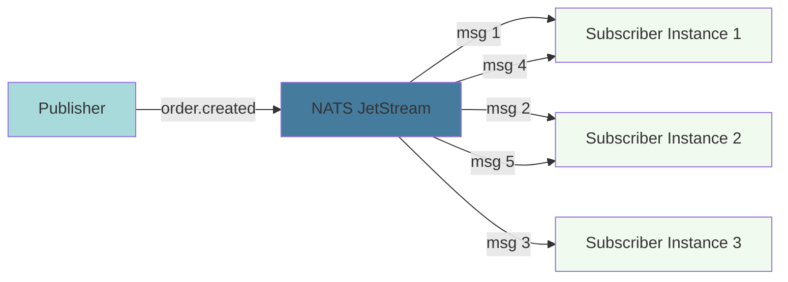

# Core Concepts

Understanding the fundamental concepts of NatsPubsub will help you build reliable event-driven systems.

## Topics and Subjects

### Topics (Application Level)

**Topics** are human-readable identifiers for message types in your application:

```md
user.created
order.updated
payment.processed
inventory.item.added
```

Topics use dot notation for hierarchical organization:

- Simple: `user.created`
- Nested: `order.item.added`
- Deep nesting: `warehouse.inventory.bin.location.updated`

### Subjects (NATS Level)

**Subjects** are NATS-level identifiers automatically generated from topics:

```md
{env}.{appName}.{topic}
```

Example transformations:

| Topic           | Env          | App Name | Subject                        |
| --------------- | ------------ | -------- | ------------------------------ |
| `user.created`  | `production` | `api`    | `production.api.user.created`  |
| `order.updated` | `staging`    | `orders` | `staging.orders.order.updated` |

This automatic prefixing provides:

- **Environment isolation**: Dev/staging/prod messages don't mix
- **App isolation**: Multiple apps can use same topics
- **Debugging**: Easy to trace message sources

### Wildcard Patterns

Subscribe to multiple topics with wildcards:

**Single-level wildcard (`*`):**

```md
user._ → user.created, user.updated, user.deleted
order._.confirm → order.payment.confirm, order.shipping.confirm
```

**Multi-level wildcard (`>`):**

```md
user.> → user.created, user.profile.updated, user.settings.changed
order.> → order.created, order.item.added, order.payment.processed
```

**JavaScript:**

```typescript
class AllUserEventsSubscriber extends Subscriber {
  constructor() {
    super("user.*"); // Matches all user events
  }
}
```

**Ruby:**

```ruby
class AllUserEventsSubscriber < NatsPubsub::Subscriber
  subscribe_to 'user.>'  # Matches all user events (nested)
end
```

## Message Envelope

Every message is wrapped in a standard envelope with metadata:

```json
{
  "id": "550e8400-e29b-41d4-a716-446655440000",
  "topic": "user.created",
  "timestamp": "2025-01-15T10:30:00.000Z",
  "source": "user-service",
  "version": "1.0",
  "data": {
    "userId": "123",
    "email": "user@example.com"
  },
  "metadata": {
    "userId": "admin-456",
    "traceId": "trace-789",
    "correlationId": "corr-012"
  }
}
```

### Envelope Fields

- **id**: Unique message identifier (UUID v4)
- **topic**: The topic name
- **timestamp**: When the message was created (ISO 8601)
- **source**: Service that published the message
- **version**: Message schema version
- **data**: The actual payload
- **metadata**: Additional context (user ID, trace ID, etc.)

### Accessing Envelope Data

**JavaScript:**

```typescript
class OrderSubscriber extends Subscriber {
  async handle(message: any, metadata: MessageMetadata) {
    // Message data
    console.log(message.orderId);

    // Envelope metadata
    console.log(metadata.id); // Message ID
    console.log(metadata.topic); // Topic name
    console.log(metadata.timestamp); // When published
    console.log(metadata.source); // Source service
  }
}
```

**Ruby:**

```ruby
class OrderSubscriber < NatsPubsub::Subscriber
  def handle(message, context)
    # Message data
    puts message['order_id']

    # Envelope metadata
    puts context[:id]        # Message ID
    puts context[:topic]     # Topic name
    puts context[:timestamp] # When published
    puts context[:source]    # Source service
  end
end
```

## Publishers and Subscribers

### Publishers

Publishers send messages to topics:

**JavaScript:**

```typescript
import NatsPubsub from "nats-pubsub";

// Configure once at app startup
NatsPubsub.configure({
  natsUrls: "nats://localhost:4222",
  env: "production",
  appName: "order-service",
});

// Simple publish
await NatsPubsub.publish("order.created", {
  orderId: "123",
  amount: 99.99,
});

// Publish with metadata
await NatsPubsub.publish("order.created", orderData, {
  trace_id: "trace-456",
  message_type: "OrderCreated",
});
```

**Ruby:**

```ruby
# Simple publish
NatsPubsub.publish('order.created', {
  order_id: '123',
  amount: 99.99
})

# Publish with metadata
NatsPubsub.publish('order.created', order_data,
  metadata: {
    user_id: 'user-123',
    trace_id: 'trace-456'
  }
)
```

### Subscribers

Subscribers receive and process messages:

**JavaScript:**

```typescript
import { Subscriber, TopicMetadata } from "nats-pubsub";

class OrderCreatedSubscriber extends Subscriber<
  Record<string, unknown>,
  TopicMetadata
> {
  constructor() {
    super("production.order-service.order.created", {
      maxDeliver: 3, // Max retry attempts
      ackWait: 30000, // Time to process (ms)
    });
  }

  async handle(
    message: Record<string, unknown>,
    metadata: TopicMetadata,
  ): Promise<void> {
    // Process message
    await processOrder(message);
  }
}
```

**Ruby:**

```ruby
class OrderCreatedSubscriber < NatsPubsub::Subscriber
  subscribe_to 'order.created',
    max_deliver: 3,       # Max retry attempts
    ack_wait: 30_000,     # Time to process (ms)
    max_ack_pending: 100  # Max unacked messages

  def handle(message, context)
    # Process message
    process_order(message)
  end
end
```

## Consumer Groups

Subscribers automatically form **consumer groups** for load balancing.

### How It Works



Multiple instances of the same subscriber share the workload:

- Messages are distributed round-robin
- Each message is processed by exactly one instance
- Provides horizontal scalability

### Example

```typescript
import { Subscriber, TopicMetadata } from "nats-pubsub";

// Instance 1, 2, and 3 all run the same code:
class OrderSubscriber extends Subscriber<
  Record<string, unknown>,
  TopicMetadata
> {
  constructor() {
    super("production.order-service.order.created");
  }

  async handle(
    message: Record<string, unknown>,
    metadata: TopicMetadata,
  ): Promise<void> {
    await processOrder(message);
  }
}

// Messages are distributed:
// - Instance 1: processes messages 1, 4, 7, 10...
// - Instance 2: processes messages 2, 5, 8, 11...
// - Instance 3: processes messages 3, 6, 9, 12...
```

## Acknowledgments

### Acknowledgment Modes

**Auto (default):**

- Message is automatically acknowledged after successful processing
- Nacked (retried) if error is thrown

**Manual:**

- You control when to acknowledge
- Useful for complex processing logic

```typescript
import { Subscriber, TopicMetadata } from "nats-pubsub";

class OrderSubscriber extends Subscriber<
  Record<string, unknown>,
  TopicMetadata
> {
  constructor() {
    super("production.order-service.order.created", {
      manualAck: true,
    });
  }

  async handle(
    message: Record<string, unknown>,
    metadata: TopicMetadata,
  ): Promise<void> {
    try {
      await processOrder(message);
      await metadata.ack(); // Success
    } catch (error) {
      if (isRetriable(error)) {
        await metadata.nack(); // Retry later
      } else {
        await metadata.term(); // Terminal error, don't retry
      }
    }
  }
}
```

**Ruby:**

```ruby
class OrderSubscriber < NatsPubsub::Subscriber
  ack_mode :manual

  def handle(message, context)
    process_order(message)
    context.ack  # Success
  rescue RetriableError => e
    context.nak  # Retry later
  rescue FatalError => e
    context.term # Don't retry
  end
end
```

### Acknowledgment Types

- **ack()**: Message processed successfully
- **nak()**: Processing failed, retry later
- **term()**: Terminal error, don't retry
- **inProgress()**: Still processing, extend ack deadline

## Retry and Error Handling

### Automatic Retries

Failed messages are automatically retried with exponential backoff:

```typescript
import { Subscriber, TopicMetadata } from "nats-pubsub";

class OrderSubscriber extends Subscriber<
  Record<string, unknown>,
  TopicMetadata
> {
  constructor() {
    super("production.order-service.order.created", {
      maxDeliver: 5, // Retry up to 5 times
      ackWait: 30000, // 30 seconds per attempt
      backoff: [1000, 5000, 15000, 30000], // Custom backoff
    });
  }

  async handle(
    message: Record<string, unknown>,
    metadata: TopicMetadata,
  ): Promise<void> {
    // If this throws, message will be retried
    await processOrder(message);
  }
}
```

### Retry Attempts Tracking

```typescript
async handle(message: Record<string, unknown>, metadata: TopicMetadata): Promise<void> {
  const attempt = metadata.deliveries || 1;
  console.log(`Processing attempt ${attempt}`);

  if (attempt > 3) {
    // Maybe use different strategy after 3 attempts
    await fallbackProcessing(message);
  } else {
    await normalProcessing(message);
  }
}
```

### Error Handlers

```typescript
import { Subscriber, TopicMetadata } from "nats-pubsub";

class OrderSubscriber extends Subscriber<
  Record<string, unknown>,
  TopicMetadata
> {
  constructor() {
    super("production.order-service.order.created");
  }

  async handle(
    message: Record<string, unknown>,
    metadata: TopicMetadata,
  ): Promise<void> {
    await processOrder(message);
  }

  async onError(
    error: Error,
    message: Record<string, unknown>,
    metadata: TopicMetadata,
  ): Promise<void> {
    console.error("Processing failed:", error);

    // Log to monitoring service
    await logger.error({
      error: error.message,
      event_id: metadata.event_id,
      topic: metadata.topic,
    });
  }
}
```

## Dead Letter Queue (DLQ)

Messages that fail after max retries go to the Dead Letter Queue:

```typescript
import { Subscriber, TopicMetadata } from "nats-pubsub";

class OrderSubscriber extends Subscriber<
  Record<string, unknown>,
  TopicMetadata
> {
  constructor() {
    super("production.order-service.order.created", {
      maxDeliver: 3,
      useDlq: true, // Enable DLQ
    });
  }

  async handle(
    message: Record<string, unknown>,
    metadata: TopicMetadata,
  ): Promise<void> {
    await processOrder(message);
  }
}

// Process DLQ messages
class OrderDLQSubscriber extends Subscriber<
  Record<string, unknown>,
  TopicMetadata
> {
  constructor() {
    super("production.order-service.dlq");
  }

  async handle(
    message: Record<string, unknown>,
    metadata: TopicMetadata,
  ): Promise<void> {
    // Manual intervention or special handling
    await notifyAdmin(message, metadata.error);
  }
}
```

## Streams and Consumers

### JetStream Streams

**Streams** are named message stores in NATS JetStream:

```md
ORDERS_STREAM
└── Subjects: production.api.order.\*
└── Retention: 7 days
└── Storage: File
└── Replicas: 3
```

NatsPubsub automatically creates and manages streams:

```typescript
import { Subscriber, TopicMetadata } from "nats-pubsub";

class OrderCreatedSubscriber extends Subscriber<
  Record<string, unknown>,
  TopicMetadata
> {
  constructor() {
    super("production.order-service.order.created", {
      stream: "ORDERS_STREAM", // Optional: specify stream name
    });
  }

  async handle(
    message: Record<string, unknown>,
    metadata: TopicMetadata,
  ): Promise<void> {
    await processOrder(message);
  }
}
```

### Durable Consumers

**Consumers** are subscriptions that remember their position:

```md
OrderCreatedConsumer
└── Stream: ORDERS_STREAM
└── Filter: production.api.order.created
└── AckPolicy: Explicit
└── MaxDeliver: 3
```

Consumers provide:

- **Position tracking**: Resume from last processed message
- **Load balancing**: Multiple instances share workload
- **Replay capability**: Re-process historical messages

## Message Ordering

### Ordered by Topic

Messages on the **same topic** are processed in order:

```md
Topic: order.created
Messages: [msg1, msg2, msg3] → Processed in order
```

### Unordered Across Topics

Messages on **different topics** are processed independently:

```md
Topic: order.created → [msg1, msg2]
Topic: order.updated → [msg3, msg4]
No ordering guarantee between topics
```

### Guaranteed Ordering

For strict ordering within a consumer group:

```typescript
import { Subscriber, TopicMetadata } from "nats-pubsub";

class OrderSubscriber extends Subscriber<
  Record<string, unknown>,
  TopicMetadata
> {
  constructor() {
    super("production.order-service.order.created", {
      concurrency: 1, // Process one message at a time
    });
  }

  async handle(
    message: Record<string, unknown>,
    metadata: TopicMetadata,
  ): Promise<void> {
    await processOrder(message);
  }
}
```

## Idempotency

### Why Idempotency Matters

Messages may be delivered more than once:

- Network failures
- Consumer crashes
- Redelivery after timeout

Your handlers should be idempotent (safe to run multiple times).

### Strategies

**1. Use Inbox Pattern (Built-in):**

```typescript
import { Subscriber, TopicMetadata } from "nats-pubsub";

class OrderSubscriber extends Subscriber<
  Record<string, unknown>,
  TopicMetadata
> {
  constructor() {
    super("production.order-service.order.created", {
      useInbox: true, // Automatic deduplication
    });
  }

  async handle(
    message: Record<string, unknown>,
    metadata: TopicMetadata,
  ): Promise<void> {
    // Will only run once per unique message
    await processOrder(message);
  }
}
```

**2. Check Before Processing:**

```typescript
async handle(message: Record<string, unknown>, metadata: TopicMetadata): Promise<void> {
  // Check if already processed
  if (await orderExists(message.orderId as string)) {
    return; // Skip duplicate
  }

  await createOrder(message);
}
```

**3. Use Database Constraints:**

```typescript
async handle(message: Record<string, unknown>, metadata: TopicMetadata): Promise<void> {
  try {
    // Unique constraint on order_id prevents duplicates
    await db.orders.insert(message);
  } catch (error) {
    if (error.code === '23505') { // Unique violation
      // Already processed, ignore
      return;
    }
    throw error;
  }
}
```

## Durability and Persistence

### Message Persistence

JetStream persists messages to disk:

- Messages survive server restarts
- Configurable retention policies
- Automatic cleanup of old messages

### Retention Policies

**Limits-based:**

```typescript
streamConfig: {
  retention: 'limits',
  maxAge: 86400000,      // 24 hours
  maxBytes: 1073741824,  // 1 GB
  maxMsgs: 1000000       // 1 million messages
}
```

**Interest-based:**

```typescript
streamConfig: {
  retention: 'interest',  // Keep until all consumers ack
}
```

**Work-queue:**

```typescript
streamConfig: {
  retention: 'workqueue',  // Delete after any consumer acks
}
```

## Performance Considerations

### Batching

Publish multiple messages efficiently:

```typescript
import NatsPubsub from "nats-pubsub";

const batch = NatsPubsub.batch();
for (const order of orders) {
  batch.add("order.created", order);
}
await batch.publish(); // Single network round-trip
```

### Concurrent Processing

Process multiple messages in parallel:

```typescript
import { Subscriber, TopicMetadata } from "nats-pubsub";

class OrderSubscriber extends Subscriber<
  Record<string, unknown>,
  TopicMetadata
> {
  constructor() {
    super("production.order-service.order.created", {
      concurrency: 100, // Process up to 100 messages concurrently
    });
  }

  async handle(
    message: Record<string, unknown>,
    metadata: TopicMetadata,
  ): Promise<void> {
    await processOrder(message);
  }
}
```

### Backpressure

Control message flow to prevent overload:

```typescript
import { Subscriber, TopicMetadata } from "nats-pubsub";

class OrderSubscriber extends Subscriber<
  Record<string, unknown>,
  TopicMetadata
> {
  constructor() {
    super("production.order-service.order.created", {
      concurrency: 50, // Limit in-flight messages
      ackWait: 60000, // 60 second processing time
    });
  }

  async handle(
    message: Record<string, unknown>,
    metadata: TopicMetadata,
  ): Promise<void> {
    await processOrder(message);
  }
}
```

## Next Steps

Now that you understand the core concepts:

1. **Start Building**: Try the [Publishing Guide](../guides/publishing.md)
2. **Add Reliability**: Learn about [Inbox/Outbox Patterns](../patterns/inbox-outbox.md)
3. **Go Deeper**: Read the [Architecture Guide](../advanced/architecture.md)

---

[← Ruby Quick Start](./quick-start-ruby.md) | [Back to Home](../index.md) | [Publishing Guide →](../guides/publishing.md)
