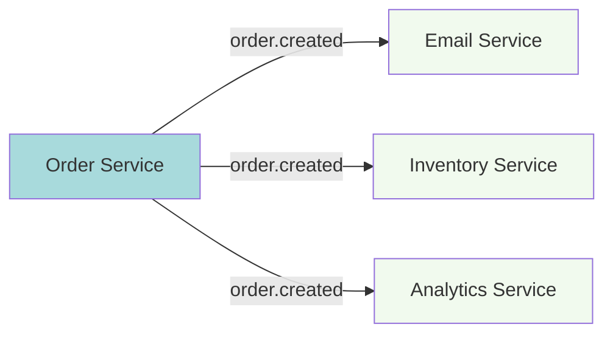
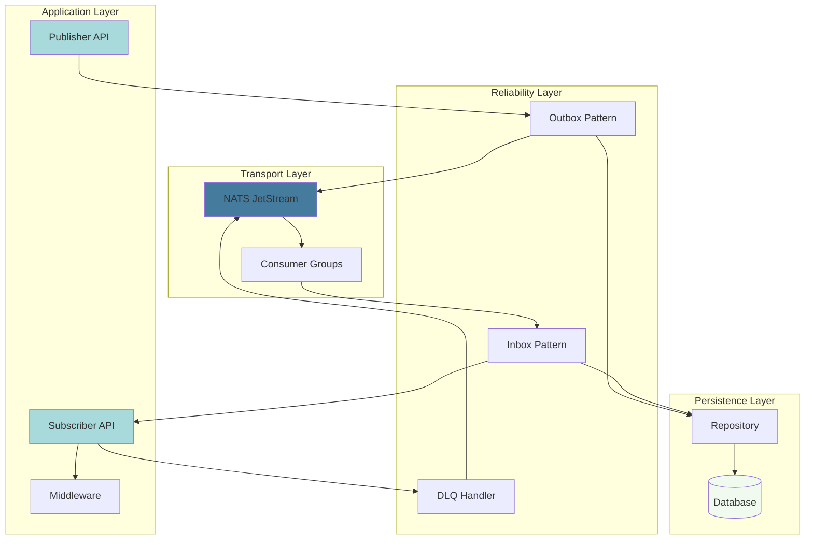

# Introduction to NatsPubsub

## What is NatsPubsub?

**NatsPubsub** is a production-ready, declarative pub/sub messaging library built on top of [NATS JetStream](https://docs.nats.io/nats-concepts/jetstream). It provides a familiar, intuitive API for building event-driven applications with battle-tested reliability patterns.

Available in both **JavaScript/TypeScript** and **Ruby**, NatsPubsub enables seamless cross-language communication while maintaining type safety and developer productivity.

## Why NatsPubsub?

### The Problem

Building reliable distributed systems with message queues often requires:

1. **Boilerplate Code**: Repetitive connection management, error handling, and retry logic
2. **Reliability Patterns**: Manual implementation of Inbox/Outbox patterns and DLQ
3. **Testing Complexity**: Difficulty testing async message flows
4. **Operational Overhead**: Manual stream and consumer management
5. **Cross-Language Communication**: Inconsistent APIs between languages

### The Solution

NatsPubsub solves these problems by providing:

- **Declarative API**: Class-based subscribers inspired by Rails and NestJS
- **Built-in Reliability**: Automatic Inbox/Outbox patterns and Dead Letter Queue
- **Testing Support**: Fake and inline modes for easy testing
- **Auto-Topology**: Automatic JetStream stream and consumer creation
- **Language Parity**: Identical APIs in JavaScript and Ruby

## Core Features

### 🎯 Declarative Subscriber API

Write clean, maintainable message handlers:

```typescript
// JavaScript/TypeScript
import { Subscriber, TopicMetadata } from "nats-pubsub";

class OrderCreatedSubscriber extends Subscriber<
  Record<string, unknown>,
  TopicMetadata
> {
  constructor() {
    super("production.myapp.order.created");
  }

  async handle(
    message: Record<string, unknown>,
    metadata: TopicMetadata,
  ): Promise<void> {
    await processOrder(message);
  }
}
```

```ruby
# Ruby
class OrderCreatedSubscriber < NatsPubsub::Subscriber
  subscribe_to 'order.created'

  def handle(message, context)
    process_order(message)
  end
end
```

### 🔒 Reliability Patterns

#### Outbox Pattern

Guarantees message delivery even during NATS outages:

```typescript
import NatsPubsub from "nats-pubsub";

// Configure with outbox enabled
NatsPubsub.configure({
  natsUrls: "nats://localhost:4222",
  env: "production",
  appName: "my-app",
  useOutbox: true,
});

// Message is saved to database first, then relayed to NATS
await NatsPubsub.publish("order.created", orderData);
// ✅ Message will be delivered even if NATS is down
```

#### Inbox Pattern

Prevents duplicate processing with database-backed deduplication:

```typescript
import { Subscriber, TopicMetadata } from "nats-pubsub";

class OrderSubscriber extends Subscriber<
  Record<string, unknown>,
  TopicMetadata
> {
  constructor() {
    super("production.myapp.order.created", {
      useInbox: true, // Enable exactly-once processing
    });
  }

  async handle(
    message: Record<string, unknown>,
    metadata: TopicMetadata,
  ): Promise<void> {
    // This will only be called once per message
    await processOrder(message);
  }
}
```

#### Dead Letter Queue

Automatically handles failed messages:

```typescript
import { Subscriber, TopicMetadata } from "nats-pubsub";

// Failed messages are automatically sent to DLQ after max attempts
class OrderCreatedSubscriber extends Subscriber<
  Record<string, unknown>,
  TopicMetadata
> {
  constructor() {
    super("production.myapp.order.created", {
      maxDeliver: 3,
      useDlq: true,
    });
  }

  async handle(
    message: Record<string, unknown>,
    metadata: TopicMetadata,
  ): Promise<void> {
    await processOrder(message);
  }
}
```

### 🌐 Cross-Language Interoperability

Ruby and JavaScript services communicate seamlessly:

```typescript
import NatsPubsub from "nats-pubsub";

// JavaScript service publishes
await NatsPubsub.publish("user.created", {
  userId: 123,
  email: "user@example.com",
});
```

```ruby
# Ruby service receives
class UserCreatedSubscriber < NatsPubsub::Subscriber
  subscribe_to 'user.created'

  def handle(message, context)
    # message = { 'userId' => 123, 'email' => 'user@example.com' }
    create_user_profile(message)
  end
end
```

### 🧪 Testing Support

Test your pub/sub code easily:

**JavaScript:**

```typescript
import { TestHarness } from "nats-pubsub/testing";

// In-memory testing without NATS
const harness = new TestHarness();

await harness.publish("order.created", orderData);

expect(harness.published).toContainEqual({
  topic: "order.created",
  message: orderData,
});
```

**Ruby:**

```ruby
# Fake mode records events without processing
NatsPubsub.fake!

NatsPubsub.publish('order.created', order_data)

expect(NatsPubsub).to have_published_event('order.created')
  .with(order_data)
```

### 📊 Built-in Observability

Monitor your messaging system:

**JavaScript:**

- Prometheus metrics
- Health check endpoints
- Structured logging
- OpenTelemetry support

**Ruby:**

- Web UI for Inbox/Outbox monitoring
- ActiveSupport instrumentation
- Health check endpoints
- Rails integration

### ⚡ High Performance

Optimized for production workloads:

- **Batching**: Automatic message batching for 10x throughput
- **Connection Pooling**: Efficient resource usage
- **Async Processing**: Non-blocking I/O
- **Backpressure**: Automatic flow control

## Use Cases

### 1. Microservices Communication



Decouple microservices with async events:

- Order service publishes `order.created`
- Email, inventory, and analytics services react independently
- Services can scale and deploy independently

### 2. Event Sourcing

Store all state changes as events:

```typescript
import NatsPubsub from "nats-pubsub";
import { Subscriber, TopicMetadata } from "nats-pubsub";

// Store events
await NatsPubsub.publish("account.credited", {
  accountId: "123",
  amount: 100,
  timestamp: Date.now(),
});

// Rebuild state from events
class AccountProjector extends Subscriber<
  Record<string, unknown>,
  TopicMetadata
> {
  constructor() {
    super("production.myapp.account.credited");
  }

  async handle(
    event: Record<string, unknown>,
    metadata: TopicMetadata,
  ): Promise<void> {
    await updateAccountBalance(event);
  }
}
```

### 3. CQRS (Command Query Responsibility Segregation)

Separate read and write models:

```typescript
import NatsPubsub from "nats-pubsub";
import { Subscriber, TopicMetadata } from "nats-pubsub";

// Write model publishes events
await NatsPubsub.publish("product.updated", productData);

// Read model subscribes and updates views
class ProductViewUpdater extends Subscriber<
  Record<string, unknown>,
  TopicMetadata
> {
  constructor() {
    super("production.myapp.product.updated");
  }

  async handle(
    event: Record<string, unknown>,
    metadata: TopicMetadata,
  ): Promise<void> {
    await updateSearchIndex(event);
    await updateCache(event);
  }
}
```

### 4. Background Jobs

Offload heavy processing:

```typescript
import NatsPubsub from "nats-pubsub";
import { Subscriber, TopicMetadata } from "nats-pubsub";

// Enqueue background job
await NatsPubsub.publish("video.process", {
  videoId: "123",
  formats: ["720p", "1080p", "4k"],
});

// Worker processes job
class VideoProcessor extends Subscriber<
  Record<string, unknown>,
  TopicMetadata
> {
  constructor() {
    super("production.myapp.video.process");
  }

  async handle(
    job: Record<string, unknown>,
    metadata: TopicMetadata,
  ): Promise<void> {
    await transcodeVideo(job);
  }
}
```

### 5. Real-time Notifications

Push updates to users:

```typescript
import NatsPubsub from "nats-pubsub";
import { Subscriber, TopicMetadata } from "nats-pubsub";

// Backend publishes notification
await NatsPubsub.publish("notification.send", {
  userId: "123",
  message: "Your order has shipped!",
});

// WebSocket service subscribes and pushes to client
class NotificationSubscriber extends Subscriber<
  Record<string, unknown>,
  TopicMetadata
> {
  constructor() {
    super("production.myapp.notification.send");
  }

  async handle(
    notification: Record<string, unknown>,
    metadata: TopicMetadata,
  ): Promise<void> {
    await websocket.send(notification.userId as string, notification);
  }
}
```

## Architecture Overview



### Component Breakdown

1. **Publisher API**: Simple interface for publishing messages
2. **Subscriber API**: Declarative class-based message handlers
3. **Middleware**: Composable processing pipeline
4. **Outbox Pattern**: Transactional message publishing
5. **Inbox Pattern**: Duplicate message prevention
6. **DLQ Handler**: Failed message management
7. **NATS JetStream**: Message broker and streaming platform
8. **Repository**: Database abstraction for Inbox/Outbox
9. **Consumer Groups**: Load balancing across subscriber instances

## Core Concepts

### Topics and Subjects

NatsPubsub uses **topics** (application-level) which are automatically converted to **subjects** (NATS-level):

```
Topic:   order.created
Subject: production.order-service.order.created
         └────┬────┘ └──────┬──────┘ └──────┬──────┘
           env      appName         topic
```

**Wildcard Support:**

- `*` matches a single level: `order.*` → `order.created`, `order.updated`
- `>` matches multiple levels: `order.>` → `order.created`, `order.updated`, `order.item.added`

### Message Envelope

Messages are wrapped in a standard envelope:

```json
{
  "id": "uuid-v4",
  "topic": "order.created",
  "timestamp": "2025-01-15T10:30:00Z",
  "source": "order-service",
  "data": {
    "orderId": "12345",
    "amount": 99.99
  },
  "metadata": {
    "userId": "user-123",
    "traceId": "trace-456"
  }
}
```

### Consumer Groups

Subscribers automatically form consumer groups for load balancing:

```typescript
import { Subscriber, TopicMetadata } from "nats-pubsub";

// Multiple instances of the same subscriber form a consumer group
// Messages are distributed across instances (round-robin)
class OrderSubscriber extends Subscriber<
  Record<string, unknown>,
  TopicMetadata
> {
  constructor() {
    super("production.myapp.order.created");
  }

  async handle(
    message: Record<string, unknown>,
    metadata: TopicMetadata,
  ): Promise<void> {
    await processOrder(message);
  }
}

// Instance 1 receives message 1, 3, 5...
// Instance 2 receives message 2, 4, 6...
```

### Acknowledgment Modes

Control message acknowledgment behavior:

- **Auto (default)**: Message acked after successful handling
- **Manual**: You control when to ack/nack
- **None**: No acknowledgment (fire-and-forget)

```typescript
import { Subscriber, TopicMetadata } from "nats-pubsub";

class OrderSubscriber extends Subscriber<
  Record<string, unknown>,
  TopicMetadata
> {
  constructor() {
    super("production.myapp.order.created", {
      manualAck: true,
    });
  }

  async handle(
    message: Record<string, unknown>,
    metadata: TopicMetadata,
  ): Promise<void> {
    try {
      await processOrder(message);
      await metadata.ack(); // Success
    } catch (error) {
      await metadata.nack(); // Retry
    }
  }
}
```

## Comparison with Alternatives

### vs. Raw NATS Client

| Feature               | Raw NATS | NatsPubsub |
| --------------------- | -------- | ---------- |
| Learning Curve        | Steep    | Gentle     |
| Boilerplate           | High     | Low        |
| Reliability Patterns  | Manual   | Built-in   |
| Testing               | Complex  | Simple     |
| Type Safety           | Limited  | Full (TS)  |
| Framework Integration | DIY      | Built-in   |

### vs. Apache Kafka

| Feature          | Kafka            | NatsPubsub (NATS)   |
| ---------------- | ---------------- | ------------------- |
| Setup Complexity | High (ZooKeeper) | Low (single binary) |
| Message Latency  | 5-50ms           | &lt;1ms             |
| Throughput       | Very High        | High                |
| Ecosystem        | Mature           | Growing             |
| Operations       | Complex          | Simple              |
| Cost             | High             | Low                 |

### vs. RabbitMQ

| Feature        | RabbitMQ | NatsPubsub (NATS) |
| -------------- | -------- | ----------------- |
| Performance    | Good     | Excellent         |
| Protocol       | AMQP     | NATS              |
| Configuration  | Complex  | Simple            |
| Clustering     | Manual   | Automatic         |
| Cloud Native   | Moderate | Excellent         |
| Resource Usage | Higher   | Lower             |

### vs. AWS SQS/SNS

| Feature           | AWS SQS/SNS     | NatsPubsub          |
| ----------------- | --------------- | ------------------- |
| Vendor Lock-in    | High            | None                |
| Cost              | Pay per message | Infrastructure only |
| Latency           | Variable        | Predictable         |
| Local Development | Limited         | Full                |
| Self-Hosted       | No              | Yes                 |

## When to Use NatsPubsub

### ✅ Great For

- **Microservices Architecture**: Async communication between services
- **Event-Driven Systems**: Event sourcing, CQRS patterns
- **Real-time Applications**: Low-latency message delivery
- **Background Jobs**: Async task processing
- **Cross-Language Systems**: Ruby + JavaScript/TypeScript services
- **Cloud-Native Apps**: Kubernetes-based deployments

### ⚠️ Consider Alternatives If

- **You need Kafka ecosystem**: Kafka Connect, ksqlDB, etc.
- **You're already on AWS**: SQS/SNS might be simpler
- **You need long retention**: Kafka better for months/years of data
- **Team expertise**: If team knows RabbitMQ well

## Learning Path

### Beginner (Day 1)

1. [Installation](./installation.md) - Set up NatsPubsub
2. [Quick Start](./quick-start-js.md) - First pub/sub example
3. [Core Concepts](./concepts.md) - Understand fundamentals

### Intermediate (Week 1)

1. [Publishing Guide](../guides/publishing.md) - Master publishing patterns
2. [Subscribing Guide](../guides/subscribing.md) - Create robust subscribers
3. [Testing Guide](../guides/testing.md) - Test your code
4. [Middleware](../guides/middleware.md) - Add cross-cutting concerns

### Advanced (Month 1)

1. [Inbox/Outbox Patterns](../patterns/inbox-outbox.md) - Guaranteed delivery
2. [Deployment Guide](../guides/deployment.md) - Production deployment
3. [Performance Tuning](../guides/performance.md) - Optimize throughput
4. [Architecture Deep Dive](../advanced/architecture.md) - Internal design

## Next Steps

Ready to get started? Choose your language:

- **JavaScript/TypeScript**: [Quick Start](./quick-start-js.md)
- **Ruby**: [Quick Start](./quick-start-ruby.md)

Or learn more about [Core Concepts](./concepts.md).

---

[← Back to Documentation Home](../index.md) | [Installation →](./installation.md)
