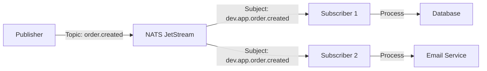

# Quick Start Guide

Get started with NatsPubsub in under 10 minutes. This guide covers the basics for both JavaScript/TypeScript and Ruby implementations.

## What is NatsPubsub?

NatsPubsub is a production-ready pub/sub messaging library built on NATS JetStream. It provides:

- **Declarative API**: Class-based subscribers for clean, maintainable code
- **Built-in Reliability**: Automatic Inbox/Outbox patterns and Dead Letter Queue
- **Cross-Language**: Identical APIs in JavaScript and Ruby
- **Testing Support**: Fake and inline modes for easy testing
- **Auto-Topology**: Automatic stream and consumer management

## Prerequisites

### For JavaScript/TypeScript

- Node.js >= 20.x
- TypeScript (optional, recommended)

### For Ruby

- Ruby >= 2.7
- Rails (optional)

### For Both

- **NATS Server with JetStream** running locally or remotely

Don't have NATS installed? Start it with Docker:

```bash
docker run -d -p 4222:4222 nats:latest -js
```

## Choose Your Language

NatsPubsub provides native implementations for both JavaScript and Ruby with identical concepts and patterns.

### JavaScript/TypeScript

Perfect for Node.js applications, Next.js, Express, NestJS, and modern JavaScript projects.

**Installation:**

```bash
npm install nats-pubsub
```

**Quick Example:**

```typescript
import NatsPubsub, { Subscriber, TopicMetadata } from "nats-pubsub";

// Configure
NatsPubsub.configure({
  natsUrls: "nats://localhost:4222",
  env: "development",
  appName: "my-app",
});

// Publish
await NatsPubsub.publish("user.created", {
  userId: "123",
  email: "user@example.com",
});

// Subscribe
class UserCreatedSubscriber extends Subscriber<
  Record<string, unknown>,
  TopicMetadata
> {
  constructor() {
    super("development.my-app.user.created");
  }

  async handle(
    message: Record<string, unknown>,
    metadata: TopicMetadata,
  ): Promise<void> {
    console.log("User created:", message);
  }
}

NatsPubsub.registerSubscriber(new UserCreatedSubscriber());
await NatsPubsub.start();
```

**Learn More:** [JavaScript/TypeScript Quick Start](./quick-start-js.md)

### Ruby

Perfect for Rails applications, Sinatra, Ruby microservices, and Ruby projects.

**Installation:**

```bash
gem install nats_pubsub
# or add to Gemfile
gem 'nats_pubsub'
```

**Quick Example:**

```ruby
require 'nats_pubsub'

# Configure
NatsPubsub.configure do |config|
  config.servers = 'nats://localhost:4222'
  config.env = 'development'
  config.app_name = 'my-app'
end

# Publish
NatsPubsub.publish('user.created', {
  user_id: '123',
  email: 'user@example.com'
})

# Subscribe
class UserCreatedSubscriber < NatsPubsub::Subscriber
  subscribe_to 'user.created'

  def handle(message, context)
    puts "User created: #{message}"
  end
end

# Start subscribers
NatsPubsub::Manager.start
```

**Learn More:** [Ruby Quick Start](./quick-start-ruby.md)

## Core Concepts

### 1. Topics and Subjects

NatsPubsub uses **topics** (application-level) which are automatically converted to **subjects** (NATS-level):

```
Topic:   user.created
Subject: development.my-app.user.created
         └────┬────┘ └───┬───┘ └────┬─────┘
           env       appName      topic
```

**Wildcards:**

- `*` matches one level: `user.*` matches `user.created`, `user.updated`
- `>` matches multiple levels: `user.>` matches `user.created`, `user.profile.updated`

### 2. Publishers

Publishers send messages to topics:

**JavaScript:**

```typescript
await NatsPubsub.publish("order.created", {
  orderId: "123",
  total: 99.99,
});
```

**Ruby:**

```ruby
NatsPubsub.publish('order.created', {
  order_id: '123',
  total: 99.99
})
```

### 3. Subscribers

Subscribers receive and process messages:

**JavaScript:**

```typescript
class OrderSubscriber extends Subscriber<OrderData, TopicMetadata> {
  constructor() {
    super("*.*.order.created");
  }

  async handle(message: OrderData, metadata: TopicMetadata): Promise<void> {
    await processOrder(message);
  }
}
```

**Ruby:**

```ruby
class OrderSubscriber < NatsPubsub::Subscriber
  subscribe_to 'order.created'

  def handle(message, context)
    process_order(message)
  end
end
```

### 4. Message Flow



## Your First Pub/Sub System

Let's build a simple user registration system that demonstrates the core concepts.

### 1. Start NATS Server

```bash
docker run -d -p 4222:4222 nats:latest -js
```

### 2. Create Project Structure

**JavaScript:**

```bash
mkdir my-pubsub-app && cd my-pubsub-app
npm init -y
npm install nats-pubsub
npm install --save-dev tsx typescript @types/node
```

**Ruby:**

```bash
mkdir my-pubsub-app && cd my-pubsub-app
bundle init
# Add to Gemfile: gem 'nats_pubsub'
bundle install
```

### 3. Implement Publisher

**JavaScript** (`publisher.ts`):

```typescript
import NatsPubsub from "nats-pubsub";

NatsPubsub.configure({
  natsUrls: "nats://localhost:4222",
  env: "development",
  appName: "user-service",
});

async function registerUser(email: string, name: string) {
  const userId = Date.now().toString();

  await NatsPubsub.publish("user.registered", {
    userId,
    email,
    name,
    registeredAt: new Date().toISOString(),
  });

  console.log(`✓ User registered: ${email}`);
}

registerUser("john@example.com", "John Doe").catch(console.error);
```

**Ruby** (`publisher.rb`):

```ruby
require 'nats_pubsub'

NatsPubsub.configure do |config|
  config.servers = 'nats://localhost:4222'
  config.env = 'development'
  config.app_name = 'user-service'
end

def register_user(email, name)
  user_id = Time.now.to_i.to_s

  NatsPubsub.publish('user.registered', {
    user_id: user_id,
    email: email,
    name: name,
    registered_at: Time.now.iso8601
  })

  puts "✓ User registered: #{email}"
end

NatsPubsub::Connection.connect
register_user('john@example.com', 'John Doe')
NatsPubsub::Connection.close
```

### 4. Implement Subscribers

**JavaScript** (`subscribers.ts`):

```typescript
import NatsPubsub, { Subscriber, TopicMetadata } from "nats-pubsub";

// Email notification subscriber
class EmailNotificationSubscriber extends Subscriber<
  Record<string, unknown>,
  TopicMetadata
> {
  constructor() {
    super("development.user-service.user.registered");
  }

  async handle(
    message: Record<string, unknown>,
    metadata: TopicMetadata,
  ): Promise<void> {
    console.log(`📧 Sending welcome email to ${message.email}`);
    // Simulate sending email
    await new Promise((resolve) => setTimeout(resolve, 100));
    console.log(`✓ Welcome email sent to ${message.email}`);
  }
}

// Analytics subscriber
class AnalyticsSubscriber extends Subscriber<
  Record<string, unknown>,
  TopicMetadata
> {
  constructor() {
    super("development.user-service.user.registered");
  }

  async handle(
    message: Record<string, unknown>,
    metadata: TopicMetadata,
  ): Promise<void> {
    console.log(`📊 Recording analytics for user ${message.userId}`);
    // Simulate analytics
    await new Promise((resolve) => setTimeout(resolve, 50));
    console.log(`✓ Analytics recorded for user ${message.userId}`);
  }
}

// Configure and start
NatsPubsub.configure({
  natsUrls: "nats://localhost:4222",
  env: "development",
  appName: "user-service",
});

NatsPubsub.registerSubscriber(new EmailNotificationSubscriber());
NatsPubsub.registerSubscriber(new AnalyticsSubscriber());

await NatsPubsub.start();
console.log("✓ Subscribers started, waiting for messages...");

process.on("SIGINT", async () => {
  console.log("\nShutting down...");
  await NatsPubsub.stop();
  process.exit(0);
});
```

**Ruby** (`subscribers.rb`):

```ruby
require 'nats_pubsub'

# Email notification subscriber
class EmailNotificationSubscriber < NatsPubsub::Subscriber
  subscribe_to 'user.registered'

  def handle(message, context)
    puts "📧 Sending welcome email to #{message['email']}"
    sleep 0.1 # Simulate sending email
    puts "✓ Welcome email sent to #{message['email']}"
  end
end

# Analytics subscriber
class AnalyticsSubscriber < NatsPubsub::Subscriber
  subscribe_to 'user.registered'

  def handle(message, context)
    puts "📊 Recording analytics for user #{message['user_id']}"
    sleep 0.05 # Simulate analytics
    puts "✓ Analytics recorded for user #{message['user_id']}"
  end
end

# Configure and start
NatsPubsub.configure do |config|
  config.servers = 'nats://localhost:4222'
  config.env = 'development'
  config.app_name = 'user-service'
end

NatsPubsub::Manager.start
puts '✓ Subscribers started, waiting for messages...'

Signal.trap('INT') do
  puts "\nShutting down..."
  NatsPubsub::Manager.stop
  exit
end

sleep
```

### 5. Run the System

**Terminal 1 - Start Subscribers:**

```bash
# JavaScript
npx tsx subscribers.ts

# Ruby
ruby subscribers.rb
```

**Terminal 2 - Publish Messages:**

```bash
# JavaScript
npx tsx publisher.ts

# Ruby
ruby publisher.rb
```

You should see both subscribers process the message independently!

## What's Happening?

1. **Publisher** sends a `user.registered` event to NATS
2. **NATS** routes the message to all matching subscribers
3. **Email Subscriber** sends a welcome email
4. **Analytics Subscriber** records user registration
5. Both run **independently** and **asynchronously**

## Key Benefits Demonstrated

1. **Decoupling**: Publisher doesn't know about subscribers
2. **Fan-out**: One message, multiple processors
3. **Reliability**: NATS ensures message delivery
4. **Scalability**: Add more subscribers without changing publisher
5. **Cross-Language**: JavaScript and Ruby services work together

## Next Steps by Use Case

### I'm Building a Web Application

**JavaScript/TypeScript:**

- [Express Integration](../integrations/express.md)
- [NestJS Integration](../integrations/nestjs.md)

**Ruby:**

- [Rails Integration](../integrations/rails.md)

### I Want Guaranteed Delivery

Learn about reliability patterns:

- [Inbox/Outbox Pattern](../patterns/inbox-outbox.md) - Full reliability with transactional publishing and exactly-once processing

### I Need to Handle Failures

Learn about error handling:

- [Dead Letter Queue (DLQ)](../patterns/dlq.md) - Failed message management
- [Error Handling Patterns](../patterns/error-handling.md) - Retry strategies

### I'm Ready for Production

Follow deployment guides:

- [Deployment Guide](../guides/deployment.md)
- [Performance Tuning](../guides/performance.md)
- [Monitoring & Observability](../advanced/observability.md)

### I Want to Test My Code

Learn testing approaches:

- [Testing Guide](../guides/testing.md)

## Language-Specific Quick Starts

For detailed, language-specific guides with more examples:

- **JavaScript/TypeScript**: [JavaScript Quick Start](./quick-start-js.md)
- **Ruby**: [Ruby Quick Start](./quick-start-ruby.md)

## Common Questions

### Do I need both JavaScript and Ruby?

No! Choose one based on your tech stack. They're completely independent and can interoperate.

### Can JavaScript and Ruby services communicate?

Yes! Messages published from JavaScript can be consumed by Ruby and vice versa. NatsPubsub handles serialization automatically.

### How is this different from HTTP APIs?

- **Async**: Fire and forget, no waiting for response
- **Decoupled**: Services don't need to know about each other
- **Scalable**: Horizontal scaling without code changes
- **Reliable**: Built-in retry, DLQ, and transactional patterns

### Is this production-ready?

Yes! NatsPubsub is battle-tested with:

- Built-in reliability patterns
- Comprehensive error handling
- Monitoring and observability
- Performance optimizations

## Troubleshooting

### NATS Connection Failed

**Error:** `Could not connect to NATS server`

**Solution:**

```bash
# Check NATS is running
docker ps | grep nats

# Start NATS if needed
docker run -d -p 4222:4222 nats:latest -js
```

### Messages Not Being Received

1. **Check subscriber is running** before publishing
2. **Verify subject matches** - enable debug logging:

**JavaScript:**

```typescript
NatsPubsub.configure({
  // ... other config
  logger: {
    debug: console.debug,
    info: console.info,
    error: console.error,
  },
});
```

**Ruby:**

```ruby
NatsPubsub.configure do |config|
  config.log_level = :debug
end
```

### Module Not Found

**JavaScript:**

```bash
npm install nats-pubsub
```

**Ruby:**

```bash
gem install nats_pubsub
# or
bundle install
```

## Additional Resources

- [Core Concepts](./concepts.md) - Deep dive into architecture
- [Configuration Reference](../reference/configuration.md) - All options
- [API Documentation](../reference/javascript-api.md) - Complete API reference
- [Examples Repository](https://github.com/attaradev/nats-pubsub/tree/main/examples)

---

**Ready to dive deeper?**

- [JavaScript Quick Start →](./quick-start-js.md)
- [Ruby Quick Start →](./quick-start-ruby.md)
- [← Back to Documentation Home](../index.md)
