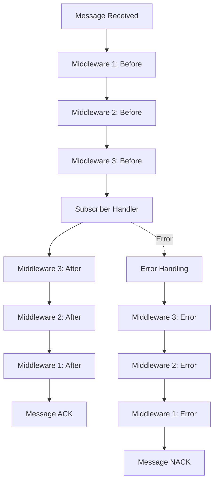
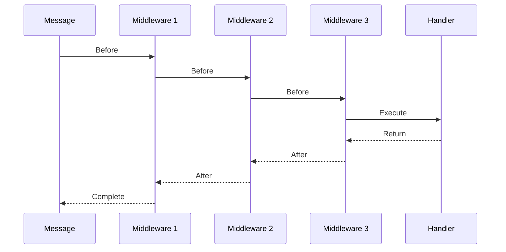

# Middleware System Guide

This comprehensive guide covers the middleware system in NatsPubsub, enabling you to add cross-cutting concerns like logging, metrics, tracing, and custom business logic to your message processing pipeline.

## Table of Contents

- [Overview](#overview)
- [Middleware Basics](#middleware-basics)
- [Creating Custom Middleware](#creating-custom-middleware)
- [Built-in Middleware](#built-in-middleware)
- [Middleware Chain](#middleware-chain)
- [Error Handling Middleware](#error-handling-middleware)
- [Logging Middleware](#logging-middleware)
- [Metrics and Monitoring](#metrics-and-monitoring)
- [Tracing and Correlation](#tracing-and-correlation)
- [Authentication and Authorization](#authentication-and-authorization)
- [Caching Middleware](#caching-middleware)
- [Rate Limiting](#rate-limiting)
- [Best Practices](#best-practices)
- [Testing Middleware](#testing-middleware)
- [Performance Considerations](#performance-considerations)

---

## Overview

Middleware in NatsPubsub provides a composable way to add functionality to your message processing pipeline. Each middleware can:

- Execute code before and after message handling
- Transform messages
- Short-circuit execution
- Handle errors
- Add metadata

### Middleware Flow



---

## Middleware Basics

### Middleware Interface

#### JavaScript/TypeScript

```typescript
import { Middleware, EventMetadata } from "nats-pubsub";

interface Middleware {
  call(
    event: Record<string, unknown>,
    metadata: EventMetadata,
    next: () => Promise<void>,
  ): Promise<void>;
}
```

#### Ruby

```ruby
# Ruby middleware is a class with a call method that yields to the next middleware
class MyMiddleware
  def call(message, context)
    # Before processing
    yield # Call next middleware
    # After processing
  end
end
```

### Basic Middleware Example

#### JavaScript/TypeScript

```typescript
import { Middleware, EventMetadata } from "nats-pubsub";

class SimpleLoggingMiddleware implements Middleware {
  async call(
    event: Record<string, unknown>,
    metadata: EventMetadata,
    next: () => Promise<void>,
  ): Promise<void> {
    console.log("Before:", metadata.subject);

    await next(); // Call next middleware or handler

    console.log("After:", metadata.subject);
  }
}

// Register globally
import NatsPubsub from "nats-pubsub";
NatsPubsub.use(new SimpleLoggingMiddleware());
```

#### Ruby

```ruby
class SimpleLoggingMiddleware
  def call(message, context)
    puts "Before: #{context.subject}"

    yield # Call next middleware or handler

    puts "After: #{context.subject}"
  end
end

# Register globally
NatsPubsub.configure do |config|
  config.middleware.use SimpleLoggingMiddleware
end
```

---

## Creating Custom Middleware

### Example: Request Duration Middleware

#### JavaScript/TypeScript

```typescript
import { Middleware, EventMetadata } from "nats-pubsub";

class DurationMiddleware implements Middleware {
  async call(
    event: Record<string, unknown>,
    metadata: EventMetadata,
    next: () => Promise<void>,
  ): Promise<void> {
    const start = Date.now();

    try {
      await next();

      const duration = Date.now() - start;
      console.log(`Processed ${metadata.subject} in ${duration}ms`);

      // Store duration in metadata for other middleware
      metadata.duration = duration;
    } catch (error) {
      const duration = Date.now() - start;
      console.error(`Failed ${metadata.subject} after ${duration}ms`);
      throw error;
    }
  }
}

// Use it
NatsPubsub.use(new DurationMiddleware());
```

#### Ruby

```ruby
class DurationMiddleware
  def call(message, context)
    start = Time.now

    begin
      yield

      duration = ((Time.now - start) * 1000).round
      puts "Processed #{context.subject} in #{duration}ms"

      # Store duration in context for other middleware
      context.duration = duration
    rescue StandardError => e
      duration = ((Time.now - start) * 1000).round
      puts "Failed #{context.subject} after #{duration}ms"
      raise
    end
  end
end

# Use it
NatsPubsub.configure do |config|
  config.middleware.use DurationMiddleware
end
```

### Example: Message Transformation Middleware

#### JavaScript/TypeScript

```typescript
class TransformMiddleware implements Middleware {
  async call(
    event: Record<string, unknown>,
    metadata: EventMetadata,
    next: () => Promise<void>,
  ): Promise<void> {
    // Transform message before processing
    if (event.timestamp && typeof event.timestamp === "string") {
      event.timestamp = new Date(event.timestamp);
    }

    // Normalize keys
    event.normalized_at = new Date();

    await next();

    // Can also transform after processing if needed
  }
}

NatsPubsub.use(new TransformMiddleware());
```

#### Ruby

```ruby
class TransformMiddleware
  def call(message, context)
    # Transform message before processing
    if message['timestamp'].is_a?(String)
      message['timestamp'] = Time.parse(message['timestamp'])
    end

    # Normalize keys
    message['normalized_at'] = Time.now

    yield

    # Can also transform after processing if needed
  end
end

NatsPubsub.configure do |config|
  config.middleware.use TransformMiddleware
end
```

### Example: Conditional Short-Circuit Middleware

#### JavaScript/TypeScript

```typescript
class ConditionalMiddleware implements Middleware {
  async call(
    event: Record<string, unknown>,
    metadata: EventMetadata,
    next: () => Promise<void>,
  ): Promise<void> {
    // Skip processing for certain conditions
    if (event.skip_processing === true) {
      console.log("Skipping processing due to skip_processing flag");
      return; // Don't call next(), short-circuit the chain
    }

    // Check for duplicate processing
    const isDuplicate = await this.checkDuplicate(metadata.event_id);
    if (isDuplicate) {
      console.log("Duplicate message, skipping");
      return;
    }

    await next();
  }

  private async checkDuplicate(eventId: string): Promise<boolean> {
    // Check if already processed
    return await cache.exists(`processed:${eventId}`);
  }
}

NatsPubsub.use(new ConditionalMiddleware());
```

#### Ruby

```ruby
class ConditionalMiddleware
  def call(message, context)
    # Skip processing for certain conditions
    if message['skip_processing'] == true
      puts 'Skipping processing due to skip_processing flag'
      return # Don't yield, short-circuit the chain
    end

    # Check for duplicate processing
    if check_duplicate(context.event_id)
      puts 'Duplicate message, skipping'
      return
    end

    yield
  end

  private

  def check_duplicate(event_id)
    # Check if already processed
    Rails.cache.exist?("processed:#{event_id}")
  end
end

NatsPubsub.configure do |config|
  config.middleware.use ConditionalMiddleware
end
```

---

## Built-in Middleware

### JavaScript/TypeScript Built-in Middleware

```typescript
import NatsPubsub, {
  loggingMiddleware,
  retryLoggerMiddleware,
  metricsMiddleware,
  tracingMiddleware,
} from "nats-pubsub";

// Structured logging
NatsPubsub.use(loggingMiddleware);

// Retry attempt logging
NatsPubsub.use(retryLoggerMiddleware);

// Prometheus metrics
NatsPubsub.use(metricsMiddleware);

// Distributed tracing
NatsPubsub.use(tracingMiddleware);
```

### Ruby Built-in Middleware

```ruby
# Ruby built-in middleware
NatsPubsub.configure do |config|
  # Structured logging
  config.middleware.use NatsPubsub::Middleware::StructuredLogging

  # Metrics collection
  config.middleware.use NatsPubsub::Middleware::Metrics

  # Distributed tracing
  config.middleware.use NatsPubsub::Middleware::Tracing

  # Error reporting
  config.middleware.use NatsPubsub::Middleware::ErrorReporting
end
```

---

## Middleware Chain

### Execution Order

Middleware executes in the order it's registered:



### Configuring the Chain

#### JavaScript/TypeScript

```typescript
import NatsPubsub from "nats-pubsub";

// Global middleware (applies to all subscribers)
NatsPubsub.use(new AuthenticationMiddleware());
NatsPubsub.use(new LoggingMiddleware());
NatsPubsub.use(new MetricsMiddleware());
NatsPubsub.use(new ErrorHandlingMiddleware());

// Subscriber-specific middleware
class OrderSubscriber extends Subscriber {
  constructor() {
    super("production.app.order.created");

    // These run after global middleware
    this.use(new OrderValidationMiddleware());
    this.use(new OrderEnrichmentMiddleware());
  }

  async handle(message: any, metadata: TopicMetadata): Promise<void> {
    // Handler logic
  }
}
```

#### Ruby

```ruby
# Global middleware
NatsPubsub.configure do |config|
  config.middleware.use AuthenticationMiddleware
  config.middleware.use LoggingMiddleware
  config.middleware.use MetricsMiddleware
  config.middleware.use ErrorHandlingMiddleware
end

# Subscriber-specific middleware
class OrderSubscriber < NatsPubsub::Subscriber
  subscribe_to 'order.created'

  # These run after global middleware
  use OrderValidationMiddleware
  use OrderEnrichmentMiddleware

  def handle(message, context)
    # Handler logic
  end
end
```

---

## Error Handling Middleware

### JavaScript/TypeScript

```typescript
class ErrorHandlingMiddleware implements Middleware {
  async call(
    event: Record<string, unknown>,
    metadata: EventMetadata,
    next: () => Promise<void>,
  ): Promise<void> {
    try {
      await next();
    } catch (error) {
      // Log error with context
      logger.error("Message processing failed", {
        error: error.message,
        stack: error.stack,
        event_id: metadata.event_id,
        trace_id: metadata.trace_id,
        subject: metadata.subject,
        deliveries: metadata.deliveries,
        message: event,
      });

      // Report to error tracking service
      if (errorTracker) {
        errorTracker.captureException(error, {
          extra: {
            event_id: metadata.event_id,
            trace_id: metadata.trace_id,
            subject: metadata.subject,
            deliveries: metadata.deliveries,
          },
        });
      }

      // Determine if error is retryable
      if (this.isRetryable(error)) {
        // Re-throw to trigger retry mechanism
        throw error;
      } else {
        // Log as non-retryable and ACK message
        logger.warn("Non-retryable error, discarding message", {
          error: error.message,
          event_id: metadata.event_id,
        });
        // Not re-throwing = message will be ACKed
      }
    }
  }

  private isRetryable(error: Error): boolean {
    // Network errors, timeouts, 5xx responses are retryable
    const retryablePatterns = [
      "ECONNREFUSED",
      "ETIMEDOUT",
      "ENOTFOUND",
      "503",
      "502",
      "504",
    ];

    return retryablePatterns.some((pattern) => error.message.includes(pattern));
  }
}

NatsPubsub.use(new ErrorHandlingMiddleware());
```

### Ruby

```ruby
class ErrorHandlingMiddleware
  def call(message, context)
    yield
  rescue StandardError => e
    # Log error with context
    Rails.logger.error('Message processing failed', {
      error: e.message,
      backtrace: e.backtrace.first(5),
      event_id: context.event_id,
      trace_id: context.trace_id,
      subject: context.subject,
      deliveries: context.deliveries,
      message: message
    })

    # Report to error tracking service
    Sentry.capture_exception(e, extra: {
      event_id: context.event_id,
      trace_id: context.trace_id,
      subject: context.subject,
      deliveries: context.deliveries
    })

    # Determine if error is retryable
    if retryable?(e)
      # Re-raise to trigger retry mechanism
      raise
    else
      # Log as non-retryable and ACK message
      Rails.logger.warn('Non-retryable error, discarding message', {
        error: e.message,
        event_id: context.event_id
      })
      # Not re-raising = message will be ACKed
    end
  end

  private

  def retryable?(error)
    # Network errors, timeouts, 5xx responses are retryable
    error.is_a?(Timeout::Error) ||
      error.is_a?(Errno::ECONNREFUSED) ||
      error.is_a?(Errno::ETIMEDOUT) ||
      error.message.include?('503') ||
      error.message.include?('502') ||
      error.message.include?('504')
  end
end

NatsPubsub.configure do |config|
  config.middleware.use ErrorHandlingMiddleware
end
```

---

## Logging Middleware

### Structured Logging

#### JavaScript/TypeScript

```typescript
import { createLogger, format, transports } from "winston";

class StructuredLoggingMiddleware implements Middleware {
  private logger = createLogger({
    format: format.combine(format.timestamp(), format.json()),
    transports: [
      new transports.Console(),
      new transports.File({ filename: "subscriber.log" }),
    ],
  });

  async call(
    event: Record<string, unknown>,
    metadata: EventMetadata,
    next: () => Promise<void>,
  ): Promise<void> {
    const start = Date.now();

    // Log message received
    this.logger.info("Message received", {
      event_id: metadata.event_id,
      trace_id: metadata.trace_id,
      subject: metadata.subject,
      deliveries: metadata.deliveries,
      occurred_at: metadata.occurred_at,
    });

    try {
      await next();

      const duration = Date.now() - start;

      // Log success
      this.logger.info("Message processed successfully", {
        event_id: metadata.event_id,
        trace_id: metadata.trace_id,
        subject: metadata.subject,
        duration_ms: duration,
      });
    } catch (error) {
      const duration = Date.now() - start;

      // Log failure
      this.logger.error("Message processing failed", {
        event_id: metadata.event_id,
        trace_id: metadata.trace_id,
        subject: metadata.subject,
        duration_ms: duration,
        error: error.message,
        stack: error.stack,
        deliveries: metadata.deliveries,
      });

      throw error;
    }
  }
}

NatsPubsub.use(new StructuredLoggingMiddleware());
```

#### Ruby

```ruby
class StructuredLoggingMiddleware
  def call(message, context)
    start = Time.now

    # Log message received
    Rails.logger.info('Message received', {
      event_id: context.event_id,
      trace_id: context.trace_id,
      subject: context.subject,
      deliveries: context.deliveries,
      occurred_at: context.occurred_at
    })

    begin
      yield

      duration = ((Time.now - start) * 1000).round

      # Log success
      Rails.logger.info('Message processed successfully', {
        event_id: context.event_id,
        trace_id: context.trace_id,
        subject: context.subject,
        duration_ms: duration
      })
    rescue StandardError => e
      duration = ((Time.now - start) * 1000).round

      # Log failure
      Rails.logger.error('Message processing failed', {
        event_id: context.event_id,
        trace_id: context.trace_id,
        subject: context.subject,
        duration_ms: duration,
        error: e.message,
        backtrace: e.backtrace.first(5),
        deliveries: context.deliveries
      })

      raise
    end
  end
end

NatsPubsub.configure do |config|
  config.middleware.use StructuredLoggingMiddleware
end
```

---

## Metrics and Monitoring

### Prometheus Metrics

#### JavaScript/TypeScript

```typescript
import { Registry, Counter, Histogram } from "prom-client";

class MetricsMiddleware implements Middleware {
  private registry = new Registry();

  private messagesProcessed = new Counter({
    name: "nats_messages_processed_total",
    help: "Total number of messages processed",
    labelNames: ["subject", "status"],
    registers: [this.registry],
  });

  private processingDuration = new Histogram({
    name: "nats_message_processing_duration_seconds",
    help: "Message processing duration in seconds",
    labelNames: ["subject"],
    buckets: [0.01, 0.05, 0.1, 0.5, 1, 5, 10],
    registers: [this.registry],
  });

  private messageSize = new Histogram({
    name: "nats_message_size_bytes",
    help: "Message size in bytes",
    labelNames: ["subject"],
    buckets: [100, 500, 1000, 5000, 10000, 50000],
    registers: [this.registry],
  });

  async call(
    event: Record<string, unknown>,
    metadata: EventMetadata,
    next: () => Promise<void>,
  ): Promise<void> {
    const start = Date.now();
    const messageSize = JSON.stringify(event).length;

    // Record message size
    this.messageSize.observe({ subject: metadata.subject }, messageSize);

    try {
      await next();

      // Record success
      this.messagesProcessed.inc({
        subject: metadata.subject,
        status: "success",
      });

      const duration = (Date.now() - start) / 1000;
      this.processingDuration.observe({ subject: metadata.subject }, duration);
    } catch (error) {
      // Record failure
      this.messagesProcessed.inc({
        subject: metadata.subject,
        status: "failure",
      });

      throw error;
    }
  }

  // Expose metrics endpoint
  getMetrics(): Promise<string> {
    return this.registry.metrics();
  }
}

const metricsMiddleware = new MetricsMiddleware();
NatsPubsub.use(metricsMiddleware);

// Expose metrics endpoint (Express example)
app.get("/metrics", async (req, res) => {
  res.set("Content-Type", "text/plain");
  res.send(await metricsMiddleware.getMetrics());
});
```

#### Ruby

```ruby
require 'prometheus/client'

class MetricsMiddleware
  def initialize
    @registry = Prometheus::Client.registry

    @messages_processed = @registry.counter(
      :nats_messages_processed_total,
      docstring: 'Total number of messages processed',
      labels: [:subject, :status]
    )

    @processing_duration = @registry.histogram(
      :nats_message_processing_duration_seconds,
      docstring: 'Message processing duration in seconds',
      labels: [:subject],
      buckets: [0.01, 0.05, 0.1, 0.5, 1, 5, 10]
    )

    @message_size = @registry.histogram(
      :nats_message_size_bytes,
      docstring: 'Message size in bytes',
      labels: [:subject],
      buckets: [100, 500, 1000, 5000, 10000, 50000]
    )
  end

  def call(message, context)
    start = Time.now
    message_size = message.to_json.bytesize

    # Record message size
    @message_size.observe(message_size, labels: { subject: context.subject })

    begin
      yield

      # Record success
      @messages_processed.increment(labels: { subject: context.subject, status: 'success' })

      duration = Time.now - start
      @processing_duration.observe(duration, labels: { subject: context.subject })
    rescue StandardError => e
      # Record failure
      @messages_processed.increment(labels: { subject: context.subject, status: 'failure' })

      raise
    end
  end
end

NatsPubsub.configure do |config|
  config.middleware.use MetricsMiddleware
end
```

---

## Tracing and Correlation

### Distributed Tracing

#### JavaScript/TypeScript

```typescript
import { trace, context, SpanStatusCode } from "@opentelemetry/api";

class TracingMiddleware implements Middleware {
  private tracer = trace.getTracer("nats-pubsub");

  async call(
    event: Record<string, unknown>,
    metadata: EventMetadata,
    next: () => Promise<void>,
  ): Promise<void> {
    // Create span for message processing
    const span = this.tracer.startSpan("nats.message.process", {
      attributes: {
        "messaging.system": "nats",
        "messaging.destination": metadata.subject,
        "messaging.message_id": metadata.event_id,
        "messaging.trace_id": metadata.trace_id,
        "messaging.delivery_count": metadata.deliveries,
      },
    });

    // Set span as active context
    return context.with(trace.setSpan(context.active(), span), async () => {
      try {
        await next();

        // Mark as successful
        span.setStatus({ code: SpanStatusCode.OK });
      } catch (error) {
        // Record error
        span.recordException(error);
        span.setStatus({
          code: SpanStatusCode.ERROR,
          message: error.message,
        });

        throw error;
      } finally {
        span.end();
      }
    });
  }
}

NatsPubsub.use(new TracingMiddleware());
```

#### Ruby

```ruby
require 'opentelemetry/sdk'

class TracingMiddleware
  def initialize
    @tracer = OpenTelemetry.tracer_provider.tracer('nats-pubsub')
  end

  def call(message, context)
    # Create span for message processing
    @tracer.in_span('nats.message.process',
      attributes: {
        'messaging.system' => 'nats',
        'messaging.destination' => context.subject,
        'messaging.message_id' => context.event_id,
        'messaging.trace_id' => context.trace_id,
        'messaging.delivery_count' => context.deliveries
      }) do |span|

      begin
        yield

        # Mark as successful
        span.status = OpenTelemetry::Trace::Status.ok
      rescue StandardError => e
        # Record error
        span.record_exception(e)
        span.status = OpenTelemetry::Trace::Status.error(e.message)

        raise
      end
    end
  end
end

NatsPubsub.configure do |config|
  config.middleware.use TracingMiddleware
end
```

---

## Authentication and Authorization

### JavaScript/TypeScript

```typescript
class AuthenticationMiddleware implements Middleware {
  async call(
    event: Record<string, unknown>,
    metadata: EventMetadata,
    next: () => Promise<void>,
  ): Promise<void> {
    // Extract token from metadata
    const token = metadata.headers?.["authorization"] as string;

    if (!token) {
      throw new Error("Missing authentication token");
    }

    // Verify token
    const user = await this.verifyToken(token);

    if (!user) {
      throw new Error("Invalid authentication token");
    }

    // Add user to event for downstream processing
    event._user = user;

    await next();
  }

  private async verifyToken(token: string): Promise<any> {
    // Token verification logic
    return await authService.verify(token);
  }
}

class AuthorizationMiddleware implements Middleware {
  async call(
    event: Record<string, unknown>,
    metadata: EventMetadata,
    next: () => Promise<void>,
  ): Promise<void> {
    const user = event._user as any;

    if (!user) {
      throw new Error("User not authenticated");
    }

    // Check permissions based on subject
    const requiredPermission = this.getRequiredPermission(metadata.subject);

    if (!user.permissions.includes(requiredPermission)) {
      throw new Error(`User lacks permission: ${requiredPermission}`);
    }

    await next();
  }

  private getRequiredPermission(subject: string): string {
    // Map subject to required permission
    const mapping: Record<string, string> = {
      "production.app.order.created": "order:create",
      "production.app.order.updated": "order:update",
      "production.app.order.deleted": "order:delete",
    };

    return mapping[subject] || "default:read";
  }
}

NatsPubsub.use(new AuthenticationMiddleware());
NatsPubsub.use(new AuthorizationMiddleware());
```

---

## Caching Middleware

### JavaScript/TypeScript

```typescript
import Redis from "ioredis";

class CachingMiddleware implements Middleware {
  private redis = new Redis();

  async call(
    event: Record<string, unknown>,
    metadata: EventMetadata,
    next: () => Promise<void>,
  ): Promise<void> {
    const cacheKey = `processed:${metadata.event_id}`;

    // Check if already processed (idempotency)
    const cached = await this.redis.get(cacheKey);
    if (cached) {
      console.log("Message already processed, skipping");
      return; // Short-circuit
    }

    // Process message
    await next();

    // Mark as processed (expire after 24 hours)
    await this.redis.set(cacheKey, "1", "EX", 86400);
  }
}

NatsPubsub.use(new CachingMiddleware());
```

### Ruby

```ruby
class CachingMiddleware
  def call(message, context)
    cache_key = "processed:#{context.event_id}"

    # Check if already processed (idempotency)
    if Rails.cache.exist?(cache_key)
      Rails.logger.info('Message already processed, skipping')
      return # Short-circuit
    end

    # Process message
    yield

    # Mark as processed (expire after 24 hours)
    Rails.cache.write(cache_key, true, expires_in: 24.hours)
  end
end

NatsPubsub.configure do |config|
  config.middleware.use CachingMiddleware
end
```

---

## Rate Limiting

### JavaScript/TypeScript

```typescript
import { RateLimiterRedis } from "rate-limiter-flexible";
import Redis from "ioredis";

class RateLimitingMiddleware implements Middleware {
  private limiter: RateLimiterRedis;

  constructor() {
    this.limiter = new RateLimiterRedis({
      storeClient: new Redis(),
      points: 100, // 100 requests
      duration: 60, // per 60 seconds
      keyPrefix: "nats_rl",
    });
  }

  async call(
    event: Record<string, unknown>,
    metadata: EventMetadata,
    next: () => Promise<void>,
  ): Promise<void> {
    const key = metadata.subject;

    try {
      await this.limiter.consume(key);
      await next();
    } catch (error) {
      if (error instanceof Error && error.message.includes("rate limit")) {
        console.warn("Rate limit exceeded for subject:", metadata.subject);
        // Delay and retry
        throw new Error("Rate limit exceeded, will retry");
      }
      throw error;
    }
  }
}

NatsPubsub.use(new RateLimitingMiddleware());
```

---

## Best Practices

### 1. Keep Middleware Focused

```typescript
// Good: Single responsibility
class LoggingMiddleware implements Middleware {
  async call(
    event: any,
    metadata: any,
    next: () => Promise<void>,
  ): Promise<void> {
    logger.info("Processing", { subject: metadata.subject });
    await next();
  }
}

// Bad: Multiple responsibilities
class GodMiddleware implements Middleware {
  async call(
    event: any,
    metadata: any,
    next: () => Promise<void>,
  ): Promise<void> {
    // Logging, metrics, tracing, validation, transformation...
    // Too much in one middleware!
  }
}
```

### 2. Order Matters

```typescript
// Correct order
NatsPubsub.use(new AuthenticationMiddleware()); // First
NatsPubsub.use(new LoggingMiddleware()); // Second
NatsPubsub.use(new MetricsMiddleware()); // Third

// Wrong order
NatsPubsub.use(new MetricsMiddleware()); // Will miss auth failures
NatsPubsub.use(new LoggingMiddleware());
NatsPubsub.use(new AuthenticationMiddleware());
```

### 3. Error Handling

```typescript
class SafeMiddleware implements Middleware {
  async call(
    event: any,
    metadata: any,
    next: () => Promise<void>,
  ): Promise<void> {
    try {
      // Middleware logic
      await this.doSomething();
      await next();
    } catch (error) {
      // Log error but decide whether to propagate
      logger.error("Middleware error", { error });

      if (this.isCritical(error)) {
        throw error; // Propagate critical errors
      }
      // Non-critical errors: continue processing
      await next();
    }
  }
}
```

### 4. Performance Considerations

```typescript
// Good: Minimal overhead
class EfficientMiddleware implements Middleware {
  async call(
    event: any,
    metadata: any,
    next: () => Promise<void>,
  ): Promise<void> {
    const start = Date.now();
    await next();
    metrics.observe("duration", Date.now() - start);
  }
}

// Bad: Expensive operations
class SlowMiddleware implements Middleware {
  async call(
    event: any,
    metadata: any,
    next: () => Promise<void>,
  ): Promise<void> {
    // Expensive DB query on every message
    const config = await db.query("SELECT * FROM config");
    // Use cached config instead!
    await next();
  }
}
```

---

## Testing Middleware

### JavaScript/TypeScript

```typescript
import { MetricsMiddleware } from "../middleware/metrics";

describe("MetricsMiddleware", () => {
  let middleware: MetricsMiddleware;
  let mockNext: jest.Mock;

  beforeEach(() => {
    middleware = new MetricsMiddleware();
    mockNext = jest.fn();
  });

  it("records successful message processing", async () => {
    const event = { id: "123" };
    const metadata = {
      subject: "test.subject",
      event_id: "evt-123",
    };

    await middleware.call(event, metadata, mockNext);

    expect(mockNext).toHaveBeenCalled();
    // Assert metrics were recorded
  });

  it("records failed message processing", async () => {
    const event = { id: "123" };
    const metadata = {
      subject: "test.subject",
      event_id: "evt-123",
    };

    mockNext.mockRejectedValue(new Error("Processing failed"));

    await expect(middleware.call(event, metadata, mockNext)).rejects.toThrow(
      "Processing failed",
    );

    // Assert error metrics were recorded
  });
});
```

### Ruby

```ruby
require 'rails_helper'

RSpec.describe MetricsMiddleware do
  let(:middleware) { described_class.new }
  let(:message) { { 'id' => '123' } }
  let(:context) { double('Context', subject: 'test.subject', event_id: 'evt-123') }

  describe '#call' do
    it 'records successful message processing' do
      expect(Metrics).to receive(:increment).with('messages.processed', subject: 'test.subject')

      middleware.call(message, context) do
        # Handler logic
      end
    end

    it 'records failed message processing' do
      expect(Metrics).to receive(:increment).with('messages.failed', subject: 'test.subject')

      expect {
        middleware.call(message, context) do
          raise 'Processing failed'
        end
      }.to raise_error('Processing failed')
    end
  end
end
```

---

## Performance Considerations

### 1. Minimize Middleware Count

```typescript
// Good: 3-5 middleware
NatsPubsub.use(new LoggingMiddleware());
NatsPubsub.use(new MetricsMiddleware());
NatsPubsub.use(new ErrorHandlingMiddleware());

// Bad: Too many middleware (>10) adds overhead
```

### 2. Avoid Blocking Operations

```typescript
// Good: Async operations
class FastMiddleware implements Middleware {
  async call(
    event: any,
    metadata: any,
    next: () => Promise<void>,
  ): Promise<void> {
    await this.asyncOperation();
    await next();
  }
}

// Bad: Synchronous blocking
class SlowMiddleware implements Middleware {
  async call(
    event: any,
    metadata: any,
    next: () => Promise<void>,
  ): Promise<void> {
    fs.readFileSync("large-file.txt"); // Blocks event loop!
    await next();
  }
}
```

### 3. Cache Expensive Operations

```typescript
class CachedMiddleware implements Middleware {
  private configCache: any = null;
  private cacheExpiry: number = 0;

  async call(
    event: any,
    metadata: any,
    next: () => Promise<void>,
  ): Promise<void> {
    // Use cached config if available
    if (Date.now() < this.cacheExpiry) {
      event.config = this.configCache;
    } else {
      // Refresh cache
      this.configCache = await loadConfig();
      this.cacheExpiry = Date.now() + 60000; // Cache for 1 minute
      event.config = this.configCache;
    }

    await next();
  }
}
```

---

## Navigation

- **Previous**: [Subscribing to Messages](./subscribing.md)
- **Next**: [Testing Strategies](./testing.md)
- **Related**:
  - [Error Handling Patterns](../patterns/error-handling.md)
  - [Observability Guide](../advanced/observability.md)
  - [Performance Guide](./performance.md)
