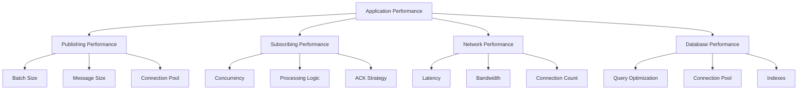

# Performance Optimization Guide

This comprehensive guide covers performance optimization strategies for NatsPubsub applications, including batching, connection pooling, concurrent processing, memory optimization, benchmarking, and troubleshooting performance bottlenecks.

## Table of Contents

- [Overview](#overview)
- [Performance Metrics](#performance-metrics)
- [Batching Strategies](#batching-strategies)
- [Connection Pooling](#connection-pooling)
- [Concurrent Processing](#concurrent-processing)
- [Memory Optimization](#memory-optimization)
- [Database Optimization](#database-optimization)
- [Network Optimization](#network-optimization)
- [Caching Strategies](#caching-strategies)
- [Benchmarking](#benchmarking)
- [Monitoring Performance](#monitoring-performance)
- [Troubleshooting Bottlenecks](#troubleshooting-bottlenecks)
- [Production Tuning](#production-tuning)

---

## Overview

NatsPubsub performance depends on several factors:



### Performance Goals

| Metric                        | Target | Excellent | Good    | Acceptable |
| ----------------------------- | ------ | --------- | ------- | ---------- |
| **Publish Latency (p50)**     | < 1ms  | < 2ms     | < 5ms   | < 10ms     |
| **Publish Latency (p99)**     | < 5ms  | < 10ms    | < 20ms  | < 50ms     |
| **Subscribe Latency (p50)**   | < 10ms | < 20ms    | < 50ms  | < 100ms    |
| **Subscribe Latency (p99)**   | < 50ms | < 100ms   | < 200ms | < 500ms    |
| **Throughput (Messages/sec)** | > 10K  | > 5K      | > 1K    | > 100      |
| **Error Rate**                | < 0.1% | < 0.5%    | < 1%    | < 5%       |

---

## Performance Metrics

### Key Metrics to Monitor

#### 1. Publishing Metrics

```typescript
// JavaScript/TypeScript
interface PublishMetrics {
  publishRate: number; // Messages/second
  publishLatencyP50: number; // Milliseconds
  publishLatencyP99: number; // Milliseconds
  publishErrors: number; // Count
  batchSize: number; // Average batch size
  messageSize: number; // Average message size (bytes)
}
```

#### 2. Subscribing Metrics

```typescript
interface SubscribeMetrics {
  processRate: number; // Messages/second
  processLatencyP50: number; // Milliseconds
  processLatencyP99: number; // Milliseconds
  consumerLag: number; // Messages behind
  retryRate: number; // Retries/second
  dlqRate: number; // DLQ messages/second
}
```

#### 3. System Metrics

```typescript
interface SystemMetrics {
  cpuUsage: number; // Percentage
  memoryUsage: number; // MB
  connectionCount: number; // Active connections
  eventLoopLag: number; // Milliseconds (Node.js)
}
```

---

## Batching Strategies

### Publishing Batches

Batch publishing is 5-10x faster than individual publishes for bulk operations.

#### JavaScript/TypeScript

```typescript
import NatsPubsub from "nats-pubsub";

// Good: Batch publishing
async function publishOrders(orders: Order[]): Promise<void> {
  const batch = NatsPubsub.batch();

  for (const order of orders) {
    batch.add("order.created", {
      order_id: order.id,
      customer_id: order.customer_id,
      total: order.total,
    });
  }

  const result = await batch.publish();
  console.log(`Published ${result.successCount} messages in batch`);
}

// Bad: Individual publishes
async function publishOrdersSlow(orders: Order[]): Promise<void> {
  for (const order of orders) {
    await NatsPubsub.publish("order.created", {
      order_id: order.id,
      customer_id: order.customer_id,
      total: order.total,
    });
  }
}

// Benchmark results (1000 messages):
// Batch: ~500ms (2000 msg/sec)
// Individual: ~5000ms (200 msg/sec)
```

#### Ruby

```ruby
# Good: Batch publishing
def publish_orders(orders)
  batch = NatsPubsub.batch

  orders.each do |order|
    batch.add('order.created', {
      order_id: order.id,
      customer_id: order.customer_id,
      total: order.total
    })
  end

  result = batch.publish
  puts "Published #{result.success_count} messages in batch"
end

# Bad: Individual publishes
def publish_orders_slow(orders)
  orders.each do |order|
    NatsPubsub.publish('order.created', {
      order_id: order.id,
      customer_id: order.customer_id,
      total: order.total
    })
  end
end
```

### Optimal Batch Sizes

```typescript
// Experiment with different batch sizes
async function findOptimalBatchSize(): Promise<number> {
  const batchSizes = [10, 25, 50, 100, 250, 500];
  const results: Record<number, number> = {};

  for (const size of batchSizes) {
    const start = Date.now();
    const batch = NatsPubsub.batch();

    for (let i = 0; i < size; i++) {
      batch.add("test.message", { id: i });
    }

    await batch.publish();
    const duration = Date.now() - start;
    const throughput = (size / duration) * 1000;

    results[size] = throughput;
    console.log(`Batch size ${size}: ${throughput.toFixed(0)} msg/sec`);
  }

  // Find optimal size
  return Object.entries(results).sort(
    ([, a], [, b]) => b - a,
  )[0][0] as unknown as number;
}

// Typical results:
// Batch size 10: 500 msg/sec
// Batch size 25: 1200 msg/sec
// Batch size 50: 2000 msg/sec  <- Often optimal
// Batch size 100: 2500 msg/sec
// Batch size 250: 2600 msg/sec (diminishing returns)
```

### Dynamic Batching

```typescript
class SmartBatchPublisher {
  private batch: any[] = [];
  private readonly maxBatchSize = 100;
  private readonly maxWaitMs = 1000;
  private timer?: NodeJS.Timeout;

  async add(topic: string, message: any): Promise<void> {
    this.batch.push({ topic, message });

    // Publish immediately if batch is full
    if (this.batch.length >= this.maxBatchSize) {
      await this.flush();
    } else if (!this.timer) {
      // Schedule flush after max wait time
      this.timer = setTimeout(() => this.flush(), this.maxWaitMs);
    }
  }

  private async flush(): Promise<void> {
    if (this.batch.length === 0) return;

    clearTimeout(this.timer);
    this.timer = undefined;

    const toPublish = this.batch.splice(0);
    const batch = NatsPubsub.batch();

    for (const { topic, message } of toPublish) {
      batch.add(topic, message);
    }

    await batch.publish();
  }
}

// Usage
const publisher = new SmartBatchPublisher();

// Add messages - automatically batches
await publisher.add("order.created", { order_id: "1" });
await publisher.add("order.created", { order_id: "2" });
// ... more messages

// Automatically flushes when:
// 1. Batch reaches 100 messages, OR
// 2. 1 second elapsed since first message
```

---

## Connection Pooling

### NATS Connection Pool

#### JavaScript/TypeScript

```typescript
import { connect, NatsConnection } from "nats";

class ConnectionPool {
  private connections: NatsConnection[] = [];
  private readonly poolSize: number;
  private currentIndex = 0;

  constructor(poolSize: number = 5) {
    this.poolSize = poolSize;
  }

  async initialize(natsUrls: string): Promise<void> {
    for (let i = 0; i < this.poolSize; i++) {
      const nc = await connect({ servers: natsUrls });
      this.connections.push(nc);
    }
  }

  getConnection(): NatsConnection {
    const conn = this.connections[this.currentIndex];
    this.currentIndex = (this.currentIndex + 1) % this.poolSize;
    return conn;
  }

  async close(): Promise<void> {
    await Promise.all(this.connections.map((nc) => nc.close()));
  }
}

// Usage
const pool = new ConnectionPool(5);
await pool.initialize("nats://localhost:4222");

// Use connection from pool
const nc = pool.getConnection();
const js = nc.jetstream();
await js.publish("test.subject", JSON.stringify({ data: "test" }));
```

### Database Connection Pool

#### JavaScript/TypeScript

```typescript
import { Pool } from "pg";

// Configure pool based on concurrency
const concurrency = parseInt(process.env.CONCURRENCY || "20");

const pool = new Pool({
  connectionString: process.env.DATABASE_URL,
  // Pool size should match or exceed concurrency
  max: Math.max(concurrency, 20),
  min: Math.floor(concurrency / 2),
  idleTimeoutMillis: 30000,
  connectionTimeoutMillis: 2000,
  // Enable statement timeout
  statement_timeout: 30000,
});

// Monitor pool
pool.on("connect", () => {
  console.log("New client connected to pool");
});

pool.on("error", (err) => {
  console.error("Unexpected pool error:", err);
});

// Usage in subscriber
class OrderSubscriber extends Subscriber {
  async handle(message: any, metadata: TopicMetadata): Promise<void> {
    const client = await pool.connect();

    try {
      await client.query("BEGIN");

      await client.query(
        "INSERT INTO orders (id, customer_id, total) VALUES ($1, $2, $3)",
        [message.order_id, message.customer_id, message.total],
      );

      await client.query("COMMIT");
    } catch (error) {
      await client.query("ROLLBACK");
      throw error;
    } finally {
      client.release();
    }
  }
}
```

#### Ruby

```ruby
# config/database.yml
production:
  adapter: postgresql
  encoding: unicode
  pool: <%= ENV['RAILS_MAX_THREADS'] || 20 %>
  timeout: 5000
  statement_timeout: 30000
  connect_timeout: 2

# config/initializers/nats_pubsub.rb
NatsPubsub.configure do |config|
  # Ensure pool size matches concurrency
  config.concurrency = ENV['CONCURRENCY']&.to_i || 20
end

# Ensure Rails thread pool matches
Rails.application.config.after_initialize do
  ActiveRecord::Base.connection_pool.disconnect!

  ActiveRecord::Base.establish_connection(
    Rails.application.config.database_configuration[Rails.env].merge(
      pool: [NatsPubsub.config.concurrency, 20].max
    )
  )
end
```

---

## Concurrent Processing

### Tuning Concurrency

#### JavaScript/TypeScript

```typescript
// Configure concurrency based on workload
NatsPubsub.configure({
  natsUrls: "nats://localhost:4222",
  env: "production",
  appName: "order-service",

  // CPU-bound tasks: concurrency = CPU cores
  concurrency: os.cpus().length,

  // I/O-bound tasks: concurrency = 2-4x CPU cores
  // concurrency: os.cpus().length * 3,

  // Database-heavy: concurrency ≤ DB pool size
  // concurrency: 20,
});
```

#### Finding Optimal Concurrency

```typescript
async function benchmarkConcurrency(): Promise<void> {
  const concurrencyLevels = [1, 5, 10, 20, 50, 100];

  for (const concurrency of concurrencyLevels) {
    console.log(`\nTesting concurrency: ${concurrency}`);

    NatsPubsub.configure({ concurrency });

    const start = Date.now();
    const messageCount = 1000;

    // Publish messages
    for (let i = 0; i < messageCount; i++) {
      await NatsPubsub.publish("test.message", { id: i });
    }

    // Wait for processing
    await new Promise((resolve) => setTimeout(resolve, 5000));

    const duration = (Date.now() - start) / 1000;
    const throughput = messageCount / duration;

    console.log(`Duration: ${duration.toFixed(2)}s`);
    console.log(`Throughput: ${throughput.toFixed(0)} msg/sec`);
  }
}

// Typical results:
// Concurrency 1: 100 msg/sec
// Concurrency 5: 400 msg/sec
// Concurrency 10: 800 msg/sec
// Concurrency 20: 1500 msg/sec  <- Often optimal
// Concurrency 50: 1600 msg/sec  (diminishing returns)
// Concurrency 100: 1550 msg/sec (overhead reduces performance)
```

### Backpressure Handling

```typescript
class BackpressureSubscriber extends Subscriber {
  private processingCount = 0;
  private readonly maxConcurrent = 50;

  async handle(message: any, metadata: TopicMetadata): Promise<void> {
    // Wait if too many concurrent operations
    while (this.processingCount >= this.maxConcurrent) {
      await new Promise((resolve) => setTimeout(resolve, 10));
    }

    this.processingCount++;

    try {
      await this.processMessage(message);
    } finally {
      this.processingCount--;
    }
  }

  private async processMessage(message: any): Promise<void> {
    // Heavy processing
    await heavyOperation(message);
  }
}
```

---

## Memory Optimization

### Reducing Memory Footprint

#### JavaScript/TypeScript

```typescript
// Bad: Loading entire dataset into memory
async function processOrdersBad(): Promise<void> {
  const orders = await Order.findAll(); // Loads everything!

  for (const order of orders) {
    await NatsPubsub.publish("order.created", order.toJSON());
  }
}

// Good: Streaming/cursor-based processing
async function processOrdersGood(): Promise<void> {
  const batchSize = 100;
  let offset = 0;

  while (true) {
    const orders = await Order.findAll({
      limit: batchSize,
      offset,
    });

    if (orders.length === 0) break;

    const batch = NatsPubsub.batch();
    for (const order of orders) {
      batch.add("order.created", order.toJSON());
    }
    await batch.publish();

    offset += batchSize;

    // Allow garbage collection
    await new Promise((resolve) => setImmediate(resolve));
  }
}
```

### Memory Monitoring

```typescript
import v8 from "v8";

class MemoryMonitor {
  private readonly threshold = 0.9; // 90% of heap

  checkMemory(): void {
    const heapStats = v8.getHeapStatistics();
    const used = heapStats.used_heap_size;
    const total = heapStats.heap_size_limit;
    const ratio = used / total;

    if (ratio > this.threshold) {
      console.warn(`High memory usage: ${(ratio * 100).toFixed(1)}%`);

      // Force garbage collection (if --expose-gc flag is set)
      if (global.gc) {
        global.gc();
      }
    }
  }

  startMonitoring(intervalMs = 10000): void {
    setInterval(() => this.checkMemory(), intervalMs);
  }
}

const memoryMonitor = new MemoryMonitor();
memoryMonitor.startMonitoring();
```

### Subscriber Memory Optimization

```typescript
class OptimizedSubscriber extends Subscriber {
  // Use WeakMap for caching (automatically garbage collected)
  private cache = new WeakMap<object, any>();

  async handle(message: any, metadata: TopicMetadata): Promise<void> {
    // Process message without storing references
    const result = await this.processMessage(message);

    // Don't keep processed messages in memory
    message = null; // Help GC
  }

  private async processMessage(message: any): Promise<any> {
    // Processing logic
    return await heavyOperation(message);
  }
}
```

---

## Database Optimization

### Indexing

```sql
-- Index for Outbox table
CREATE INDEX CONCURRENTLY idx_outbox_status_created
  ON nats_pubsub_outbox (status, created_at)
  WHERE status = 'pending';

-- Index for Inbox table (idempotency checks)
CREATE INDEX CONCURRENTLY idx_inbox_event_id
  ON nats_pubsub_inbox (event_id);

-- Partial index for faster lookups
CREATE INDEX CONCURRENTLY idx_inbox_pending
  ON nats_pubsub_inbox (created_at)
  WHERE status = 'pending';
```

### Query Optimization

#### JavaScript/TypeScript

```typescript
// Bad: N+1 query problem
async function processOrdersBad(): Promise<void> {
  const orders = await Order.findAll();

  for (const order of orders) {
    const customer = await Customer.findById(order.customer_id); // N queries!
    await process(order, customer);
  }
}

// Good: Join/eager loading
async function processOrdersGood(): Promise<void> {
  const orders = await Order.findAll({
    include: [{ model: Customer }], // 1 query with join
  });

  for (const order of orders) {
    await process(order, order.customer);
  }
}
```

#### Ruby

```ruby
# Bad: N+1 query problem
def process_orders_bad
  orders = Order.all

  orders.each do |order|
    customer = Customer.find(order.customer_id) # N queries!
    process(order, customer)
  end
end

# Good: Eager loading
def process_orders_good
  orders = Order.includes(:customer).all # 1-2 queries

  orders.each do |order|
    process(order, order.customer)
  end
end
```

### Bulk Operations

```typescript
// Bad: Individual inserts
for (const order of orders) {
  await Order.create(order);
}

// Good: Bulk insert
await Order.bulkCreate(orders);

// Best: Bulk insert with transaction
await sequelize.transaction(async (t) => {
  await Order.bulkCreate(orders, { transaction: t });
});
```

---

## Network Optimization

### Message Size Optimization

```typescript
// Bad: Large messages
await NatsPubsub.publish("order.created", {
  order: fullOrderObject, // Many KB
  customer: fullCustomerObject, // Many KB
  items: fullItemsWithDetails, // Many KB
  metadata: lotsOfExtraData, // Many KB
});

// Good: Reference-based messages
await NatsPubsub.publish("order.created", {
  order_id: "ORD-123", // Small
  customer_id: "CUST-456", // Small
  total: 99.99, // Small
});
// Fetch full details in subscriber if needed
```

### Compression

```typescript
import { gzip, gunzip } from "zlib";
import { promisify } from "util";

const gzipAsync = promisify(gzip);
const gunzipAsync = promisify(gunzip);

// Publisher with compression
async function publishCompressed(topic: string, message: any): Promise<void> {
  const json = JSON.stringify(message);
  const compressed = await gzipAsync(Buffer.from(json));

  await NatsPubsub.publish(topic, {
    _compressed: true,
    data: compressed.toString("base64"),
  });
}

// Subscriber with decompression
class CompressedSubscriber extends Subscriber {
  async handle(message: any, metadata: TopicMetadata): Promise<void> {
    if (message._compressed) {
      const buffer = Buffer.from(message.data, "base64");
      const decompressed = await gunzipAsync(buffer);
      message = JSON.parse(decompressed.toString());
    }

    await this.processMessage(message);
  }
}
```

---

## Caching Strategies

### In-Memory Caching

```typescript
import NodeCache from "node-cache";

class CachedSubscriber extends Subscriber {
  private cache = new NodeCache({
    stdTTL: 600, // 10 minutes
    checkperiod: 120,
    useClones: false, // Don't clone objects (faster)
  });

  async handle(message: any, metadata: TopicMetadata): Promise<void> {
    const cacheKey = `customer:${message.customer_id}`;

    // Try cache first
    let customer = this.cache.get(cacheKey);

    if (!customer) {
      // Cache miss - fetch from database
      customer = await Customer.findById(message.customer_id);
      this.cache.set(cacheKey, customer);
    }

    await this.processOrder(message, customer);
  }
}
```

### Redis Caching

```typescript
import Redis from "ioredis";

const redis = new Redis({
  host: process.env.REDIS_HOST,
  enableReadyCheck: true,
  maxRetriesPerRequest: 3,
});

class RedisCachedSubscriber extends Subscriber {
  async handle(message: any, metadata: TopicMetadata): Promise<void> {
    const cacheKey = `customer:${message.customer_id}`;

    // Try cache first
    let customer = await redis.get(cacheKey);

    if (!customer) {
      // Cache miss - fetch from database
      const customerObj = await Customer.findById(message.customer_id);
      customer = JSON.stringify(customerObj);

      // Cache for 10 minutes
      await redis.setex(cacheKey, 600, customer);
    }

    await this.processOrder(message, JSON.parse(customer));
  }
}
```

---

## Benchmarking

### Publishing Benchmark

```typescript
async function benchmarkPublishing(): Promise<void> {
  const messageCount = 10000;
  const message = { order_id: "ORD-123", total: 99.99 };

  console.log("Benchmarking publishing...\n");

  // Individual publishing
  {
    const start = Date.now();
    for (let i = 0; i < 100; i++) {
      await NatsPubsub.publish("test.individual", message);
    }
    const duration = Date.now() - start;
    console.log(`Individual: ${duration}ms for 100 messages`);
    console.log(
      `Throughput: ${((100 / duration) * 1000).toFixed(0)} msg/sec\n`,
    );
  }

  // Batch publishing
  {
    const start = Date.now();
    const batch = NatsPubsub.batch();
    for (let i = 0; i < 100; i++) {
      batch.add("test.batch", message);
    }
    await batch.publish();
    const duration = Date.now() - start;
    console.log(`Batch: ${duration}ms for 100 messages`);
    console.log(`Throughput: ${((100 / duration) * 1000).toFixed(0)} msg/sec`);
  }
}
```

### Subscribing Benchmark

```typescript
async function benchmarkSubscribing(): Promise<void> {
  let processedCount = 0;
  const startTime = Date.now();

  class BenchmarkSubscriber extends Subscriber {
    constructor() {
      super("test.benchmark");
    }

    async handle(message: any): Promise<void> {
      processedCount++;

      // Simulate processing
      await new Promise((resolve) => setTimeout(resolve, 10));
    }
  }

  NatsPubsub.registerSubscriber(new BenchmarkSubscriber());
  await NatsPubsub.start();

  // Publish messages
  for (let i = 0; i < 1000; i++) {
    await NatsPubsub.publish("test.benchmark", { id: i });
  }

  // Wait for processing
  await new Promise((resolve) => setTimeout(resolve, 30000));

  const duration = (Date.now() - startTime) / 1000;
  const throughput = processedCount / duration;

  console.log(`Processed: ${processedCount} messages`);
  console.log(`Duration: ${duration.toFixed(2)}s`);
  console.log(`Throughput: ${throughput.toFixed(0)} msg/sec`);

  await NatsPubsub.stop();
}
```

---

## Monitoring Performance

### Metrics Collection

```typescript
import { Registry, Histogram, Counter } from "prom-client";

class PerformanceMonitor {
  private registry = new Registry();

  private publishLatency = new Histogram({
    name: "nats_publish_latency_seconds",
    help: "Publishing latency in seconds",
    labelNames: ["topic"],
    buckets: [0.001, 0.005, 0.01, 0.05, 0.1, 0.5, 1],
    registers: [this.registry],
  });

  private subscribeLatency = new Histogram({
    name: "nats_subscribe_latency_seconds",
    help: "Subscribe processing latency in seconds",
    labelNames: ["subject"],
    buckets: [0.01, 0.05, 0.1, 0.5, 1, 5, 10],
    registers: [this.registry],
  });

  private messageSize = new Histogram({
    name: "nats_message_size_bytes",
    help: "Message size in bytes",
    labelNames: ["topic"],
    buckets: [100, 500, 1000, 5000, 10000, 50000],
    registers: [this.registry],
  });

  recordPublish(topic: string, durationMs: number, sizeBytes: number): void {
    this.publishLatency.observe({ topic }, durationMs / 1000);
    this.messageSize.observe({ topic }, sizeBytes);
  }

  recordSubscribe(subject: string, durationMs: number): void {
    this.subscribeLatency.observe({ subject }, durationMs / 1000);
  }

  async getMetrics(): Promise<string> {
    return this.registry.metrics();
  }
}

export const performanceMonitor = new PerformanceMonitor();
```

---

## Troubleshooting Bottlenecks

### Identifying Slow Subscribers

```typescript
class DiagnosticMiddleware implements Middleware {
  private slowThreshold = 1000; // 1 second

  async call(
    event: any,
    metadata: any,
    next: () => Promise<void>,
  ): Promise<void> {
    const start = Date.now();

    await next();

    const duration = Date.now() - start;

    if (duration > this.slowThreshold) {
      console.warn("Slow subscriber detected:", {
        subject: metadata.subject,
        duration: `${duration}ms`,
        event_id: metadata.event_id,
      });
    }
  }
}

NatsPubsub.use(new DiagnosticMiddleware());
```

### CPU Profiling

```typescript
import { cpuUsage } from "process";

class CPUProfiler {
  profile(name: string, fn: () => Promise<void>): Promise<void> {
    const startCPU = cpuUsage();
    const start = Date.now();

    return fn().finally(() => {
      const endCPU = cpuUsage(startCPU);
      const duration = Date.now() - start;

      console.log(`${name} Profile:`, {
        duration: `${duration}ms`,
        user: `${(endCPU.user / 1000).toFixed(2)}ms`,
        system: `${(endCPU.system / 1000).toFixed(2)}ms`,
      });
    });
  }
}
```

---

## Production Tuning

### Recommended Settings

```typescript
// Production configuration
NatsPubsub.configure({
  // Connection settings
  natsUrls: ["nats://nats-1:4222", "nats://nats-2:4222", "nats://nats-3:4222"],
  maxReconnectAttempts: -1,
  reconnectTimeWait: 2000,

  // Consumer settings
  concurrency: 20, // Start with 20, tune based on workload
  batchSize: 50, // Fetch 50 messages at a time
  maxDeliver: 5, // Max 5 delivery attempts
  ackWait: 30000, // 30 second ACK timeout

  // Performance settings
  useDlq: true, // Enable DLQ
  useOutbox: true, // Enable outbox for reliability

  // Monitoring
  monitoring: {
    enabled: true,
    metricsPort: 9090,
  },
});
```

---

## Navigation

- **Previous**: [Deployment Guide](./deployment.md)
- **Next**: [API Reference](../reference/javascript-api.md)
- **Related**:
  - [Monitoring Guide](../advanced/monitoring.md)
  - [Troubleshooting](../troubleshooting/common-issues.md)
