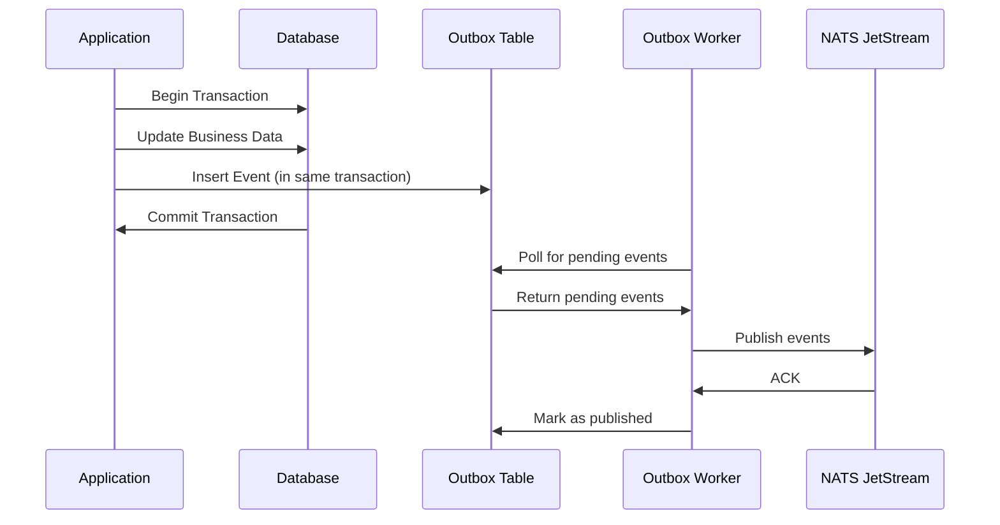

# Publishing Messages Guide

This comprehensive guide covers everything you need to know about publishing messages with NatsPubsub, including basic publishing, batch operations, metadata handling, and best practices for production systems.

## Table of Contents

- [Overview](#overview)
- [Basic Publishing](#basic-publishing)
- [Topic-Based Publishing](#topic-based-publishing)
- [Multi-Topic Publishing](#multi-topic-publishing)
- [Batch Publishing](#batch-publishing)
- [Publishing with Metadata](#publishing-with-metadata)
- [Outbox Pattern Integration](#outbox-pattern-integration)
- [Request-Reply Pattern](#request-reply-pattern)
- [Error Handling](#error-handling)
- [Best Practices](#best-practices)
- [Performance Optimization](#performance-optimization)
- [Troubleshooting](#troubleshooting)

---

## Overview

Publishing in NatsPubsub is designed to be simple yet powerful, supporting multiple patterns:

- **Topic-based messaging**: Hierarchical topics like `order.created`, `user.updated`
- **Batch publishing**: Efficiently publish multiple messages at once
- **Outbox pattern**: Guarantee message delivery with transactional outbox
- **Rich metadata**: Attach trace IDs, event IDs, and custom headers

### Subject Pattern

NatsPubsub automatically constructs NATS subjects from your topics:

```
{env}.{appName}.{topic}
```

**Example**: Topic `order.created` becomes subject `production.myapp.order.created`

---

## Basic Publishing

### JavaScript/TypeScript

```typescript
import NatsPubsub from "nats-pubsub";

// Configure once at application startup
NatsPubsub.configure({
  natsUrls: "nats://localhost:4222",
  env: "production",
  appName: "order-service",
});

// Publish a simple message
await NatsPubsub.publish("order.created", {
  order_id: "ORD-12345",
  customer_id: "CUST-789",
  total: 99.99,
  items: [
    { product_id: "PROD-1", quantity: 2, price: 29.99 },
    { product_id: "PROD-2", quantity: 1, price: 40.01 },
  ],
});
```

### Ruby

```ruby
require 'nats_pubsub'

# Configure once at application startup
NatsPubsub.configure do |config|
  config.servers = 'nats://localhost:4222'
  config.env = 'production'
  config.app_name = 'order-service'
end

# Publish a simple message
NatsPubsub.publish('order.created', {
  order_id: 'ORD-12345',
  customer_id: 'CUST-789',
  total: 99.99,
  items: [
    { product_id: 'PROD-1', quantity: 2, price: 29.99 },
    { product_id: 'PROD-2', quantity: 1, price: 40.01 }
  ]
})
```

---

## Topic-Based Publishing

Topics use dot notation for hierarchical organization, supporting wildcards for flexible subscriptions.

### Single Topic

#### JavaScript/TypeScript

```typescript
// Method 1: Positional arguments
await NatsPubsub.publish("notification.email", {
  to: "user@example.com",
  subject: "Welcome!",
  body: "Thanks for signing up.",
});

// Method 2: Options object
await NatsPubsub.publish({
  topic: "notification.email",
  message: {
    to: "user@example.com",
    subject: "Welcome!",
    body: "Thanks for signing up.",
  },
});
```

#### Ruby

```ruby
# Method 1: Positional arguments
NatsPubsub.publish('notification.email', {
  to: 'user@example.com',
  subject: 'Welcome!',
  body: 'Thanks for signing up.'
})

# Method 2: Keyword arguments
NatsPubsub.publish(
  topic: 'notification.email',
  message: {
    to: 'user@example.com',
    subject: 'Welcome!',
    body: 'Thanks for signing up.'
  }
)
```

### Topic Hierarchy Best Practices

Organize topics hierarchically for flexibility:

```
resource.action
domain.resource.action
service.domain.resource.action
```

**Examples**:

```typescript
// Good: Clear hierarchy
await NatsPubsub.publish("order.created", orderData);
await NatsPubsub.publish("order.updated", orderData);
await NatsPubsub.publish("order.cancelled", orderData);

await NatsPubsub.publish("notification.email.sent", emailData);
await NatsPubsub.publish("notification.sms.sent", smsData);
await NatsPubsub.publish("notification.push.sent", pushData);

// Advanced: Multi-level hierarchy
await NatsPubsub.publish("ecommerce.order.payment.completed", paymentData);
await NatsPubsub.publish("ecommerce.inventory.item.reserved", inventoryData);
```

---

## Multi-Topic Publishing

Publish the same message to multiple topics simultaneously (fan-out pattern).

### JavaScript/TypeScript

```typescript
// Publish to multiple topics at once
await NatsPubsub.publish({
  topics: [
    "order.created",
    "notification.email",
    "audit.order-event",
    "analytics.conversion",
  ],
  message: {
    order_id: "ORD-12345",
    customer_id: "CUST-789",
    total: 99.99,
    timestamp: new Date().toISOString(),
  },
});
```

### Ruby

```ruby
# Publish to multiple topics at once
NatsPubsub.publish(
  topics: [
    'order.created',
    'notification.email',
    'audit.order-event',
    'analytics.conversion'
  ],
  message: {
    order_id: 'ORD-12345',
    customer_id: 'CUST-789',
    total: 99.99,
    timestamp: Time.now.iso8601
  }
)
```

### Use Cases for Multi-Topic Publishing

1. **Event Fan-Out**: Notify multiple services of the same event
2. **Audit Logging**: Send to business topic + audit topic
3. **Analytics**: Send to business topic + analytics topic
4. **Cross-Cutting Concerns**: Logging, metrics, tracing

---

## Batch Publishing

Efficiently publish multiple messages in a single operation.

### JavaScript/TypeScript

```typescript
import NatsPubsub from "nats-pubsub";

// Create a batch
const batch = NatsPubsub.batch();

// Add messages to the batch
batch
  .add("order.created", { order_id: "ORD-1", total: 10.0 })
  .add("order.created", { order_id: "ORD-2", total: 20.0 })
  .add("order.created", { order_id: "ORD-3", total: 30.0 })
  .add("notification.email", { to: "user1@example.com" })
  .add("notification.email", { to: "user2@example.com" });

// Publish all messages
const result = await batch.publish();

console.log(`Published ${result.count} messages`);
console.log(`Success: ${result.successCount}, Failed: ${result.failureCount}`);
```

### Ruby

```ruby
require 'nats_pubsub'

# Create a batch
batch = NatsPubsub.batch

# Add messages to the batch
batch
  .add('order.created', { order_id: 'ORD-1', total: 10.00 })
  .add('order.created', { order_id: 'ORD-2', total: 20.00 })
  .add('order.created', { order_id: 'ORD-3', total: 30.00 })
  .add('notification.email', { to: 'user1@example.com' })
  .add('notification.email', { to: 'user2@example.com' })

# Publish all messages
result = batch.publish

puts "Published #{result.count} messages"
puts "Success: #{result.success_count}, Failed: #{result.failure_count}"
```

### Advanced Batch Usage

#### With Metadata

```typescript
// JavaScript
const batch = NatsPubsub.batch();

batch
  .add(
    "order.created",
    { order_id: "ORD-1" },
    {
      trace_id: "trace-123",
      occurred_at: new Date(),
    },
  )
  .add(
    "order.created",
    { order_id: "ORD-2" },
    {
      trace_id: "trace-456",
      occurred_at: new Date(),
    },
  );

await batch.publish();
```

```ruby
# Ruby
batch = NatsPubsub.batch

batch
  .add('order.created', { order_id: 'ORD-1' }, trace_id: 'trace-123')
  .add('order.created', { order_id: 'ORD-2' }, trace_id: 'trace-456')

batch.publish
```

#### Conditional Batching

```typescript
// JavaScript: Build batch conditionally
const batch = NatsPubsub.batch();

orders.forEach((order) => {
  batch.add("order.created", {
    order_id: order.id,
    total: order.total,
  });

  if (order.total > 100) {
    batch.add("analytics.high-value-order", {
      order_id: order.id,
      total: order.total,
    });
  }
});

await batch.publish();
```

---

## Publishing with Metadata

Enrich messages with metadata for tracing, debugging, and correlation.

### Available Metadata Options

| Option           | Type   | Description                                              |
| ---------------- | ------ | -------------------------------------------------------- |
| `event_id`       | string | Unique event identifier (auto-generated if not provided) |
| `trace_id`       | string | Distributed tracing ID for request correlation           |
| `occurred_at`    | Date   | Timestamp when event occurred (defaults to now)          |
| `message_type`   | string | Custom message type/schema identifier                    |
| `correlation_id` | string | ID for correlating related events                        |
| `causation_id`   | string | ID of the event that caused this event                   |

### JavaScript/TypeScript

```typescript
import { v4 as uuidv4 } from "uuid";

// Publish with comprehensive metadata
await NatsPubsub.publish(
  "order.created",
  {
    order_id: "ORD-12345",
    customer_id: "CUST-789",
    total: 99.99,
  },
  {
    event_id: uuidv4(),
    trace_id: "trace-abc-123",
    correlation_id: "corr-xyz-789",
    occurred_at: new Date(),
    message_type: "OrderCreatedV2",
  },
);
```

### Ruby

```ruby
require 'securerandom'

# Publish with comprehensive metadata
NatsPubsub.publish(
  'order.created',
  {
    order_id: 'ORD-12345',
    customer_id: 'CUST-789',
    total: 99.99
  },
  event_id: SecureRandom.uuid,
  trace_id: 'trace-abc-123',
  correlation_id: 'corr-xyz-789',
  occurred_at: Time.now,
  message_type: 'OrderCreatedV2'
)
```

### Metadata Propagation Pattern

```typescript
// Express middleware to propagate trace ID
app.use((req, res, next) => {
  req.traceId = req.headers["x-trace-id"] || uuidv4();
  res.setHeader("x-trace-id", req.traceId);
  next();
});

// Use trace ID in publishing
app.post("/orders", async (req, res) => {
  const order = await createOrder(req.body);

  await NatsPubsub.publish(
    "order.created",
    { order_id: order.id },
    { trace_id: req.traceId },
  );

  res.json(order);
});
```

---

## Outbox Pattern Integration

The Outbox pattern ensures messages are published even if NATS is temporarily unavailable by storing them in a database first.

### How It Works



### JavaScript/TypeScript Setup

#### 1. Database Schema

```sql
-- PostgreSQL
CREATE TABLE nats_pubsub_outbox (
  id BIGSERIAL PRIMARY KEY,
  event_id VARCHAR(255) UNIQUE NOT NULL,
  subject VARCHAR(255) NOT NULL,
  payload JSONB NOT NULL,
  status VARCHAR(50) DEFAULT 'pending',
  retry_count INTEGER DEFAULT 0,
  created_at TIMESTAMP DEFAULT NOW(),
  published_at TIMESTAMP,
  error TEXT
);

CREATE INDEX idx_outbox_status_created ON nats_pubsub_outbox(status, created_at);
```

#### 2. Enable Outbox Pattern

```typescript
import NatsPubsub from "nats-pubsub";
import { Pool } from "pg";

// Configure with database connection
NatsPubsub.configure({
  natsUrls: "nats://localhost:4222",
  env: "production",
  appName: "order-service",
  useOutbox: true,
  outbox: {
    database: new Pool({
      connectionString: process.env.DATABASE_URL,
    }),
    pollInterval: 5000, // Check every 5 seconds
    batchSize: 100,
  },
});

// Publishing automatically uses outbox
await NatsPubsub.publish("order.created", orderData);
// Event stored in outbox table first, then published by worker
```

#### 3. Start Outbox Worker

```typescript
// worker.ts
import NatsPubsub from "nats-pubsub";

// Configuration already done above

// Start the outbox worker
await NatsPubsub.startOutboxWorker();

console.log("Outbox worker started");

// Graceful shutdown
process.on("SIGTERM", async () => {
  await NatsPubsub.stopOutboxWorker();
  process.exit(0);
});
```

### Ruby Setup

#### 1. Generate Migration

```bash
rails generate nats_pubsub:migrations
rails db:migrate
```

#### 2. Enable Outbox Pattern

```ruby
# config/initializers/nats_pubsub.rb
NatsPubsub.configure do |config|
  config.servers = ENV['NATS_URLS']
  config.env = Rails.env
  config.app_name = 'order-service'
  config.use_outbox = true
end
```

#### 3. Publish with Outbox

```ruby
# Automatically uses outbox when enabled
NatsPubsub.publish('order.created', order_data)
# Event stored in outbox table first

# In your model
class Order < ApplicationRecord
  include NatsPubsub::ActiveRecord::Publishable

  after_create :publish_created_event

  private

  def publish_created_event
    publish('order.created', {
      order_id: id,
      customer_id: customer_id,
      total: total
    })
  end
end
```

#### 4. Start Outbox Worker

```bash
# CLI command
bundle exec nats_pubsub outbox:worker

# Or in code
rake nats_pubsub:outbox:start
```

### Transactional Outbox Example

#### JavaScript/TypeScript

```typescript
import { Pool } from "pg";
import NatsPubsub from "nats-pubsub";

const pool = new Pool({ connectionString: process.env.DATABASE_URL });

async function createOrderWithEvent(orderData: any) {
  const client = await pool.connect();

  try {
    await client.query("BEGIN");

    // Insert order
    const orderResult = await client.query(
      "INSERT INTO orders (customer_id, total, status) VALUES ($1, $2, $3) RETURNING *",
      [orderData.customer_id, orderData.total, "pending"],
    );
    const order = orderResult.rows[0];

    // Insert outbox event in same transaction
    await client.query(
      `INSERT INTO nats_pubsub_outbox (event_id, subject, payload, status)
       VALUES ($1, $2, $3, $4)`,
      [
        uuidv4(),
        "production.order-service.order.created",
        JSON.stringify({
          order_id: order.id,
          customer_id: order.customer_id,
          total: order.total,
        }),
        "pending",
      ],
    );

    await client.query("COMMIT");

    return order;
  } catch (error) {
    await client.query("ROLLBACK");
    throw error;
  } finally {
    client.release();
  }
}
```

#### Ruby with ActiveRecord

```ruby
class OrderService
  def create_order(order_params)
    Order.transaction do
      order = Order.create!(order_params)

      # Automatically stored in outbox within transaction
      NatsPubsub.publish('order.created', {
        order_id: order.id,
        customer_id: order.customer_id,
        total: order.total
      })

      order
    end
  rescue StandardError => e
    # Both order and outbox event are rolled back
    Rails.logger.error("Failed to create order: #{e.message}")
    raise
  end
end
```

---

## Request-Reply Pattern

For synchronous communication patterns where you need a response.

### JavaScript/TypeScript

```typescript
import NatsPubsub from "nats-pubsub";

// Request-reply with timeout
async function validateOrder(orderId: string): Promise<boolean> {
  try {
    const response = await NatsPubsub.request(
      "order.validate",
      { order_id: orderId },
      { timeout: 5000 }, // 5 second timeout
    );

    return response.valid === true;
  } catch (error) {
    console.error("Order validation failed:", error);
    return false;
  }
}

// Responder (in another service)
class OrderValidationSubscriber extends Subscriber {
  constructor() {
    super("production.order-service.order.validate");
  }

  async handle(message: any, metadata: any): Promise<void> {
    const isValid = await this.validateOrder(message.order_id);

    // Reply using metadata.reply subject
    if (metadata.reply) {
      await NatsPubsub.publish(metadata.reply, { valid: isValid });
    }
  }

  private async validateOrder(orderId: string): Promise<boolean> {
    // Validation logic
    return true;
  }
}
```

### Ruby

```ruby
# Request-reply with timeout
def validate_order(order_id)
  response = NatsPubsub.request(
    'order.validate',
    { order_id: order_id },
    timeout: 5 # 5 seconds
  )

  response['valid'] == true
rescue NatsPubsub::TimeoutError => e
  Rails.logger.error("Order validation timeout: #{e.message}")
  false
end

# Responder (in another service)
class OrderValidationSubscriber < NatsPubsub::Subscriber
  subscribe_to 'order.validate'

  def handle(message, context)
    is_valid = validate_order(message['order_id'])

    # Reply using context.reply_to subject
    if context.reply_to
      NatsPubsub.publish(context.reply_to, { valid: is_valid })
    end
  end

  private

  def validate_order(order_id)
    # Validation logic
    true
  end
end
```

---

## Error Handling

Robust error handling ensures reliability in production.

### JavaScript/TypeScript

```typescript
import NatsPubsub from "nats-pubsub";

async function publishWithErrorHandling(topic: string, message: any) {
  try {
    const result = await NatsPubsub.publish(topic, message);

    if (result.success) {
      console.log(`Published to ${topic}:`, result.eventId);
      return result;
    } else {
      console.error(`Failed to publish to ${topic}:`, result.error);
      // Handle failure (e.g., store in database, retry later)
      await storeFailedMessage(topic, message, result.error);
      throw new Error(`Publishing failed: ${result.error}`);
    }
  } catch (error) {
    console.error("Publishing error:", error);

    // Log to error tracking service
    if (errorTracker) {
      errorTracker.captureException(error, {
        extra: { topic, message },
      });
    }

    throw error;
  }
}

// With retry logic
async function publishWithRetry(
  topic: string,
  message: any,
  maxRetries = 3,
): Promise<void> {
  let lastError: Error | null = null;

  for (let attempt = 1; attempt <= maxRetries; attempt++) {
    try {
      await NatsPubsub.publish(topic, message);
      return; // Success
    } catch (error) {
      lastError = error as Error;
      console.warn(`Publish attempt ${attempt} failed:`, error);

      if (attempt < maxRetries) {
        // Exponential backoff
        const delay = Math.min(1000 * Math.pow(2, attempt - 1), 10000);
        await new Promise((resolve) => setTimeout(resolve, delay));
      }
    }
  }

  throw new Error(`Failed after ${maxRetries} attempts: ${lastError?.message}`);
}
```

### Ruby

```ruby
def publish_with_error_handling(topic, message)
  result = NatsPubsub.publish(topic, message)

  if result.success?
    Rails.logger.info("Published to #{topic}: #{result.event_id}")
    result
  else
    Rails.logger.error("Failed to publish to #{topic}: #{result.error}")
    # Handle failure (e.g., store in database, retry later)
    store_failed_message(topic, message, result.error)
    raise "Publishing failed: #{result.error}"
  end
rescue StandardError => e
  Rails.logger.error("Publishing error: #{e.message}")

  # Log to error tracking service
  Sentry.capture_exception(e, extra: { topic: topic, message: message })

  raise
end

# With retry logic
def publish_with_retry(topic, message, max_retries: 3)
  last_error = nil

  max_retries.times do |attempt|
    NatsPubsub.publish(topic, message)
    return # Success
  rescue StandardError => e
    last_error = e
    Rails.logger.warn("Publish attempt #{attempt + 1} failed: #{e.message}")

    if attempt < max_retries - 1
      # Exponential backoff
      delay = [1 * (2 ** attempt), 10].min
      sleep(delay)
    end
  end

  raise "Failed after #{max_retries} attempts: #{last_error&.message}"
end
```

---

## Best Practices

### 1. Use Meaningful Topic Names

```typescript
// Good: Clear, hierarchical topics
"order.created";
"order.updated";
"order.cancelled";
"notification.email.sent";
"payment.processed";

// Bad: Vague or flat topics
"event1";
"update";
"process";
```

### 2. Keep Messages Small

```typescript
// Good: Reference-based
await NatsPubsub.publish("order.created", {
  order_id: "ORD-12345",
  customer_id: "CUST-789",
  total: 99.99,
});

// Bad: Embedding large objects
await NatsPubsub.publish("order.created", {
  order: fullOrderObject, // Could be many KB
  customer: fullCustomerObject,
  items: allItemsWithDetails,
});
```

### 3. Use Idempotency Keys

```typescript
// JavaScript
await NatsPubsub.publish(
  'order.created',
  { order_id: orderId },
  { event_id: `order-created-${orderId}` } // Consistent event ID
);

// Ruby
NatsPubsub.publish(
  'order.created',
  { order_id: order_id },
  event_id: "order-created-#{order_id}" # Consistent event ID
)
```

### 4. Propagate Trace IDs

```typescript
// Express middleware
app.use((req, res, next) => {
  req.traceId = req.headers["x-trace-id"] || uuidv4();
  next();
});

// Use in publishing
app.post("/orders", async (req, res) => {
  await NatsPubsub.publish("order.created", orderData, {
    trace_id: req.traceId,
  });
});
```

### 5. Use Batch Publishing for Bulk Operations

```typescript
// Good: Batch publishing
const batch = NatsPubsub.batch();
orders.forEach((order) => {
  batch.add("order.created", { order_id: order.id });
});
await batch.publish();

// Bad: Individual publishes in loop
for (const order of orders) {
  await NatsPubsub.publish("order.created", { order_id: order.id });
}
```

### 6. Handle Errors Gracefully

```typescript
try {
  await NatsPubsub.publish("order.created", orderData);
} catch (error) {
  // Log error
  logger.error("Failed to publish order.created", { error, orderData });

  // Don't fail the request if publishing fails
  // Consider storing in outbox or retry queue
}
```

### 7. Use Type Safety (TypeScript)

```typescript
interface OrderCreatedMessage {
  order_id: string;
  customer_id: string;
  total: number;
}

// Type-safe publishing
await NatsPubsub.publish<OrderCreatedMessage>("order.created", {
  order_id: "ORD-123",
  customer_id: "CUST-456",
  total: 99.99,
  // TypeScript will error if fields are missing or wrong type
});
```

---

## Performance Optimization

### 1. Use Batch Publishing

Batch publishing is 5-10x faster than individual publishes for bulk operations.

```typescript
// Benchmark: 1000 messages
// Individual: ~5000ms
// Batch: ~500ms

const batch = NatsPubsub.batch();
for (let i = 0; i < 1000; i++) {
  batch.add("event.test", { id: i });
}
await batch.publish();
```

### 2. Enable Connection Pooling

```typescript
// JavaScript
NatsPubsub.configure({
  natsUrls: "nats://localhost:4222",
  maxReconnectAttempts: -1, // Infinite reconnects
  reconnectTimeWait: 1000, // 1 second between attempts
});
```

```ruby
# Ruby
NatsPubsub.configure do |config|
  config.servers = 'nats://localhost:4222'
  config.max_reconnect_attempts = -1 # Infinite reconnects
  config.reconnect_time_wait = 1 # 1 second between attempts
end
```

### 3. Use Async Publishing (Non-Blocking)

```typescript
// Fire and forget (non-blocking)
NatsPubsub.publish("analytics.event", data).catch((error) => {
  logger.error("Analytics publish failed", { error });
});

// Continue with request handling
return res.json({ success: true });
```

### 4. Monitor Publishing Performance

```typescript
class PublishMetricsMiddleware {
  async call(event: any, metadata: any, next: () => Promise<void>) {
    const start = Date.now();

    try {
      await next();
      const duration = Date.now() - start;

      metrics.histogram("publish.duration", duration, {
        topic: metadata.topic,
      });
    } catch (error) {
      metrics.increment("publish.error", {
        topic: metadata.topic,
      });
      throw error;
    }
  }
}
```

---

## Troubleshooting

### Connection Issues

**Problem**: `Error: Could not connect to NATS server`

**Solutions**:

- Verify NATS server is running: `docker ps` or `ps aux | grep nats-server`
- Check NATS URL configuration
- Verify network connectivity: `telnet localhost 4222`
- Check firewall rules

### Publishing Failures

**Problem**: Messages not being published

**Solutions**:

- Check NATS server logs: `docker logs nats-server`
- Verify JetStream is enabled: `nats stream ls`
- Check stream configuration
- Verify subject pattern matches stream subjects

### Outbox Not Processing

**Problem**: Messages stuck in outbox table

**Solutions**:

- Verify outbox worker is running
- Check database connection
- Review worker logs for errors
- Check `status` column in outbox table

### Performance Issues

**Problem**: Publishing is slow

**Solutions**:

- Use batch publishing for bulk operations
- Enable connection pooling
- Check network latency to NATS server
- Consider using async publishing
- Monitor NATS server resource usage

---

## Navigation

- **Previous**: [Core Concepts](../getting-started/concepts.md)
- **Next**: [Subscribing to Messages](./subscribing.md)
- **Related**:
  - [Batch Publishing API Reference](../reference/javascript-api.md#batch-publishing)
  - [Outbox Pattern](../patterns/inbox-outbox.md)
  - [Performance Guide](./performance.md)
