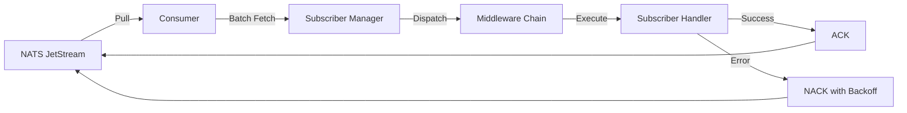
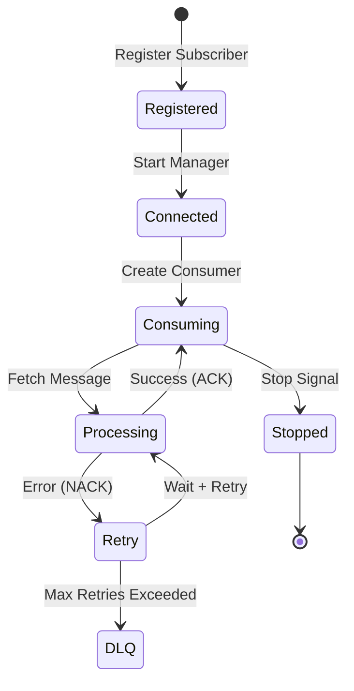

# Subscribing to Messages Guide

This comprehensive guide covers everything you need to know about creating and managing subscribers in NatsPubsub, from basic subscriptions to advanced patterns with error handling, middleware, and production best practices.

## Table of Contents

- [Overview](#overview)
- [Basic Subscribers](#basic-subscribers)
- [Topic-Based Subscriptions](#topic-based-subscriptions)
- [Wildcard Subscriptions](#wildcard-subscriptions)
- [Consumer Configuration](#consumer-configuration)
- [Acknowledgment Modes](#acknowledgment-modes)
- [Error Handling](#error-handling)
- [Middleware Usage](#middleware-usage)
- [Subscriber Lifecycle](#subscriber-lifecycle)
- [Testing Subscribers](#testing-subscribers)
- [Best Practices](#best-practices)
- [Performance Tuning](#performance-tuning)
- [Troubleshooting](#troubleshooting)

---

## Overview

Subscribers in NatsPubsub consume messages from NATS JetStream using a declarative, class-based approach. Each subscriber:

- Subscribes to one or more topics or subject patterns
- Processes messages with a `handle` method
- Supports automatic retries with exponential backoff
- Can use middleware for cross-cutting concerns
- Automatically acknowledges messages on success

### Subscriber Architecture



---

## Basic Subscribers

### JavaScript/TypeScript

#### Creating a Subscriber

```typescript
import { Subscriber, TopicMetadata } from "nats-pubsub";

class OrderCreatedSubscriber extends Subscriber {
  constructor() {
    // Subscribe to the full subject pattern
    super("production.order-service.order.created");
  }

  async handle(
    message: Record<string, unknown>,
    metadata: TopicMetadata,
  ): Promise<void> {
    console.log("Order created:", message);
    console.log("Event ID:", metadata.event_id);
    console.log("Trace ID:", metadata.trace_id);
    console.log("Topic:", metadata.topic);

    // Your business logic here
    await this.processOrder(message);
  }

  private async processOrder(message: Record<string, unknown>): Promise<void> {
    // Process the order
    const orderId = message.order_id as string;
    console.log(`Processing order ${orderId}`);
  }
}
```

#### With Type Safety

```typescript
interface OrderCreatedMessage {
  order_id: string;
  customer_id: string;
  total: number;
  items: Array<{
    product_id: string;
    quantity: number;
    price: number;
  }>;
}

class OrderCreatedSubscriber extends Subscriber<OrderCreatedMessage> {
  constructor() {
    super("production.order-service.order.created");
  }

  async handle(
    message: OrderCreatedMessage,
    metadata: TopicMetadata,
  ): Promise<void> {
    // message is fully typed!
    console.log(`Order ${message.order_id} total: $${message.total}`);

    // Process items with type safety
    for (const item of message.items) {
      await this.reserveInventory(item.product_id, item.quantity);
    }
  }

  private async reserveInventory(
    productId: string,
    quantity: number,
  ): Promise<void> {
    console.log(`Reserving ${quantity} units of ${productId}`);
  }
}
```

#### Registering and Starting

```typescript
import NatsPubsub from "nats-pubsub";

// Configure NatsPubsub
NatsPubsub.configure({
  natsUrls: "nats://localhost:4222",
  env: "production",
  appName: "order-service",
  concurrency: 10,
});

// Register subscriber
const orderSubscriber = new OrderCreatedSubscriber();
NatsPubsub.registerSubscriber(orderSubscriber);

// Start consuming messages
await NatsPubsub.start();

console.log("Subscribers started");

// Graceful shutdown
process.on("SIGTERM", async () => {
  console.log("Shutting down...");
  await NatsPubsub.stop();
  process.exit(0);
});
```

### Ruby

#### Creating a Subscriber

```ruby
class OrderCreatedSubscriber < NatsPubsub::Subscriber
  # Subscribe to a topic
  subscribe_to 'order.created'

  # Configure JetStream options
  jetstream_options retry: 3, ack_wait: 60

  def handle(message, context)
    puts "Order created: #{message}"
    puts "Event ID: #{context.event_id}"
    puts "Trace ID: #{context.trace_id}"
    puts "Topic: #{context.topic}"

    # Your business logic here
    process_order(message)
  end

  private

  def process_order(message)
    order_id = message['order_id']
    puts "Processing order #{order_id}"
  end
end
```

#### Starting Subscribers

```ruby
# config/initializers/nats_pubsub.rb
NatsPubsub.configure do |config|
  config.nats_urls = ENV['NATS_URLS'] || 'nats://localhost:4222'
  config.env = Rails.env
  config.app_name = 'order-service'
  config.concurrency = 10
end

# Subscribers are auto-discovered if they follow naming convention
# Or manually register:
NatsPubsub.register_subscriber(OrderCreatedSubscriber.new)

# Start all subscribers (in a separate process or worker)
# bin/nats_subscriber or rake nats_pubsub:start
NatsPubsub.start
```

---

## Topic-Based Subscriptions

NatsPubsub uses topic-based subscriptions with automatic subject building.

### JavaScript/TypeScript

```typescript
import { Subscriber, TopicMetadata } from "nats-pubsub";

// Extend Subscriber class with full subject
interface EmailMessage {
  to: string;
  subject: string;
  body: string;
}

class EmailNotificationSubscriber extends Subscriber<
  EmailMessage,
  TopicMetadata
> {
  constructor() {
    // Full subject: {env}.{appName}.{topic}
    super("production.app.notification.email");
  }

  async handle(message: EmailMessage, metadata: TopicMetadata): Promise<void> {
    console.log(`Sending email to ${message.to}`);
    await sendEmail(message);
  }
}
```

### Ruby

```ruby
class EmailNotificationSubscriber < NatsPubsub::Subscriber
  # Simple topic subscription
  subscribe_to 'notification.email'

  def handle(message, context)
    puts "Sending email to #{message['to']}"
    send_email(message)
  end

  private

  def send_email(message)
    # Email sending logic
  end
end
```

### Multiple Topics

Subscribe to multiple topics in a single subscriber:

#### JavaScript/TypeScript

```typescript
class NotificationSubscriber extends Subscriber {
  constructor() {
    // Subscribe to multiple subjects
    super([
      "production.app.notification.email",
      "production.app.notification.sms",
      "production.app.notification.push",
    ]);
  }

  async handle(message: any, metadata: TopicMetadata): Promise<void> {
    // Route based on topic
    switch (metadata.topic) {
      case "notification.email":
        await this.handleEmail(message);
        break;
      case "notification.sms":
        await this.handleSms(message);
        break;
      case "notification.push":
        await this.handlePush(message);
        break;
    }
  }

  private async handleEmail(message: any): Promise<void> {
    // Email handling
  }

  private async handleSms(message: any): Promise<void> {
    // SMS handling
  }

  private async handlePush(message: any): Promise<void> {
    // Push notification handling
  }
}
```

#### Ruby

```ruby
class NotificationSubscriber < NatsPubsub::Subscriber
  # Subscribe to multiple topics
  subscribe_to 'notification.email', 'notification.sms', 'notification.push'

  def handle(message, context)
    case context.topic
    when 'notification.email'
      handle_email(message)
    when 'notification.sms'
      handle_sms(message)
    when 'notification.push'
      handle_push(message)
    end
  end

  private

  def handle_email(message)
    # Email handling
  end

  def handle_sms(message)
    # SMS handling
  end

  def handle_push(message)
    # Push notification handling
  end
end
```

---

## Wildcard Subscriptions

Use wildcards to subscribe to multiple related topics.

### Wildcard Types

- `*` - Matches exactly one token at that level
- `>` - Matches one or more tokens (must be at the end)

### JavaScript/TypeScript

```typescript
// Single-level wildcard: matches user.created, user.updated, user.deleted
class AllUserEventsSubscriber extends Subscriber {
  constructor() {
    super("production.user-service.user.*");
  }

  async handle(message: any, metadata: TopicMetadata): Promise<void> {
    console.log(`User event: ${metadata.topic}`);

    // Extract action from topic
    const action = metadata.topic.split(".").pop(); // 'created', 'updated', 'deleted'

    switch (action) {
      case "created":
        await this.handleCreated(message);
        break;
      case "updated":
        await this.handleUpdated(message);
        break;
      case "deleted":
        await this.handleDeleted(message);
        break;
    }
  }

  private async handleCreated(message: any): Promise<void> {
    console.log("User created:", message.user_id);
  }

  private async handleUpdated(message: any): Promise<void> {
    console.log("User updated:", message.user_id);
  }

  private async handleDeleted(message: any): Promise<void> {
    console.log("User deleted:", message.user_id);
  }
}

// Multi-level wildcard: matches all order-related topics
class OrderAuditSubscriber extends Subscriber {
  constructor() {
    super("production.order-service.order.>");
  }

  async handle(message: any, metadata: TopicMetadata): Promise<void> {
    // Log all order events for audit
    await AuditLog.create({
      event_type: metadata.topic,
      event_id: metadata.event_id,
      trace_id: metadata.trace_id,
      payload: message,
      occurred_at: metadata.occurred_at,
    });
  }
}
```

### Ruby

```ruby
# Single-level wildcard
class AllUserEventsSubscriber < NatsPubsub::Subscriber
  subscribe_to 'user.*'

  def handle(message, context)
    puts "User event: #{context.topic}"

    # Extract action from topic
    action = context.topic.split('.').last

    case action
    when 'created'
      handle_created(message)
    when 'updated'
      handle_updated(message)
    when 'deleted'
      handle_deleted(message)
    end
  end

  private

  def handle_created(message)
    puts "User created: #{message['user_id']}"
  end

  def handle_updated(message)
    puts "User updated: #{message['user_id']}"
  end

  def handle_deleted(message)
    puts "User deleted: #{message['user_id']}"
  end
end

# Multi-level wildcard
class OrderAuditSubscriber < NatsPubsub::Subscriber
  subscribe_to_wildcard 'order' # Subscribes to order.>

  def handle(message, context)
    # Log all order events for audit
    AuditLog.create!(
      event_type: context.topic,
      event_id: context.event_id,
      trace_id: context.trace_id,
      payload: message,
      occurred_at: context.occurred_at
    )
  end
end
```

### Wildcard Use Cases

1. **Audit Logging**: Subscribe to all events from a service
2. **Analytics**: Track all events of a certain type
3. **Debugging**: Monitor all events during development
4. **Event Sourcing**: Capture all domain events

---

## Consumer Configuration

Customize consumer behavior for different workloads.

### JavaScript/TypeScript

```typescript
class CustomConfigSubscriber extends Subscriber {
  constructor() {
    super("production.app.custom.event", {
      // Consumer name (defaults to subscriber class name)
      consumerName: "custom-consumer",

      // Maximum delivery attempts before moving to DLQ
      maxDeliver: 5,

      // Acknowledgment timeout (ms)
      ackWait: 60000, // 60 seconds

      // Retry attempts
      retry: 3,

      // Backoff strategy (ms)
      backoff: [1000, 5000, 15000], // 1s, 5s, 15s

      // Batch size for fetching messages
      batchSize: 25,

      // Enable dead letter queue
      useDlq: true,
    });
  }

  async handle(message: any, metadata: TopicMetadata): Promise<void> {
    // Handler logic
  }
}
```

### Ruby

```ruby
class CustomConfigSubscriber < NatsPubsub::Subscriber
  subscribe_to 'custom.event'

  # JetStream consumer options
  jetstream_options(
    retry: 5,               # Maximum retries
    ack_wait: 60,           # ACK timeout in seconds
    max_deliver: 5,         # Max delivery attempts
    dead_letter: true,      # Enable DLQ
    batch_size: 25          # Messages per batch
  )

  def handle(message, context)
    # Handler logic
  end
end
```

### Configuration Options Reference

| Option        | Type    | Default             | Description                          |
| ------------- | ------- | ------------------- | ------------------------------------ |
| `maxDeliver`  | number  | 5                   | Maximum delivery attempts before DLQ |
| `ackWait`     | number  | 30000               | Time to wait for ACK (ms)            |
| `retry`       | number  | 3                   | Number of retry attempts             |
| `backoff`     | array   | [1000, 5000, 15000] | Retry backoff delays (ms)            |
| `batchSize`   | number  | 25                  | Messages fetched per batch           |
| `useDlq`      | boolean | true                | Enable dead letter queue             |
| `concurrency` | number  | 10                  | Concurrent message processors        |

---

## Acknowledgment Modes

Control how messages are acknowledged.

### Automatic Acknowledgment (Default)

Messages are automatically acknowledged on successful completion:

```typescript
class AutoAckSubscriber extends Subscriber {
  constructor() {
    super("production.app.order.created");
  }

  async handle(message: any, metadata: TopicMetadata): Promise<void> {
    // Process message
    await processOrder(message);
    // Automatically ACKed if no error thrown
  }
}
```

### Manual Acknowledgment

For advanced use cases, manually control acknowledgment:

#### JavaScript/TypeScript

```typescript
class ManualAckSubscriber extends Subscriber {
  constructor() {
    super("production.app.order.created", {
      manualAck: true, // Enable manual acknowledgment
    });
  }

  async handle(message: any, metadata: TopicMetadata): Promise<void> {
    try {
      await processOrder(message);

      // Explicitly acknowledge
      await metadata.ack();
    } catch (error) {
      // Negative acknowledge with delay
      await metadata.nack(5000); // Retry after 5 seconds
    }
  }
}
```

#### Ruby

```ruby
class ManualAckSubscriber < NatsPubsub::Subscriber
  subscribe_to 'order.created'

  jetstream_options manual_ack: true

  def handle(message, context)
    process_order(message)

    # Explicitly acknowledge
    context.ack
  rescue StandardError => e
    # Negative acknowledge with delay
    context.nack(delay: 5) # Retry after 5 seconds
  end
end
```

### Acknowledgment Strategies

#### 1. Immediate ACK (Default)

```typescript
// Automatically ACKs on success
async handle(message: any, metadata: TopicMetadata): Promise<void> {
  await process(message);
}
```

#### 2. Conditional ACK

```typescript
async handle(message: any, metadata: TopicMetadata): Promise<void> {
  const result = await process(message);

  if (result.needsRetry) {
    throw new Error('Needs retry'); // Will NACK with backoff
  }
  // Otherwise ACKs automatically
}
```

#### 3. Progressive ACK

```typescript
async handle(message: any, metadata: TopicMetadata): Promise<void> {
  // Working message - extends ack deadline
  await metadata.inProgress();

  // Long-running operation
  await longRunningTask();

  // Final acknowledgment happens automatically
}
```

---

## Error Handling

Robust error handling ensures messages are processed reliably.

### Automatic Retry with Backoff

#### JavaScript/TypeScript

```typescript
class ResilientSubscriber extends Subscriber {
  constructor() {
    super("production.app.order.created", {
      retry: 5,
      backoff: [1000, 2000, 5000, 10000, 30000], // Exponential backoff
    });
  }

  async handle(message: any, metadata: TopicMetadata): Promise<void> {
    try {
      await this.processOrder(message);
    } catch (error) {
      // Log error details
      console.error("Error processing order:", {
        orderId: message.order_id,
        error: error.message,
        deliveries: metadata.deliveries,
        eventId: metadata.event_id,
      });

      // Re-throw to trigger retry
      throw error;
    }
  }

  private async processOrder(message: any): Promise<void> {
    // May throw errors that trigger retries
    await externalApi.createOrder(message);
  }
}
```

#### Ruby

```ruby
class ResilientSubscriber < NatsPubsub::Subscriber
  subscribe_to 'order.created'

  jetstream_options(
    retry: 5,
    backoff: [1, 2, 5, 10, 30] # seconds
  )

  def handle(message, context)
    process_order(message)
  rescue StandardError => e
    # Log error details
    Rails.logger.error("Error processing order: #{e.message}", {
      order_id: message['order_id'],
      deliveries: context.deliveries,
      event_id: context.event_id
    })

    # Re-raise to trigger retry
    raise
  end

  private

  def process_order(message)
    # May raise errors that trigger retries
    ExternalApi.create_order(message)
  end
end
```

### Custom Error Handling

#### JavaScript/TypeScript

```typescript
class CustomErrorHandlingSubscriber extends Subscriber {
  constructor() {
    super("production.app.order.created");
  }

  async handle(message: any, metadata: TopicMetadata): Promise<void> {
    try {
      await this.processOrder(message);
    } catch (error) {
      if (this.isRetryable(error)) {
        // Retryable error - let retry mechanism handle it
        console.warn("Retryable error, will retry:", error);
        throw error;
      } else {
        // Non-retryable error - log and move on
        console.error("Non-retryable error, discarding:", error);
        await this.logFailure(message, error);
        // Don't throw - message will be ACKed
      }
    }
  }

  private isRetryable(error: Error): boolean {
    // Network errors, timeouts, 5xx responses are retryable
    return (
      error.message.includes("ECONNREFUSED") ||
      error.message.includes("timeout") ||
      error.message.includes("503") ||
      error.message.includes("502")
    );
  }

  private async logFailure(message: any, error: Error): Promise<void> {
    await FailureLog.create({
      message,
      error: error.message,
      stack: error.stack,
      timestamp: new Date(),
    });
  }

  private async processOrder(message: any): Promise<void> {
    // Processing logic
  }
}
```

#### Ruby

```ruby
class CustomErrorHandlingSubscriber < NatsPubsub::Subscriber
  subscribe_to 'order.created'

  def handle(message, context)
    process_order(message)
  rescue StandardError => e
    if retryable?(e)
      # Retryable error - let retry mechanism handle it
      Rails.logger.warn("Retryable error, will retry: #{e.message}")
      raise
    else
      # Non-retryable error - log and move on
      Rails.logger.error("Non-retryable error, discarding: #{e.message}")
      log_failure(message, e)
      # Don't raise - message will be ACKed
    end
  end

  private

  def retryable?(error)
    # Network errors, timeouts, 5xx responses are retryable
    error.is_a?(Timeout::Error) ||
      error.is_a?(Errno::ECONNREFUSED) ||
      error.message.include?('503') ||
      error.message.include?('502')
  end

  def log_failure(message, error)
    FailureLog.create!(
      message: message,
      error: error.message,
      backtrace: error.backtrace,
      timestamp: Time.now
    )
  end

  def process_order(message)
    # Processing logic
  end
end
```

### Dead Letter Queue (DLQ)

Messages that exceed max delivery attempts go to the DLQ:

```typescript
// DLQ subscriber to handle failed messages
class DlqSubscriber extends Subscriber {
  constructor() {
    super("production.events.dlq");
  }

  async handle(message: any, metadata: TopicMetadata): Promise<void> {
    console.error("Message sent to DLQ:", {
      originalSubject: metadata.subject,
      eventId: metadata.event_id,
      deliveries: metadata.deliveries,
      message,
    });

    // Store for manual review
    await DlqMessage.create({
      subject: metadata.subject,
      event_id: metadata.event_id,
      payload: message,
      metadata,
      created_at: new Date(),
    });

    // Alert ops team
    await alertOpsTeam("Message sent to DLQ", {
      subject: metadata.subject,
      eventId: metadata.event_id,
    });
  }
}
```

---

## Middleware Usage

Add cross-cutting concerns with middleware.

### JavaScript/TypeScript

```typescript
import { Middleware, EventMetadata } from "nats-pubsub";

// 1. Logging middleware
class LoggingMiddleware implements Middleware {
  async call(
    event: Record<string, unknown>,
    metadata: EventMetadata,
    next: () => Promise<void>,
  ): Promise<void> {
    console.log("Before processing:", metadata.subject);
    const start = Date.now();

    try {
      await next();
      const duration = Date.now() - start;
      console.log("After processing:", metadata.subject, `${duration}ms`);
    } catch (error) {
      console.error("Error processing:", metadata.subject, error);
      throw error;
    }
  }
}

// 2. Metrics middleware
class MetricsMiddleware implements Middleware {
  async call(
    event: Record<string, unknown>,
    metadata: EventMetadata,
    next: () => Promise<void>,
  ): Promise<void> {
    const start = Date.now();

    try {
      await next();

      const duration = Date.now() - start;
      metrics.histogram("subscriber.duration", duration, {
        subject: metadata.subject,
      });
      metrics.increment("subscriber.success", {
        subject: metadata.subject,
      });
    } catch (error) {
      metrics.increment("subscriber.error", {
        subject: metadata.subject,
        error: error.constructor.name,
      });
      throw error;
    }
  }
}

// 3. Apply middleware globally
NatsPubsub.use(new LoggingMiddleware());
NatsPubsub.use(new MetricsMiddleware());

// 4. Or apply to specific subscriber
class OrderSubscriber extends Subscriber {
  constructor() {
    super("production.app.order.created");

    // Subscriber-specific middleware
    this.use(new LoggingMiddleware());
  }

  async handle(message: any, metadata: TopicMetadata): Promise<void> {
    await processOrder(message);
  }
}
```

### Ruby

```ruby
# 1. Create middleware
class LoggingMiddleware
  def call(message, context)
    puts "Before processing: #{context.subject}"
    start = Time.now

    yield

    duration = ((Time.now - start) * 1000).round
    puts "After processing: #{context.subject} (#{duration}ms)"
  rescue StandardError => e
    puts "Error processing: #{context.subject} - #{e.message}"
    raise
  end
end

# 2. Create metrics middleware
class MetricsMiddleware
  def call(message, context)
    start = Time.now

    yield

    duration = ((Time.now - start) * 1000).round
    Metrics.histogram('subscriber.duration', duration, subject: context.subject)
    Metrics.increment('subscriber.success', subject: context.subject)
  rescue StandardError => e
    Metrics.increment('subscriber.error', subject: context.subject, error: e.class.name)
    raise
  end
end

# 3. Apply globally
NatsPubsub.configure do |config|
  config.middleware.use LoggingMiddleware
  config.middleware.use MetricsMiddleware
end

# 4. Or apply to specific subscriber
class OrderSubscriber < NatsPubsub::Subscriber
  subscribe_to 'order.created'

  use LoggingMiddleware
  use MetricsMiddleware

  def handle(message, context)
    process_order(message)
  end
end
```

---

## Subscriber Lifecycle

Understanding the subscriber lifecycle helps with debugging and optimization.

### Lifecycle Events



### Lifecycle Hooks (JavaScript/TypeScript)

```typescript
class LifecycleAwareSubscriber extends Subscriber {
  constructor() {
    super("production.app.order.created");
  }

  // Called when subscriber is registered
  async onRegister(): Promise<void> {
    console.log("Subscriber registered");
    await this.initialize();
  }

  // Called when starting to consume
  async onStart(): Promise<void> {
    console.log("Starting consumer");
    await this.setupResources();
  }

  // Called on each message
  async handle(message: any, metadata: TopicMetadata): Promise<void> {
    await this.processMessage(message);
  }

  // Called when stopping
  async onStop(): Promise<void> {
    console.log("Stopping consumer");
    await this.cleanup();
  }

  // Called on errors
  async onError(
    error: Error,
    message: any,
    metadata: TopicMetadata,
  ): Promise<void> {
    console.error("Error in subscriber:", error);
    await this.logError(error, message, metadata);
  }

  private async initialize(): Promise<void> {
    // Initialization logic
  }

  private async setupResources(): Promise<void> {
    // Setup resources (connections, pools, etc.)
  }

  private async processMessage(message: any): Promise<void> {
    // Message processing
  }

  private async cleanup(): Promise<void> {
    // Cleanup resources
  }

  private async logError(
    error: Error,
    message: any,
    metadata: TopicMetadata,
  ): Promise<void> {
    // Error logging
  }
}
```

---

## Testing Subscribers

### JavaScript/TypeScript

```typescript
import { OrderCreatedSubscriber } from "../subscribers/order-created-subscriber";
import { TopicMetadata } from "nats-pubsub";

describe("OrderCreatedSubscriber", () => {
  let subscriber: OrderCreatedSubscriber;

  beforeEach(() => {
    subscriber = new OrderCreatedSubscriber();
  });

  it("processes order created event", async () => {
    const message = {
      order_id: "ORD-123",
      customer_id: "CUST-456",
      total: 99.99,
    };

    const metadata: TopicMetadata = {
      event_id: "evt-123",
      trace_id: "trace-456",
      topic: "order.created",
      subject: "production.order-service.order.created",
      occurred_at: new Date(),
      deliveries: 1,
    };

    // Call handler directly
    await subscriber.handle(message, metadata);

    // Assert side effects
    // expect(orderService.processOrder).toHaveBeenCalledWith('ORD-123');
  });

  it("handles errors gracefully", async () => {
    const message = { order_id: "INVALID" };
    const metadata: TopicMetadata = {
      event_id: "evt-123",
      trace_id: "trace-456",
      topic: "order.created",
      subject: "production.order-service.order.created",
      occurred_at: new Date(),
      deliveries: 1,
    };

    // Should throw error for retry
    await expect(subscriber.handle(message, metadata)).rejects.toThrow(
      "Invalid order",
    );
  });
});
```

### Ruby

```ruby
require 'rails_helper'

RSpec.describe OrderCreatedSubscriber, type: :subscriber do
  let(:subscriber) { described_class.new }

  describe '#handle' do
    let(:message) do
      {
        'order_id' => 'ORD-123',
        'customer_id' => 'CUST-456',
        'total' => 99.99
      }
    end

    let(:context) do
      double(
        'MessageContext',
        event_id: 'evt-123',
        trace_id: 'trace-456',
        topic: 'order.created',
        subject: 'production.order-service.order.created',
        occurred_at: Time.now,
        deliveries: 1
      )
    end

    it 'processes order created event' do
      expect(OrderService).to receive(:process_order).with('ORD-123')

      subscriber.handle(message, context)
    end

    it 'handles errors gracefully' do
      allow(OrderService).to receive(:process_order).and_raise('Invalid order')

      expect { subscriber.handle(message, context) }
        .to raise_error('Invalid order')
    end
  end
end
```

---

## Best Practices

### 1. Keep Handlers Idempotent

```typescript
class IdempotentSubscriber extends Subscriber {
  constructor() {
    super("production.app.order.created");
  }

  async handle(message: any, metadata: TopicMetadata): Promise<void> {
    // Check if already processed
    const exists = await Order.findOne({ event_id: metadata.event_id });
    if (exists) {
      console.log("Already processed, skipping");
      return; // Idempotent - safe to process again
    }

    // Process order
    await Order.create({
      event_id: metadata.event_id,
      order_id: message.order_id,
      ...message,
    });
  }
}
```

### 2. Use Structured Logging

```typescript
class StructuredLoggingSubscriber extends Subscriber {
  constructor() {
    super("production.app.order.created");
  }

  async handle(message: any, metadata: TopicMetadata): Promise<void> {
    logger.info("Processing order", {
      event_id: metadata.event_id,
      trace_id: metadata.trace_id,
      order_id: message.order_id,
      deliveries: metadata.deliveries,
    });

    await processOrder(message);

    logger.info("Order processed successfully", {
      event_id: metadata.event_id,
      order_id: message.order_id,
    });
  }
}
```

### 3. Implement Circuit Breakers

```typescript
import CircuitBreaker from "opossum";

class CircuitBreakerSubscriber extends Subscriber {
  private breaker: CircuitBreaker;

  constructor() {
    super("production.app.order.created");

    this.breaker = new CircuitBreaker(this.callExternalService.bind(this), {
      timeout: 3000, // 3 seconds
      errorThresholdPercentage: 50,
      resetTimeout: 30000, // 30 seconds
    });
  }

  async handle(message: any, metadata: TopicMetadata): Promise<void> {
    try {
      const result = await this.breaker.fire(message);
      console.log("External service call succeeded:", result);
    } catch (error) {
      if (this.breaker.opened) {
        console.error("Circuit breaker opened, failing fast");
      }
      throw error;
    }
  }

  private async callExternalService(message: any): Promise<any> {
    // External service call
    return await externalApi.process(message);
  }
}
```

### 4. Monitor Performance

```typescript
class MonitoredSubscriber extends Subscriber {
  constructor() {
    super("production.app.order.created");
  }

  async handle(message: any, metadata: TopicMetadata): Promise<void> {
    const start = Date.now();

    try {
      await this.processOrder(message);

      const duration = Date.now() - start;
      metrics.histogram("subscriber.processing_time", duration, {
        topic: metadata.topic,
      });

      if (duration > 5000) {
        logger.warn("Slow processing detected", {
          duration,
          topic: metadata.topic,
          event_id: metadata.event_id,
        });
      }
    } catch (error) {
      metrics.increment("subscriber.error", {
        topic: metadata.topic,
        error: error.constructor.name,
      });
      throw error;
    }
  }

  private async processOrder(message: any): Promise<void> {
    // Processing logic
  }
}
```

---

## Performance Tuning

### 1. Adjust Concurrency

```typescript
// JavaScript
NatsPubsub.configure({
  concurrency: 20, // Process 20 messages concurrently
});
```

```ruby
# Ruby
NatsPubsub.configure do |config|
  config.concurrency = 20
end
```

### 2. Optimize Batch Size

```typescript
class OptimizedSubscriber extends Subscriber {
  constructor() {
    super("production.app.order.created", {
      batchSize: 50, // Fetch 50 messages at a time
    });
  }
}
```

### 3. Use Connection Pooling

```typescript
// Database connection pool
const pool = new Pool({
  max: 20, // Match or exceed concurrency
  min: 5,
});

class PooledSubscriber extends Subscriber {
  async handle(message: any, metadata: TopicMetadata): Promise<void> {
    const client = await pool.connect();
    try {
      await client.query("INSERT INTO orders VALUES ($1, $2)", [
        message.id,
        message.data,
      ]);
    } finally {
      client.release();
    }
  }
}
```

---

## Troubleshooting

### Messages Not Being Received

**Solutions**:

- Verify subscriber is registered: `NatsPubsub.registerSubscriber(subscriber)`
- Check subject pattern matches published messages
- Verify NATS connection is active
- Check stream configuration: `nats stream info`

### High Memory Usage

**Solutions**:

- Reduce concurrency
- Reduce batch size
- Check for memory leaks in handler
- Monitor with `process.memoryUsage()`

### Slow Processing

**Solutions**:

- Profile handler with timing logs
- Check database query performance
- Add indexes to frequently queried fields
- Consider batch processing

### Messages Going to DLQ

**Solutions**:

- Review error logs
- Increase `ackWait` for long-running handlers
- Fix bugs in handler logic
- Add better error handling

---

## Navigation

- **Previous**: [Publishing Messages](./publishing.md)
- **Next**: [Middleware System](./middleware.md)
- **Related**:
  - [Consumer Configuration Reference](../reference/configuration.md#consumer-options)
  - [Error Handling Patterns](../patterns/error-handling.md)
  - [Testing Guide](./testing.md)
