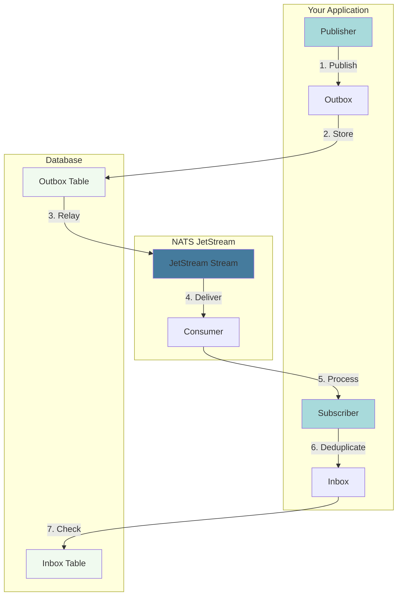

# NatsPubsub Documentation

Welcome to the comprehensive documentation for **NatsPubsub** - a production-ready, declarative pub/sub messaging library for NATS JetStream.

## What is NatsPubsub?

NatsPubsub is a modern, developer-friendly library that brings battle-tested reliability patterns to NATS JetStream. Available in both **JavaScript/TypeScript** and **Ruby**, it enables seamless event-driven architecture with guaranteed message delivery, exactly-once processing, and automatic failure handling.

### Key Features

- 🎯 **Declarative API** - Intuitive, class-based subscribers inspired by Rails and NestJS
- 🔒 **Reliability Patterns** - Built-in Inbox/Outbox patterns and Dead Letter Queue (DLQ)
- 🌐 **Cross-Language** - Full interoperability between Ruby and JavaScript services
- 🧪 **Testing Support** - Comprehensive testing utilities and matchers
- 📊 **Observability** - Built-in metrics, health checks, and monitoring UI
- ⚡ **High Performance** - Optimized for throughput with batching and connection pooling
- 🛡️ **Type Safety** - Full TypeScript support with built-in schema validation
- 🔧 **Auto-Topology** - Automatic JetStream stream and consumer management

## Quick Navigation

### Getting Started

Perfect for newcomers to NatsPubsub:

- [Introduction](./getting-started/introduction.md) - Understand core concepts and benefits
- [Installation](./getting-started/installation.md) - Set up NatsPubsub in your project
- [JavaScript Quick Start](./getting-started/quick-start-js.md) - Get running in 5 minutes (JS/TS)
- [Ruby Quick Start](./getting-started/quick-start-ruby.md) - Get running in 5 minutes (Ruby)
- [Core Concepts](./getting-started/concepts.md) - Learn the fundamentals

### Guides

Step-by-step guides for common tasks:

- [Publishing Messages](./guides/publishing.md) - Send messages to topics
- [Subscribing to Messages](./guides/subscribing.md) - Create and manage subscribers
- [Middleware System](./guides/middleware.md) - Add cross-cutting concerns
- [Testing Strategies](./guides/testing.md) - Test your pub/sub code
- [Deployment Guide](./guides/deployment.md) - Deploy to production
- [Performance Tuning](./guides/performance.md) - Optimize for throughput and latency

### Patterns

Implement reliability patterns:

- [Inbox/Outbox Pattern](./patterns/inbox-outbox.md) - Guaranteed delivery and exactly-once processing
- [Dead Letter Queue](./patterns/dlq.md) - Handle failed messages gracefully
- [Schema Validation](./patterns/schema-validation.md) - Validate messages with Zod
- [Event Sourcing](./patterns/event-sourcing.md) - Build event-sourced systems

### Integrations

Framework-specific integration guides:

- [Ruby on Rails](./integrations/rails.md) - Integrate with Rails applications
- [Express.js](./integrations/express.md) - Use with Express applications
- [NestJS](./integrations/nestjs.md) - Integrate with NestJS
- [Database Integration](./integrations/databases.md) - PostgreSQL, MySQL, SQLite support

### Reference

Complete API and configuration documentation:

- [JavaScript API Reference](./reference/javascript-api.md) - Complete TypeScript/JavaScript API
- [Ruby API Reference](./reference/ruby-api.md) - Complete Ruby API
- [Configuration Reference](./reference/configuration.md) - All configuration options
- [CLI Reference](./reference/cli.md) - Command-line tools

### Advanced

Deep dives into internals and advanced topics:

- [Architecture Overview](./advanced/architecture.md) - System design and components
- [Internals](./advanced/internals.md) - How NatsPubsub works under the hood
- [Custom Repositories](./advanced/custom-repositories.md) - Implement custom storage backends
- [Security Best Practices](./advanced/security.md) - Secure your messaging system

### Troubleshooting

Solutions to common problems:

- [Common Issues](./troubleshooting/common-issues.md) - Frequent problems and solutions
- [Debugging Guide](./troubleshooting/debugging.md) - Debug message flow and failures
- [FAQ](./troubleshooting/faq.md) - Frequently asked questions

## Language-Specific Resources

### JavaScript/TypeScript

- [JavaScript API Reference](./reference/javascript-api.md)
- [TypeScript Examples](https://github.com/attaradev/nats-pubsub/tree/main/packages/javascript/examples)
- [NPM Package](https://www.npmjs.com/package/nats-pubsub)

### Ruby

- [Ruby API Reference](./reference/ruby-api.md)
- [Ruby Examples](https://github.com/attaradev/nats-pubsub/tree/main/packages/ruby/examples)
- [Rails Quick Start](./getting-started/rails-quick-start.md)
- [RubyGems Package](https://rubygems.org/gems/nats_pubsub)

## Example Projects

Learn by example with complete working applications:

- [JavaScript/TypeScript Examples](https://github.com/attaradev/nats-pubsub/tree/main/packages/javascript/examples) - Simple JavaScript/TypeScript examples
- [Ruby Examples](https://github.com/attaradev/nats-pubsub/tree/main/packages/ruby/examples) - Ruby implementation examples

## Quick Start

### JavaScript/TypeScript

```typescript
import { Publisher, Subscriber } from "nats-pubsub";

// Publish a message
const publisher = new Publisher({
  servers: "nats://localhost:4222",
  env: "production",
  appName: "my-app",
});

await publisher.publish("order.created", {
  orderId: "12345",
  amount: 99.99,
});

// Subscribe to messages
class OrderSubscriber extends Subscriber {
  constructor() {
    super("order.created");
  }

  async handle(message, metadata) {
    console.log("Order created:", message);
  }
}

// Start subscriber
const subscriber = new OrderSubscriber();
await subscriber.connect({
  servers: "nats://localhost:4222",
  env: "production",
  appName: "my-app",
});
```

### Ruby

```ruby
require 'nats_pubsub'

# Configure NatsPubsub
NatsPubsub.configure do |config|
  config.servers = 'nats://localhost:4222'
  config.env = 'production'
  config.app_name = 'my-app'
end

# Publish a message
NatsPubsub.publish('order.created', {
  order_id: '12345',
  amount: 99.99
})

# Subscribe to messages
class OrderSubscriber < NatsPubsub::Subscriber
  subscribe_to 'order.created'

  def handle(message, context)
    puts "Order created: #{message}"
  end
end

# Start subscribers
NatsPubsub::Manager.start
```

## Architecture Overview



## Core Concepts

### Topics and Subjects

NatsPubsub uses hierarchical topics with automatic subject generation:

```
{env}.{appName}.{topic}
```

Example: `production.order-service.order.created`

### Reliability Patterns

- **Outbox Pattern**: Ensures messages are published even if NATS is temporarily unavailable
- **Inbox Pattern**: Prevents duplicate message processing with database-backed deduplication
- **Dead Letter Queue**: Automatically handles failed messages with configurable retry

### Middleware System

Add cross-cutting concerns with a composable middleware pipeline:

```typescript
// JavaScript
subscriber.use(loggingMiddleware);
subscriber.use(retryMiddleware);
subscriber.use(metricsMiddleware);
```

```ruby
# Ruby
class OrderSubscriber < NatsPubsub::Subscriber
  use LoggingMiddleware
  use RetryMiddleware
  use MetricsMiddleware
end
```

## Why NatsPubsub?

### vs. Raw NATS Client

| Feature               | Raw NATS   | NatsPubsub                |
| --------------------- | ---------- | ------------------------- |
| Declarative API       | ❌         | ✅                        |
| Inbox/Outbox Patterns | ❌ Manual  | ✅ Built-in               |
| Schema Validation     | ❌         | ✅                        |
| Testing Utilities     | ⚠️ Limited | ✅ Comprehensive          |
| Auto-Topology         | ❌         | ✅                        |
| Observability         | ⚠️ Basic   | ✅ Built-in               |
| Framework Integration | ❌         | ✅ Rails, Express, NestJS |

### vs. Kafka

- ✅ **Simpler Operations**: No ZooKeeper, easier deployment
- ✅ **Lower Latency**: Sub-millisecond message delivery
- ✅ **Built-in Request/Reply**: Native support for synchronous patterns
- ✅ **Smaller Footprint**: Single binary, minimal resource usage
- ⚠️ **Ecosystem**: Smaller ecosystem than Kafka

### vs. RabbitMQ

- ✅ **Performance**: 2-10x higher throughput
- ✅ **Simplicity**: Easier to configure and operate
- ✅ **Cloud Native**: Better Kubernetes integration
- ✅ **At-Least-Once**: Built into JetStream
- ⚠️ **Message Persistence**: Different durability model

## Community & Support

- **GitHub**: [anthropics/nats-pubsub](https://github.com/anthropics/nats-pubsub)
- **Issues**: [Report bugs or request features](https://github.com/anthropics/nats-pubsub/issues)
- **Discussions**: [Ask questions and share ideas](https://github.com/anthropics/nats-pubsub/discussions)
- **Contributing**: [Contribution Guidelines](https://github.com/attaradev/nats-pubsub/blob/develop/CONTRIBUTING.md)
- **Security**: [Security Policy](https://github.com/attaradev/nats-pubsub/blob/develop/SECURITY.md)

## Performance Benchmarks

NatsPubsub delivers production-grade performance:

| Operation          | Throughput    | Latency (p99) |
| ------------------ | ------------- | ------------- |
| Publishing (sync)  | 50K msgs/sec  | 2ms           |
| Publishing (batch) | 200K msgs/sec | 5ms           |
| Subscribing        | 100K msgs/sec | &lt;1ms       |
| Inbox Check        | 150K ops/sec  | &lt;1ms       |
| Outbox Relay       | 80K msgs/sec  | 10ms          |

See [Performance Guide](./guides/performance.md) for optimization tips.

## Production Ready

NatsPubsub is built for production with:

- ✅ **Battle-tested**: Used in high-throughput production systems
- ✅ **Comprehensive Testing**: 95%+ code coverage
- ✅ **Type Safety**: Full TypeScript support
- ✅ **Monitoring**: Built-in metrics and health checks
- ✅ **Documentation**: Extensive guides and API docs
- ✅ **Active Maintenance**: Regular updates and security patches

## Next Steps

1. **New to NatsPubsub?** Start with [Introduction](./getting-started/introduction.md)
2. **Ready to code?** Try the [Quick Start](./getting-started/quick-start-js.md) (5 minutes)
3. **Building for production?** Read the [Deployment Guide](./guides/deployment.md)
4. **Need help?** Check [Troubleshooting](./troubleshooting/common-issues.md)

---

**License**: MIT | **Version**: 1.0.0 | **Last Updated**: November 2025
