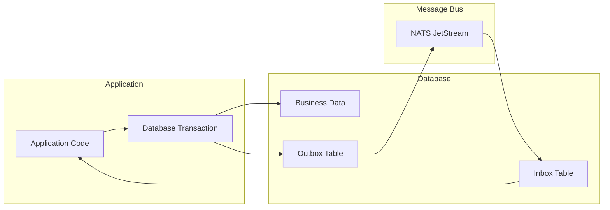

# Database Integration Guide

This comprehensive guide covers integrating NatsPubsub with various databases, focusing on Inbox/Outbox pattern implementation, migrations, connection pooling, and best practices for reliable event-driven architecture.

## Table of Contents

- [Overview](#overview)
- [Database Requirements](#database-requirements)
- [PostgreSQL Integration](#postgresql-integration)
  - [Setup](#postgresql-setup)
  - [Schema Design](#postgresql-schema-design)
  - [Migrations](#postgresql-migrations)
  - [Repository Implementation](#postgresql-repository-implementation)
  - [Connection Pooling](#postgresql-connection-pooling)
- [MySQL Integration](#mysql-integration)
  - [Setup](#mysql-setup)
  - [Schema Design](#mysql-schema-design)
  - [Migrations](#mysql-migrations)
  - [Repository Implementation](#mysql-repository-implementation)
- [SQLite Integration](#sqlite-integration)
  - [Setup](#sqlite-setup)
  - [Schema Design](#sqlite-schema-design)
  - [Limitations](#sqlite-limitations)
- [MongoDB Integration](#mongodb-integration)
  - [Setup](#mongodb-setup)
  - [Collection Design](#mongodb-collection-design)
  - [Repository Implementation](#mongodb-repository-implementation)
- [Repository Pattern](#repository-pattern)
  - [Interface Definition](#interface-definition)
  - [Custom Repository](#custom-repository)
  - [In-Memory Repository](#in-memory-repository)
- [Migrations for Inbox/Outbox](#migrations-for-inboxoutbox)
  - [Creating Migrations](#creating-migrations)
  - [Running Migrations](#running-migrations)
  - [Rollback Strategies](#rollback-strategies)
- [Connection Pooling](#connection-pooling)
  - [Configuration](#pooling-configuration)
  - [Monitoring](#pool-monitoring)
  - [Tuning](#pool-tuning)
- [Transaction Handling](#transaction-handling)
  - [ACID Compliance](#acid-compliance)
  - [Isolation Levels](#isolation-levels)
  - [Deadlock Prevention](#deadlock-prevention)
- [Performance Optimization](#performance-optimization)
  - [Indexing Strategy](#indexing-strategy)
  - [Query Optimization](#query-optimization)
  - [Cleanup Strategies](#cleanup-strategies)
- [Monitoring and Maintenance](#monitoring-and-maintenance)
  - [Health Checks](#health-checks)
  - [Metrics Collection](#metrics-collection)
  - [Backup Strategies](#backup-strategies)
- [Best Practices](#best-practices)
- [Troubleshooting](#troubleshooting)

---

## Overview

NatsPubsub's Inbox and Outbox patterns require database storage for guaranteed message delivery and exactly-once processing. This guide covers integration with popular databases.

### Pattern Overview



**Key Benefits:**

- **Atomicity**: Database changes and message publishing in one transaction
- **Reliability**: Messages never lost, even if NATS is down
- **Idempotency**: Duplicate messages automatically deduplicated
- **Audit Trail**: Complete history of events

---

## Database Requirements

### Minimum Requirements

For Inbox/Outbox patterns, your database must support:

1. **ACID Transactions**: Atomicity, Consistency, Isolation, Durability
2. **Unique Constraints**: For event_id deduplication
3. **Indexes**: For query performance
4. **Text/JSON Storage**: For event payloads

### Recommended Databases

| Database       | Support Level | Best For                 |
| -------------- | ------------- | ------------------------ |
| **PostgreSQL** | Full          | Production (recommended) |
| **MySQL**      | Full          | Production               |
| **SQLite**     | Limited       | Development/Testing      |
| **MongoDB**    | Experimental  | Document-based apps      |

---

## PostgreSQL Integration

PostgreSQL is the recommended database for production use with NatsPubsub.

### PostgreSQL Setup

```bash
# Install PostgreSQL
# macOS
brew install postgresql@15
brew services start postgresql@15

# Ubuntu/Debian
sudo apt-get install postgresql-15
sudo systemctl start postgresql

# Docker
docker run -d \
  --name postgres \
  -e POSTGRES_PASSWORD=password \
  -e POSTGRES_DB=myapp \
  -p 5432:5432 \
  postgres:15
```

### PostgreSQL Schema Design

```sql
-- Outbox table for reliable publishing
CREATE TABLE nats_pubsub_outbox (
  event_id VARCHAR(255) PRIMARY KEY,
  subject VARCHAR(500) NOT NULL,
  payload TEXT NOT NULL,
  headers TEXT,
  status VARCHAR(50) NOT NULL DEFAULT 'pending',
  enqueued_at TIMESTAMP NOT NULL DEFAULT CURRENT_TIMESTAMP,
  sent_at TIMESTAMP,
  error_message TEXT,
  retry_count INTEGER DEFAULT 0,
  created_at TIMESTAMP NOT NULL DEFAULT CURRENT_TIMESTAMP,
  updated_at TIMESTAMP NOT NULL DEFAULT CURRENT_TIMESTAMP
);

-- Indexes for performance
CREATE INDEX idx_outbox_status_enqueued ON nats_pubsub_outbox(status, enqueued_at)
  WHERE status = 'pending';
CREATE INDEX idx_outbox_sent_at ON nats_pubsub_outbox(sent_at)
  WHERE sent_at IS NOT NULL;
CREATE INDEX idx_outbox_status_retry ON nats_pubsub_outbox(status, retry_count)
  WHERE status = 'failed';

-- Inbox table for idempotent processing
CREATE TABLE nats_pubsub_inbox (
  event_id VARCHAR(255) PRIMARY KEY,
  subject VARCHAR(500) NOT NULL,
  payload TEXT NOT NULL,
  headers TEXT,
  stream VARCHAR(255),
  stream_seq BIGINT,
  status VARCHAR(50) NOT NULL DEFAULT 'processing',
  received_at TIMESTAMP NOT NULL DEFAULT CURRENT_TIMESTAMP,
  processed_at TIMESTAMP,
  deliveries INTEGER DEFAULT 1,
  error_message TEXT,
  created_at TIMESTAMP NOT NULL DEFAULT CURRENT_TIMESTAMP,
  updated_at TIMESTAMP NOT NULL DEFAULT CURRENT_TIMESTAMP
);

-- Indexes for performance
CREATE UNIQUE INDEX idx_inbox_stream_seq ON nats_pubsub_inbox(stream, stream_seq)
  WHERE stream IS NOT NULL;
CREATE INDEX idx_inbox_status_processed ON nats_pubsub_inbox(status, processed_at)
  WHERE status = 'processed';
CREATE INDEX idx_inbox_received_at ON nats_pubsub_inbox(received_at);
CREATE INDEX idx_inbox_status_failed ON nats_pubsub_inbox(status)
  WHERE status = 'failed';

-- Trigger to update updated_at timestamp
CREATE OR REPLACE FUNCTION update_updated_at_column()
RETURNS TRIGGER AS $$
BEGIN
  NEW.updated_at = CURRENT_TIMESTAMP;
  RETURN NEW;
END;
$$ LANGUAGE plpgsql;

CREATE TRIGGER update_outbox_updated_at
  BEFORE UPDATE ON nats_pubsub_outbox
  FOR EACH ROW
  EXECUTE FUNCTION update_updated_at_column();

CREATE TRIGGER update_inbox_updated_at
  BEFORE UPDATE ON nats_pubsub_inbox
  FOR EACH ROW
  EXECUTE FUNCTION update_updated_at_column();

-- Partitioning for large-scale deployments (optional)
-- Partition outbox by month
CREATE TABLE nats_pubsub_outbox_2025_01 PARTITION OF nats_pubsub_outbox
  FOR VALUES FROM ('2025-01-01') TO ('2025-02-01');

-- Add more partitions as needed
```

### PostgreSQL Migrations

#### Using Knex.js (Node.js)

```typescript
// migrations/20250117_create_inbox_outbox.ts
import { Knex } from "knex";

export async function up(knex: Knex): Promise<void> {
  // Create outbox table
  await knex.schema.createTable("nats_pubsub_outbox", (table) => {
    table.string("event_id", 255).primary();
    table.string("subject", 500).notNullable();
    table.text("payload").notNullable();
    table.text("headers");
    table.string("status", 50).notNullable().defaultTo("pending");
    table.timestamp("enqueued_at").notNullable().defaultTo(knex.fn.now());
    table.timestamp("sent_at");
    table.text("error_message");
    table.integer("retry_count").defaultTo(0);
    table.timestamps(true, true);

    table.index(["status", "enqueued_at"], "idx_outbox_status_enqueued");
    table.index("sent_at", "idx_outbox_sent_at");
  });

  // Create inbox table
  await knex.schema.createTable("nats_pubsub_inbox", (table) => {
    table.string("event_id", 255).primary();
    table.string("subject", 500).notNullable();
    table.text("payload").notNullable();
    table.text("headers");
    table.string("stream", 255);
    table.bigInteger("stream_seq");
    table.string("status", 50).notNullable().defaultTo("processing");
    table.timestamp("received_at").notNullable().defaultTo(knex.fn.now());
    table.timestamp("processed_at");
    table.integer("deliveries").defaultTo(1);
    table.text("error_message");
    table.timestamps(true, true);

    table.unique(["stream", "stream_seq"], "idx_inbox_stream_seq");
    table.index(["status", "processed_at"], "idx_inbox_status_processed");
    table.index("received_at", "idx_inbox_received_at");
  });
}

export async function down(knex: Knex): Promise<void> {
  await knex.schema.dropTableIfExists("nats_pubsub_inbox");
  await knex.schema.dropTableIfExists("nats_pubsub_outbox");
}
```

#### Using ActiveRecord (Ruby/Rails)

```ruby
# db/migrate/20250117000000_create_nats_pubsub_outbox.rb
class CreateNatsPubsubOutbox < ActiveRecord::Migration[7.0]
  def change
    create_table :nats_pubsub_outbox, id: false, primary_key: :event_id do |t|
      t.string :event_id, null: false, limit: 255
      t.string :subject, null: false, limit: 500
      t.text :payload, null: false
      t.text :headers
      t.string :status, null: false, default: 'pending', limit: 50
      t.timestamp :enqueued_at, null: false, default: -> { 'CURRENT_TIMESTAMP' }
      t.timestamp :sent_at
      t.text :error_message
      t.integer :retry_count, default: 0
      t.timestamps
    end

    add_index :nats_pubsub_outbox, [:status, :enqueued_at],
              name: 'idx_outbox_status_enqueued',
              where: "status = 'pending'"
    add_index :nats_pubsub_outbox, :sent_at,
              name: 'idx_outbox_sent_at',
              where: 'sent_at IS NOT NULL'
  end
end

# db/migrate/20250117000001_create_nats_pubsub_inbox.rb
class CreateNatsPubsubInbox < ActiveRecord::Migration[7.0]
  def change
    create_table :nats_pubsub_inbox, id: false, primary_key: :event_id do |t|
      t.string :event_id, null: false, limit: 255
      t.string :subject, null: false, limit: 500
      t.text :payload, null: false
      t.text :headers
      t.string :stream, limit: 255
      t.bigint :stream_seq
      t.string :status, null: false, default: 'processing', limit: 50
      t.timestamp :received_at, null: false, default: -> { 'CURRENT_TIMESTAMP' }
      t.timestamp :processed_at
      t.integer :deliveries, default: 1
      t.text :error_message
      t.timestamps
    end

    add_index :nats_pubsub_inbox, [:stream, :stream_seq],
              unique: true,
              name: 'idx_inbox_stream_seq',
              where: 'stream IS NOT NULL'
    add_index :nats_pubsub_inbox, [:status, :processed_at],
              name: 'idx_inbox_status_processed'
  end
end
```

### PostgreSQL Repository Implementation

```typescript
// src/repositories/postgres-outbox.repository.ts
import { Pool, PoolClient } from "pg";
import { OutboxRepository, OutboxEvent } from "nats-pubsub";

export class PostgresOutboxRepository implements OutboxRepository {
  constructor(private readonly pool: Pool) {}

  async findOrCreate(params: Partial<OutboxEvent>): Promise<OutboxEvent> {
    const query = `
      INSERT INTO nats_pubsub_outbox (
        event_id, subject, payload, headers, status, enqueued_at
      ) VALUES ($1, $2, $3, $4, $5, $6)
      ON CONFLICT (event_id) DO NOTHING
      RETURNING *
    `;

    const values = [
      params.eventId,
      params.subject,
      params.payload,
      params.headers,
      "pending",
      new Date(),
    ];

    const result = await this.pool.query(query, values);

    if (result.rows.length === 0) {
      // Event already exists, fetch it
      const fetchQuery = "SELECT * FROM nats_pubsub_outbox WHERE event_id = $1";
      const fetchResult = await this.pool.query(fetchQuery, [params.eventId]);
      return fetchResult.rows[0];
    }

    return result.rows[0];
  }

  async markAsSent(eventId: string): Promise<void> {
    const query = `
      UPDATE nats_pubsub_outbox
      SET status = 'sent', sent_at = $1
      WHERE event_id = $2
    `;

    await this.pool.query(query, [new Date(), eventId]);
  }

  async markAsPublishing(eventId: string): Promise<void> {
    const query = `
      UPDATE nats_pubsub_outbox
      SET status = 'publishing'
      WHERE event_id = $1
    `;

    await this.pool.query(query, [eventId]);
  }

  async markAsFailed(eventId: string, error: string): Promise<void> {
    const query = `
      UPDATE nats_pubsub_outbox
      SET status = 'failed',
          error_message = $1,
          retry_count = retry_count + 1
      WHERE event_id = $2
    `;

    await this.pool.query(query, [error, eventId]);
  }

  async findPending(options?: { limit?: number }): Promise<OutboxEvent[]> {
    const query = `
      SELECT * FROM nats_pubsub_outbox
      WHERE status = 'pending'
      ORDER BY enqueued_at ASC
      LIMIT $1
    `;

    const result = await this.pool.query(query, [options?.limit || 100]);
    return result.rows;
  }

  async cleanup(olderThanDays: number): Promise<number> {
    const cutoffDate = new Date();
    cutoffDate.setDate(cutoffDate.getDate() - olderThanDays);

    const query = `
      DELETE FROM nats_pubsub_outbox
      WHERE status = 'sent' AND sent_at < $1
    `;

    const result = await this.pool.query(query, [cutoffDate]);
    return result.rowCount || 0;
  }

  async resetStale(staleMinutes: number): Promise<number> {
    const cutoffTime = new Date();
    cutoffTime.setMinutes(cutoffTime.getMinutes() - staleMinutes);

    const query = `
      UPDATE nats_pubsub_outbox
      SET status = 'pending'
      WHERE status = 'publishing' AND enqueued_at < $1
    `;

    const result = await this.pool.query(query, [cutoffTime]);
    return result.rowCount || 0;
  }

  async getCountByStatus(): Promise<Record<string, number>> {
    const query = `
      SELECT status, COUNT(*) as count
      FROM nats_pubsub_outbox
      GROUP BY status
    `;

    const result = await this.pool.query(query);

    return result.rows.reduce(
      (acc, row) => {
        acc[row.status] = parseInt(row.count);
        return acc;
      },
      {} as Record<string, number>,
    );
  }
}
```

### PostgreSQL Connection Pooling

```typescript
// src/config/database.ts
import { Pool } from "pg";

export function createDatabasePool() {
  const pool = new Pool({
    connectionString: process.env.DATABASE_URL,

    // Connection pool settings
    max: 20, // Maximum connections
    min: 5, // Minimum connections
    idleTimeoutMillis: 30000, // Close idle connections after 30s
    connectionTimeoutMillis: 10000, // Timeout for acquiring connection

    // Statement timeout
    statement_timeout: 30000, // 30 seconds

    // Keep-alive settings
    keepAlive: true,
    keepAliveInitialDelayMillis: 10000,
  });

  // Error handling
  pool.on("error", (err, client) => {
    console.error("Unexpected error on idle client", err);
  });

  pool.on("connect", () => {
    console.log("New database connection established");
  });

  return pool;
}
```

---

## MySQL Integration

MySQL is fully supported with some minor schema differences.

### MySQL Setup

```bash
# Install MySQL
# macOS
brew install mysql@8.0
brew services start mysql@8.0

# Ubuntu/Debian
sudo apt-get install mysql-server
sudo systemctl start mysql

# Docker
docker run -d \
  --name mysql \
  -e MYSQL_ROOT_PASSWORD=password \
  -e MYSQL_DATABASE=myapp \
  -p 3306:3306 \
  mysql:8.0
```

### MySQL Schema Design

```sql
-- Outbox table
CREATE TABLE nats_pubsub_outbox (
  event_id VARCHAR(255) PRIMARY KEY,
  subject VARCHAR(500) NOT NULL,
  payload LONGTEXT NOT NULL,
  headers TEXT,
  status VARCHAR(50) NOT NULL DEFAULT 'pending',
  enqueued_at TIMESTAMP NOT NULL DEFAULT CURRENT_TIMESTAMP,
  sent_at TIMESTAMP NULL,
  error_message TEXT,
  retry_count INT DEFAULT 0,
  created_at TIMESTAMP NOT NULL DEFAULT CURRENT_TIMESTAMP,
  updated_at TIMESTAMP NOT NULL DEFAULT CURRENT_TIMESTAMP ON UPDATE CURRENT_TIMESTAMP,
  INDEX idx_outbox_status_enqueued (status, enqueued_at),
  INDEX idx_outbox_sent_at (sent_at)
) ENGINE=InnoDB DEFAULT CHARSET=utf8mb4 COLLATE=utf8mb4_unicode_ci;

-- Inbox table
CREATE TABLE nats_pubsub_inbox (
  event_id VARCHAR(255) PRIMARY KEY,
  subject VARCHAR(500) NOT NULL,
  payload LONGTEXT NOT NULL,
  headers TEXT,
  stream VARCHAR(255),
  stream_seq BIGINT,
  status VARCHAR(50) NOT NULL DEFAULT 'processing',
  received_at TIMESTAMP NOT NULL DEFAULT CURRENT_TIMESTAMP,
  processed_at TIMESTAMP NULL,
  deliveries INT DEFAULT 1,
  error_message TEXT,
  created_at TIMESTAMP NOT NULL DEFAULT CURRENT_TIMESTAMP,
  updated_at TIMESTAMP NOT NULL DEFAULT CURRENT_TIMESTAMP ON UPDATE CURRENT_TIMESTAMP,
  UNIQUE KEY idx_inbox_stream_seq (stream, stream_seq),
  INDEX idx_inbox_status_processed (status, processed_at),
  INDEX idx_inbox_received_at (received_at)
) ENGINE=InnoDB DEFAULT CHARSET=utf8mb4 COLLATE=utf8mb4_unicode_ci;
```

### MySQL Migrations

```typescript
// migrations/20250117_create_inbox_outbox_mysql.ts
import { Knex } from "knex";

export async function up(knex: Knex): Promise<void> {
  await knex.raw(`
    CREATE TABLE nats_pubsub_outbox (
      event_id VARCHAR(255) PRIMARY KEY,
      subject VARCHAR(500) NOT NULL,
      payload LONGTEXT NOT NULL,
      headers TEXT,
      status VARCHAR(50) NOT NULL DEFAULT 'pending',
      enqueued_at TIMESTAMP NOT NULL DEFAULT CURRENT_TIMESTAMP,
      sent_at TIMESTAMP NULL,
      error_message TEXT,
      retry_count INT DEFAULT 0,
      created_at TIMESTAMP NOT NULL DEFAULT CURRENT_TIMESTAMP,
      updated_at TIMESTAMP NOT NULL DEFAULT CURRENT_TIMESTAMP ON UPDATE CURRENT_TIMESTAMP,
      INDEX idx_outbox_status_enqueued (status, enqueued_at),
      INDEX idx_outbox_sent_at (sent_at)
    ) ENGINE=InnoDB DEFAULT CHARSET=utf8mb4 COLLATE=utf8mb4_unicode_ci
  `);

  await knex.raw(`
    CREATE TABLE nats_pubsub_inbox (
      event_id VARCHAR(255) PRIMARY KEY,
      subject VARCHAR(500) NOT NULL,
      payload LONGTEXT NOT NULL,
      headers TEXT,
      stream VARCHAR(255),
      stream_seq BIGINT,
      status VARCHAR(50) NOT NULL DEFAULT 'processing',
      received_at TIMESTAMP NOT NULL DEFAULT CURRENT_TIMESTAMP,
      processed_at TIMESTAMP NULL,
      deliveries INT DEFAULT 1,
      error_message TEXT,
      created_at TIMESTAMP NOT NULL DEFAULT CURRENT_TIMESTAMP,
      updated_at TIMESTAMP NOT NULL DEFAULT CURRENT_TIMESTAMP ON UPDATE CURRENT_TIMESTAMP,
      UNIQUE KEY idx_inbox_stream_seq (stream, stream_seq),
      INDEX idx_inbox_status_processed (status, processed_at),
      INDEX idx_inbox_received_at (received_at)
    ) ENGINE=InnoDB DEFAULT CHARSET=utf8mb4 COLLATE=utf8mb4_unicode_ci
  `);
}

export async function down(knex: Knex): Promise<void> {
  await knex.schema.dropTableIfExists("nats_pubsub_inbox");
  await knex.schema.dropTableIfExists("nats_pubsub_outbox");
}
```

### MySQL Repository Implementation

Similar to PostgreSQL repository, with minor query adjustments:

```typescript
// src/repositories/mysql-outbox.repository.ts
import { Pool } from "mysql2/promise";
import { OutboxRepository, OutboxEvent } from "nats-pubsub";

export class MySQLOutboxRepository implements OutboxRepository {
  constructor(private readonly pool: Pool) {}

  async findOrCreate(params: Partial<OutboxEvent>): Promise<OutboxEvent> {
    const query = `
      INSERT IGNORE INTO nats_pubsub_outbox (
        event_id, subject, payload, headers, status, enqueued_at
      ) VALUES (?, ?, ?, ?, ?, ?)
    `;

    const values = [
      params.eventId,
      params.subject,
      params.payload,
      params.headers,
      "pending",
      new Date(),
    ];

    await this.pool.query(query, values);

    // Fetch the event
    const [rows] = await this.pool.query(
      "SELECT * FROM nats_pubsub_outbox WHERE event_id = ?",
      [params.eventId],
    );

    return (rows as any[])[0];
  }

  // Other methods similar to PostgreSQL implementation...
}
```

---

## SQLite Integration

SQLite is suitable for development and testing, with some limitations.

### SQLite Setup

```bash
# Install SQLite
# macOS
brew install sqlite

# Ubuntu/Debian
sudo apt-get install sqlite3
```

### SQLite Schema Design

```sql
-- Outbox table
CREATE TABLE nats_pubsub_outbox (
  event_id TEXT PRIMARY KEY,
  subject TEXT NOT NULL,
  payload TEXT NOT NULL,
  headers TEXT,
  status TEXT NOT NULL DEFAULT 'pending',
  enqueued_at TEXT NOT NULL DEFAULT (datetime('now')),
  sent_at TEXT,
  error_message TEXT,
  retry_count INTEGER DEFAULT 0,
  created_at TEXT NOT NULL DEFAULT (datetime('now')),
  updated_at TEXT NOT NULL DEFAULT (datetime('now'))
);

CREATE INDEX idx_outbox_status_enqueued ON nats_pubsub_outbox(status, enqueued_at);
CREATE INDEX idx_outbox_sent_at ON nats_pubsub_outbox(sent_at);

-- Inbox table
CREATE TABLE nats_pubsub_inbox (
  event_id TEXT PRIMARY KEY,
  subject TEXT NOT NULL,
  payload TEXT NOT NULL,
  headers TEXT,
  stream TEXT,
  stream_seq INTEGER,
  status TEXT NOT NULL DEFAULT 'processing',
  received_at TEXT NOT NULL DEFAULT (datetime('now')),
  processed_at TEXT,
  deliveries INTEGER DEFAULT 1,
  error_message TEXT,
  created_at TEXT NOT NULL DEFAULT (datetime('now')),
  updated_at TEXT NOT NULL DEFAULT (datetime('now'))
);

CREATE UNIQUE INDEX idx_inbox_stream_seq ON nats_pubsub_inbox(stream, stream_seq)
  WHERE stream IS NOT NULL;
CREATE INDEX idx_inbox_status_processed ON nats_pubsub_inbox(status, processed_at);
CREATE INDEX idx_inbox_received_at ON nats_pubsub_inbox(received_at);
```

### SQLite Limitations

1. **No True Concurrent Writes**: SQLite locks the entire database for writes
2. **No Native JSON Type**: Must use TEXT and parse manually
3. **Limited Date/Time Functions**: Use TEXT for timestamps
4. **Not Recommended for Production**: Use PostgreSQL or MySQL instead

**Best Use Cases for SQLite:**

- Local development
- Testing
- Single-user applications
- Embedded applications

---

## MongoDB Integration

MongoDB support is experimental and requires document-based approach.

### MongoDB Setup

```bash
# Docker
docker run -d \
  --name mongodb \
  -e MONGO_INITDB_ROOT_USERNAME=root \
  -e MONGO_INITDB_ROOT_PASSWORD=password \
  -e MONGO_INITDB_DATABASE=myapp \
  -p 27017:27017 \
  mongo:7
```

### MongoDB Collection Design

```typescript
// MongoDB schema using Mongoose
import { Schema, model } from "mongoose";

const OutboxEventSchema = new Schema(
  {
    event_id: { type: String, required: true, unique: true },
    subject: { type: String, required: true },
    payload: { type: Schema.Types.Mixed, required: true },
    headers: { type: Schema.Types.Mixed },
    status: { type: String, required: true, default: "pending", index: true },
    enqueued_at: { type: Date, required: true, default: Date.now, index: true },
    sent_at: { type: Date },
    error_message: { type: String },
    retry_count: { type: Number, default: 0 },
  },
  {
    timestamps: true,
    collection: "nats_pubsub_outbox",
  },
);

// Compound index for efficient queries
OutboxEventSchema.index({ status: 1, enqueued_at: 1 });

export const OutboxEvent = model("OutboxEvent", OutboxEventSchema);
```

### MongoDB Repository Implementation

```typescript
// src/repositories/mongodb-outbox.repository.ts
import { Model } from "mongoose";
import { OutboxRepository, OutboxEvent } from "nats-pubsub";

export class MongoDBOutboxRepository implements OutboxRepository {
  constructor(private readonly model: Model<any>) {}

  async findOrCreate(params: Partial<OutboxEvent>): Promise<OutboxEvent> {
    const event = await this.model.findOneAndUpdate(
      { event_id: params.eventId },
      {
        $setOnInsert: {
          event_id: params.eventId,
          subject: params.subject,
          payload: params.payload,
          headers: params.headers,
          status: "pending",
          enqueued_at: new Date(),
        },
      },
      { upsert: true, new: true, setDefaultsOnInsert: true },
    );

    return event.toObject();
  }

  async markAsSent(eventId: string): Promise<void> {
    await this.model.updateOne(
      { event_id: eventId },
      { status: "sent", sent_at: new Date() },
    );
  }

  async findPending(options?: { limit?: number }): Promise<OutboxEvent[]> {
    const events = await this.model
      .find({ status: "pending" })
      .sort({ enqueued_at: 1 })
      .limit(options?.limit || 100);

    return events.map((e) => e.toObject());
  }

  // Other methods...
}
```

---

## Repository Pattern

### Interface Definition

```typescript
// src/repositories/interfaces.ts
export interface OutboxEvent {
  eventId: string;
  subject: string;
  payload: string;
  headers?: string;
  status: "pending" | "publishing" | "sent" | "failed";
  enqueuedAt: Date;
  sentAt?: Date;
  errorMessage?: string;
  retryCount: number;
}

export interface InboxEvent {
  eventId: string;
  subject: string;
  payload: string;
  headers?: string;
  stream?: string;
  streamSeq?: number;
  status: "processing" | "processed" | "failed";
  receivedAt: Date;
  processedAt?: Date;
  deliveries: number;
  errorMessage?: string;
}

export interface OutboxRepository {
  findOrCreate(params: Partial<OutboxEvent>): Promise<OutboxEvent>;
  markAsSent(eventId: string): Promise<void>;
  markAsPublishing(eventId: string): Promise<void>;
  markAsFailed(eventId: string, error: string): Promise<void>;
  findPending(options?: { limit?: number }): Promise<OutboxEvent[]>;
  cleanup(olderThanDays: number): Promise<number>;
  resetStale(staleMinutes: number): Promise<number>;
  getCountByStatus(): Promise<Record<string, number>>;
}

export interface InboxRepository {
  findOrCreate(params: Partial<InboxEvent>): Promise<InboxEvent>;
  markAsProcessed(eventId: string): Promise<void>;
  markAsFailed(eventId: string, error: string): Promise<void>;
  isProcessed(eventId: string): Promise<boolean>;
  cleanup(olderThanDays: number): Promise<number>;
  resetStale(staleMinutes: number): Promise<number>;
  getCountByStatus(): Promise<Record<string, number>>;
  getFailedEvents(limit?: number): Promise<InboxEvent[]>;
}
```

### Custom Repository

```typescript
// src/repositories/custom-outbox.repository.ts
import { OutboxRepository, OutboxEvent } from "./interfaces";

export class CustomOutboxRepository implements OutboxRepository {
  constructor(private readonly db: any) {}

  async findOrCreate(params: Partial<OutboxEvent>): Promise<OutboxEvent> {
    // Your custom implementation
    // Can use any database client or ORM
  }

  // Implement all interface methods...
}
```

### In-Memory Repository

```typescript
// src/repositories/memory-outbox.repository.ts
import { OutboxRepository, OutboxEvent } from "./interfaces";

export class MemoryOutboxRepository implements OutboxRepository {
  private events: Map<string, OutboxEvent> = new Map();

  async findOrCreate(params: Partial<OutboxEvent>): Promise<OutboxEvent> {
    let event = this.events.get(params.eventId!);

    if (!event) {
      event = {
        eventId: params.eventId!,
        subject: params.subject!,
        payload: params.payload!,
        headers: params.headers,
        status: "pending",
        enqueuedAt: new Date(),
        retryCount: 0,
      };
      this.events.set(event.eventId, event);
    }

    return event;
  }

  async markAsSent(eventId: string): Promise<void> {
    const event = this.events.get(eventId);
    if (event) {
      event.status = "sent";
      event.sentAt = new Date();
    }
  }

  async findPending(options?: { limit?: number }): Promise<OutboxEvent[]> {
    const pending = Array.from(this.events.values())
      .filter((e) => e.status === "pending")
      .sort((a, b) => a.enqueuedAt.getTime() - b.enqueuedAt.getTime())
      .slice(0, options?.limit || 100);

    return pending;
  }

  async cleanup(olderThanDays: number): Promise<number> {
    const cutoff = new Date();
    cutoff.setDate(cutoff.getDate() - olderThanDays);

    let deleted = 0;
    for (const [id, event] of this.events.entries()) {
      if (event.status === "sent" && event.sentAt && event.sentAt < cutoff) {
        this.events.delete(id);
        deleted++;
      }
    }

    return deleted;
  }

  // Implement other methods...
}
```

---

## Migrations for Inbox/Outbox

### Creating Migrations

#### Knex.js

```bash
# Create migration
npx knex migrate:make create_inbox_outbox

# Run migrations
npx knex migrate:latest

# Rollback
npx knex migrate:rollback
```

#### TypeORM

```bash
# Generate migration
npx typeorm migration:generate -n CreateInboxOutbox

# Run migrations
npx typeorm migration:run

# Revert
npx typeorm migration:revert
```

#### Rails

```bash
# Generate migration
rails generate migration CreateNatsPubsubInboxOutbox

# Run migrations
rails db:migrate

# Rollback
rails db:rollback
```

### Running Migrations

```typescript
// Example: Running migrations programmatically
import { Pool } from "pg";
import { readFileSync } from "fs";

async function runMigrations(pool: Pool) {
  const schema = readFileSync("./migrations/001_inbox_outbox.sql", "utf-8");

  await pool.query(schema);

  console.log("Migrations completed successfully");
}
```

### Rollback Strategies

```typescript
// Example: Rollback with backup
async function rollbackWithBackup(pool: Pool) {
  // 1. Backup data
  await pool.query(`
    CREATE TABLE nats_pubsub_outbox_backup AS
    SELECT * FROM nats_pubsub_outbox
  `);

  // 2. Drop tables
  await pool.query("DROP TABLE nats_pubsub_outbox");
  await pool.query("DROP TABLE nats_pubsub_inbox");

  console.log("Rollback completed. Data backed up.");
}
```

---

## Connection Pooling

### Pooling Configuration

```typescript
// Optimal pool configuration
import { Pool } from "pg";

const pool = new Pool({
  // Connection settings
  host: process.env.DB_HOST,
  port: parseInt(process.env.DB_PORT || "5432"),
  database: process.env.DB_NAME,
  user: process.env.DB_USER,
  password: process.env.DB_PASSWORD,

  // Pool settings
  max: 20, // Maximum pool size
  min: 5, // Minimum pool size
  idleTimeoutMillis: 30000, // 30 seconds
  connectionTimeoutMillis: 10000, // 10 seconds

  // Application name for monitoring
  application_name: "nats-pubsub",
});
```

### Pool Monitoring

```typescript
// Monitor pool health
setInterval(() => {
  console.log("Pool stats:", {
    total: pool.totalCount,
    idle: pool.idleCount,
    waiting: pool.waitingCount,
  });

  // Alert if pool is exhausted
  if (pool.waitingCount > 5) {
    console.warn("Connection pool under pressure!");
  }
}, 60000); // Every minute
```

### Pool Tuning

**Formula for pool size:**

```
pool_size = ((core_count * 2) + effective_spindle_count)
```

**Example:**

- 4 CPU cores
- 1 SSD (effective spindles ≈ 1)
- Recommended pool size: (4 \* 2) + 1 = 9

**Rules of Thumb:**

- Start with 10-20 connections
- Monitor and adjust based on load
- Never exceed database max_connections
- Leave room for other applications

---

## Transaction Handling

### ACID Compliance

```typescript
// Ensure ACID transactions
async function createOrderWithEvent(orderData: any) {
  const client = await pool.connect();

  try {
    await client.query("BEGIN");

    // Insert order
    const orderResult = await client.query(
      "INSERT INTO orders (user_id, total) VALUES ($1, $2) RETURNING *",
      [orderData.userId, orderData.total],
    );

    const order = orderResult.rows[0];

    // Insert outbox event (same transaction!)
    await client.query(
      `INSERT INTO nats_pubsub_outbox
       (event_id, subject, payload, status)
       VALUES ($1, $2, $3, $4)`,
      [
        `order-${order.id}-created`,
        "order.created",
        JSON.stringify(order),
        "pending",
      ],
    );

    await client.query("COMMIT");

    return order;
  } catch (error) {
    await client.query("ROLLBACK");
    throw error;
  } finally {
    client.release();
  }
}
```

### Isolation Levels

```sql
-- Read Committed (default, recommended)
SET TRANSACTION ISOLATION LEVEL READ COMMITTED;

-- Repeatable Read (for complex queries)
SET TRANSACTION ISOLATION LEVEL REPEATABLE READ;

-- Serializable (strictest, but slower)
SET TRANSACTION ISOLATION LEVEL SERIALIZABLE;
```

### Deadlock Prevention

```typescript
// Always lock in same order
async function updateMultipleTables() {
  await client.query("BEGIN");

  // Lock tables in alphabetical order to prevent deadlocks
  await client.query(
    "LOCK TABLE nats_pubsub_outbox IN SHARE ROW EXCLUSIVE MODE",
  );
  await client.query("LOCK TABLE orders IN SHARE ROW EXCLUSIVE MODE");

  // Perform updates...

  await client.query("COMMIT");
}
```

---

## Performance Optimization

### Indexing Strategy

```sql
-- Essential indexes
CREATE INDEX idx_outbox_status_enqueued ON nats_pubsub_outbox(status, enqueued_at)
  WHERE status = 'pending'; -- Partial index for faster queries

CREATE INDEX idx_outbox_sent_cleanup ON nats_pubsub_outbox(sent_at)
  WHERE status = 'sent'; -- For cleanup queries

CREATE INDEX idx_inbox_event_lookup ON nats_pubsub_inbox(event_id)
  INCLUDE (status); -- Covering index

-- Analyze query performance
EXPLAIN ANALYZE
SELECT * FROM nats_pubsub_outbox
WHERE status = 'pending'
ORDER BY enqueued_at
LIMIT 100;
```

### Query Optimization

```sql
-- Optimize cleanup queries with partitioning
CREATE TABLE nats_pubsub_outbox_2025_01 PARTITION OF nats_pubsub_outbox
  FOR VALUES FROM ('2025-01-01') TO ('2025-02-01');

-- Use EXPLAIN to verify index usage
EXPLAIN (ANALYZE, BUFFERS)
SELECT * FROM nats_pubsub_outbox WHERE status = 'pending';
```

### Cleanup Strategies

```typescript
// Efficient cleanup with batching
async function cleanupOldEvents() {
  const batchSize = 1000;
  let deleted = 0;

  while (true) {
    const result = await pool.query(
      `
      DELETE FROM nats_pubsub_outbox
      WHERE event_id IN (
        SELECT event_id FROM nats_pubsub_outbox
        WHERE status = 'sent' AND sent_at < NOW() - INTERVAL '7 days'
        LIMIT $1
      )
    `,
      [batchSize],
    );

    deleted += result.rowCount || 0;

    if ((result.rowCount || 0) < batchSize) {
      break;
    }

    // Small delay to avoid overwhelming the database
    await new Promise((resolve) => setTimeout(resolve, 100));
  }

  console.log(`Cleaned up ${deleted} old events`);
}
```

---

## Monitoring and Maintenance

### Health Checks

```typescript
// Database health check
async function checkDatabaseHealth(): Promise<{
  healthy: boolean;
  latency: number;
  poolStats: any;
}> {
  const start = Date.now();

  try {
    await pool.query("SELECT 1");
    const latency = Date.now() - start;

    return {
      healthy: latency < 1000, // Less than 1 second
      latency,
      poolStats: {
        total: pool.totalCount,
        idle: pool.idleCount,
        waiting: pool.waitingCount,
      },
    };
  } catch (error) {
    return {
      healthy: false,
      latency: -1,
      poolStats: null,
    };
  }
}
```

### Metrics Collection

```typescript
// Collect metrics
async function collectMetrics() {
  const outboxStats = await pool.query(`
    SELECT status, COUNT(*) as count
    FROM nats_pubsub_outbox
    GROUP BY status
  `);

  const inboxStats = await pool.query(`
    SELECT status, COUNT(*) as count
    FROM nats_pubsub_inbox
    GROUP BY status
  `);

  return {
    outbox: outboxStats.rows,
    inbox: inboxStats.rows,
    timestamp: new Date(),
  };
}
```

### Backup Strategies

```bash
# PostgreSQL backup
pg_dump -h localhost -U user -d myapp > backup.sql

# Automated backup with cron
0 2 * * * pg_dump -h localhost -U user -d myapp | gzip > /backups/myapp_$(date +\%Y\%m\%d).sql.gz

# Point-in-time recovery setup
# Enable WAL archiving in postgresql.conf
# wal_level = replica
# archive_mode = on
# archive_command = 'cp %p /archive/%f'
```

---

## Best Practices

1. **Use PostgreSQL for Production**: Best support and performance
2. **Enable Connection Pooling**: Reuse connections efficiently
3. **Implement Cleanup Jobs**: Prevent table bloat
4. **Monitor Pool Health**: Alert on exhaustion
5. **Use Transactions**: Ensure atomicity
6. **Add Appropriate Indexes**: Optimize query performance
7. **Partition Large Tables**: For high-volume systems
8. **Regular Backups**: Automated daily backups
9. **Test Migrations**: Always test on staging first
10. **Monitor Query Performance**: Use EXPLAIN ANALYZE

---

## Troubleshooting

### Common Issues

**Issue**: Slow queries

- **Solution**: Add indexes, analyze query plans

**Issue**: Connection pool exhausted

- **Solution**: Increase pool size, optimize queries

**Issue**: Table bloat

- **Solution**: Run VACUUM, implement cleanup jobs

**Issue**: Deadlocks

- **Solution**: Lock tables in consistent order

**Issue**: Migration failures

- **Solution**: Test on staging, use transactions

---

## Navigation

- **Previous**: [NestJS Integration](./nestjs.md)
- **Next**: [Rails Integration](./rails.md)
- **Related**:
  - [Inbox/Outbox Pattern](../patterns/inbox-outbox.md)
  - [Performance Guide](../guides/performance.md)
  - [Deployment Guide](../guides/deployment.md)
