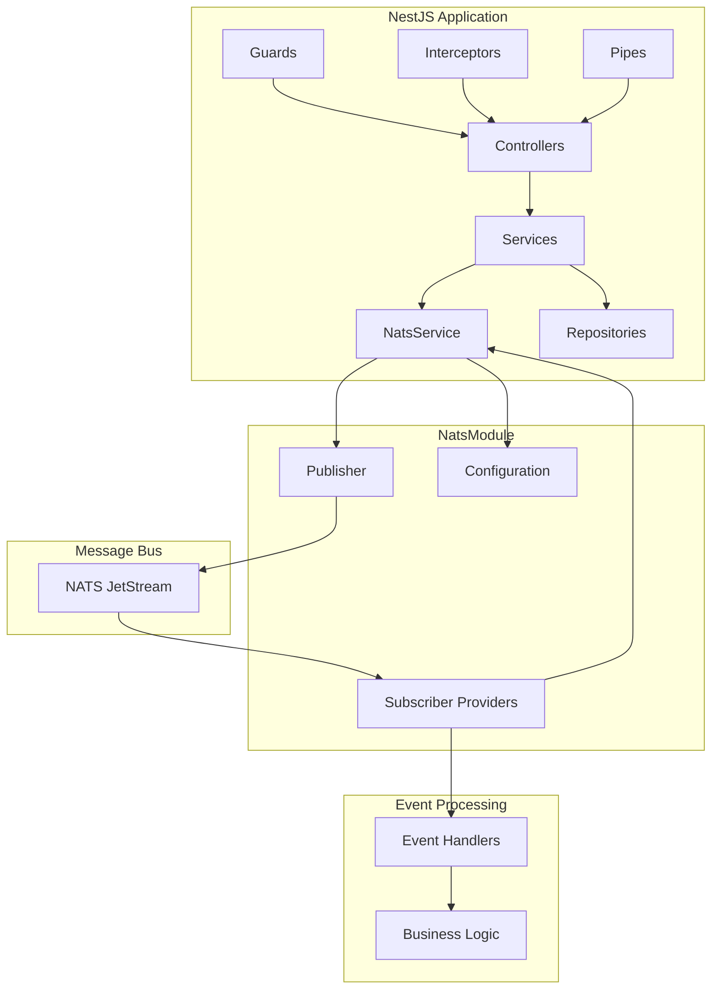

# NestJS Integration Guide

This comprehensive guide covers integrating NatsPubsub into your NestJS application using dependency injection, modules, and decorators for a fully type-safe, enterprise-ready event-driven architecture.

## Table of Contents

- [Overview](#overview)
- [Prerequisites](#prerequisites)
- [Installation](#installation)
- [Module Setup](#module-setup)
  - [Creating NatsModule](#creating-natsmodule)
  - [Global Configuration](#global-configuration)
  - [Feature Modules](#feature-modules)
- [Dependency Injection](#dependency-injection)
  - [NatsService](#natsservice)
  - [Using in Controllers](#using-in-controllers)
  - [Using in Services](#using-in-services)
- [Publishers as Services](#publishers-as-services)
  - [Event Publisher Service](#event-publisher-service)
  - [Typed Publishers](#typed-publishers)
  - [Transactional Publishing](#transactional-publishing)
- [Subscribers as Providers](#subscribers-as-providers)
  - [Basic Subscriber Provider](#basic-subscriber-provider)
  - [Subscriber with Dependencies](#subscriber-with-dependencies)
  - [Auto-Loading Subscribers](#auto-loading-subscribers)
- [Decorators Pattern](#decorators-pattern)
  - [Custom Publish Decorator](#custom-publish-decorator)
  - [Event Handler Decorator](#event-handler-decorator)
  - [Interceptor for Publishing](#interceptor-for-publishing)
- [Guards and Interceptors](#guards-and-interceptors)
  - [Authentication Guard](#authentication-guard)
  - [Logging Interceptor](#logging-interceptor)
  - [Transform Interceptor](#transform-interceptor)
- [Testing](#testing)
  - [Unit Testing](#unit-testing)
  - [Integration Testing](#integration-testing)
  - [E2E Testing](#e2e-testing)
- [Production Setup](#production-setup)
  - [Configuration Management](#configuration-management)
  - [Health Checks](#health-checks)
  - [Swagger Integration](#swagger-integration)
- [Complete Example](#complete-example)
- [Best Practices](#best-practices)
- [Troubleshooting](#troubleshooting)

---

## Overview

NestJS provides a powerful architecture with dependency injection, modules, and decorators. Integrating NatsPubsub with NestJS allows you to:

- **Leverage DI**: Inject NatsPubsub services anywhere in your app
- **Modular Design**: Organize event publishers and subscribers by domain
- **Type Safety**: Full TypeScript support with generics and interfaces
- **Testability**: Easy mocking and testing with NestJS testing utilities
- **Decorators**: Custom decorators for clean, declarative code
- **Middleware**: Use guards, interceptors, and pipes with event publishing

### Architecture



---

## Prerequisites

- **Node.js**: 20 or higher
- **NestJS**: 10.0+
- **TypeScript**: 5.0+
- **NATS Server**: With JetStream enabled

---

## Installation

### Step 1: Create NestJS Project

```bash
npm i -g @nestjs/cli
nest new my-app
cd my-app
```

### Step 2: Install Dependencies

```bash
npm install nats-pubsub
npm install @nestjs/config @nestjs/typeorm typeorm pg
```

### Step 3: Project Structure

```
my-app/
├── src/
│   ├── app.module.ts
│   ├── main.ts
│   ├── nats/
│   │   ├── nats.module.ts
│   │   ├── nats.service.ts
│   │   ├── decorators/
│   │   │   ├── publish.decorator.ts
│   │   │   └── subscribe.decorator.ts
│   │   └── subscribers/
│   │       ├── user.subscriber.ts
│   │       └── order.subscriber.ts
│   ├── users/
│   │   ├── users.module.ts
│   │   ├── users.controller.ts
│   │   ├── users.service.ts
│   │   └── dto/
│   ├── orders/
│   │   ├── orders.module.ts
│   │   ├── orders.controller.ts
│   │   ├── orders.service.ts
│   │   └── dto/
│   └── common/
│       ├── interceptors/
│       └── guards/
├── package.json
└── tsconfig.json
```

---

## Module Setup

### Creating NatsModule

```typescript
// src/nats/nats.module.ts
import { Module, Global, DynamicModule, Provider } from "@nestjs/common";
import { ConfigModule, ConfigService } from "@nestjs/config";
import NatsPubsub from "nats-pubsub";
import { NatsService } from "./nats.service";
import { NATS_OPTIONS } from "./nats.constants";

export interface NatsModuleOptions {
  natsUrls: string;
  env: string;
  appName: string;
  concurrency?: number;
  maxDeliver?: number;
  useDlq?: boolean;
}

@Global()
@Module({})
export class NatsModule {
  static forRoot(): DynamicModule {
    return {
      module: NatsModule,
      imports: [ConfigModule],
      providers: [
        {
          provide: NATS_OPTIONS,
          useFactory: (configService: ConfigService): NatsModuleOptions => ({
            natsUrls: configService.get("NATS_URLS", "nats://localhost:4222"),
            env: configService.get("NODE_ENV", "development"),
            appName: configService.get("APP_NAME", "nestjs-app"),
            concurrency: configService.get("CONCURRENCY", 10),
            maxDeliver: 5,
            useDlq: true,
          }),
          inject: [ConfigService],
        },
        NatsService,
      ],
      exports: [NatsService],
    };
  }

  static forRootAsync(options: {
    useFactory: (
      ...args: any[]
    ) => Promise<NatsModuleOptions> | NatsModuleOptions;
    inject?: any[];
  }): DynamicModule {
    return {
      module: NatsModule,
      imports: [ConfigModule],
      providers: [
        {
          provide: NATS_OPTIONS,
          useFactory: options.useFactory,
          inject: options.inject || [],
        },
        NatsService,
      ],
      exports: [NatsService],
    };
  }
}
```

### Global Configuration

```typescript
// src/nats/nats.service.ts
import {
  Injectable,
  Inject,
  OnModuleInit,
  OnModuleDestroy,
} from "@nestjs/common";
import NatsPubsub from "nats-pubsub";
import { NATS_OPTIONS } from "./nats.constants";
import { NatsModuleOptions } from "./nats.module";

@Injectable()
export class NatsService implements OnModuleInit, OnModuleDestroy {
  constructor(
    @Inject(NATS_OPTIONS)
    private readonly options: NatsModuleOptions,
  ) {}

  async onModuleInit() {
    // Configure NatsPubsub
    NatsPubsub.configure({
      natsUrls: this.options.natsUrls,
      env: this.options.env,
      appName: this.options.appName,
      concurrency: this.options.concurrency || 10,
      maxDeliver: this.options.maxDeliver || 5,
      useDlq: this.options.useDlq !== false,
    });

    console.log("NatsPubsub configured successfully");
  }

  async onModuleDestroy() {
    await NatsPubsub.stop();
    console.log("NatsPubsub stopped");
  }

  async publish<T = any>(
    topic: string,
    message: T,
    metadata?: {
      trace_id?: string;
      event_id?: string;
      occurred_at?: Date;
    },
  ): Promise<void> {
    await NatsPubsub.publish(topic, message, metadata);
  }

  async publishMultiple<T = any>(
    topics: string[],
    message: T,
    metadata?: {
      trace_id?: string;
      event_id?: string;
      occurred_at?: Date;
    },
  ): Promise<void> {
    await NatsPubsub.publish({
      topics,
      message,
      metadata,
    });
  }

  batch() {
    return NatsPubsub.batch();
  }

  registerSubscriber(subscriber: any): void {
    NatsPubsub.registerSubscriber(subscriber);
  }

  async start(): Promise<void> {
    await NatsPubsub.start();
  }

  isConnected(): boolean {
    return NatsPubsub.isConnected();
  }
}

// src/nats/nats.constants.ts
export const NATS_OPTIONS = "NATS_OPTIONS";
```

### Feature Modules

```typescript
// src/app.module.ts
import { Module } from "@nestjs/common";
import { ConfigModule } from "@nestjs/config";
import { NatsModule } from "./nats/nats.module";
import { UsersModule } from "./users/users.module";
import { OrdersModule } from "./orders/orders.module";

@Module({
  imports: [
    ConfigModule.forRoot({
      isGlobal: true,
      envFilePath: ".env",
    }),
    NatsModule.forRoot(),
    UsersModule,
    OrdersModule,
  ],
})
export class AppModule {}
```

---

## Dependency Injection

### NatsService

```typescript
// src/nats/nats.service.ts (extended)
import { Injectable, Inject, Logger } from "@nestjs/common";
import NatsPubsub from "nats-pubsub";
import { NATS_OPTIONS } from "./nats.constants";
import { NatsModuleOptions } from "./nats.module";

@Injectable()
export class NatsService {
  private readonly logger = new Logger(NatsService.name);

  constructor(
    @Inject(NATS_OPTIONS)
    private readonly options: NatsModuleOptions,
  ) {}

  async publish<T = any>(
    topic: string,
    message: T,
    metadata?: {
      trace_id?: string;
      event_id?: string;
      occurred_at?: Date;
      correlation_id?: string;
    },
  ): Promise<void> {
    this.logger.debug(`Publishing to ${topic}`, { message, metadata });

    try {
      await NatsPubsub.publish(topic, message, metadata);
      this.logger.log(`Published to ${topic}`);
    } catch (error) {
      this.logger.error(`Failed to publish to ${topic}`, error.stack);
      throw error;
    }
  }

  async publishBatch<T = any>(
    messages: Array<{
      topic: string;
      message: T;
      metadata?: any;
    }>,
  ): Promise<void> {
    const batch = NatsPubsub.batch();

    for (const msg of messages) {
      batch.add(msg.topic, msg.message, msg.metadata);
    }

    await batch.publish();
    this.logger.log(`Published batch of ${messages.length} messages`);
  }
}
```

### Using in Controllers

```typescript
// src/users/users.controller.ts
import {
  Controller,
  Post,
  Body,
  HttpCode,
  HttpStatus,
  Req,
} from "@nestjs/common";
import { UsersService } from "./users.service";
import { CreateUserDto } from "./dto/create-user.dto";
import { NatsService } from "../nats/nats.service";

@Controller("users")
export class UsersController {
  constructor(
    private readonly usersService: UsersService,
    private readonly natsService: NatsService,
  ) {}

  @Post()
  @HttpCode(HttpStatus.CREATED)
  async create(@Body() createUserDto: CreateUserDto, @Req() req: any) {
    const user = await this.usersService.create(createUserDto);

    // Publish event
    await this.natsService.publish(
      "user.created",
      {
        id: user.id,
        email: user.email,
        name: user.name,
        createdAt: user.createdAt,
      },
      {
        trace_id: req.headers["x-trace-id"],
        event_id: `user-${user.id}-created`,
        occurred_at: new Date(),
      },
    );

    return user;
  }
}
```

### Using in Services

```typescript
// src/orders/orders.service.ts
import { Injectable, NotFoundException } from "@nestjs/common";
import { InjectRepository } from "@nestjs/typeorm";
import { Repository } from "typeorm";
import { Order } from "./entities/order.entity";
import { CreateOrderDto } from "./dto/create-order.dto";
import { NatsService } from "../nats/nats.service";

@Injectable()
export class OrdersService {
  constructor(
    @InjectRepository(Order)
    private readonly orderRepository: Repository<Order>,
    private readonly natsService: NatsService,
  ) {}

  async create(createOrderDto: CreateOrderDto): Promise<Order> {
    // Create order in transaction
    const order = await this.orderRepository.manager.transaction(
      async (manager) => {
        const newOrder = manager.create(Order, {
          userId: createOrderDto.userId,
          total: createOrderDto.total,
          status: "pending",
        });

        const savedOrder = await manager.save(newOrder);

        // Publish event (with outbox, this is transactional)
        await this.natsService.publish(
          "order.created",
          {
            orderId: savedOrder.id,
            userId: savedOrder.userId,
            total: savedOrder.total,
            status: savedOrder.status,
          },
          {
            event_id: `order-${savedOrder.id}-created`,
          },
        );

        return savedOrder;
      },
    );

    return order;
  }

  async updateStatus(id: string, status: string): Promise<Order> {
    const order = await this.orderRepository.findOne({ where: { id } });

    if (!order) {
      throw new NotFoundException(`Order ${id} not found`);
    }

    const previousStatus = order.status;
    order.status = status;

    await this.orderRepository.save(order);

    // Publish status change event
    await this.natsService.publish("order.status_changed", {
      orderId: order.id,
      previousStatus,
      newStatus: status,
      changedAt: new Date(),
    });

    return order;
  }
}
```

---

## Publishers as Services

### Event Publisher Service

```typescript
// src/nats/publishers/event-publisher.service.ts
import { Injectable, Logger } from "@nestjs/common";
import { NatsService } from "../nats.service";

export interface EventMetadata {
  trace_id?: string;
  event_id?: string;
  occurred_at?: Date;
  correlation_id?: string;
  causation_id?: string;
}

@Injectable()
export class EventPublisherService {
  private readonly logger = new Logger(EventPublisherService.name);

  constructor(private readonly natsService: NatsService) {}

  async publishEvent<T>(
    topic: string,
    payload: T,
    metadata?: EventMetadata,
  ): Promise<void> {
    this.logger.debug(`Publishing event: ${topic}`);

    await this.natsService.publish(topic, payload, {
      ...metadata,
      occurred_at: metadata?.occurred_at || new Date(),
    });
  }

  async publishDomainEvent<T>(
    domain: string,
    action: string,
    payload: T,
    metadata?: EventMetadata,
  ): Promise<void> {
    const topic = `${domain}.${action}`;
    await this.publishEvent(topic, payload, metadata);
  }

  async fanOut<T>(
    topics: string[],
    payload: T,
    metadata?: EventMetadata,
  ): Promise<void> {
    this.logger.debug(`Fan-out to ${topics.length} topics`);

    await this.natsService.publishMultiple(topics, payload, metadata);
  }
}
```

### Typed Publishers

```typescript
// src/orders/publishers/order-events.publisher.ts
import { Injectable } from "@nestjs/common";
import { EventPublisherService } from "../../nats/publishers/event-publisher.service";

export interface OrderCreatedEvent {
  orderId: string;
  userId: string;
  total: number;
  items: Array<{
    productId: string;
    quantity: number;
    price: number;
  }>;
}

export interface OrderStatusChangedEvent {
  orderId: string;
  previousStatus: string;
  newStatus: string;
  changedAt: Date;
}

export interface OrderCancelledEvent {
  orderId: string;
  userId: string;
  reason: string;
  cancelledAt: Date;
}

@Injectable()
export class OrderEventsPublisher {
  constructor(private readonly eventPublisher: EventPublisherService) {}

  async orderCreated(
    event: OrderCreatedEvent,
    traceId?: string,
  ): Promise<void> {
    await this.eventPublisher.publishDomainEvent("order", "created", event, {
      trace_id: traceId,
      event_id: `order-${event.orderId}-created`,
    });
  }

  async orderStatusChanged(
    event: OrderStatusChangedEvent,
    traceId?: string,
  ): Promise<void> {
    await this.eventPublisher.publishDomainEvent(
      "order",
      "status_changed",
      event,
      {
        trace_id: traceId,
      },
    );
  }

  async orderCancelled(
    event: OrderCancelledEvent,
    traceId?: string,
  ): Promise<void> {
    await this.eventPublisher.publishDomainEvent("order", "cancelled", event, {
      trace_id: traceId,
      event_id: `order-${event.orderId}-cancelled`,
    });
  }
}
```

### Transactional Publishing

```typescript
// src/orders/orders.service.ts (with typed publisher)
import { Injectable } from "@nestjs/common";
import { InjectRepository } from "@nestjs/typeorm";
import { Repository } from "typeorm";
import { Order } from "./entities/order.entity";
import { OrderEventsPublisher } from "./publishers/order-events.publisher";

@Injectable()
export class OrdersService {
  constructor(
    @InjectRepository(Order)
    private readonly orderRepository: Repository<Order>,
    private readonly orderEventsPublisher: OrderEventsPublisher,
  ) {}

  async create(
    createOrderDto: CreateOrderDto,
    traceId?: string,
  ): Promise<Order> {
    const order = await this.orderRepository.manager.transaction(
      async (manager) => {
        // Create order
        const newOrder = manager.create(Order, {
          userId: createOrderDto.userId,
          total: createOrderDto.total,
          status: "pending",
        });

        const savedOrder = await manager.save(newOrder);

        // Publish typed event
        await this.orderEventsPublisher.orderCreated(
          {
            orderId: savedOrder.id,
            userId: savedOrder.userId,
            total: savedOrder.total,
            items: createOrderDto.items,
          },
          traceId,
        );

        return savedOrder;
      },
    );

    return order;
  }
}
```

---

## Subscribers as Providers

### Basic Subscriber Provider

```typescript
// src/nats/subscribers/user.subscriber.ts
import { Injectable, Logger, OnModuleInit } from "@nestjs/common";
import { Subscriber, EventMetadata } from "nats-pubsub";
import { NatsService } from "../nats.service";

interface UserCreatedMessage {
  id: string;
  email: string;
  name: string;
  createdAt: string;
}

@Injectable()
export class UserCreatedSubscriber extends Subscriber implements OnModuleInit {
  private readonly logger = new Logger(UserCreatedSubscriber.name);

  constructor(private readonly natsService: NatsService) {
    super("development.nestjs-app.user.created");
  }

  onModuleInit() {
    this.natsService.registerSubscriber(this);
    this.logger.log("Registered UserCreatedSubscriber");
  }

  async call(
    message: Record<string, unknown>,
    metadata: EventMetadata,
  ): Promise<void> {
    const data = message as UserCreatedMessage;

    this.logger.debug(`Processing user.created: ${data.id}`);

    try {
      // Send welcome email
      await this.sendWelcomeEmail(data.email, data.name);

      // Track analytics
      await this.trackUserSignup(data.id);

      this.logger.log(`Processed user.created: ${data.id}`);
    } catch (error) {
      this.logger.error(`Error processing user.created: ${error.message}`);
      throw error; // Will retry with backoff
    }
  }

  private async sendWelcomeEmail(email: string, name: string): Promise<void> {
    // Implementation
  }

  private async trackUserSignup(userId: string): Promise<void> {
    // Implementation
  }
}
```

### Subscriber with Dependencies

```typescript
// src/nats/subscribers/order.subscriber.ts
import { Injectable, Logger, OnModuleInit } from "@nestjs/common";
import { Subscriber, EventMetadata } from "nats-pubsub";
import { NatsService } from "../nats.service";
import { OrdersService } from "../../orders/orders.service";
import { NotificationService } from "../../notifications/notification.service";

interface OrderCreatedMessage {
  orderId: string;
  userId: string;
  total: number;
}

@Injectable()
export class OrderCreatedSubscriber extends Subscriber implements OnModuleInit {
  private readonly logger = new Logger(OrderCreatedSubscriber.name);

  constructor(
    private readonly natsService: NatsService,
    private readonly ordersService: OrdersService,
    private readonly notificationService: NotificationService,
  ) {
    super("development.nestjs-app.order.created");
  }

  onModuleInit() {
    this.natsService.registerSubscriber(this);
    this.logger.log("Registered OrderCreatedSubscriber");
  }

  async call(
    message: Record<string, unknown>,
    metadata: EventMetadata,
  ): Promise<void> {
    const data = message as OrderCreatedMessage;

    this.logger.debug(`Processing order.created: ${data.orderId}`);

    try {
      // Process order
      await this.ordersService.processOrder(data.orderId);

      // Send notifications
      await this.notificationService.sendOrderConfirmation(
        data.userId,
        data.orderId,
      );

      this.logger.log(`Processed order.created: ${data.orderId}`);
    } catch (error) {
      this.logger.error(`Error processing order.created: ${error.message}`);
      throw error;
    }
  }
}
```

### Auto-Loading Subscribers

```typescript
// src/nats/nats.module.ts (extended)
import { Module, Global, DynamicModule, OnModuleInit } from "@nestjs/common";
import { NatsService } from "./nats.service";
import { UserCreatedSubscriber } from "./subscribers/user.subscriber";
import { OrderCreatedSubscriber } from "./subscribers/order.subscriber";

@Global()
@Module({})
export class NatsModule implements OnModuleInit {
  constructor(private readonly natsService: NatsService) {}

  async onModuleInit() {
    // Start subscriber process if enabled
    if (process.env.SUBSCRIBER_PROCESS === "true") {
      await this.natsService.start();
      console.log("NatsPubsub subscribers started");
    }
  }

  static forRoot(): DynamicModule {
    return {
      module: NatsModule,
      providers: [
        {
          provide: NATS_OPTIONS,
          useFactory: (configService: ConfigService) => ({
            natsUrls: configService.get("NATS_URLS"),
            env: configService.get("NODE_ENV"),
            appName: configService.get("APP_NAME"),
          }),
          inject: [ConfigService],
        },
        NatsService,
        // Register all subscribers
        UserCreatedSubscriber,
        OrderCreatedSubscriber,
      ],
      exports: [NatsService],
    };
  }
}
```

---

## Decorators Pattern

### Custom Publish Decorator

```typescript
// src/nats/decorators/publish.decorator.ts
import { SetMetadata } from "@nestjs/common";

export const PUBLISH_EVENT_KEY = "PUBLISH_EVENT";

export interface PublishEventOptions {
  topic: string;
  extractPayload?: (result: any, args: any[]) => any;
  extractMetadata?: (result: any, args: any[]) => any;
}

export const PublishEvent = (options: PublishEventOptions) =>
  SetMetadata(PUBLISH_EVENT_KEY, options);
```

### Event Handler Decorator

```typescript
// src/nats/decorators/event-handler.decorator.ts
export const EVENT_HANDLER_KEY = "EVENT_HANDLER";

export interface EventHandlerOptions {
  event: string;
}

export const EventHandler = (event: string) =>
  SetMetadata(EVENT_HANDLER_KEY, { event });
```

### Interceptor for Publishing

```typescript
// src/nats/interceptors/publish.interceptor.ts
import {
  Injectable,
  NestInterceptor,
  ExecutionContext,
  CallHandler,
} from "@nestjs/common";
import { Reflector } from "@nestjs/core";
import { Observable } from "rxjs";
import { tap } from "rxjs/operators";
import { NatsService } from "../nats.service";
import {
  PUBLISH_EVENT_KEY,
  PublishEventOptions,
} from "../decorators/publish.decorator";

@Injectable()
export class PublishInterceptor implements NestInterceptor {
  constructor(
    private readonly reflector: Reflector,
    private readonly natsService: NatsService,
  ) {}

  intercept(context: ExecutionContext, next: CallHandler): Observable<any> {
    const publishOptions = this.reflector.get<PublishEventOptions>(
      PUBLISH_EVENT_KEY,
      context.getHandler(),
    );

    if (!publishOptions) {
      return next.handle();
    }

    return next.handle().pipe(
      tap(async (result) => {
        const request = context.switchToHttp().getRequest();
        const args = context.getArgs();

        const payload = publishOptions.extractPayload
          ? publishOptions.extractPayload(result, args)
          : result;

        const metadata = publishOptions.extractMetadata
          ? publishOptions.extractMetadata(result, args)
          : { trace_id: request.headers["x-trace-id"] };

        await this.natsService.publish(publishOptions.topic, payload, metadata);
      }),
    );
  }
}
```

Usage:

```typescript
// src/users/users.controller.ts
import { Controller, Post, Body, UseInterceptors } from "@nestjs/common";
import { PublishInterceptor } from "../nats/interceptors/publish.interceptor";
import { PublishEvent } from "../nats/decorators/publish.decorator";

@Controller("users")
@UseInterceptors(PublishInterceptor)
export class UsersController {
  constructor(private readonly usersService: UsersService) {}

  @Post()
  @PublishEvent({
    topic: "user.created",
    extractPayload: (user) => ({
      id: user.id,
      email: user.email,
      name: user.name,
    }),
    extractMetadata: (user) => ({
      event_id: `user-${user.id}-created`,
      occurred_at: new Date(),
    }),
  })
  async create(@Body() createUserDto: CreateUserDto) {
    return this.usersService.create(createUserDto);
  }
}
```

---

## Guards and Interceptors

### Authentication Guard

```typescript
// src/common/guards/auth.guard.ts
import {
  Injectable,
  CanActivate,
  ExecutionContext,
  UnauthorizedException,
} from "@nestjs/common";
import { JwtService } from "@nestjs/jwt";

@Injectable()
export class AuthGuard implements CanActivate {
  constructor(private readonly jwtService: JwtService) {}

  async canActivate(context: ExecutionContext): Promise<boolean> {
    const request = context.switchToHttp().getRequest();
    const token = this.extractToken(request);

    if (!token) {
      throw new UnauthorizedException("No token provided");
    }

    try {
      const payload = await this.jwtService.verifyAsync(token);
      request.user = payload;
      return true;
    } catch {
      throw new UnauthorizedException("Invalid token");
    }
  }

  private extractToken(request: any): string | null {
    const authHeader = request.headers.authorization;
    if (!authHeader) return null;

    const [type, token] = authHeader.split(" ");
    return type === "Bearer" ? token : null;
  }
}
```

### Logging Interceptor

```typescript
// src/common/interceptors/logging.interceptor.ts
import {
  Injectable,
  NestInterceptor,
  ExecutionContext,
  CallHandler,
  Logger,
} from "@nestjs/common";
import { Observable } from "rxjs";
import { tap } from "rxjs/operators";

@Injectable()
export class LoggingInterceptor implements NestInterceptor {
  private readonly logger = new Logger(LoggingInterceptor.name);

  intercept(context: ExecutionContext, next: CallHandler): Observable<any> {
    const request = context.switchToHttp().getRequest();
    const { method, url } = request;
    const start = Date.now();

    return next.handle().pipe(
      tap(() => {
        const duration = Date.now() - start;
        this.logger.log(`${method} ${url} - ${duration}ms`);
      }),
    );
  }
}
```

### Transform Interceptor

```typescript
// src/common/interceptors/transform.interceptor.ts
import {
  Injectable,
  NestInterceptor,
  ExecutionContext,
  CallHandler,
} from "@nestjs/common";
import { Observable } from "rxjs";
import { map } from "rxjs/operators";

export interface Response<T> {
  data: T;
  timestamp: string;
  path: string;
}

@Injectable()
export class TransformInterceptor<T>
  implements NestInterceptor<T, Response<T>>
{
  intercept(
    context: ExecutionContext,
    next: CallHandler,
  ): Observable<Response<T>> {
    const request = context.switchToHttp().getRequest();

    return next.handle().pipe(
      map((data) => ({
        data,
        timestamp: new Date().toISOString(),
        path: request.url,
      })),
    );
  }
}
```

---

## Testing

### Unit Testing

```typescript
// src/users/users.service.spec.ts
import { Test, TestingModule } from "@nestjs/testing";
import { UsersService } from "./users.service";
import { NatsService } from "../nats/nats.service";
import { getRepositoryToken } from "@nestjs/typeorm";
import { User } from "./entities/user.entity";

const mockNatsService = {
  publish: jest.fn(),
};

const mockRepository = {
  create: jest.fn(),
  save: jest.fn(),
  findOne: jest.fn(),
};

describe("UsersService", () => {
  let service: UsersService;
  let natsService: NatsService;

  beforeEach(async () => {
    const module: TestingModule = await Test.createTestingModule({
      providers: [
        UsersService,
        {
          provide: NatsService,
          useValue: mockNatsService,
        },
        {
          provide: getRepositoryToken(User),
          useValue: mockRepository,
        },
      ],
    }).compile();

    service = module.get<UsersService>(UsersService);
    natsService = module.get<NatsService>(NatsService);
  });

  afterEach(() => {
    jest.clearAllMocks();
  });

  describe("create", () => {
    it("should create user and publish event", async () => {
      const createUserDto = {
        email: "test@example.com",
        name: "Test User",
        password: "password123",
      };

      const user = {
        id: "123",
        email: createUserDto.email,
        name: createUserDto.name,
        createdAt: new Date(),
      };

      mockRepository.create.mockReturnValue(user);
      mockRepository.save.mockResolvedValue(user);

      const result = await service.create(createUserDto);

      expect(result).toEqual(user);
      expect(mockRepository.create).toHaveBeenCalledWith(createUserDto);
      expect(mockRepository.save).toHaveBeenCalledWith(user);
      expect(natsService.publish).toHaveBeenCalledWith(
        "user.created",
        expect.objectContaining({
          id: user.id,
          email: user.email,
          name: user.name,
        }),
        expect.any(Object),
      );
    });
  });
});
```

### Integration Testing

```typescript
// src/users/users.controller.spec.ts
import { Test, TestingModule } from "@nestjs/testing";
import { INestApplication } from "@nestjs/common";
import * as request from "supertest";
import { AppModule } from "../app.module";
import { NatsService } from "../nats/nats.service";

describe("UsersController (integration)", () => {
  let app: INestApplication;
  let natsService: NatsService;

  beforeAll(async () => {
    const moduleFixture: TestingModule = await Test.createTestingModule({
      imports: [AppModule],
    })
      .overrideProvider(NatsService)
      .useValue({
        publish: jest.fn(),
      })
      .compile();

    app = moduleFixture.createNestApplication();
    natsService = moduleFixture.get<NatsService>(NatsService);

    await app.init();
  });

  afterAll(async () => {
    await app.close();
  });

  describe("POST /users", () => {
    it("should create user and publish event", async () => {
      const createUserDto = {
        email: "test@example.com",
        name: "Test User",
        password: "password123",
      };

      const response = await request(app.getHttpServer())
        .post("/users")
        .send(createUserDto)
        .expect(201);

      expect(response.body).toMatchObject({
        email: createUserDto.email,
        name: createUserDto.name,
      });

      expect(natsService.publish).toHaveBeenCalledWith(
        "user.created",
        expect.any(Object),
        expect.any(Object),
      );
    });
  });
});
```

### E2E Testing

```typescript
// test/app.e2e-spec.ts
import { Test, TestingModule } from "@nestjs/testing";
import { INestApplication } from "@nestjs/common";
import * as request from "supertest";
import { AppModule } from "./../src/app.module";
import NatsPubsub from "nats-pubsub";

describe("AppController (e2e)", () => {
  let app: INestApplication;

  beforeAll(async () => {
    const moduleFixture: TestingModule = await Test.createTestingModule({
      imports: [AppModule],
    }).compile();

    app = moduleFixture.createNestApplication();
    await app.init();

    // Start NatsPubsub for E2E testing
    await NatsPubsub.start();
  });

  afterAll(async () => {
    await NatsPubsub.stop();
    await app.close();
  });

  it("/users (POST)", async () => {
    const response = await request(app.getHttpServer())
      .post("/users")
      .send({
        email: "test@example.com",
        name: "Test User",
        password: "password123",
      })
      .expect(201);

    expect(response.body).toHaveProperty("id");
    expect(response.body.email).toBe("test@example.com");
  });
});
```

---

## Production Setup

### Configuration Management

```typescript
// src/config/configuration.ts
export default () => ({
  port: parseInt(process.env.PORT, 10) || 3000,
  nats: {
    urls: process.env.NATS_URLS || "nats://localhost:4222",
    env: process.env.NODE_ENV || "development",
    appName: process.env.APP_NAME || "nestjs-app",
    concurrency: parseInt(process.env.CONCURRENCY, 10) || 10,
  },
  database: {
    url: process.env.DATABASE_URL,
  },
  jwt: {
    secret: process.env.JWT_SECRET,
    expiresIn: "1d",
  },
});
```

### Health Checks

```typescript
// src/health/health.controller.ts
import { Controller, Get } from "@nestjs/common";
import {
  HealthCheck,
  HealthCheckService,
  TypeOrmHealthIndicator,
} from "@nestjs/terminus";
import { NatsHealthIndicator } from "./nats.health";

@Controller("health")
export class HealthController {
  constructor(
    private health: HealthCheckService,
    private db: TypeOrmHealthIndicator,
    private nats: NatsHealthIndicator,
  ) {}

  @Get()
  @HealthCheck()
  check() {
    return this.health.check([
      () => this.db.pingCheck("database"),
      () => this.nats.isHealthy("nats"),
    ]);
  }
}

// src/health/nats.health.ts
import { Injectable } from "@nestjs/common";
import {
  HealthIndicator,
  HealthIndicatorResult,
  HealthCheckError,
} from "@nestjs/terminus";
import { NatsService } from "../nats/nats.service";

@Injectable()
export class NatsHealthIndicator extends HealthIndicator {
  constructor(private readonly natsService: NatsService) {
    super();
  }

  async isHealthy(key: string): Promise<HealthIndicatorResult> {
    const isHealthy = this.natsService.isConnected();

    const result = this.getStatus(key, isHealthy);

    if (isHealthy) {
      return result;
    }

    throw new HealthCheckError("NATS check failed", result);
  }
}
```

### Swagger Integration

```typescript
// src/main.ts
import { NestFactory } from "@nestjs/core";
import { SwaggerModule, DocumentBuilder } from "@nestjs/swagger";
import { AppModule } from "./app.module";

async function bootstrap() {
  const app = await NestFactory.create(AppModule);

  const config = new DocumentBuilder()
    .setTitle("NatsPubsub API")
    .setDescription("Event-driven API with NatsPubsub")
    .setVersion("1.0")
    .addBearerAuth()
    .build();

  const document = SwaggerModule.createDocument(app, config);
  SwaggerModule.setup("api", app, document);

  await app.listen(3000);
}
bootstrap();
```

---

## Complete Example

```typescript
// Full working example
// src/app.module.ts
import { Module } from "@nestjs/common";
import { ConfigModule } from "@nestjs/config";
import { TypeOrmModule } from "@nestjs/typeorm";
import { NatsModule } from "./nats/nats.module";
import { UsersModule } from "./users/users.module";
import configuration from "./config/configuration";

@Module({
  imports: [
    ConfigModule.forRoot({
      isGlobal: true,
      load: [configuration],
    }),
    TypeOrmModule.forRoot({
      type: "postgres",
      url: process.env.DATABASE_URL,
      autoLoadEntities: true,
      synchronize: process.env.NODE_ENV === "development",
    }),
    NatsModule.forRoot(),
    UsersModule,
  ],
})
export class AppModule {}

// src/users/users.module.ts
import { Module } from "@nestjs/common";
import { TypeOrmModule } from "@nestjs/typeorm";
import { UsersController } from "./users.controller";
import { UsersService } from "./users.service";
import { User } from "./entities/user.entity";

@Module({
  imports: [TypeOrmModule.forFeature([User])],
  controllers: [UsersController],
  providers: [UsersService],
})
export class UsersModule {}

// src/users/users.service.ts
import { Injectable } from "@nestjs/common";
import { InjectRepository } from "@nestjs/typeorm";
import { Repository } from "typeorm";
import { User } from "./entities/user.entity";
import { NatsService } from "../nats/nats.service";

@Injectable()
export class UsersService {
  constructor(
    @InjectRepository(User)
    private readonly userRepository: Repository<User>,
    private readonly natsService: NatsService,
  ) {}

  async create(createUserDto: any): Promise<User> {
    const user = this.userRepository.create(createUserDto);
    await this.userRepository.save(user);

    await this.natsService.publish("user.created", {
      id: user.id,
      email: user.email,
      name: user.name,
    });

    return user;
  }
}
```

---

## Best Practices

1. **Use Dependency Injection**: Inject NatsService everywhere
2. **Type Safety**: Use interfaces for event payloads
3. **Modular Design**: Group publishers and subscribers by domain
4. **Error Handling**: Use NestJS exception filters
5. **Testing**: Mock NatsService in tests
6. **Health Checks**: Implement proper health indicators
7. **Logging**: Use NestJS Logger for consistency
8. **Configuration**: Use ConfigModule for environment variables

---

## Troubleshooting

### Common Issues

**Issue**: Subscribers not loading

- **Solution**: Ensure `onModuleInit` is called, check providers array

**Issue**: Circular dependency

- **Solution**: Use `forwardRef()` or restructure modules

**Issue**: Events not publishing

- **Solution**: Check NatsService injection, verify configuration

---

## Navigation

- **Previous**: [Express.js Integration](./express.md)
- **Next**: [Databases Integration](./databases.md)
- **Related**:
  - [Publishing Guide](../guides/publishing.md)
  - [Subscribing Guide](../guides/subscribing.md)
  - [Testing Guide](../guides/testing.md)
