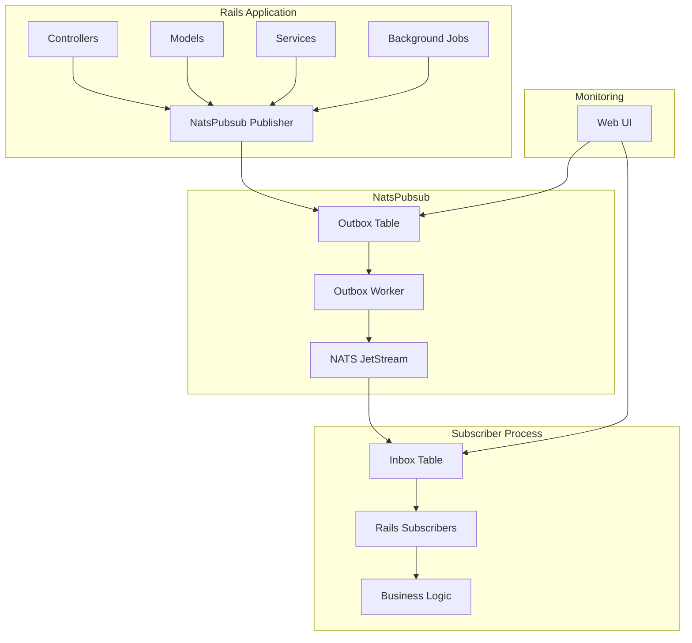

# Rails Integration Guide

This comprehensive guide covers everything you need to integrate NatsPubsub into your Ruby on Rails application, from initial setup through production deployment.

## Table of Contents

- [Overview](#overview)
- [Prerequisites](#prerequisites)
- [Installation](#installation)
- [Configuration](#configuration)
- [Generators](#generators)
  - [Install Generator](#install-generator)
  - [Subscriber Generator](#subscriber-generator)
  - [Migration Generator](#migration-generator)
  - [Config Generator](#config-generator)
- [Publishing from Rails](#publishing-from-rails)
  - [Controllers](#publishing-from-controllers)
  - [Models](#publishing-from-models)
  - [Services](#publishing-from-services)
  - [Background Jobs](#publishing-from-background-jobs)
- [ActiveRecord Integration](#activerecord-integration)
  - [Publishable Concern](#publishable-concern)
  - [Model Callbacks](#model-callbacks)
  - [Transactional Publishing](#transactional-publishing)
- [Creating Subscribers](#creating-subscribers)
  - [Basic Subscriber](#basic-subscriber)
  - [Wildcard Subscriptions](#wildcard-subscriptions)
  - [Error Handling](#error-handling-in-subscribers)
  - [Middleware Integration](#middleware-integration)
- [Background Jobs Integration](#background-jobs-integration)
  - [Sidekiq](#sidekiq-integration)
  - [ActiveJob](#activejob-integration)
  - [Outbox Worker](#outbox-worker)
- [Testing in Rails](#testing-in-rails)
  - [RSpec Setup](#rspec-setup)
  - [Testing Publishers](#testing-publishers)
  - [Testing Subscribers](#testing-subscribers)
  - [Integration Tests](#integration-tests)
- [Web UI](#web-ui)
  - [Mounting the UI](#mounting-the-web-ui)
  - [Authentication](#authentication)
  - [Customization](#customizing-the-ui)
- [Database Setup](#database-setup)
  - [Inbox/Outbox Tables](#inbox-outbox-tables)
  - [Migrations](#running-migrations)
- [Running in Production](#running-in-production)
  - [Configuration](#production-configuration)
  - [Deployment](#deployment)
  - [Monitoring](#monitoring)
  - [Scaling](#scaling)
- [Best Practices](#best-practices)
- [Troubleshooting](#troubleshooting)
- [Example Application](#example-application)

---

## Overview

NatsPubsub integrates seamlessly with Rails through a Railtie that provides:

- **Automatic Configuration Loading**: Config files in `config/initializers/nats_pubsub.rb`
- **Rails Generators**: Scaffolding for subscribers, migrations, and configuration
- **ActiveRecord Integration**: Publish model events with callbacks
- **Web UI**: Sinatra-based monitoring interface
- **Background Job Support**: Works with Sidekiq, Resque, and ActiveJob
- **Testing Helpers**: RSpec matchers and test modes
- **CLI Integration**: Rake tasks and executable for running subscribers

### Architecture



---

## Prerequisites

Before integrating NatsPubsub with Rails:

- **Ruby**: 3.2 or higher
- **Rails**: 6.0 or higher (7.0+ recommended)
- **Database**: PostgreSQL (required for Inbox/Outbox)
- **NATS Server**: With JetStream enabled
- **Redis** (optional): For Sidekiq/background jobs

---

## Installation

### Step 1: Add to Gemfile

```ruby
# Gemfile
gem 'nats_pubsub', '~> 0.1'
```

### Step 2: Install

```bash
bundle install
```

### Step 3: Run Install Generator

```bash
rails generate nats_pubsub:install
```

This creates:

- `config/initializers/nats_pubsub.rb` - Configuration file
- `app/subscribers/` - Directory for subscribers
- `.env.example` - Environment variable template

### Step 4: Configure Environment

```bash
# Copy and configure environment variables
cp .env.example .env
```

Edit `.env`:

```bash
NATS_URLS=nats://localhost:4222
APP_NAME=my-rails-app
RAILS_ENV=development
CONCURRENCY=10
```

### Step 5: Start NATS Server

```bash
# Using Docker
docker run -d -p 4222:4222 --name nats-server nats:latest -js

# Or using Homebrew (macOS)
brew install nats-server
nats-server -js
```

---

## Configuration

### Basic Configuration

```ruby
# config/initializers/nats_pubsub.rb
NatsPubsub.configure do |config|
  # Connection settings
  config.servers = ENV.fetch('NATS_URLS', 'nats://localhost:4222')
  config.env = Rails.env
  config.app_name = ENV.fetch('APP_NAME', 'myapp')

  # Consumer settings
  config.concurrency = ENV.fetch('CONCURRENCY', 10).to_i
  config.max_deliver = 5
  config.ack_wait = 30_000 # 30 seconds
  config.backoff = [1_000, 5_000, 15_000, 30_000, 60_000]

  # Features
  config.use_dlq = true
  config.use_inbox = false
  config.use_outbox = false

  # Logging
  config.logger = Rails.logger
end
```

### Advanced Configuration

```ruby
# config/initializers/nats_pubsub.rb
NatsPubsub.configure do |config|
  config.servers = ENV.fetch('NATS_URLS', 'nats://localhost:4222')
  config.env = Rails.env
  config.app_name = ENV.fetch('APP_NAME', 'myapp')

  # Authentication (if using NATS with auth)
  config.user = ENV['NATS_USER']
  config.password = ENV['NATS_PASSWORD']

  # TLS Configuration
  if Rails.env.production?
    config.tls = {
      ca_file: Rails.root.join('config', 'certs', 'ca.pem').to_s,
      cert_file: Rails.root.join('config', 'certs', 'client-cert.pem').to_s,
      key_file: Rails.root.join('config', 'certs', 'client-key.pem').to_s
    }
  end

  # Stream Configuration
  config.stream_config = {
    max_msgs: 1_000_000,
    max_bytes: 10 * 1024 * 1024 * 1024, # 10GB
    max_age: 7 * 24 * 60 * 60 * 1_000_000_000, # 7 days in nanoseconds
    storage: 'file', # or 'memory'
    replicas: Rails.env.production? ? 3 : 1
  }

  # Inbox/Outbox Configuration
  config.use_inbox = Rails.env.production?
  config.use_outbox = Rails.env.production?

  config.outbox = {
    batch_size: 100,
    poll_interval: 5_000, # 5 seconds
    stale_timeout: 5.minutes,
    retention_period: 7.days
  }

  config.inbox = {
    stale_timeout: 5.minutes,
    retention_period: 30.days
  }

  # Middleware
  config.middleware.use NatsPubsub::Middleware::StructuredLogging
  config.middleware.use CustomMetricsMiddleware
  config.middleware.use ErrorReportingMiddleware

  # Custom logger
  config.logger = ActiveSupport::Logger.new(Rails.root.join('log', 'nats_pubsub.log'))
  config.logger.level = Rails.env.production? ? Logger::INFO : Logger::DEBUG
end
```

### Environment-Specific Configuration

```ruby
# config/initializers/nats_pubsub.rb
NatsPubsub.configure do |config|
  config.servers = ENV.fetch('NATS_URLS', 'nats://localhost:4222')
  config.env = Rails.env
  config.app_name = ENV.fetch('APP_NAME', 'myapp')

  case Rails.env
  when 'development'
    config.concurrency = 2
    config.use_inbox = false
    config.use_outbox = false
    config.logger.level = Logger::DEBUG

  when 'test'
    config.concurrency = 1
    config.use_inbox = false
    config.use_outbox = false

  when 'staging'
    config.concurrency = 5
    config.use_inbox = true
    config.use_outbox = true
    config.max_deliver = 3

  when 'production'
    config.concurrency = 20
    config.use_inbox = true
    config.use_outbox = true
    config.max_deliver = 5
    config.backoff = [1_000, 5_000, 15_000, 30_000, 60_000, 120_000]
  end
end
```

---

## Generators

NatsPubsub provides several Rails generators to scaffold common patterns.

### Install Generator

Generates initial setup files.

```bash
rails generate nats_pubsub:install
```

**Created Files:**

- `config/initializers/nats_pubsub.rb` - Configuration
- `app/subscribers/.keep` - Subscribers directory
- `.env.example` - Environment template

### Subscriber Generator

Generate a new subscriber class.

```bash
rails generate nats_pubsub:subscriber User created
```

This creates:

```ruby
# app/subscribers/user_created_subscriber.rb
class UserCreatedSubscriber < NatsPubsub::Subscriber
  subscribe_to "user.created"

  def handle(message, context)
    # Process user.created event
    Rails.logger.info "Processing user.created: #{message.inspect}"

    # Your business logic here
  end
end
```

**With Namespace:**

```bash
rails generate nats_pubsub:subscriber Notifications::Email sent
```

Creates:

```ruby
# app/subscribers/notifications/email_sent_subscriber.rb
module Notifications
  class EmailSentSubscriber < NatsPubsub::Subscriber
    subscribe_to "notifications.email.sent"

    def handle(message, context)
      # Process notifications.email.sent event
    end
  end
end
```

### Migration Generator

Generate Inbox and Outbox tables.

```bash
rails generate nats_pubsub:migrations
```

Creates:

```ruby
# db/migrate/20250117000000_create_nats_pubsub_inbox.rb
class CreateNatsPubsubInbox < ActiveRecord::Migration[7.0]
  def change
    create_table :nats_pubsub_inbox, id: false, primary_key: :event_id do |t|
      t.string :event_id, null: false, limit: 255
      t.string :subject, null: false, limit: 500
      t.text :payload, null: false
      t.text :headers
      t.string :stream, limit: 255
      t.bigint :stream_seq
      t.string :status, null: false, default: 'processing', limit: 50
      t.timestamp :received_at, null: false, default: -> { 'CURRENT_TIMESTAMP' }
      t.timestamp :processed_at
      t.integer :deliveries, default: 1
      t.text :error_message
      t.timestamps
    end

    add_index :nats_pubsub_inbox, :event_id, unique: true
    add_index :nats_pubsub_inbox, [:stream, :stream_seq],
              unique: true,
              name: 'idx_inbox_stream_seq',
              where: 'stream IS NOT NULL'
    add_index :nats_pubsub_inbox, [:status, :processed_at]
    add_index :nats_pubsub_inbox, :received_at
  end
end

# db/migrate/20250117000001_create_nats_pubsub_outbox.rb
class CreateNatsPubsubOutbox < ActiveRecord::Migration[7.0]
  def change
    create_table :nats_pubsub_outbox, id: false, primary_key: :event_id do |t|
      t.string :event_id, null: false, limit: 255
      t.string :subject, null: false, limit: 500
      t.text :payload, null: false
      t.text :headers
      t.string :status, null: false, default: 'pending', limit: 50
      t.timestamp :enqueued_at, null: false, default: -> { 'CURRENT_TIMESTAMP' }
      t.timestamp :sent_at
      t.text :error_message
      t.timestamps
    end

    add_index :nats_pubsub_outbox, :event_id, unique: true
    add_index :nats_pubsub_outbox, [:status, :enqueued_at]
    add_index :nats_pubsub_outbox, :sent_at
  end
end
```

Run migrations:

```bash
rails db:migrate
```

### Config Generator

Generate a custom configuration preset.

```bash
rails generate nats_pubsub:config production
```

Creates:

```ruby
# config/nats_pubsub/production.rb
NatsPubsub::ConfigPresets.define :production do
  concurrency 20
  max_deliver 5
  use_inbox true
  use_outbox true
  backoff [1_000, 5_000, 15_000, 30_000, 60_000]
end
```

---

## Publishing from Rails

### Publishing from Controllers

```ruby
# app/controllers/users_controller.rb
class UsersController < ApplicationController
  def create
    @user = User.new(user_params)

    if @user.save
      # Publish user.created event
      NatsPubsub.publish(
        topic: 'user.created',
        message: {
          id: @user.id,
          email: @user.email,
          name: @user.name,
          created_at: @user.created_at
        },
        trace_id: request.request_id
      )

      render json: @user, status: :created
    else
      render json: { errors: @user.errors }, status: :unprocessable_entity
    end
  end

  def update
    if @user.update(user_params)
      # Publish user.updated event
      NatsPubsub.publish(
        topic: 'user.updated',
        message: {
          id: @user.id,
          changes: @user.previous_changes
        },
        trace_id: request.request_id
      )

      render json: @user
    else
      render json: { errors: @user.errors }, status: :unprocessable_entity
    end
  end

  private

  def user_params
    params.require(:user).permit(:email, :name, :password)
  end
end
```

### Publishing from Models

#### Using Callbacks

```ruby
# app/models/order.rb
class Order < ApplicationRecord
  belongs_to :user
  has_many :order_items

  after_create :publish_created_event
  after_update :publish_updated_event, if: :saved_change_to_status?
  after_destroy :publish_cancelled_event

  private

  def publish_created_event
    NatsPubsub.publish(
      topic: 'order.created',
      message: {
        id: id,
        user_id: user_id,
        total: total,
        status: status,
        items: order_items.map { |item|
          { product_id: item.product_id, quantity: item.quantity, price: item.price }
        }
      }
    )
  end

  def publish_updated_event
    NatsPubsub.publish(
      topic: 'order.updated',
      message: {
        id: id,
        status: status,
        previous_status: status_before_last_save
      }
    )
  end

  def publish_cancelled_event
    NatsPubsub.publish(
      topic: 'order.cancelled',
      message: {
        id: id,
        user_id: user_id,
        cancelled_at: Time.current
      }
    )
  end
end
```

### Publishing from Services

```ruby
# app/services/order_processing_service.rb
class OrderProcessingService
  def initialize(order)
    @order = order
  end

  def process
    ActiveRecord::Base.transaction do
      # Update inventory
      @order.order_items.each do |item|
        item.product.decrement!(:stock, item.quantity)
      end

      # Update order status
      @order.update!(status: 'processing')

      # Publish event (with outbox, this is transactional)
      NatsPubsub.publish(
        topic: 'order.processing_started',
        message: {
          order_id: @order.id,
          user_id: @order.user_id,
          total: @order.total,
          started_at: Time.current
        }
      )
    end

    # Process payment
    payment_result = PaymentGateway.charge(@order)

    if payment_result.success?
      @order.update!(status: 'paid')

      NatsPubsub.publish(
        topic: 'order.payment_completed',
        message: {
          order_id: @order.id,
          payment_id: payment_result.id,
          amount: @order.total
        }
      )
    else
      handle_payment_failure(payment_result)
    end
  rescue StandardError => e
    handle_error(e)
  end

  private

  def handle_payment_failure(result)
    @order.update!(status: 'payment_failed')

    NatsPubsub.publish(
      topic: 'order.payment_failed',
      message: {
        order_id: @order.id,
        reason: result.error_message
      }
    )
  end

  def handle_error(error)
    Rails.logger.error("Order processing failed: #{error.message}")

    NatsPubsub.publish(
      topic: 'order.processing_failed',
      message: {
        order_id: @order.id,
        error: error.message
      }
    )

    raise
  end
end
```

### Publishing from Background Jobs

```ruby
# app/jobs/send_welcome_email_job.rb
class SendWelcomeEmailJob < ApplicationJob
  queue_as :default

  def perform(user_id)
    user = User.find(user_id)

    # Send email
    UserMailer.welcome_email(user).deliver_now

    # Publish event
    NatsPubsub.publish(
      topic: 'notification.email.sent',
      message: {
        user_id: user.id,
        email_type: 'welcome',
        sent_at: Time.current
      }
    )
  end
end
```

---

## ActiveRecord Integration

### Publishable Concern

Create a reusable concern for publishable models:

```ruby
# app/models/concerns/publishable.rb
module Publishable
  extend ActiveSupport::Concern

  included do
    after_create :publish_created_event
    after_update :publish_updated_event
    after_destroy :publish_destroyed_event
  end

  private

  def publish_created_event
    publish_event('created', as_event_payload)
  end

  def publish_updated_event
    return unless saved_changes.any?

    publish_event('updated', as_event_payload.merge(
      changes: saved_changes.except('updated_at')
    ))
  end

  def publish_destroyed_event
    publish_event('destroyed', { id: id })
  end

  def publish_event(action, payload)
    topic = "#{model_name.singular}.#{action}"

    NatsPubsub.publish(
      topic: topic,
      message: payload,
      event_id: "#{model_name.singular}-#{id}-#{action}-#{Time.current.to_i}"
    )
  end

  def as_event_payload
    # Override in model to customize payload
    attributes.except('created_at', 'updated_at')
  end
end
```

Use in models:

```ruby
# app/models/product.rb
class Product < ApplicationRecord
  include Publishable

  # Override to customize event payload
  def as_event_payload
    {
      id: id,
      name: name,
      price: price,
      sku: sku,
      available: in_stock?
    }
  end
end
```

### Model Callbacks

#### Selective Publishing

```ruby
# app/models/user.rb
class User < ApplicationRecord
  after_create :publish_welcome_event
  after_update :publish_profile_updated_event, if: :profile_changed?
  after_update :publish_email_verified_event, if: :saved_change_to_email_verified_at?

  private

  def publish_welcome_event
    NatsPubsub.publish(
      topic: 'user.welcome',
      message: {
        id: id,
        email: email,
        name: name
      }
    )
  end

  def publish_profile_updated_event
    NatsPubsub.publish(
      topic: 'user.profile_updated',
      message: {
        id: id,
        changes: previous_changes.slice('name', 'bio', 'avatar_url')
      }
    )
  end

  def publish_email_verified_event
    NatsPubsub.publish(
      topic: 'user.email_verified',
      message: {
        id: id,
        email: email,
        verified_at: email_verified_at
      }
    )
  end

  def profile_changed?
    saved_change_to_name? || saved_change_to_bio? || saved_change_to_avatar_url?
  end
end
```

### Transactional Publishing

With Outbox enabled, publishing is automatically transactional:

```ruby
# app/models/payment.rb
class Payment < ApplicationRecord
  belongs_to :order

  def process!
    ActiveRecord::Base.transaction do
      # Update payment status
      update!(status: 'completed', completed_at: Time.current)

      # Update order
      order.update!(status: 'paid')

      # Publish event (stored in outbox table in same transaction)
      NatsPubsub.publish(
        topic: 'payment.completed',
        message: {
          payment_id: id,
          order_id: order_id,
          amount: amount,
          completed_at: completed_at
        }
      )

      # If transaction rolls back, event is not published
    end
  end
end
```

---

## Creating Subscribers

### Basic Subscriber

```ruby
# app/subscribers/order_created_subscriber.rb
class OrderCreatedSubscriber < NatsPubsub::Subscriber
  subscribe_to "order.created"

  def handle(message, context)
    order_id = message['id']

    # Process order
    OrderProcessingService.new(order_id).call

    Rails.logger.info "Processed order: #{order_id}"
  end
end
```

### Wildcard Subscriptions

#### Single-Level Wildcard (\*)

```ruby
# app/subscribers/user_events_subscriber.rb
class UserEventsSubscriber < NatsPubsub::Subscriber
  subscribe_to "user.*" # Matches user.created, user.updated, etc.

  def handle(message, context)
    action = context.topic.split('.').last # created, updated, destroyed

    case action
    when 'created'
      handle_user_created(message)
    when 'updated'
      handle_user_updated(message)
    when 'destroyed'
      handle_user_destroyed(message)
    end
  end

  private

  def handle_user_created(message)
    # Send welcome email
    UserMailer.welcome_email(message['email']).deliver_later
  end

  def handle_user_updated(message)
    # Update search index
    SearchIndexJob.perform_later('User', message['id'])
  end

  def handle_user_destroyed(message)
    # Cleanup user data
    DataCleanupJob.perform_later('User', message['id'])
  end
end
```

#### Multi-Level Wildcard (>)

```ruby
# app/subscribers/audit_log_subscriber.rb
class AuditLogSubscriber < NatsPubsub::Subscriber
  subscribe_to ">" # Matches ALL events from this app

  def handle(message, context)
    AuditLog.create!(
      event_type: context.topic,
      event_id: context.event_id,
      subject: context.subject,
      payload: message,
      occurred_at: context.occurred_at,
      trace_id: context.trace_id
    )
  end
end
```

### Error Handling in Subscribers

```ruby
# app/subscribers/payment_processor_subscriber.rb
class PaymentProcessorSubscriber < NatsPubsub::Subscriber
  subscribe_to "payment.pending"

  def handle(message, context)
    payment_id = message['payment_id']

    begin
      payment = Payment.find(payment_id)

      # Process payment
      result = PaymentGateway.charge(payment)

      if result.success?
        payment.update!(
          status: 'completed',
          transaction_id: result.transaction_id
        )

        # Publish success event
        NatsPubsub.publish(
          topic: 'payment.completed',
          message: {
            payment_id: payment.id,
            transaction_id: result.transaction_id
          }
        )
      else
        handle_payment_failure(payment, result)
      end

    rescue Payment::GatewayError => e
      # Retryable error - let it retry
      Rails.logger.warn "Payment gateway error: #{e.message}"
      raise # Will retry with backoff

    rescue ActiveRecord::RecordNotFound => e
      # Non-retryable error - don't retry
      Rails.logger.error "Payment not found: #{payment_id}"
      # Don't raise - message will be ACKed and not retried

    rescue StandardError => e
      # Unexpected error - log and send to error tracking
      Rails.logger.error "Unexpected error processing payment: #{e.message}"
      Sentry.capture_exception(e, extra: { payment_id: payment_id })
      raise # Will retry
    end
  end

  private

  def handle_payment_failure(payment, result)
    payment.update!(
      status: 'failed',
      error_message: result.error_message
    )

    NatsPubsub.publish(
      topic: 'payment.failed',
      message: {
        payment_id: payment.id,
        reason: result.error_message
      }
    )
  end
end
```

### Middleware Integration

```ruby
# app/subscribers/order_subscriber.rb
class OrderSubscriber < NatsPubsub::Subscriber
  subscribe_to "order.*"

  # Use middleware for this subscriber
  use TimingMiddleware
  use ValidationMiddleware

  def handle(message, context)
    # Your logic here
  end
end

# app/middleware/timing_middleware.rb
class TimingMiddleware
  def call(message, context, next_middleware)
    start_time = Time.current

    next_middleware.call

    duration = Time.current - start_time

    Rails.logger.info "Subscriber took #{duration}s to process"

    if duration > 5.0
      SlackNotifier.warn("Slow subscriber: #{context.subscriber_class} took #{duration}s")
    end
  end
end
```

---

## Background Jobs Integration

### Sidekiq Integration

#### Setup

```ruby
# Gemfile
gem 'sidekiq'
gem 'redis'

# config/initializers/sidekiq.rb
Sidekiq.configure_server do |config|
  config.redis = { url: ENV.fetch('REDIS_URL', 'redis://localhost:6379/0') }
end

Sidekiq.configure_client do |config|
  config.redis = { url: ENV.fetch('REDIS_URL', 'redis://localhost:6379/0') }
end
```

#### Publishing from Sidekiq Jobs

```ruby
# app/workers/order_fulfillment_worker.rb
class OrderFulfillmentWorker
  include Sidekiq::Worker
  sidekiq_options retry: 3, queue: :critical

  def perform(order_id)
    order = Order.find(order_id)

    # Process fulfillment
    fulfillment = FulfillmentService.new(order).process

    # Publish event
    NatsPubsub.publish(
      topic: 'order.fulfilled',
      message: {
        order_id: order.id,
        tracking_number: fulfillment.tracking_number,
        carrier: fulfillment.carrier,
        fulfilled_at: Time.current
      }
    )
  end
end
```

#### Triggering Sidekiq from Subscribers

```ruby
# app/subscribers/order_paid_subscriber.rb
class OrderPaidSubscriber < NatsPubsub::Subscriber
  subscribe_to "order.paid"

  def handle(message, context)
    order_id = message['order_id']

    # Enqueue Sidekiq job for processing
    OrderFulfillmentWorker.perform_async(order_id)
  end
end
```

### ActiveJob Integration

```ruby
# config/application.rb
class Application < Rails::Application
  config.active_job.queue_adapter = :sidekiq
end

# app/jobs/send_notification_job.rb
class SendNotificationJob < ApplicationJob
  queue_as :notifications

  def perform(user_id, notification_type, data)
    user = User.find(user_id)

    # Send notification
    NotificationService.send(user, notification_type, data)

    # Publish event
    NatsPubsub.publish(
      topic: "notification.#{notification_type}.sent",
      message: {
        user_id: user.id,
        notification_type: notification_type,
        sent_at: Time.current
      }
    )
  end
end

# app/subscribers/user_created_subscriber.rb
class UserCreatedSubscriber < NatsPubsub::Subscriber
  subscribe_to "user.created"

  def handle(message, context)
    user_id = message['id']

    # Trigger ActiveJob
    SendNotificationJob.perform_later(user_id, 'welcome', { name: message['name'] })
  end
end
```

### Outbox Worker

Run outbox worker with Sidekiq:

```ruby
# app/workers/outbox_publisher_worker.rb
class OutboxPublisherWorker
  include Sidekiq::Worker
  sidekiq_options queue: :outbox, retry: false

  def perform
    repository = NatsPubsub::Publisher::OutboxRepository.new
    publisher = NatsPubsub::Publisher::OutboxPublisher.new(repository)

    # Process pending events
    results = publisher.publish_pending(limit: 100) do |event|
      # Extract topic from subject
      topic = event.subject.split('.')[2..-1].join('.')

      # Publish to NATS
      NatsPubsub.publish(
        topic: topic,
        message: JSON.parse(event.payload)['message'],
        headers: event.headers ? JSON.parse(event.headers) : {}
      )
    end

    Rails.logger.info "Published #{results.length} outbox events"

    # Reschedule if there are more pending
    OutboxPublisherWorker.perform_in(5.seconds) if results.length > 0
  end
end

# config/initializers/sidekiq.rb
Sidekiq.configure_server do |config|
  # Start outbox worker on Sidekiq startup
  config.on(:startup) do
    OutboxPublisherWorker.perform_async
  end
end

# Or use sidekiq-cron
# config/schedule.yml
outbox_publisher:
  cron: "*/5 * * * * *" # Every 5 seconds
  class: "OutboxPublisherWorker"
```

---

## Testing in Rails

### RSpec Setup

```ruby
# spec/rails_helper.rb
require 'nats_pubsub/testing'

RSpec.configure do |config|
  # Enable test mode (fake by default)
  config.before(:suite) do
    NatsPubsub::Testing.fake!
  end

  # Clear published messages between tests
  config.before(:each) do
    NatsPubsub::Testing.reset!
  end

  # Include helpers
  config.include NatsPubsub::Testing::Helpers
end
```

### Testing Publishers

#### Testing Controller Publishing

```ruby
# spec/controllers/users_controller_spec.rb
require 'rails_helper'

RSpec.describe UsersController, type: :controller do
  describe 'POST #create' do
    let(:valid_params) do
      { user: { email: 'test@example.com', name: 'Test User', password: 'password123' } }
    end

    it 'publishes user.created event' do
      post :create, params: valid_params

      expect(NatsPubsub).to have_published_event('user.created')
        .with_message(hash_including(
          email: 'test@example.com',
          name: 'Test User'
        ))
    end

    it 'includes trace_id in event' do
      request.headers['X-Request-ID'] = 'trace-123'

      post :create, params: valid_params

      expect(NatsPubsub).to have_published_event('user.created')
        .with_metadata(hash_including(trace_id: 'trace-123'))
    end
  end
end
```

#### Testing Model Publishing

```ruby
# spec/models/order_spec.rb
require 'rails_helper'

RSpec.describe Order, type: :model do
  describe 'callbacks' do
    it 'publishes order.created event on create' do
      order = create(:order)

      expect(NatsPubsub).to have_published_event('order.created')
        .with_message(hash_including(
          id: order.id,
          user_id: order.user_id,
          total: order.total
        ))
    end

    it 'publishes order.updated event on status change' do
      order = create(:order, status: 'pending')

      NatsPubsub::Testing.reset!

      order.update!(status: 'paid')

      expect(NatsPubsub).to have_published_event('order.updated')
        .with_message(hash_including(
          id: order.id,
          status: 'paid',
          previous_status: 'pending'
        ))
    end

    it 'does not publish on non-status updates' do
      order = create(:order)

      NatsPubsub::Testing.reset!

      order.update!(notes: 'Updated notes')

      expect(NatsPubsub).not_to have_published_event('order.updated')
    end
  end
end
```

### Testing Subscribers

```ruby
# spec/subscribers/order_created_subscriber_spec.rb
require 'rails_helper'

RSpec.describe OrderCreatedSubscriber do
  let(:subscriber) { described_class.new }

  let(:message) do
    {
      'id' => 123,
      'user_id' => 456,
      'total' => 99.99,
      'status' => 'pending'
    }
  end

  let(:context) do
    OpenStruct.new(
      event_id: 'evt-123',
      subject: 'production.myapp.order.created',
      topic: 'order.created',
      occurred_at: Time.current
    )
  end

  describe '#handle' do
    it 'processes the order' do
      expect(OrderProcessingService).to receive(:new).with(123).and_call_original
      expect_any_instance_of(OrderProcessingService).to receive(:call)

      subscriber.handle(message, context)
    end

    it 'logs the processing' do
      allow(OrderProcessingService).to receive_message_chain(:new, :call)

      expect(Rails.logger).to receive(:info).with('Processed order: 123')

      subscriber.handle(message, context)
    end

    context 'when order not found' do
      before do
        allow(OrderProcessingService).to receive(:new).and_raise(ActiveRecord::RecordNotFound)
      end

      it 'logs the error and does not raise' do
        expect(Rails.logger).to receive(:error).with(/Order not found/)

        expect { subscriber.handle(message, context) }.not_to raise_error
      end
    end
  end
end
```

### Integration Tests

```ruby
# spec/integration/order_workflow_spec.rb
require 'rails_helper'

RSpec.describe 'Order Workflow', type: :integration do
  # Use inline mode for integration tests
  before { NatsPubsub::Testing.inline! }
  after { NatsPubsub::Testing.fake! }

  it 'completes full order workflow' do
    user = create(:user)

    # Create order
    order = create(:order, user: user, status: 'pending')

    # Should have published order.created and triggered fulfillment
    expect(OrderFulfillmentWorker).to have_enqueued_sidekiq_job(order.id)

    # Process payment
    order.update!(status: 'paid')

    # Should have published order.updated
    expect(NatsPubsub).to have_published_event('order.updated')
      .with_message(hash_including(status: 'paid'))

    # Fulfill order
    perform_enqueued_jobs

    # Should have published order.fulfilled
    expect(NatsPubsub).to have_published_event('order.fulfilled')
  end
end
```

---

## Web UI

### Mounting the Web UI

The Web UI provides monitoring for Inbox and Outbox events.

```ruby
# config/routes.rb
Rails.application.routes.draw do
  # Mount NatsPubsub Web UI
  mount NatsPubsub::Web => '/nats_pubsub'

  # Your other routes...
end
```

Access at: `http://localhost:3000/nats_pubsub`

### Authentication

#### Basic Authentication

```ruby
# config/initializers/nats_pubsub.rb
NatsPubsub::Web.use(Rack::Auth::Basic) do |username, password|
  username == ENV['NATS_UI_USERNAME'] && password == ENV['NATS_UI_PASSWORD']
end
```

#### Devise Authentication

```ruby
# config/routes.rb
authenticate :user, ->(user) { user.admin? } do
  mount NatsPubsub::Web => '/nats_pubsub'
end
```

#### Custom Authentication

```ruby
# lib/nats_pubsub_auth.rb
class NatsPubsubAuth
  def initialize(app)
    @app = app
  end

  def call(env)
    request = Rack::Request.new(env)
    session = request.session

    if session[:user_id] && User.find_by(id: session[:user_id])&.admin?
      @app.call(env)
    else
      [401, { 'Content-Type' => 'text/html' }, ['Unauthorized']]
    end
  end
end

# config/initializers/nats_pubsub.rb
NatsPubsub::Web.use NatsPubsubAuth
```

### Customizing the UI

```ruby
# config/initializers/nats_pubsub.rb
NatsPubsub::Web.configure do |config|
  # Set page title
  config.title = 'My App - Event Monitor'

  # Set number of items per page
  config.per_page = 50

  # Enable/disable features
  config.enable_retry = true
  config.enable_delete = Rails.env.development?
end
```

---

## Database Setup

### Inbox/Outbox Tables

Generate and run migrations:

```bash
rails generate nats_pubsub:migrations
rails db:migrate
```

### Running Migrations

#### Development

```bash
rails db:migrate
```

#### Production

```bash
# Run on deployment
bundle exec rails db:migrate

# Or with Capistrano
cap production deploy:migrate
```

#### Rollback

```bash
rails db:rollback STEP=2
```

---

## Running in Production

### Production Configuration

```ruby
# config/initializers/nats_pubsub.rb
NatsPubsub.configure do |config|
  config.servers = ENV.fetch('NATS_URLS')
  config.env = 'production'
  config.app_name = ENV.fetch('APP_NAME')

  # Enable reliability patterns
  config.use_inbox = true
  config.use_outbox = true
  config.use_dlq = true

  # Scale for production
  config.concurrency = 20
  config.max_deliver = 5

  # TLS for security
  config.tls = {
    ca_file: '/app/certs/ca.pem',
    cert_file: '/app/certs/client-cert.pem',
    key_file: '/app/certs/client-key.pem'
  }

  # Structured logging
  config.logger = Logger.new(STDOUT)
  config.logger.level = Logger::INFO
  config.logger.formatter = proc do |severity, datetime, progname, msg|
    {
      timestamp: datetime.iso8601,
      severity: severity,
      progname: progname,
      message: msg,
      app: config.app_name,
      env: config.env
    }.to_json + "\n"
  end
end
```

### Deployment

#### With Capistrano

```ruby
# Capfile
require 'capistrano/bundler'
require 'capistrano/rails/migrations'

# config/deploy.rb
set :application, 'myapp'
set :repo_url, 'git@github.com:myorg/myapp.git'

# Start subscriber process after deployment
namespace :deploy do
  after :publishing, :restart_subscribers do
    on roles(:app) do
      execute :sudo, :systemctl, :restart, 'nats-subscribers'
    end
  end
end
```

#### Systemd Service

```ini
# /etc/systemd/system/nats-subscribers.service
[Unit]
Description=NatsPubsub Subscriber Process
After=network.target

[Service]
Type=simple
User=deploy
WorkingDirectory=/var/www/myapp/current
Environment=RAILS_ENV=production
ExecStart=/usr/local/bin/bundle exec nats_pubsub
Restart=on-failure
RestartSec=10

[Install]
WantedBy=multi-user.target
```

Start service:

```bash
sudo systemctl enable nats-subscribers
sudo systemctl start nats-subscribers
sudo systemctl status nats-subscribers
```

#### Docker

```dockerfile
# Dockerfile
FROM ruby:3.2

WORKDIR /app

COPY Gemfile Gemfile.lock ./
RUN bundle install

COPY . .

# Compile assets
RUN bundle exec rails assets:precompile

# Run subscribers
CMD ["bundle", "exec", "nats_pubsub"]
```

```yaml
# docker-compose.yml
version: "3.8"

services:
  web:
    build: .
    command: bundle exec rails server -b 0.0.0.0
    ports:
      - "3000:3000"
    environment:
      - NATS_URLS=nats://nats:4222
      - DATABASE_URL=postgresql://postgres:password@db:5432/myapp
    depends_on:
      - db
      - nats

  subscribers:
    build: .
    command: bundle exec nats_pubsub
    environment:
      - NATS_URLS=nats://nats:4222
      - DATABASE_URL=postgresql://postgres:password@db:5432/myapp
      - CONCURRENCY=10
    depends_on:
      - db
      - nats

  outbox_worker:
    build: .
    command: bundle exec rake nats_pubsub:outbox:worker
    environment:
      - NATS_URLS=nats://nats:4222
      - DATABASE_URL=postgresql://postgres:password@db:5432/myapp
    depends_on:
      - db
      - nats

  nats:
    image: nats:latest
    command: -js
    ports:
      - "4222:4222"

  db:
    image: postgres:15
    environment:
      POSTGRES_PASSWORD: password
      POSTGRES_DB: myapp
    volumes:
      - postgres_data:/var/lib/postgresql/data

volumes:
  postgres_data:
```

### Monitoring

#### Health Checks

```ruby
# config/routes.rb
Rails.application.routes.draw do
  get '/health', to: 'health#check'
end

# app/controllers/health_controller.rb
class HealthController < ApplicationController
  def check
    checks = {
      nats: nats_healthy?,
      database: database_healthy?,
      outbox: outbox_healthy?
    }

    status = checks.values.all? ? :ok : :service_unavailable

    render json: {
      status: status == :ok ? 'healthy' : 'unhealthy',
      checks: checks,
      timestamp: Time.current
    }, status: status
  end

  private

  def nats_healthy?
    NatsPubsub.connection.connected?
  rescue StandardError
    false
  end

  def database_healthy?
    ActiveRecord::Base.connection.active?
  rescue StandardError
    false
  end

  def outbox_healthy?
    # Check for backlog
    pending_count = NatsOutboxEvent.pending.count
    pending_count < 1000
  rescue StandardError
    false
  end
end
```

#### Metrics Collection

```ruby
# app/middleware/metrics_middleware.rb
class MetricsMiddleware
  def call(message, context, next_middleware)
    start_time = Time.current

    next_middleware.call

    duration = Time.current - start_time

    # Send to metrics service (Prometheus, Datadog, etc.)
    Metrics.histogram('nats.subscriber.duration', duration, tags: {
      topic: context.topic,
      subscriber: context.subscriber_class
    })

    Metrics.increment('nats.subscriber.processed', tags: {
      topic: context.topic
    })
  rescue StandardError => e
    Metrics.increment('nats.subscriber.error', tags: {
      topic: context.topic,
      error: e.class.name
    })
    raise
  end
end
```

### Scaling

#### Horizontal Scaling

Run multiple subscriber processes:

```yaml
# docker-compose.yml
services:
  subscribers_1:
    build: .
    command: bundle exec nats_pubsub
    environment:
      - CONCURRENCY=10

  subscribers_2:
    build: .
    command: bundle exec nats_pubsub
    environment:
      - CONCURRENCY=10

  subscribers_3:
    build: .
    command: bundle exec nats_pubsub
    environment:
      - CONCURRENCY=10
```

#### Vertical Scaling

Increase concurrency:

```ruby
# config/initializers/nats_pubsub.rb
NatsPubsub.configure do |config|
  config.concurrency = 50 # Increase for more throughput
end
```

---

## Best Practices

### 1. Use Meaningful Topic Names

```ruby
# Good: Clear hierarchy
NatsPubsub.publish(topic: 'order.created', message: data)
NatsPubsub.publish(topic: 'order.payment.completed', message: data)

# Bad: Flat, vague names
NatsPubsub.publish(topic: 'event1', message: data)
```

### 2. Keep Message Payloads Small

```ruby
# Good: IDs and references
NatsPubsub.publish(
  topic: 'order.created',
  message: {
    id: order.id,
    user_id: order.user_id,
    total: order.total
  }
)

# Bad: Entire object graphs
NatsPubsub.publish(
  topic: 'order.created',
  message: order.as_json(include: [:user, :items, :shipping_address])
)
```

### 3. Use Event IDs for Idempotency

```ruby
# Consistent event IDs enable deduplication
NatsPubsub.publish(
  topic: 'order.created',
  message: { id: order.id },
  event_id: "order-#{order.id}-created"
)
```

### 4. Handle Errors Appropriately

```ruby
class PaymentSubscriber < NatsPubsub::Subscriber
  subscribe_to 'payment.pending'

  def handle(message, context)
    # Retryable errors: raise to retry
    raise if transient_error?

    # Non-retryable errors: log and don't raise
    Rails.logger.error('Invalid payment') if invalid?
  end
end
```

### 5. Use Transactions with Outbox

```ruby
ActiveRecord::Base.transaction do
  order.update!(status: 'paid')

  # Published in same transaction
  NatsPubsub.publish(
    topic: 'order.paid',
    message: { order_id: order.id }
  )
end
```

### 6. Monitor Metrics

```ruby
# Track key metrics
Metrics.gauge('nats.outbox.pending', NatsOutboxEvent.pending.count)
Metrics.gauge('nats.inbox.failed', NatsInboxEvent.failed.count)
```

### 7. Use Wildcards Strategically

```ruby
# Good: Specific wildcard
subscribe_to 'order.*' # order.created, order.updated

# Bad: Too broad
subscribe_to '>' # ALL events
```

### 8. Test Thoroughly

```ruby
# Test publishing
expect(NatsPubsub).to have_published_event('order.created')

# Test subscriber behavior
subscriber.handle(message, context)
```

---

## Troubleshooting

### Common Issues

#### Issue: Subscribers Not Starting

**Symptom**: `bundle exec nats_pubsub` exits immediately

**Solution**:

```bash
# Check for syntax errors
bundle exec ruby -c app/subscribers/*.rb

# Check logs
tail -f log/nats_pubsub.log

# Verify NATS connection
nc -zv localhost 4222
```

#### Issue: Messages Not Being Published

**Symptom**: Events not appearing in NATS

**Solution**:

```ruby
# Check connection
NatsPubsub.connection.connected?

# Check subject pattern
Rails.logger.info NatsPubsub.config.subject_for('order.created')

# Verify stream exists
# nats stream ls
```

#### Issue: Duplicate Processing

**Symptom**: Messages processed multiple times

**Solution**:

```ruby
# Enable Inbox pattern
NatsPubsub.configure do |config|
  config.use_inbox = true
end

# Run migrations
rails generate nats_pubsub:migrations
rails db:migrate
```

#### Issue: High Database Load

**Symptom**: Slow queries on inbox/outbox tables

**Solution**:

```sql
-- Add indexes
CREATE INDEX idx_outbox_status ON nats_pubsub_outbox(status, enqueued_at);
CREATE INDEX idx_inbox_status ON nats_pubsub_inbox(status, processed_at);

-- Cleanup old events
DELETE FROM nats_pubsub_outbox WHERE status = 'sent' AND sent_at < NOW() - INTERVAL '7 days';
```

---

## Example Application

Complete Rails example:

```ruby
# config/initializers/nats_pubsub.rb
NatsPubsub.configure do |config|
  config.servers = ENV.fetch('NATS_URLS', 'nats://localhost:4222')
  config.env = Rails.env
  config.app_name = 'ecommerce'
  config.concurrency = 10
  config.use_outbox = Rails.env.production?
  config.use_inbox = Rails.env.production?
  config.logger = Rails.logger
end

# app/models/order.rb
class Order < ApplicationRecord
  belongs_to :user
  has_many :order_items

  after_create :publish_created_event

  def complete_payment!
    transaction do
      update!(status: 'paid', paid_at: Time.current)

      NatsPubsub.publish(
        topic: 'order.paid',
        message: {
          order_id: id,
          user_id: user_id,
          total: total,
          paid_at: paid_at
        }
      )
    end
  end

  private

  def publish_created_event
    NatsPubsub.publish(
      topic: 'order.created',
      message: {
        order_id: id,
        user_id: user_id,
        total: total,
        items: order_items.map(&:as_json)
      }
    )
  end
end

# app/subscribers/order_paid_subscriber.rb
class OrderPaidSubscriber < NatsPubsub::Subscriber
  subscribe_to 'order.paid'

  def handle(message, context)
    order = Order.find(message['order_id'])

    # Trigger fulfillment
    OrderFulfillmentJob.perform_later(order.id)

    # Send confirmation email
    OrderMailer.payment_confirmation(order).deliver_later

    Rails.logger.info "Order #{order.id} payment processed"
  end
end

# app/subscribers/order_fulfilled_subscriber.rb
class OrderFulfilledSubscriber < NatsPubsub::Subscriber
  subscribe_to 'order.fulfilled'

  def handle(message, context)
    order = Order.find(message['order_id'])

    # Update inventory
    InventoryService.decrement_stock(order)

    # Send shipping notification
    OrderMailer.shipping_notification(order).deliver_later
  end
end
```

---

## Navigation

- **Previous**: [Databases Integration](./databases.md)
- **Next**: [Express.js Integration](./express.md)
- **Related**:
  - [Publishing Guide](../guides/publishing.md)
  - [Subscribing Guide](../guides/subscribing.md)
  - [Inbox/Outbox Pattern](../patterns/inbox-outbox.md)
  - [Testing Guide](../guides/testing.md)
