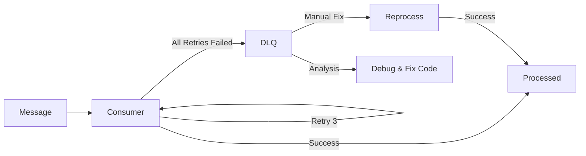
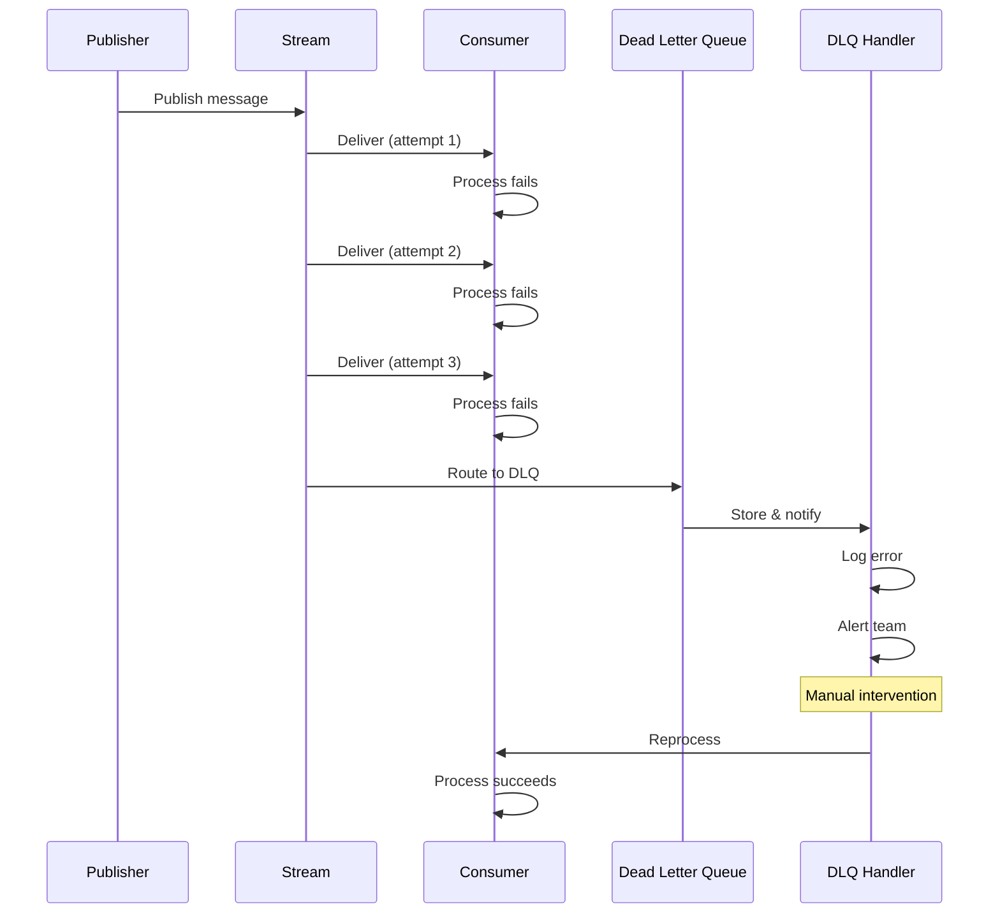
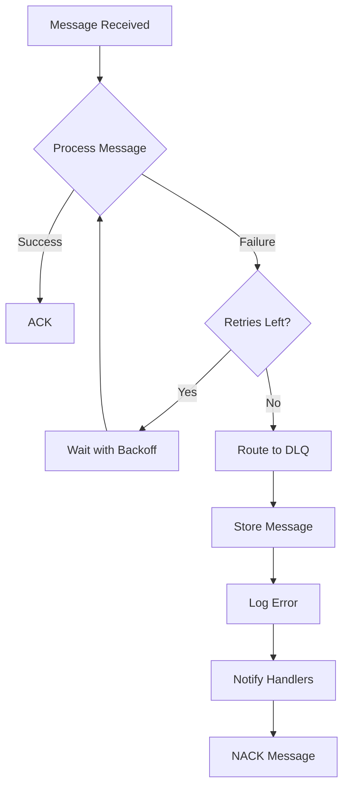

# Dead Letter Queue (DLQ) Pattern

This comprehensive guide covers the Dead Letter Queue (DLQ) pattern in NatsPubsub for handling failed messages and implementing robust error recovery strategies.

## Table of Contents

- [Overview](#overview)
- [What is a Dead Letter Queue](#what-is-a-dead-letter-queue)
- [When to Use DLQ](#when-to-use-dlq)
- [How DLQ Works](#how-dlq-works)
- [Configuration](#configuration)
  - [JavaScript Configuration](#javascript-configuration)
  - [Ruby Configuration](#ruby-configuration)
- [Implementation](#implementation)
  - [JavaScript Implementation](#javascript-implementation)
  - [Ruby Implementation](#ruby-implementation)
- [Processing DLQ Messages](#processing-dlq-messages)
  - [Automatic Handlers](#automatic-handlers)
  - [Manual Inspection](#manual-inspection)
  - [Retry Mechanisms](#retry-mechanisms)
- [Retry Strategies](#retry-strategies)
  - [Exponential Backoff](#exponential-backoff)
  - [Linear Backoff](#linear-backoff)
  - [Custom Strategies](#custom-strategies)
- [Manual Intervention](#manual-intervention)
  - [Inspecting Failed Messages](#inspecting-failed-messages)
  - [Reprocessing Messages](#reprocessing-messages)
  - [Bulk Operations](#bulk-operations)
- [Monitoring DLQ](#monitoring-dlq)
  - [Metrics and Alerts](#metrics-and-alerts)
  - [Dashboard Integration](#dashboard-integration)
- [Persistent Storage](#persistent-storage)
  - [Database Storage](#database-storage)
  - [External Storage](#external-storage)
- [Best Practices](#best-practices)
- [Troubleshooting](#troubleshooting)
- [Performance Considerations](#performance-considerations)
- [Related Resources](#related-resources)

---

## Overview

The Dead Letter Queue (DLQ) pattern provides a safety net for messages that fail processing after multiple retry attempts. Instead of losing these messages, they are routed to a special queue where they can be inspected, debugged, and potentially reprocessed.

### Key Benefits

- **No Data Loss**: Failed messages are preserved for analysis
- **System Stability**: Poison messages don't block processing
- **Debugging Aid**: Failed messages provide context for troubleshooting
- **Recovery Options**: Manual or automatic reprocessing
- **Monitoring**: Track failure patterns and system health



---

## What is a Dead Letter Queue

A **Dead Letter Queue (DLQ)** is a specialized message queue that stores messages that cannot be successfully processed after multiple retry attempts.

### Characteristics

- **Last Resort**: Messages only reach DLQ after exhausting all retry attempts
- **Persistence**: Messages are stored for later inspection and recovery
- **Isolation**: Poison messages don't affect other message processing
- **Metadata Rich**: Includes error details, retry count, and original message context

### Message Lifecycle



---

## When to Use DLQ

### Use DLQ When

1. **Critical Messages**: Messages that cannot be lost (orders, payments, etc.)
2. **Complex Processing**: Operations that may fail for various reasons
3. **External Dependencies**: Integration with unreliable third-party services
4. **Data Validation**: Messages that may contain invalid data
5. **Production Systems**: Any system where debugging and recovery are important

### Don't Use DLQ When

1. **Fire-and-Forget**: Messages where loss is acceptable
2. **Real-Time Streaming**: High-volume, low-value data streams
3. **Idempotent Operations**: Simple operations that can safely retry indefinitely
4. **Test Environments**: Development/testing where failures are expected

### Decision Matrix

| Scenario           | Use DLQ? | Why                                |
| ------------------ | -------- | ---------------------------------- |
| Payment processing | ✅ Yes   | Cannot lose financial transactions |
| Order fulfillment  | ✅ Yes   | Business-critical, need recovery   |
| User registration  | ✅ Yes   | Important for user experience      |
| Analytics events   | ❌ No    | Loss acceptable, high volume       |
| Health checks      | ❌ No    | Transient, replaced by new checks  |
| Logging events     | ❌ No    | Not critical, high volume          |

---

## How DLQ Works

### Automatic DLQ Routing

NatsPubsub automatically routes failed messages to DLQ after exhausting retries:

```typescript
// Configuration determines retry behavior
const config = {
  maxRetries: 3,
  retryDelay: 1000,
  retryBackoff: "exponential",
  dlqSubject: "production.dlq", // Failed messages go here
};
```

### Flow Diagram



### Retry with Backoff

```typescript
// Exponential backoff example
// Retry 1: Wait 1s
// Retry 2: Wait 2s
// Retry 3: Wait 4s
// Retry 4: Wait 8s
// After all retries: Send to DLQ
```

---

## Configuration

### JavaScript Configuration

#### Basic Configuration

```typescript
import NatsPubsub from "nats-pubsub";

NatsPubsub.configure({
  // DLQ settings
  dlqSubject: "production.dlq",
  maxRetries: 3,
  retryDelay: 1000, // 1 second
  retryBackoff: "exponential",

  // Optional: Max delay cap
  maxRetryDelay: 30000, // 30 seconds max

  // Optional: Custom retry strategy
  retryStrategy: {
    calculateDelay: (attempt: number) => {
      return Math.min(1000 * Math.pow(2, attempt), 30000);
    },
  },
});
```

#### Advanced Configuration

```typescript
import { Config } from "nats-pubsub";

const config: Config = {
  // DLQ configuration
  dlq: {
    subject: "production.dlq",
    enabled: true,

    // Retry configuration
    maxRetries: 5,
    retryDelay: 1000,
    retryBackoff: "exponential",
    maxRetryDelay: 60000, // 1 minute

    // Storage configuration
    persistence: {
      enabled: true,
      type: "database",
      retention: 30 * 24 * 60 * 60 * 1000, // 30 days
    },

    // Notification configuration
    notifications: {
      slack: {
        enabled: true,
        webhookUrl: process.env.SLACK_WEBHOOK,
        threshold: 10, // Alert after 10 failures
      },
      email: {
        enabled: true,
        recipients: ["ops@example.com"],
        threshold: 50,
      },
    },
  },

  // Per-subscriber overrides
  subscribers: {
    PaymentSubscriber: {
      maxRetries: 10, // More retries for critical messages
      retryBackoff: "linear",
    },
  },
};

NatsPubsub.configure(config);
```

### Ruby Configuration

#### Basic Configuration

```ruby
# config/initializers/nats_pubsub.rb
NatsPubsub.configure do |config|
  # DLQ settings
  config.dlq_subject = 'production.dlq'
  config.max_retries = 3
  config.retry_delay = 1.second
  config.retry_backoff = :exponential

  # Optional: Max delay cap
  config.max_retry_delay = 30.seconds
end
```

#### Advanced Configuration

```ruby
# config/initializers/nats_pubsub.rb
NatsPubsub.configure do |config|
  config.dlq.enabled = true
  config.dlq.subject = 'production.dlq'

  # Retry configuration
  config.dlq.max_retries = 5
  config.dlq.retry_delay = 1.second
  config.dlq.retry_backoff = :exponential
  config.dlq.max_retry_delay = 1.minute

  # Storage configuration
  config.dlq.persistence_enabled = true
  config.dlq.retention_period = 30.days

  # Notification configuration
  config.dlq.notifications.slack_webhook = ENV['SLACK_WEBHOOK']
  config.dlq.notifications.alert_threshold = 10

  # Custom retry strategy
  config.dlq.retry_strategy = lambda do |attempt|
    [1.second * (2 ** attempt), 1.minute].min
  end
end
```

#### Per-Subscriber Configuration

```ruby
# app/subscribers/payment_subscriber.rb
class PaymentSubscriber < NatsPubsub::Subscriber
  subscribe_to "payment.*"

  # Override global DLQ settings
  configure do |c|
    c.max_retries = 10      # More retries for critical messages
    c.retry_delay = 2.seconds
    c.retry_backoff = :linear
  end

  def handle(message, context)
    # Process payment
  end
end
```

---

## Implementation

### JavaScript Implementation

#### Basic DLQ Consumer

```typescript
import { DlqConsumer, DlqMessage, DlqHandler } from "nats-pubsub";

// Create DLQ consumer
const dlqConsumer = new DlqConsumer();

// Register a handler
class LoggingDlqHandler implements DlqHandler {
  async handle(message: DlqMessage): Promise<void> {
    console.error("Message failed processing:", {
      eventId: message.event_id,
      subject: message.original_subject,
      error: message.error,
      deliveries: message.deliveries,
      firstSeen: message.first_seen,
      lastSeen: message.last_seen,
    });
  }
}

dlqConsumer.addHandler(new LoggingDlqHandler());

// Start consuming DLQ messages
await dlqConsumer.start();
```

#### DLQ with Persistent Storage

```typescript
import { DlqConsumer, PersistentDlqStore, DlqMessage } from "nats-pubsub";
import { Knex } from "knex";

// Implement persistent storage
class DatabaseDlqStore implements PersistentDlqStore {
  constructor(private db: Knex) {}

  async save(message: DlqMessage): Promise<void> {
    await this.db("dlq_messages").insert({
      event_id: message.event_id,
      original_subject: message.original_subject,
      event: JSON.stringify(message.event),
      metadata: JSON.stringify(message.metadata),
      error: message.error,
      deliveries: message.deliveries,
      first_seen: message.first_seen,
      last_seen: message.last_seen,
      created_at: new Date(),
    });
  }

  async list(): Promise<DlqMessage[]> {
    const rows = await this.db("dlq_messages")
      .orderBy("created_at", "desc")
      .limit(100);

    return rows.map((row) => ({
      event_id: row.event_id,
      original_subject: row.original_subject,
      event: JSON.parse(row.event),
      metadata: JSON.parse(row.metadata),
      error: row.error,
      deliveries: row.deliveries,
      first_seen: row.first_seen,
      last_seen: row.last_seen,
    }));
  }

  async get(eventId: string): Promise<DlqMessage | undefined> {
    const row = await this.db("dlq_messages")
      .where("event_id", eventId)
      .first();

    if (!row) return undefined;

    return {
      event_id: row.event_id,
      original_subject: row.original_subject,
      event: JSON.parse(row.event),
      metadata: JSON.parse(row.metadata),
      error: row.error,
      deliveries: row.deliveries,
      first_seen: row.first_seen,
      last_seen: row.last_seen,
    };
  }

  async delete(eventId: string): Promise<void> {
    await this.db("dlq_messages").where("event_id", eventId).delete();
  }

  async clear(): Promise<void> {
    await this.db("dlq_messages").delete();
  }

  async stats(): Promise<{
    total: number;
    bySubject: Record<string, number>;
    oldestMessage?: Date;
    newestMessage?: Date;
  }> {
    const total = await this.db("dlq_messages").count("* as count").first();

    const bySubject = await this.db("dlq_messages")
      .select("original_subject")
      .count("* as count")
      .groupBy("original_subject");

    const oldest = await this.db("dlq_messages")
      .orderBy("first_seen", "asc")
      .first();

    const newest = await this.db("dlq_messages")
      .orderBy("last_seen", "desc")
      .first();

    return {
      total: parseInt(total?.count as string) || 0,
      bySubject: bySubject.reduce(
        (acc, row) => {
          acc[row.original_subject] = parseInt(row.count as string);
          return acc;
        },
        {} as Record<string, number>,
      ),
      oldestMessage: oldest?.first_seen,
      newestMessage: newest?.last_seen,
    };
  }
}

// Use persistent storage
const store = new DatabaseDlqStore(db);
const dlqConsumer = new DlqConsumer(store);
```

#### Custom DLQ Handlers

```typescript
import { DlqHandler, DlqMessage } from "nats-pubsub";

// Alert handler
class AlertDlqHandler implements DlqHandler {
  constructor(private threshold: number = 10) {}

  async handle(message: DlqMessage): Promise<void> {
    const stats = await this.getStats();

    if (stats.total >= this.threshold) {
      await this.sendAlert({
        message: `DLQ threshold exceeded: ${stats.total} messages`,
        details: stats,
      });
    }
  }

  private async sendAlert(alert: any): Promise<void> {
    // Send to Slack, PagerDuty, etc.
    console.error("ALERT:", alert);
  }

  private async getStats(): Promise<any> {
    // Implementation depends on storage
    return { total: 0 };
  }
}

// Retry handler
class RetryDlqHandler implements DlqHandler {
  private retryQueue: DlqMessage[] = [];

  async handle(message: DlqMessage): Promise<void> {
    // Add to retry queue
    this.retryQueue.push(message);

    // Process retry queue periodically
    if (this.retryQueue.length >= 10) {
      await this.processRetries();
    }
  }

  private async processRetries(): Promise<void> {
    const batch = this.retryQueue.splice(0, 10);

    for (const message of batch) {
      try {
        await this.retryMessage(message);
      } catch (error) {
        console.error("Retry failed:", error);
      }
    }
  }

  private async retryMessage(message: DlqMessage): Promise<void> {
    // Republish to original subject
    console.log("Retrying message:", message.event_id);
  }
}

// Register multiple handlers
const dlqConsumer = new DlqConsumer(store);
dlqConsumer.addHandler(new LoggingDlqHandler());
dlqConsumer.addHandler(new AlertDlqHandler(50));
dlqConsumer.addHandler(new RetryDlqHandler());
```

### Ruby Implementation

#### Basic DLQ Consumer

```ruby
# app/models/dlq_message.rb
class DlqMessage < ApplicationRecord
  validates :event_id, presence: true, uniqueness: true
  validates :original_subject, presence: true

  scope :recent, -> { order(created_at: :desc).limit(100) }
  scope :by_subject, ->(subject) { where(original_subject: subject) }
  scope :failed_today, -> { where('created_at >= ?', 1.day.ago) }

  def event_data
    JSON.parse(event)
  end

  def metadata_data
    JSON.parse(metadata)
  end
end
```

#### DLQ Subscriber

```ruby
# app/subscribers/dlq_subscriber.rb
class DlqSubscriber < NatsPubsub::Subscriber
  subscribe_to "production.dlq"

  def handle(message, context)
    # Store in database
    DlqMessage.create!(
      event_id: context.event_id,
      original_subject: context.original_subject || context.subject,
      event: message.to_json,
      metadata: context.to_h.to_json,
      error: context.error,
      deliveries: context.deliveries,
      first_seen: Time.current,
      last_seen: Time.current
    )

    # Log error
    Rails.logger.error "Message moved to DLQ: #{context.event_id}"
    Rails.logger.error "Subject: #{context.original_subject}"
    Rails.logger.error "Error: #{context.error}"
    Rails.logger.error "Deliveries: #{context.deliveries}"

    # Send alert if threshold exceeded
    check_and_alert
  rescue StandardError => e
    Rails.logger.error "Failed to store DLQ message: #{e.message}"
  end

  private

  def check_and_alert
    count = DlqMessage.failed_today.count

    if count >= 50
      AlertService.send_dlq_alert(
        message: "DLQ threshold exceeded: #{count} messages today",
        count: count
      )
    end
  end
end
```

#### DLQ Service

```ruby
# app/services/dlq_service.rb
class DlqService
  def self.stats
    {
      total: DlqMessage.count,
      by_subject: DlqMessage.group(:original_subject).count,
      today: DlqMessage.failed_today.count,
      oldest: DlqMessage.order(:first_seen).first&.first_seen,
      newest: DlqMessage.order(:last_seen).last&.last_seen
    }
  end

  def self.retry_message(event_id)
    message = DlqMessage.find_by(event_id: event_id)
    return false unless message

    # Republish to original subject
    NatsPubsub.publish(
      topic: extract_topic(message.original_subject),
      message: message.event_data,
      event_id: message.event_id
    )

    # Delete from DLQ
    message.destroy

    true
  rescue StandardError => e
    Rails.logger.error "Failed to retry message #{event_id}: #{e.message}"
    false
  end

  def self.retry_batch(event_ids)
    results = { success: 0, failed: 0 }

    event_ids.each do |event_id|
      if retry_message(event_id)
        results[:success] += 1
      else
        results[:failed] += 1
      end
    end

    results
  end

  def self.cleanup(older_than: 30.days)
    DlqMessage.where('created_at < ?', older_than.ago).delete_all
  end

  private

  def self.extract_topic(subject)
    parts = subject.split('.')
    parts[2..-1].join('.')
  end
end
```

---

## Processing DLQ Messages

### Automatic Handlers

#### JavaScript Alert Handler

```typescript
import { DlqHandler, DlqMessage } from "nats-pubsub";
import axios from "axios";

class SlackAlertHandler implements DlqHandler {
  constructor(
    private webhookUrl: string,
    private threshold: number = 10,
  ) {}

  private messageCount = 0;

  async handle(message: DlqMessage): Promise<void> {
    this.messageCount++;

    if (this.messageCount >= this.threshold) {
      await this.sendSlackAlert(message);
      this.messageCount = 0; // Reset counter
    }
  }

  private async sendSlackAlert(message: DlqMessage): Promise<void> {
    await axios.post(this.webhookUrl, {
      text: "DLQ Alert",
      attachments: [
        {
          color: "danger",
          title: "Message Processing Failed",
          fields: [
            {
              title: "Event ID",
              value: message.event_id,
              short: true,
            },
            {
              title: "Subject",
              value: message.original_subject,
              short: true,
            },
            {
              title: "Deliveries",
              value: message.deliveries?.toString(),
              short: true,
            },
            {
              title: "Error",
              value: message.error || "Unknown",
              short: false,
            },
          ],
        },
      ],
    });
  }
}

// Register handler
dlqConsumer.addHandler(new SlackAlertHandler(process.env.SLACK_WEBHOOK!, 10));
```

#### Ruby Alert Handler

```ruby
# app/services/alert_service.rb
class AlertService
  def self.send_dlq_alert(message:, count:)
    # Send to Slack
    send_slack_notification(message, count)

    # Send to PagerDuty
    send_pagerduty_alert(message, count)

    # Send email
    DlqMailer.alert_email(message, count).deliver_later
  end

  private

  def self.send_slack_notification(message, count)
    webhook_url = ENV['SLACK_WEBHOOK_URL']
    return unless webhook_url

    HTTParty.post(webhook_url, {
      body: {
        text: "🚨 DLQ Alert",
        attachments: [
          {
            color: 'danger',
            title: 'Dead Letter Queue Alert',
            text: message,
            fields: [
              {
                title: 'Failed Messages',
                value: count,
                short: true
              }
            ]
          }
        ]
      }.to_json,
      headers: { 'Content-Type' => 'application/json' }
    })
  end

  def self.send_pagerduty_alert(message, count)
    # PagerDuty integration
  end
end
```

### Manual Inspection

#### JavaScript CLI Tool

```typescript
// cli/dlq-inspect.ts
import { Command } from "commander";
import { DatabaseDlqStore } from "./dlq-store";
import { createDbConnection } from "./db";

const program = new Command();

program
  .command("list")
  .description("List DLQ messages")
  .option("-l, --limit <number>", "Number of messages to show", "100")
  .action(async (options) => {
    const db = await createDbConnection();
    const store = new DatabaseDlqStore(db);
    const messages = await store.list();

    console.table(messages.slice(0, parseInt(options.limit)));
  });

program
  .command("show <eventId>")
  .description("Show details of a specific message")
  .action(async (eventId) => {
    const db = await createDbConnection();
    const store = new DatabaseDlqStore(db);
    const message = await store.get(eventId);

    if (!message) {
      console.error("Message not found");
      return;
    }

    console.log("Event ID:", message.event_id);
    console.log("Subject:", message.original_subject);
    console.log("Deliveries:", message.deliveries);
    console.log("Error:", message.error);
    console.log("First Seen:", message.first_seen);
    console.log("Last Seen:", message.last_seen);
    console.log("\nMessage:");
    console.log(JSON.stringify(message.event, null, 2));
    console.log("\nMetadata:");
    console.log(JSON.stringify(message.metadata, null, 2));
  });

program
  .command("stats")
  .description("Show DLQ statistics")
  .action(async () => {
    const db = await createDbConnection();
    const store = new DatabaseDlqStore(db);
    const stats = await store.stats();

    console.log("Total Messages:", stats.total);
    console.log("\nBy Subject:");
    Object.entries(stats.bySubject).forEach(([subject, count]) => {
      console.log(`  ${subject}: ${count}`);
    });
    console.log("\nOldest Message:", stats.oldestMessage);
    console.log("Newest Message:", stats.newestMessage);
  });

program
  .command("retry <eventId>")
  .description("Retry a specific message")
  .action(async (eventId) => {
    const db = await createDbConnection();
    const store = new DatabaseDlqStore(db);
    const message = await store.get(eventId);

    if (!message) {
      console.error("Message not found");
      return;
    }

    // Republish message
    await republishMessage(message);
    await store.delete(eventId);

    console.log("Message retried successfully");
  });

program.parse();
```

#### Ruby Console Commands

```ruby
# Rails console commands

# List recent DLQ messages
DlqMessage.recent

# Show specific message
message = DlqMessage.find_by(event_id: 'event-123')
puts message.event_data

# Get statistics
DlqService.stats

# Retry single message
DlqService.retry_message('event-123')

# Retry batch
event_ids = DlqMessage.recent.limit(10).pluck(:event_id)
DlqService.retry_batch(event_ids)

# Cleanup old messages
DlqService.cleanup(older_than: 30.days)

# Messages by subject
DlqMessage.by_subject('production.app.payment.failed')

# Failed today
DlqMessage.failed_today
```

### Retry Mechanisms

#### Automatic Retry with Backoff

```typescript
class AutoRetryDlqHandler implements DlqHandler {
  private retrySchedule: Map<string, number> = new Map();

  async handle(message: DlqMessage): Promise<void> {
    const retryCount = this.retrySchedule.get(message.event_id) || 0;

    if (retryCount < 3) {
      // Schedule retry
      const delay = this.calculateDelay(retryCount);
      setTimeout(async () => {
        await this.retryMessage(message);
      }, delay);

      this.retrySchedule.set(message.event_id, retryCount + 1);
    } else {
      // Give up after 3 retries
      console.error("Message permanently failed:", message.event_id);
      await this.notifyPermanentFailure(message);
    }
  }

  private calculateDelay(attempt: number): number {
    // Exponential backoff: 5min, 15min, 30min
    const delays = [5 * 60 * 1000, 15 * 60 * 1000, 30 * 60 * 1000];
    return delays[attempt] || delays[delays.length - 1];
  }

  private async retryMessage(message: DlqMessage): Promise<void> {
    try {
      // Republish message
      await republish(message.original_subject, message.event);
      this.retrySchedule.delete(message.event_id);
    } catch (error) {
      console.error("Retry failed:", error);
    }
  }

  private async notifyPermanentFailure(message: DlqMessage): Promise<void> {
    // Send alert for permanent failure
  }
}
```

#### Ruby Background Job for Retry

```ruby
# app/workers/dlq_retry_worker.rb
class DlqRetryWorker
  include Sidekiq::Worker
  sidekiq_options retry: false, queue: :dlq_retry

  def perform(event_id)
    message = DlqMessage.find_by(event_id: event_id)
    return unless message

    # Republish message
    NatsPubsub.publish(
      topic: extract_topic(message.original_subject),
      message: message.event_data,
      event_id: message.event_id
    )

    # Delete from DLQ on success
    message.destroy

    Rails.logger.info "Successfully retried DLQ message: #{event_id}"
  rescue StandardError => e
    Rails.logger.error "Failed to retry DLQ message #{event_id}: #{e.message}"

    # Schedule another retry with backoff
    DlqRetryWorker.perform_in(5.minutes, event_id)
  end

  private

  def extract_topic(subject)
    parts = subject.split('.')
    parts[2..-1].join('.')
  end
end
```

---

## Retry Strategies

### Exponential Backoff

```typescript
class ExponentialBackoffStrategy {
  constructor(
    private baseDelay: number = 1000,
    private maxDelay: number = 30000,
    private factor: number = 2,
  ) {}

  calculateDelay(attempt: number): number {
    const delay = this.baseDelay * Math.pow(this.factor, attempt);
    return Math.min(delay, this.maxDelay);
  }
}

// Usage
const strategy = new ExponentialBackoffStrategy(1000, 30000, 2);
// Attempt 0: 1s
// Attempt 1: 2s
// Attempt 2: 4s
// Attempt 3: 8s
// Attempt 4: 16s
// Attempt 5: 30s (capped)
```

### Linear Backoff

```typescript
class LinearBackoffStrategy {
  constructor(
    private baseDelay: number = 1000,
    private increment: number = 1000,
    private maxDelay: number = 30000,
  ) {}

  calculateDelay(attempt: number): number {
    const delay = this.baseDelay + this.increment * attempt;
    return Math.min(delay, this.maxDelay);
  }
}

// Usage
const strategy = new LinearBackoffStrategy(1000, 2000, 30000);
// Attempt 0: 1s
// Attempt 1: 3s
// Attempt 2: 5s
// Attempt 3: 7s
// Attempt 4: 9s
```

### Custom Strategies

```typescript
interface RetryStrategy {
  calculateDelay(attempt: number): number;
  shouldRetry(attempt: number, error: Error): boolean;
}

class CustomRetryStrategy implements RetryStrategy {
  calculateDelay(attempt: number): number {
    // Custom delay logic
    if (attempt === 0) return 1000; // 1s
    if (attempt === 1) return 5000; // 5s
    if (attempt === 2) return 60000; // 1m
    if (attempt === 3) return 300000; // 5m
    return 600000; // 10m
  }

  shouldRetry(attempt: number, error: Error): boolean {
    // Custom retry logic
    if (attempt >= 5) return false; // Max 5 attempts
    if (error.message.includes("ValidationError")) return false; // Don't retry validation errors
    return true;
  }
}

// Configure
NatsPubsub.configure({
  retryStrategy: new CustomRetryStrategy(),
});
```

#### Ruby Custom Strategy

```ruby
# config/initializers/nats_pubsub.rb
NatsPubsub.configure do |config|
  config.dlq.retry_strategy = lambda do |attempt, error|
    # Don't retry validation errors
    return false if error.is_a?(ValidationError)

    # Custom delay schedule
    case attempt
    when 0 then 1.second
    when 1 then 5.seconds
    when 2 then 1.minute
    when 3 then 5.minutes
    else 10.minutes
    end
  end

  config.dlq.should_retry = lambda do |attempt, error|
    # Max 5 attempts
    return false if attempt >= 5

    # Don't retry certain errors
    return false if error.is_a?(ValidationError)
    return false if error.is_a?(AuthenticationError)

    true
  end
end
```

---

## Manual Intervention

### Inspecting Failed Messages

#### Web Dashboard (JavaScript/Express)

```typescript
import express from "express";
import { DatabaseDlqStore } from "./dlq-store";

const app = express();
const dlqStore = new DatabaseDlqStore(db);

// List DLQ messages
app.get("/dlq", async (req, res) => {
  const messages = await dlqStore.list();
  res.json(messages);
});

// Get specific message
app.get("/dlq/:eventId", async (req, res) => {
  const message = await dlqStore.get(req.params.eventId);
  if (!message) {
    return res.status(404).json({ error: "Message not found" });
  }
  res.json(message);
});

// Get statistics
app.get("/dlq/stats", async (req, res) => {
  const stats = await dlqStore.stats();
  res.json(stats);
});

// Retry message
app.post("/dlq/:eventId/retry", async (req, res) => {
  const message = await dlqStore.get(req.params.eventId);
  if (!message) {
    return res.status(404).json({ error: "Message not found" });
  }

  try {
    await retryMessage(message);
    await dlqStore.delete(req.params.eventId);
    res.json({ success: true });
  } catch (error) {
    res.status(500).json({ error: error.message });
  }
});

app.listen(3000);
```

#### Rails Admin Interface

```ruby
# app/controllers/admin/dlq_controller.rb
module Admin
  class DlqController < ApplicationController
    before_action :authenticate_admin!

    def index
      @messages = DlqMessage.recent.page(params[:page])
      @stats = DlqService.stats
    end

    def show
      @message = DlqMessage.find_by(event_id: params[:id])
      return render_not_found unless @message
    end

    def retry
      message = DlqMessage.find_by(event_id: params[:id])
      return render_not_found unless message

      if DlqService.retry_message(params[:id])
        flash[:success] = 'Message retried successfully'
      else
        flash[:error] = 'Failed to retry message'
      end

      redirect_to admin_dlq_index_path
    end

    def retry_batch
      results = DlqService.retry_batch(params[:event_ids])
      flash[:success] = "Retried #{results[:success]} messages (#{results[:failed]} failed)"
      redirect_to admin_dlq_index_path
    end

    def destroy
      message = DlqMessage.find_by(event_id: params[:id])
      message&.destroy
      flash[:success] = 'Message deleted'
      redirect_to admin_dlq_index_path
    end

    private

    def render_not_found
      render plain: 'Not found', status: :not_found
    end
  end
end
```

### Reprocessing Messages

#### JavaScript Reprocess Script

```typescript
// scripts/reprocess-dlq.ts
import { DatabaseDlqStore } from "./dlq-store";
import { connect } from "nats";

async function reprocessDlq(options: {
  subject?: string;
  eventIds?: string[];
  batchSize?: number;
}) {
  const db = await createDbConnection();
  const store = new DatabaseDlqStore(db);
  const nc = await connect({ servers: "nats://localhost:4222" });
  const js = nc.jetstream();

  let messages: DlqMessage[];

  if (options.eventIds) {
    // Reprocess specific messages
    messages = await Promise.all(
      options.eventIds.map((id) => store.get(id)),
    ).then((msgs) => msgs.filter(Boolean) as DlqMessage[]);
  } else if (options.subject) {
    // Reprocess by subject
    const allMessages = await store.list();
    messages = allMessages.filter(
      (m) => m.original_subject === options.subject,
    );
  } else {
    // Reprocess all
    messages = await store.list();
  }

  console.log(`Reprocessing ${messages.length} messages...`);

  const batchSize = options.batchSize || 10;
  for (let i = 0; i < messages.length; i += batchSize) {
    const batch = messages.slice(i, i + batchSize);

    await Promise.all(
      batch.map(async (message) => {
        try {
          await js.publish(
            message.original_subject,
            JSON.stringify(message.event),
          );
          await store.delete(message.event_id);
          console.log(`✓ Reprocessed: ${message.event_id}`);
        } catch (error) {
          console.error(`✗ Failed: ${message.event_id}`, error);
        }
      }),
    );

    // Wait between batches
    await new Promise((resolve) => setTimeout(resolve, 1000));
  }

  await nc.close();
  console.log("Reprocessing complete");
}

// Usage
reprocessDlq({
  subject: "production.app.payment.failed",
  batchSize: 10,
});
```

#### Ruby Rake Task

```ruby
# lib/tasks/dlq.rake
namespace :dlq do
  desc 'Reprocess DLQ messages'
  task :reprocess, [:subject] => :environment do |t, args|
    messages = if args[:subject]
      DlqMessage.by_subject(args[:subject])
    else
      DlqMessage.all
    end

    total = messages.count
    success = 0
    failed = 0

    puts "Reprocessing #{total} messages..."

    messages.find_each do |message|
      if DlqService.retry_message(message.event_id)
        success += 1
        print '.'
      else
        failed += 1
        print 'X'
      end

      # Slow down to avoid overwhelming the system
      sleep 0.1
    end

    puts "\nComplete: #{success} succeeded, #{failed} failed"
  end

  desc 'Cleanup old DLQ messages'
  task cleanup: :environment do
    count = DlqService.cleanup(older_than: 30.days)
    puts "Cleaned up #{count} old messages"
  end

  desc 'Show DLQ statistics'
  task stats: :environment do
    stats = DlqService.stats
    puts "Total: #{stats[:total]}"
    puts "\nBy Subject:"
    stats[:by_subject].each do |subject, count|
      puts "  #{subject}: #{count}"
    end
    puts "\nOldest: #{stats[:oldest]}"
    puts "Newest: #{stats[:newest]}"
  end
end
```

### Bulk Operations

```typescript
// Bulk retry with filtering
async function bulkRetry(options: {
  beforeDate?: Date;
  afterDate?: Date;
  subject?: string;
  errorPattern?: RegExp;
}) {
  const store = new DatabaseDlqStore(db);
  const messages = await store.list();

  const filtered = messages.filter((msg) => {
    if (options.beforeDate && msg.first_seen > options.beforeDate) return false;
    if (options.afterDate && msg.first_seen < options.afterDate) return false;
    if (options.subject && msg.original_subject !== options.subject)
      return false;
    if (options.errorPattern && !options.errorPattern.test(msg.error || ""))
      return false;
    return true;
  });

  console.log(`Retrying ${filtered.length} messages...`);

  for (const message of filtered) {
    await retryMessage(message);
    await store.delete(message.event_id);
  }
}

// Usage examples
await bulkRetry({
  subject: "production.app.payment.failed",
  errorPattern: /timeout/i,
});

await bulkRetry({
  afterDate: new Date("2025-01-01"),
  beforeDate: new Date("2025-01-15"),
});
```

---

## Monitoring DLQ

### Metrics and Alerts

#### Prometheus Metrics (JavaScript)

```typescript
import { register, Counter, Gauge } from "prom-client";

// Define metrics
const dlqMessagesTotal = new Counter({
  name: "dlq_messages_total",
  help: "Total number of messages sent to DLQ",
  labelNames: ["subject"],
});

const dlqMessagesGauge = new Gauge({
  name: "dlq_messages_current",
  help: "Current number of messages in DLQ",
});

const dlqRetriesTotal = new Counter({
  name: "dlq_retries_total",
  help: "Total number of DLQ message retries",
  labelNames: ["subject", "result"],
});

// Update metrics
class MetricsDlqHandler implements DlqHandler {
  async handle(message: DlqMessage): Promise<void> {
    dlqMessagesTotal.inc({ subject: message.original_subject });

    // Update current count
    const stats = await dlqStore.stats();
    dlqMessagesGauge.set(stats.total);
  }
}

// Expose metrics endpoint
app.get("/metrics", async (req, res) => {
  res.set("Content-Type", register.contentType);
  res.end(await register.metrics());
});
```

#### StatsD Integration

```typescript
import { StatsD } from "node-statsd";

const statsd = new StatsD({
  host: "localhost",
  port: 8125,
  prefix: "nats_pubsub.",
});

class StatsDDlqHandler implements DlqHandler {
  async handle(message: DlqMessage): Promise<void> {
    statsd.increment("dlq.messages", 1, [
      `subject:${message.original_subject}`,
    ]);
    statsd.gauge("dlq.size", await this.getDlqSize());
  }

  private async getDlqSize(): Promise<number> {
    const stats = await dlqStore.stats();
    return stats.total;
  }
}
```

#### Ruby Monitoring

```ruby
# app/services/dlq_monitoring.rb
class DlqMonitoring
  def self.check_and_alert
    stats = DlqService.stats

    # Alert on high volume
    if stats[:total] > 100
      AlertService.send_dlq_alert(
        message: "High DLQ volume: #{stats[:total]} messages",
        count: stats[:total]
      )
    end

    # Alert on old messages
    if stats[:oldest] && stats[:oldest] < 24.hours.ago
      AlertService.send_dlq_alert(
        message: "Old messages in DLQ since #{stats[:oldest]}",
        count: stats[:total]
      )
    end

    # Log metrics
    Rails.logger.info "DLQ Metrics: #{stats}"
  end

  def self.export_metrics
    stats = DlqService.stats

    # Export to Prometheus
    Prometheus.gauge('dlq_messages_total', stats[:total])

    # Export by subject
    stats[:by_subject].each do |subject, count|
      Prometheus.gauge('dlq_messages_by_subject', count, labels: { subject: subject })
    end
  end
end
```

### Dashboard Integration

#### Grafana Dashboard JSON

```json
{
  "dashboard": {
    "title": "DLQ Monitoring",
    "panels": [
      {
        "title": "DLQ Messages Over Time",
        "targets": [
          {
            "expr": "rate(dlq_messages_total[5m])"
          }
        ]
      },
      {
        "title": "Current DLQ Size",
        "targets": [
          {
            "expr": "dlq_messages_current"
          }
        ]
      },
      {
        "title": "DLQ by Subject",
        "targets": [
          {
            "expr": "sum(dlq_messages_total) by (subject)"
          }
        ]
      }
    ]
  }
}
```

---

## Persistent Storage

### Database Storage

#### PostgreSQL Schema

```sql
CREATE TABLE dlq_messages (
  id SERIAL PRIMARY KEY,
  event_id VARCHAR(255) UNIQUE NOT NULL,
  original_subject VARCHAR(500) NOT NULL,
  event JSONB NOT NULL,
  metadata JSONB,
  error TEXT,
  deliveries INTEGER DEFAULT 0,
  first_seen TIMESTAMP NOT NULL,
  last_seen TIMESTAMP NOT NULL,
  created_at TIMESTAMP NOT NULL DEFAULT CURRENT_TIMESTAMP,
  updated_at TIMESTAMP NOT NULL DEFAULT CURRENT_TIMESTAMP
);

CREATE INDEX idx_dlq_event_id ON dlq_messages(event_id);
CREATE INDEX idx_dlq_subject ON dlq_messages(original_subject);
CREATE INDEX idx_dlq_created_at ON dlq_messages(created_at);
```

### External Storage

#### S3 Storage

```typescript
import { S3 } from "aws-sdk";
import { PersistentDlqStore, DlqMessage } from "nats-pubsub";

class S3DlqStore implements PersistentDlqStore {
  private s3: S3;
  private bucket: string;

  constructor(bucket: string) {
    this.s3 = new S3();
    this.bucket = bucket;
  }

  async save(message: DlqMessage): Promise<void> {
    await this.s3
      .putObject({
        Bucket: this.bucket,
        Key: `dlq/${message.event_id}.json`,
        Body: JSON.stringify(message),
        ContentType: "application/json",
      })
      .promise();
  }

  async get(eventId: string): Promise<DlqMessage | undefined> {
    try {
      const result = await this.s3
        .getObject({
          Bucket: this.bucket,
          Key: `dlq/${eventId}.json`,
        })
        .promise();

      return JSON.parse(result.Body!.toString());
    } catch (error) {
      return undefined;
    }
  }

  async list(): Promise<DlqMessage[]> {
    const result = await this.s3
      .listObjectsV2({
        Bucket: this.bucket,
        Prefix: "dlq/",
      })
      .promise();

    const messages = await Promise.all(
      (result.Contents || []).map(async (obj) => {
        const content = await this.s3
          .getObject({
            Bucket: this.bucket,
            Key: obj.Key!,
          })
          .promise();
        return JSON.parse(content.Body!.toString());
      }),
    );

    return messages;
  }

  async delete(eventId: string): Promise<void> {
    await this.s3
      .deleteObject({
        Bucket: this.bucket,
        Key: `dlq/${eventId}.json`,
      })
      .promise();
  }

  async clear(): Promise<void> {
    const result = await this.s3
      .listObjectsV2({
        Bucket: this.bucket,
        Prefix: "dlq/",
      })
      .promise();

    await Promise.all(
      (result.Contents || []).map((obj) =>
        this.s3
          .deleteObject({
            Bucket: this.bucket,
            Key: obj.Key!,
          })
          .promise(),
      ),
    );
  }
}
```

---

## Best Practices

### 1. Set Appropriate Retry Limits

```typescript
// ✅ GOOD: Reasonable retry limit
NatsPubsub.configure({
  maxRetries: 3,
  retryBackoff: "exponential",
});

// ❌ BAD: Too many retries
NatsPubsub.configure({
  maxRetries: 100, // Blocks processing
});
```

### 2. Use Exponential Backoff

```typescript
// ✅ GOOD: Exponential backoff gives systems time to recover
retryBackoff: "exponential";

// ❌ BAD: Constant retry hammers failing systems
retryBackoff: "constant";
```

### 3. Monitor DLQ Size

```typescript
// Set up alerting
setInterval(async () => {
  const stats = await dlqStore.stats();
  if (stats.total > 100) {
    await sendAlert("High DLQ volume");
  }
}, 60000);
```

### 4. Regular Cleanup

```typescript
// Clean up old messages
setInterval(async () => {
  await cleanup(30); // Delete messages older than 30 days
}, 86400000); // Daily
```

### 5. Categorize Errors

```typescript
class ErrorCategorizationHandler implements DlqHandler {
  async handle(message: DlqMessage): Promise<void> {
    const category = this.categorizeError(message.error);

    // Handle differently based on category
    switch (category) {
      case "validation":
        await this.handleValidationError(message);
        break;
      case "timeout":
        await this.scheduleRetry(message);
        break;
      case "fatal":
        await this.alertOps(message);
        break;
    }
  }

  private categorizeError(error?: string): string {
    if (!error) return "unknown";
    if (error.includes("validation")) return "validation";
    if (error.includes("timeout")) return "timeout";
    if (error.includes("database")) return "database";
    return "fatal";
  }
}
```

### 6. Include Rich Context

```typescript
// ✅ GOOD: Rich error context
throw new Error(
  JSON.stringify({
    message: "Payment processing failed",
    orderId: order.id,
    paymentId: payment.id,
    amount: payment.amount,
    provider: "stripe",
    errorCode: "card_declined",
  }),
);

// ❌ BAD: No context
throw new Error("Payment failed");
```

### 7. Document Recovery Procedures

```markdown
# DLQ Recovery Procedures

## Payment Failures

1. Check payment provider status
2. Verify customer payment method
3. Retry manually if provider is back up
4. Contact customer if payment method invalid

## Order Processing Failures

1. Check inventory levels
2. Verify shipping address
3. Retry after fixing data issues
4. Cancel order if unrecoverable
```

---

## Troubleshooting

### Issue: DLQ Filling Up

**Symptoms:**

- Large number of messages in DLQ
- Consistent failures for specific subjects

**Causes:**

- Downstream service unavailable
- Code bug in message handler
- Invalid message format

**Solution:**

```typescript
// 1. Identify the problem
const stats = await dlqStore.stats();
console.log("Failed subjects:", stats.bySubject);

// 2. Inspect sample messages
const messages = await dlqStore.list();
console.log("Sample error:", messages[0].error);

// 3. Fix the issue (code or infrastructure)
// 4. Retry messages
await bulkRetry({ subject: "problematic.subject" });
```

### Issue: Messages Not Reaching DLQ

**Symptoms:**

- Messages disappear without trace
- No DLQ messages despite failures

**Causes:**

- DLQ not configured
- Missing DLQ subscriber
- ACK/NACK not configured correctly

**Solution:**

```typescript
// Verify configuration
console.log("DLQ Subject:", config.dlqSubject);

// Ensure DLQ consumer is running
const dlqConsumer = new DlqConsumer(store);
await dlqConsumer.start();

// Check NATS consumer configuration
console.log("Consumer config:", await js.consumerInfo("stream", "consumer"));
```

---

## Performance Considerations

### Database Performance

```sql
-- Ensure proper indexes
CREATE INDEX idx_dlq_created_at ON dlq_messages(created_at);
CREATE INDEX idx_dlq_subject ON dlq_messages(original_subject);

-- Regular cleanup
DELETE FROM dlq_messages WHERE created_at < NOW() - INTERVAL '30 days';

-- Partition large tables
CREATE TABLE dlq_messages_2025_01 PARTITION OF dlq_messages
  FOR VALUES FROM ('2025-01-01') TO ('2025-02-01');
```

### Memory Management

```typescript
// Process DLQ in batches
const batchSize = 100;
const messages = await dlqStore.list();

for (let i = 0; i < messages.length; i += batchSize) {
  const batch = messages.slice(i, i + batchSize);
  await processBatch(batch);
}
```

---

## Related Resources

### Documentation

- [Inbox/Outbox Patterns](inbox-outbox.md) - Reliable message processing
- [Retry Strategies](../guides/performance.md#retry-strategies) - Retry configuration
- [Monitoring](../guides/monitoring.md) - System monitoring

### External Resources

- [NATS JetStream Consumers](https://docs.nats.io/nats-concepts/jetstream/consumers)
- [Dead Letter Queue Pattern (AWS)](https://aws.amazon.com/what-is/dead-letter-queue/)
- [Error Handling Best Practices](https://microservices.io/patterns/reliability/dead-letter-queue.html)

---

**Navigation:**

- [← Back: Inbox/Outbox](inbox-outbox.md)
- [Next: Schema Validation →](schema-validation.md)
- [Documentation Home](../index.md)
