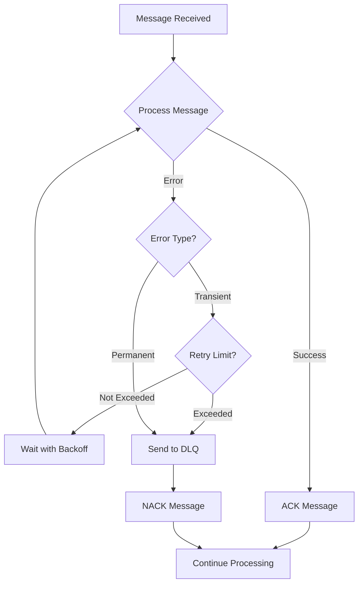

# Error Handling Strategies

This comprehensive guide covers error handling patterns and strategies in NatsPubsub for building resilient, fault-tolerant message-driven applications.

## Table of Contents

- [Overview](#overview)
- [Error Classification](#error-classification)
  - [Transient Errors](#transient-errors)
  - [Permanent Errors](#permanent-errors)
  - [Error Detection](#error-detection)
- [Retry Strategies](#retry-strategies)
  - [Fixed Backoff](#fixed-backoff)
  - [Exponential Backoff](#exponential-backoff)
  - [Jittered Backoff](#jittered-backoff)
  - [Custom Retry Logic](#custom-retry-logic)
- [Circuit Breaker Pattern](#circuit-breaker-pattern)
  - [Circuit States](#circuit-states)
  - [Implementation](#implementation)
  - [Configuration](#configuration)
- [Error Boundaries](#error-boundaries)
  - [Isolating Failures](#isolating-failures)
  - [Graceful Degradation](#graceful-degradation)
- [Fallback Strategies](#fallback-strategies)
  - [Default Responses](#default-responses)
  - [Cached Data](#cached-data)
  - [Alternative Services](#alternative-services)
- [Dead Letter Queue Integration](#dead-letter-queue-integration)
  - [DLQ Configuration](#dlq-configuration)
  - [Processing Failed Messages](#processing-failed-messages)
- [Monitoring and Alerting](#monitoring-and-alerting)
  - [Error Metrics](#error-metrics)
  - [Alert Rules](#alert-rules)
  - [Logging Strategies](#logging-strategies)
- [Best Practices](#best-practices)
- [Complete Examples](#complete-examples)
- [Related Resources](#related-resources)

---

## Overview

Effective error handling is crucial for building resilient distributed systems. This guide covers strategies for handling errors in NATS-based applications, from transient network issues to permanent failures requiring manual intervention.

### Key Principles

- **Fail Fast**: Detect and report errors quickly
- **Fail Safe**: Ensure system stability during failures
- **Fail Gracefully**: Degrade functionality rather than crash
- **Recovery**: Automatically recover from transient errors
- **Observability**: Make errors visible and actionable



---

## Error Classification

### Transient Errors

Transient errors are temporary failures that may resolve themselves with retry:

```typescript
class TransientError extends Error {
  constructor(
    message: string,
    public cause?: Error,
  ) {
    super(message);
    this.name = "TransientError";
  }
}

// Common transient errors
const TRANSIENT_ERROR_PATTERNS = [
  /ECONNREFUSED/, // Connection refused
  /ECONNRESET/, // Connection reset
  /ETIMEDOUT/, // Timeout
  /ENOTFOUND/, // DNS lookup failed
  /Network error/i, // Network issues
  /Service temporarily unavailable/i,
  /Too many requests/i, // Rate limiting
  /503/, // Service unavailable
  /504/, // Gateway timeout
];

function isTransientError(error: Error): boolean {
  return TRANSIENT_ERROR_PATTERNS.some((pattern) =>
    pattern.test(error.message),
  );
}
```

```ruby
# Ruby
class TransientError < StandardError
  attr_reader :cause

  def initialize(message, cause: nil)
    super(message)
    @cause = cause
  end
end

TRANSIENT_ERROR_PATTERNS = [
  /connection refused/i,
  /connection reset/i,
  /timeout/i,
  /network error/i,
  /service temporarily unavailable/i,
  /too many requests/i,
  /503/,
  /504/
].freeze

def transient_error?(error)
  TRANSIENT_ERROR_PATTERNS.any? do |pattern|
    pattern.match?(error.message)
  end
end
```

### Permanent Errors

Permanent errors indicate issues that won't resolve with retry:

```typescript
class PermanentError extends Error {
  constructor(
    message: string,
    public cause?: Error,
  ) {
    super(message);
    this.name = "PermanentError";
  }
}

// Common permanent errors
const PERMANENT_ERROR_PATTERNS = [
  /validation failed/i,
  /invalid input/i,
  /not found/i,
  /unauthorized/i,
  /forbidden/i,
  /400/, // Bad request
  /401/, // Unauthorized
  /403/, // Forbidden
  /404/, // Not found
  /422/, // Unprocessable entity
];

function isPermanentError(error: Error): boolean {
  return PERMANENT_ERROR_PATTERNS.some((pattern) =>
    pattern.test(error.message),
  );
}
```

```ruby
# Ruby
class PermanentError < StandardError
  attr_reader :cause

  def initialize(message, cause: nil)
    super(message)
    @cause = cause
  end
end

PERMANENT_ERROR_PATTERNS = [
  /validation failed/i,
  /invalid input/i,
  /not found/i,
  /unauthorized/i,
  /forbidden/i,
  /400/,
  /401/,
  /403/,
  /404/,
  /422/
].freeze

def permanent_error?(error)
  PERMANENT_ERROR_PATTERNS.any? do |pattern|
    pattern.match?(error.message)
  end
end
```

### Error Detection

```typescript
class ErrorClassifier {
  static classify(error: Error): "transient" | "permanent" | "unknown" {
    if (isTransientError(error)) {
      return "transient";
    }

    if (isPermanentError(error)) {
      return "permanent";
    }

    // Default to transient for unknown errors (safer)
    return "transient";
  }

  static shouldRetry(
    error: Error,
    attemptNumber: number,
    maxAttempts: number,
  ): boolean {
    if (attemptNumber >= maxAttempts) {
      return false;
    }

    const classification = this.classify(error);

    // Never retry permanent errors
    if (classification === "permanent") {
      return false;
    }

    // Retry transient and unknown errors
    return true;
  }
}
```

---

## Retry Strategies

### Fixed Backoff

Simple fixed delay between retries:

```typescript
interface RetryConfig {
  maxAttempts: number;
  delayMs: number;
}

async function retryWithFixedBackoff<T>(
  fn: () => Promise<T>,
  config: RetryConfig,
): Promise<T> {
  let lastError: Error;

  for (let attempt = 1; attempt <= config.maxAttempts; attempt++) {
    try {
      return await fn();
    } catch (error: any) {
      lastError = error;

      // Don't retry permanent errors
      if (isPermanentError(error)) {
        throw error;
      }

      // Don't delay after last attempt
      if (attempt < config.maxAttempts) {
        await sleep(config.delayMs);
      }
    }
  }

  throw lastError!;
}

// Usage
const result = await retryWithFixedBackoff(async () => await fetchData(), {
  maxAttempts: 3,
  delayMs: 1000,
});
```

```ruby
# Ruby
def retry_with_fixed_backoff(max_attempts:, delay_seconds:)
  last_error = nil

  max_attempts.times do |attempt|
    begin
      return yield
    rescue StandardError => e
      last_error = e

      # Don't retry permanent errors
      raise e if permanent_error?(e)

      # Don't delay after last attempt
      if attempt < max_attempts - 1
        sleep delay_seconds
      end
    end
  end

  raise last_error
end

# Usage
result = retry_with_fixed_backoff(max_attempts: 3, delay_seconds: 1) do
  fetch_data
end
```

### Exponential Backoff

Delay doubles with each retry:

```typescript
interface ExponentialBackoffConfig {
  maxAttempts: number;
  initialDelayMs: number;
  maxDelayMs: number;
  multiplier: number;
}

async function retryWithExponentialBackoff<T>(
  fn: () => Promise<T>,
  config: ExponentialBackoffConfig,
): Promise<T> {
  let lastError: Error;
  let delay = config.initialDelayMs;

  for (let attempt = 1; attempt <= config.maxAttempts; attempt++) {
    try {
      return await fn();
    } catch (error: any) {
      lastError = error;

      if (isPermanentError(error)) {
        throw error;
      }

      if (attempt < config.maxAttempts) {
        console.log(`Attempt ${attempt} failed, retrying in ${delay}ms...`);
        await sleep(delay);

        // Exponentially increase delay
        delay = Math.min(delay * config.multiplier, config.maxDelayMs);
      }
    }
  }

  throw lastError!;
}

// Usage
const result = await retryWithExponentialBackoff(async () => await apiCall(), {
  maxAttempts: 5,
  initialDelayMs: 1000, // Start with 1 second
  maxDelayMs: 30000, // Cap at 30 seconds
  multiplier: 2, // Double each time
});
```

```ruby
# Ruby
def retry_with_exponential_backoff(max_attempts:, initial_delay:, max_delay:, multiplier: 2)
  last_error = nil
  delay = initial_delay

  max_attempts.times do |attempt|
    begin
      return yield
    rescue StandardError => e
      last_error = e

      raise e if permanent_error?(e)

      if attempt < max_attempts - 1
        Rails.logger.info "Attempt #{attempt + 1} failed, retrying in #{delay}s..."
        sleep delay

        # Exponentially increase delay
        delay = [delay * multiplier, max_delay].min
      end
    end
  end

  raise last_error
end

# Usage
result = retry_with_exponential_backoff(
  max_attempts: 5,
  initial_delay: 1,
  max_delay: 30,
  multiplier: 2
) do
  api_call
end
```

### Jittered Backoff

Add randomness to prevent thundering herd:

```typescript
function calculateJitteredBackoff(
  attempt: number,
  baseDelayMs: number,
  maxDelayMs: number,
): number {
  // Exponential backoff: baseDelay * 2^attempt
  const exponentialDelay = baseDelayMs * Math.pow(2, attempt - 1);

  // Cap at max delay
  const cappedDelay = Math.min(exponentialDelay, maxDelayMs);

  // Add jitter (randomness between 0 and cappedDelay)
  const jitter = Math.random() * cappedDelay;

  return jitter;
}

async function retryWithJitteredBackoff<T>(
  fn: () => Promise<T>,
  config: ExponentialBackoffConfig,
): Promise<T> {
  let lastError: Error;

  for (let attempt = 1; attempt <= config.maxAttempts; attempt++) {
    try {
      return await fn();
    } catch (error: any) {
      lastError = error;

      if (isPermanentError(error)) {
        throw error;
      }

      if (attempt < config.maxAttempts) {
        const delay = calculateJitteredBackoff(
          attempt,
          config.initialDelayMs,
          config.maxDelayMs,
        );

        console.log(
          `Attempt ${attempt} failed, retrying in ${Math.round(delay)}ms...`,
        );
        await sleep(delay);
      }
    }
  }

  throw lastError!;
}
```

```ruby
# Ruby
def calculate_jittered_backoff(attempt, base_delay, max_delay)
  # Exponential backoff
  exponential_delay = base_delay * (2 ** (attempt - 1))

  # Cap at max delay
  capped_delay = [exponential_delay, max_delay].min

  # Add jitter
  rand(0.0..capped_delay)
end

def retry_with_jittered_backoff(max_attempts:, initial_delay:, max_delay:)
  last_error = nil

  max_attempts.times do |attempt|
    begin
      return yield
    rescue StandardError => e
      last_error = e

      raise e if permanent_error?(e)

      if attempt < max_attempts - 1
        delay = calculate_jittered_backoff(attempt + 1, initial_delay, max_delay)
        Rails.logger.info "Attempt #{attempt + 1} failed, retrying in #{delay.round(2)}s..."
        sleep delay
      end
    end
  end

  raise last_error
end
```

### Custom Retry Logic

```typescript
class RetryPolicy {
  constructor(
    public maxAttempts: number,
    public shouldRetry: (error: Error, attempt: number) => boolean,
    public calculateDelay: (attempt: number) => number,
  ) {}

  async execute<T>(fn: () => Promise<T>): Promise<T> {
    let lastError: Error;

    for (let attempt = 1; attempt <= this.maxAttempts; attempt++) {
      try {
        return await fn();
      } catch (error: any) {
        lastError = error;

        if (!this.shouldRetry(error, attempt)) {
          throw error;
        }

        if (attempt < this.maxAttempts) {
          const delay = this.calculateDelay(attempt);
          await sleep(delay);
        }
      }
    }

    throw lastError!;
  }
}

// Custom policy for API calls
const apiRetryPolicy = new RetryPolicy(
  5, // max attempts
  (error, attempt) => {
    // Retry only transient errors
    if (isPermanentError(error)) return false;

    // Stop retrying after 5 attempts
    if (attempt >= 5) return false;

    // Special handling for rate limits
    if (error.message.includes("429")) {
      return attempt < 10; // More retries for rate limits
    }

    return true;
  },
  (attempt) => {
    // Jittered exponential backoff
    return calculateJitteredBackoff(attempt, 1000, 30000);
  },
);

// Usage
const data = await apiRetryPolicy.execute(async () => {
  return await fetch("https://api.example.com/data");
});
```

---

## Circuit Breaker Pattern

### Circuit States

The circuit breaker prevents cascading failures by temporarily blocking calls to failing services:

```typescript
enum CircuitState {
  CLOSED = "closed", // Normal operation
  OPEN = "open", // Blocking calls
  HALF_OPEN = "half-open", // Testing recovery
}

interface CircuitBreakerConfig {
  failureThreshold: number; // Failures before opening
  successThreshold: number; // Successes to close from half-open
  timeout: number; // Time before attempting recovery (ms)
  monitoringPeriod: number; // Window for counting failures (ms)
}
```

### Implementation

```typescript
class CircuitBreaker {
  private state: CircuitState = CircuitState.CLOSED;
  private failures: number = 0;
  private successes: number = 0;
  private lastFailureTime: number = 0;
  private nextAttemptTime: number = 0;

  constructor(private config: CircuitBreakerConfig) {}

  async execute<T>(fn: () => Promise<T>): Promise<T> {
    // Check if circuit is open
    if (this.state === CircuitState.OPEN) {
      if (Date.now() < this.nextAttemptTime) {
        throw new Error("Circuit breaker is OPEN");
      }

      // Try half-open
      this.state = CircuitState.HALF_OPEN;
      this.successes = 0;
    }

    try {
      const result = await fn();
      this.onSuccess();
      return result;
    } catch (error) {
      this.onFailure();
      throw error;
    }
  }

  private onSuccess(): void {
    this.failures = 0;

    if (this.state === CircuitState.HALF_OPEN) {
      this.successes++;

      if (this.successes >= this.config.successThreshold) {
        this.state = CircuitState.CLOSED;
        console.log("Circuit breaker closed");
      }
    }
  }

  private onFailure(): void {
    this.failures++;
    this.lastFailureTime = Date.now();

    if (this.state === CircuitState.HALF_OPEN) {
      this.open();
      return;
    }

    if (this.failures >= this.config.failureThreshold) {
      this.open();
    }
  }

  private open(): void {
    this.state = CircuitState.OPEN;
    this.nextAttemptTime = Date.now() + this.config.timeout;
    console.log(
      `Circuit breaker opened until ${new Date(this.nextAttemptTime)}`,
    );
  }

  getState(): CircuitState {
    return this.state;
  }

  getStats() {
    return {
      state: this.state,
      failures: this.failures,
      successes: this.successes,
      lastFailureTime: this.lastFailureTime,
      nextAttemptTime: this.nextAttemptTime,
    };
  }
}

// Usage
const breaker = new CircuitBreaker({
  failureThreshold: 5, // Open after 5 failures
  successThreshold: 2, // Close after 2 successes
  timeout: 60000, // Wait 1 minute before retry
  monitoringPeriod: 10000, // 10 second window
});

try {
  const result = await breaker.execute(async () => {
    return await externalApiCall();
  });
} catch (error) {
  if (error.message === "Circuit breaker is OPEN") {
    // Use fallback
    return getFallbackData();
  }
  throw error;
}
```

```ruby
# Ruby
class CircuitBreaker
  attr_reader :state, :failures, :successes

  STATES = {
    closed: 'closed',
    open: 'open',
    half_open: 'half_open'
  }.freeze

  def initialize(config)
    @config = config
    @state = STATES[:closed]
    @failures = 0
    @successes = 0
    @last_failure_time = nil
    @next_attempt_time = nil
  end

  def execute
    # Check if circuit is open
    if @state == STATES[:open]
      if Time.current < @next_attempt_time
        raise 'Circuit breaker is OPEN'
      end

      # Try half-open
      @state = STATES[:half_open]
      @successes = 0
    end

    begin
      result = yield
      on_success
      result
    rescue StandardError => e
      on_failure
      raise e
    end
  end

  private

  def on_success
    @failures = 0

    if @state == STATES[:half_open]
      @successes += 1

      if @successes >= @config[:success_threshold]
        @state = STATES[:closed]
        Rails.logger.info 'Circuit breaker closed'
      end
    end
  end

  def on_failure
    @failures += 1
    @last_failure_time = Time.current

    if @state == STATES[:half_open]
      open_circuit
      return
    end

    open_circuit if @failures >= @config[:failure_threshold]
  end

  def open_circuit
    @state = STATES[:open]
    @next_attempt_time = Time.current + @config[:timeout]
    Rails.logger.warn "Circuit breaker opened until #{@next_attempt_time}"
  end

  def stats
    {
      state: @state,
      failures: @failures,
      successes: @successes,
      last_failure_time: @last_failure_time,
      next_attempt_time: @next_attempt_time
    }
  end
end

# Usage
breaker = CircuitBreaker.new(
  failure_threshold: 5,
  success_threshold: 2,
  timeout: 60.seconds
)

begin
  result = breaker.execute do
    external_api_call
  end
rescue StandardError => e
  if e.message == 'Circuit breaker is OPEN'
    # Use fallback
    get_fallback_data
  else
    raise e
  end
end
```

### Configuration

```typescript
// Different configurations for different services
const criticalServiceBreaker = new CircuitBreaker({
  failureThreshold: 3, // Fail fast
  successThreshold: 5, // Require more successes
  timeout: 30000, // Short timeout
  monitoringPeriod: 5000,
});

const nonCriticalServiceBreaker = new CircuitBreaker({
  failureThreshold: 10, // More tolerant
  successThreshold: 2,
  timeout: 120000, // Longer timeout
  monitoringPeriod: 30000,
});
```

---

## Error Boundaries

### Isolating Failures

```typescript
class MessageProcessor {
  async processWithErrorBoundary(message: any, metadata: any): Promise<void> {
    try {
      // Critical processing
      await this.processCriticalData(message);
    } catch (error) {
      // Log but don't let it stop non-critical processing
      console.error("Critical processing failed:", error);
      await this.sendAlert("Critical processing failed", error);
      // Continue with non-critical processing
    }

    try {
      // Non-critical processing
      await this.processAnalytics(message);
    } catch (error) {
      // Just log, don't fail the entire message
      console.error("Analytics processing failed:", error);
    }

    try {
      // Another independent operation
      await this.updateCache(message);
    } catch (error) {
      console.error("Cache update failed:", error);
    }
  }

  private async processCriticalData(message: any): Promise<void> {
    // Must succeed
    await this.updateDatabase(message);
  }

  private async processAnalytics(message: any): Promise<void> {
    // Nice to have
    await this.sendToAnalytics(message);
  }

  private async updateCache(message: any): Promise<void> {
    // Optional
    await this.redis.set(message.id, JSON.stringify(message));
  }
}
```

### Graceful Degradation

```typescript
class OrderService {
  async createOrder(orderData: any): Promise<Order> {
    let order: Order;

    // Critical: Create order in database
    try {
      order = await this.db.orders.create(orderData);
    } catch (error) {
      // Cannot proceed without order
      throw error;
    }

    // Important but not critical: Send confirmation email
    try {
      await this.emailService.sendOrderConfirmation(order);
    } catch (error) {
      console.error("Failed to send confirmation email:", error);
      // Queue for retry later
      await this.queueEmailRetry(order.id);
    }

    // Nice to have: Update recommendations
    try {
      await this.recommendationService.updateForOrder(order);
    } catch (error) {
      console.error("Failed to update recommendations:", error);
      // Silently fail - not critical
    }

    // Nice to have: Track analytics
    try {
      await this.analytics.trackOrderCreated(order);
    } catch (error) {
      console.error("Failed to track analytics:", error);
      // Silently fail
    }

    return order;
  }
}
```

---

## Fallback Strategies

### Default Responses

```typescript
async function getUserProfile(userId: string): Promise<UserProfile> {
  try {
    return await api.getUserProfile(userId);
  } catch (error) {
    console.error("Failed to fetch user profile:", error);

    // Return default profile
    return {
      id: userId,
      name: "Unknown User",
      email: "",
      avatar: "/default-avatar.png",
      preferences: {},
    };
  }
}
```

### Cached Data

```typescript
class ProductService {
  constructor(
    private api: ProductAPI,
    private cache: RedisCache,
  ) {}

  async getProduct(productId: string): Promise<Product> {
    try {
      // Try to fetch fresh data
      const product = await this.api.getProduct(productId);

      // Update cache
      await this.cache.set(`product:${productId}`, product, 3600);

      return product;
    } catch (error) {
      console.error("API call failed, trying cache:", error);

      // Fallback to cached data
      const cached = await this.cache.get(`product:${productId}`);

      if (cached) {
        console.log("Using cached data");
        return cached;
      }

      // No cache available
      throw error;
    }
  }
}
```

### Alternative Services

```typescript
class PaymentService {
  constructor(
    private primaryProvider: StripeProvider,
    private fallbackProvider: PayPalProvider,
  ) {}

  async processPayment(paymentData: PaymentData): Promise<PaymentResult> {
    try {
      // Try primary provider
      return await this.primaryProvider.charge(paymentData);
    } catch (error) {
      console.error("Primary payment provider failed:", error);

      // Try fallback provider
      try {
        console.log("Using fallback payment provider");
        return await this.fallbackProvider.charge(paymentData);
      } catch (fallbackError) {
        console.error("Fallback payment provider also failed:", fallbackError);

        // Both failed - throw error
        throw new Error("All payment providers failed");
      }
    }
  }
}
```

---

## Dead Letter Queue Integration

### DLQ Configuration

```typescript
import { Subscriber, MessageContext } from "nats-pubsub";

class ResilientSubscriber extends Subscriber {
  private maxRetries = 3;
  private dlqSubject = "dlq.failed-messages";

  async handle(message: any, metadata: MessageContext): Promise<void> {
    try {
      await this.processMessage(message, metadata);
    } catch (error: any) {
      await this.handleError(error, message, metadata);
    }
  }

  private async handleError(
    error: Error,
    message: any,
    metadata: MessageContext,
  ): Promise<void> {
    const deliveries = metadata.deliveries || 0;

    // Check if we should retry
    if (deliveries < this.maxRetries && isTransientError(error)) {
      console.log(
        `Transient error, will retry (attempt ${deliveries}/${this.maxRetries})`,
      );
      throw error; // NACK for retry
    }

    // Max retries reached or permanent error - send to DLQ
    console.error(`Sending message to DLQ after ${deliveries} attempts`);

    await this.sendToDLQ({
      originalSubject: metadata.subject,
      originalMessage: message,
      error: error.message,
      stack: error.stack,
      attempts: deliveries,
      failedAt: new Date(),
      metadata: metadata,
    });

    // ACK the message to prevent further redelivery
  }

  private async sendToDLQ(dlqMessage: any): Promise<void> {
    await this.nats.publish(this.dlqSubject, dlqMessage);
  }

  private async processMessage(
    message: any,
    metadata: MessageContext,
  ): Promise<void> {
    // Your processing logic
  }
}
```

```ruby
# Ruby
class ResilientSubscriber < NatsPubsub::Subscriber
  subscribe_to "orders.*"

  MAX_RETRIES = 3
  DLQ_SUBJECT = 'dlq.failed-messages'

  def handle(message, context)
    process_message(message, context)
  rescue StandardError => e
    handle_error(e, message, context)
  end

  private

  def handle_error(error, message, context)
    deliveries = context.deliveries || 0

    # Check if we should retry
    if deliveries < MAX_RETRIES && transient_error?(error)
      Rails.logger.info "Transient error, will retry (attempt #{deliveries}/#{MAX_RETRIES})"
      raise error # NACK for retry
    end

    # Max retries reached or permanent error - send to DLQ
    Rails.logger.error "Sending message to DLQ after #{deliveries} attempts"

    send_to_dlq(
      original_subject: context.subject,
      original_message: message,
      error: error.message,
      backtrace: error.backtrace,
      attempts: deliveries,
      failed_at: Time.current,
      metadata: context
    )

    # ACK the message to prevent further redelivery
  end

  def send_to_dlq(dlq_message)
    NatsPubsub.client.publish(DLQ_SUBJECT, dlq_message)
  end

  def process_message(message, context)
    # Your processing logic
  end
end
```

### Processing Failed Messages

```typescript
class DLQProcessor {
  constructor(
    private repository: FailedMessageRepository,
    private nats: NatsConnection,
  ) {}

  async processDLQMessage(dlqMessage: any): Promise<void> {
    // Store in database for investigation
    await this.repository.store({
      subject: dlqMessage.originalSubject,
      payload: JSON.stringify(dlqMessage.originalMessage),
      error: dlqMessage.error,
      stack: dlqMessage.stack,
      attempts: dlqMessage.attempts,
      failedAt: dlqMessage.failedAt,
      metadata: JSON.stringify(dlqMessage.metadata),
    });

    // Send alert for critical messages
    if (dlqMessage.originalSubject.includes("payment")) {
      await this.sendCriticalAlert(dlqMessage);
    }
  }

  async retryFailedMessage(messageId: string): Promise<void> {
    const failedMessage = await this.repository.getById(messageId);

    if (!failedMessage) {
      throw new Error("Message not found");
    }

    // Republish to original subject
    await this.nats.publish(
      failedMessage.subject,
      JSON.parse(failedMessage.payload),
    );

    // Mark as retried
    await this.repository.markAsRetried(messageId);
  }

  async getFailedMessages(filters?: {
    subject?: string;
    fromDate?: Date;
    toDate?: Date;
  }): Promise<FailedMessage[]> {
    return await this.repository.query(filters);
  }

  private async sendCriticalAlert(dlqMessage: any): Promise<void> {
    await this.alertService.send({
      severity: "critical",
      title: "Critical Message Failed",
      message: `Subject: ${dlqMessage.originalSubject}\nError: ${dlqMessage.error}`,
      metadata: dlqMessage,
    });
  }
}
```

---

## Monitoring and Alerting

### Error Metrics

```typescript
class ErrorMetrics {
  private errorCounts = new Map<string, number>();
  private lastErrors = new Map<string, Date>();

  recordError(error: Error, context: any): void {
    const errorType = error.name || "Unknown";

    // Increment counter
    const count = this.errorCounts.get(errorType) || 0;
    this.errorCounts.set(errorType, count + 1);

    // Track last occurrence
    this.lastErrors.set(errorType, new Date());

    // Export to monitoring
    metrics.increment("errors.total", {
      error_type: errorType,
      subject: context.subject,
      permanent: isPermanentError(error),
    });
  }

  getErrorRate(windowMs: number = 60000): number {
    const now = Date.now();
    let recentErrors = 0;

    for (const [_, timestamp] of this.lastErrors) {
      if (now - timestamp.getTime() < windowMs) {
        recentErrors++;
      }
    }

    return recentErrors / (windowMs / 1000); // Errors per second
  }

  getStats() {
    return {
      errorCounts: Object.fromEntries(this.errorCounts),
      lastErrors: Object.fromEntries(this.lastErrors),
      errorRate: this.getErrorRate(),
    };
  }
}

// Global error tracking
const errorMetrics = new ErrorMetrics();

// Use in subscriber
class MonitoredSubscriber extends Subscriber {
  async handle(message: any, metadata: MessageContext): Promise<void> {
    try {
      await this.processMessage(message);
    } catch (error: any) {
      errorMetrics.recordError(error, { subject: metadata.subject });
      throw error;
    }
  }
}

// Periodic reporting
setInterval(() => {
  const stats = errorMetrics.getStats();
  console.log("Error statistics:", stats);

  // Alert on high error rate
  if (stats.errorRate > 10) {
    alerting.send({
      severity: "warning",
      title: "High Error Rate",
      message: `Current error rate: ${stats.errorRate.toFixed(2)}/sec`,
    });
  }
}, 60000);
```

### Alert Rules

```typescript
interface AlertRule {
  name: string;
  condition: (error: Error, context: any) => boolean;
  severity: "info" | "warning" | "critical";
  message: (error: Error, context: any) => string;
}

const alertRules: AlertRule[] = [
  {
    name: "permanent-error-in-critical-path",
    condition: (error, context) =>
      isPermanentError(error) && context.subject.includes("payment"),
    severity: "critical",
    message: (error, context) =>
      `Permanent error in payment processing: ${error.message}`,
  },
  {
    name: "high-retry-count",
    condition: (error, context) => context.deliveries > 5,
    severity: "warning",
    message: (error, context) =>
      `Message retried ${context.deliveries} times: ${context.subject}`,
  },
  {
    name: "database-connection-error",
    condition: (error) =>
      error.message.includes("ECONNREFUSED") &&
      error.message.includes("database"),
    severity: "critical",
    message: () => "Database connection failed",
  },
];

async function checkAlertRules(error: Error, context: any): Promise<void> {
  for (const rule of alertRules) {
    if (rule.condition(error, context)) {
      await alerting.send({
        severity: rule.severity,
        title: rule.name,
        message: rule.message(error, context),
        error: error.message,
        stack: error.stack,
        context: context,
      });
    }
  }
}
```

### Logging Strategies

```typescript
class StructuredLogger {
  error(message: string, error: Error, context?: any): void {
    console.error(
      JSON.stringify({
        level: "error",
        message,
        error: {
          name: error.name,
          message: error.message,
          stack: error.stack,
          classification: ErrorClassifier.classify(error),
        },
        context,
        timestamp: new Date().toISOString(),
        environment: process.env.NODE_ENV,
      }),
    );
  }

  warn(message: string, details?: any): void {
    console.warn(
      JSON.stringify({
        level: "warn",
        message,
        details,
        timestamp: new Date().toISOString(),
      }),
    );
  }

  info(message: string, details?: any): void {
    console.log(
      JSON.stringify({
        level: "info",
        message,
        details,
        timestamp: new Date().toISOString(),
      }),
    );
  }
}

const logger = new StructuredLogger();

// Usage in subscriber
class LoggingSubscriber extends Subscriber {
  async handle(message: any, metadata: MessageContext): Promise<void> {
    try {
      await this.processMessage(message);
      logger.info("Message processed successfully", {
        subject: metadata.subject,
        eventId: metadata.eventId,
      });
    } catch (error: any) {
      logger.error("Message processing failed", error, {
        subject: metadata.subject,
        eventId: metadata.eventId,
        deliveries: metadata.deliveries,
        shouldRetry: ErrorClassifier.shouldRetry(error, metadata.deliveries, 3),
      });
      throw error;
    }
  }
}
```

```ruby
# Ruby structured logging
class StructuredLogger
  def error(message, error, context = {})
    Rails.logger.error({
      level: 'error',
      message: message,
      error: {
        class: error.class.name,
        message: error.message,
        backtrace: error.backtrace&.first(5),
        classification: classify_error(error)
      },
      context: context,
      timestamp: Time.current.iso8601,
      environment: Rails.env
    }.to_json)
  end

  def warn(message, details = {})
    Rails.logger.warn({
      level: 'warn',
      message: message,
      details: details,
      timestamp: Time.current.iso8601
    }.to_json)
  end

  def info(message, details = {})
    Rails.logger.info({
      level: 'info',
      message: message,
      details: details,
      timestamp: Time.current.iso8601
    }.to_json)
  end

  private

  def classify_error(error)
    return 'permanent' if permanent_error?(error)
    return 'transient' if transient_error?(error)
    'unknown'
  end
end
```

---

## Best Practices

### 1. Always Classify Errors

```typescript
// ✅ GOOD: Classify errors to determine retry strategy
try {
  await processMessage(message);
} catch (error: any) {
  const classification = ErrorClassifier.classify(error);

  if (classification === "permanent") {
    // Don't retry, send to DLQ
    await sendToDLQ(message, error);
  } else {
    // Retry with backoff
    throw error;
  }
}

// ❌ BAD: Retry all errors blindly
try {
  await processMessage(message);
} catch (error) {
  throw error; // Will retry even permanent errors
}
```

### 2. Use Appropriate Backoff

```typescript
// ✅ GOOD: Exponential backoff with jitter
await retryWithJitteredBackoff(() => apiCall(), {
  maxAttempts: 5,
  initialDelayMs: 1000,
  maxDelayMs: 30000,
});

// ❌ BAD: No backoff (hammers the service)
for (let i = 0; i < 5; i++) {
  try {
    await apiCall();
    break;
  } catch (error) {
    // Retry immediately
  }
}
```

### 3. Implement Circuit Breakers

```typescript
// ✅ GOOD: Circuit breaker for external services
const breaker = new CircuitBreaker({
  failureThreshold: 5,
  timeout: 60000,
});

try {
  const data = await breaker.execute(() => externalApi.getData());
} catch (error) {
  // Use fallback or cached data
}

// ❌ BAD: No protection against cascading failures
await externalApi.getData(); // Can bring down your service
```

### 4. Provide Fallbacks

```typescript
// ✅ GOOD: Graceful degradation
async function getRecommendations(userId: string): Promise<Product[]> {
  try {
    return await recommendationService.getForUser(userId);
  } catch (error) {
    logger.warn("Recommendation service failed, using defaults", error);
    return await getDefaultRecommendations();
  }
}

// ❌ BAD: No fallback
async function getRecommendations(userId: string): Promise<Product[]> {
  return await recommendationService.getForUser(userId);
  // If this fails, user sees error page
}
```

### 5. Monitor Error Rates

```typescript
// ✅ GOOD: Track and alert on errors
errorMetrics.recordError(error, context);

if (errorMetrics.getErrorRate() > THRESHOLD) {
  alerting.send("High error rate detected");
}

// ❌ BAD: Silent failures
try {
  await process();
} catch (error) {
  // Silently fail
}
```

### 6. Use Structured Logging

```typescript
// ✅ GOOD: Structured logging
logger.error("Processing failed", error, {
  subject: metadata.subject,
  eventId: metadata.eventId,
  userId: message.userId,
  classification: ErrorClassifier.classify(error),
});

// ❌ BAD: Unstructured logging
console.error("Error:", error.message);
```

### 7. Implement DLQ for Failed Messages

```typescript
// ✅ GOOD: Failed messages go to DLQ for investigation
if (deliveries >= MAX_RETRIES) {
  await sendToDLQ(message, error);
  return; // ACK to stop redelivery
}

// ❌ BAD: Messages lost or retried forever
throw error; // Will retry forever
```

### 8. Set Retry Limits

```typescript
// ✅ GOOD: Limit retries to prevent infinite loops
const MAX_RETRIES = 3;
if (deliveries >= MAX_RETRIES) {
  await sendToDLQ(message, error);
  return;
}

// ❌ BAD: No retry limit
// Will retry forever, wasting resources
```

---

## Complete Examples

### JavaScript/TypeScript Complete Example

```typescript
import { Subscriber, MessageContext } from "nats-pubsub";

// Retry policy
class RetryPolicy {
  async execute<T>(fn: () => Promise<T>, maxAttempts: number = 3): Promise<T> {
    let lastError: Error;

    for (let attempt = 1; attempt <= maxAttempts; attempt++) {
      try {
        return await fn();
      } catch (error: any) {
        lastError = error;

        if (isPermanentError(error)) {
          throw error;
        }

        if (attempt < maxAttempts) {
          const delay = calculateJitteredBackoff(attempt, 1000, 30000);
          await sleep(delay);
        }
      }
    }

    throw lastError!;
  }
}

// Circuit breaker for external services
const paymentServiceBreaker = new CircuitBreaker({
  failureThreshold: 5,
  successThreshold: 2,
  timeout: 60000,
  monitoringPeriod: 10000,
});

// Complete subscriber with all error handling
class OrderSubscriber extends Subscriber {
  private retryPolicy = new RetryPolicy();
  private maxDeliveries = 3;
  private dlqSubject = "dlq.orders";

  constructor() {
    super("production.*.order.*");
  }

  async handle(message: any, metadata: MessageContext): Promise<void> {
    const deliveries = metadata.deliveries || 0;

    try {
      // Process with error handling
      await this.processOrder(message, metadata);

      // Log success
      logger.info("Order processed successfully", {
        orderId: message.orderId,
        subject: metadata.subject,
        eventId: metadata.eventId,
      });
    } catch (error: any) {
      // Log error with context
      logger.error("Order processing failed", error, {
        orderId: message.orderId,
        subject: metadata.subject,
        eventId: metadata.eventId,
        deliveries: deliveries,
        classification: ErrorClassifier.classify(error),
      });

      // Record metrics
      errorMetrics.recordError(error, metadata);

      // Check if we should retry
      if (this.shouldRetry(error, deliveries)) {
        console.log(
          `Retrying message (attempt ${deliveries}/${this.maxDeliveries})`,
        );
        throw error; // NACK for retry
      }

      // Send to DLQ
      await this.sendToDLQ(message, metadata, error, deliveries);

      // ACK to prevent further redelivery
    }
  }

  private async processOrder(
    message: any,
    metadata: MessageContext,
  ): Promise<void> {
    // Validate input
    this.validateOrder(message);

    // Update order with retry
    await this.retryPolicy.execute(async () => {
      await this.updateOrderStatus(message.orderId, "processing");
    });

    // Process payment with circuit breaker
    let paymentResult;
    try {
      paymentResult = await paymentServiceBreaker.execute(async () => {
        return await this.processPayment(message);
      });
    } catch (error: any) {
      if (error.message === "Circuit breaker is OPEN") {
        // Use fallback payment method
        paymentResult = await this.processFallbackPayment(message);
      } else {
        throw error;
      }
    }

    // Update order
    await this.updateOrderStatus(message.orderId, "completed");

    // Non-critical: Send confirmation (with error boundary)
    try {
      await this.sendOrderConfirmation(message);
    } catch (error) {
      logger.warn("Failed to send confirmation", { error });
      // Don't fail the entire message
    }

    // Non-critical: Update analytics (with error boundary)
    try {
      await this.updateAnalytics(message);
    } catch (error) {
      logger.warn("Failed to update analytics", { error });
      // Don't fail the entire message
    }
  }

  private validateOrder(message: any): void {
    if (!message.orderId) {
      throw new PermanentError("Missing orderId");
    }

    if (!message.customerId) {
      throw new PermanentError("Missing customerId");
    }

    if (!message.items || message.items.length === 0) {
      throw new PermanentError("Order has no items");
    }
  }

  private shouldRetry(error: Error, deliveries: number): boolean {
    // Never retry permanent errors
    if (isPermanentError(error)) {
      return false;
    }

    // Check retry limit
    if (deliveries >= this.maxDeliveries) {
      return false;
    }

    return true;
  }

  private async sendToDLQ(
    message: any,
    metadata: MessageContext,
    error: Error,
    attempts: number,
  ): Promise<void> {
    const dlqMessage = {
      originalSubject: metadata.subject,
      originalMessage: message,
      error: {
        message: error.message,
        stack: error.stack,
        classification: ErrorClassifier.classify(error),
      },
      attempts,
      failedAt: new Date(),
      metadata: {
        eventId: metadata.eventId,
        deliveries: metadata.deliveries,
        subject: metadata.subject,
      },
    };

    await this.nats.publish(this.dlqSubject, dlqMessage);

    logger.error("Message sent to DLQ", error, {
      subject: metadata.subject,
      eventId: metadata.eventId,
      attempts,
    });

    // Alert for critical orders
    if (message.total > 1000) {
      await this.sendCriticalAlert(dlqMessage);
    }
  }

  private async updateOrderStatus(
    orderId: string,
    status: string,
  ): Promise<void> {
    // Implementation
  }

  private async processPayment(message: any): Promise<any> {
    // Implementation
  }

  private async processFallbackPayment(message: any): Promise<any> {
    // Fallback implementation
  }

  private async sendOrderConfirmation(message: any): Promise<void> {
    // Implementation
  }

  private async updateAnalytics(message: any): Promise<void> {
    // Implementation
  }

  private async sendCriticalAlert(dlqMessage: any): Promise<void> {
    await alerting.send({
      severity: "critical",
      title: "High-Value Order Failed",
      message: `Order ${dlqMessage.originalMessage.orderId} failed after ${dlqMessage.attempts} attempts`,
      details: dlqMessage,
    });
  }
}

// Register subscriber
const subscriber = new OrderSubscriber();
await NatsPubsub.subscribe(subscriber);
```

### Ruby/Rails Complete Example

```ruby
# app/subscribers/order_subscriber.rb
class OrderSubscriber < NatsPubsub::Subscriber
  subscribe_to "production.*.order.*"

  MAX_DELIVERIES = 3
  DLQ_SUBJECT = 'dlq.orders'

  def handle(message, context)
    deliveries = context.deliveries || 0

    begin
      # Process with error handling
      process_order(message, context)

      # Log success
      Rails.logger.info({
        message: 'Order processed successfully',
        order_id: message['order_id'],
        subject: context.subject,
        event_id: context.event_id
      }.to_json)

    rescue StandardError => e
      # Log error with context
      Rails.logger.error({
        message: 'Order processing failed',
        error: {
          class: e.class.name,
          message: e.message,
          backtrace: e.backtrace&.first(5)
        },
        order_id: message['order_id'],
        subject: context.subject,
        event_id: context.event_id,
        deliveries: deliveries,
        classification: classify_error(e)
      }.to_json)

      # Record metrics
      ErrorMetrics.record(e, context)

      # Check if we should retry
      if should_retry?(e, deliveries)
        Rails.logger.info "Retrying message (attempt #{deliveries}/#{MAX_DELIVERIES})"
        raise e # NACK for retry
      end

      # Send to DLQ
      send_to_dlq(message, context, e, deliveries)

      # ACK to prevent further redelivery
    end
  end

  private

  def process_order(message, context)
    # Validate input
    validate_order(message)

    # Update order with retry
    retry_with_backoff do
      update_order_status(message['order_id'], 'processing')
    end

    # Process payment with circuit breaker
    payment_result = process_with_circuit_breaker do
      process_payment(message)
    end

    # Update order
    update_order_status(message['order_id'], 'completed')

    # Non-critical: Send confirmation (with error boundary)
    begin
      send_order_confirmation(message)
    rescue StandardError => e
      Rails.logger.warn "Failed to send confirmation: #{e.message}"
      # Don't fail the entire message
    end

    # Non-critical: Update analytics (with error boundary)
    begin
      update_analytics(message)
    rescue StandardError => e
      Rails.logger.warn "Failed to update analytics: #{e.message}"
      # Don't fail the entire message
    end
  end

  def validate_order(message)
    raise PermanentError, 'Missing order_id' unless message['order_id']
    raise PermanentError, 'Missing customer_id' unless message['customer_id']
    raise PermanentError, 'Order has no items' if message['items'].blank?
  end

  def should_retry?(error, deliveries)
    # Never retry permanent errors
    return false if permanent_error?(error)

    # Check retry limit
    return false if deliveries >= MAX_DELIVERIES

    true
  end

  def send_to_dlq(message, context, error, attempts)
    dlq_message = {
      original_subject: context.subject,
      original_message: message,
      error: {
        message: error.message,
        backtrace: error.backtrace,
        classification: classify_error(error)
      },
      attempts: attempts,
      failed_at: Time.current,
      metadata: {
        event_id: context.event_id,
        deliveries: context.deliveries,
        subject: context.subject
      }
    }

    NatsPubsub.client.publish(DLQ_SUBJECT, dlq_message)

    Rails.logger.error "Message sent to DLQ: #{context.event_id}"

    # Alert for critical orders
    if message['total'].to_f > 1000
      send_critical_alert(dlq_message)
    end
  end

  def retry_with_backoff(max_attempts: 3, &block)
    retry_with_exponential_backoff(
      max_attempts: max_attempts,
      initial_delay: 1,
      max_delay: 30,
      &block
    )
  end

  def process_with_circuit_breaker(&block)
    circuit_breaker = CircuitBreaker.new(
      failure_threshold: 5,
      success_threshold: 2,
      timeout: 60.seconds
    )

    circuit_breaker.execute(&block)
  rescue StandardError => e
    if e.message == 'Circuit breaker is OPEN'
      # Use fallback
      process_fallback_payment
    else
      raise e
    end
  end

  def update_order_status(order_id, status)
    # Implementation
  end

  def process_payment(message)
    # Implementation
  end

  def process_fallback_payment
    # Fallback implementation
  end

  def send_order_confirmation(message)
    # Implementation
  end

  def update_analytics(message)
    # Implementation
  end

  def send_critical_alert(dlq_message)
    AlertService.send(
      severity: 'critical',
      title: 'High-Value Order Failed',
      message: "Order #{dlq_message[:original_message]['order_id']} failed after #{dlq_message[:attempts]} attempts",
      details: dlq_message
    )
  end

  def classify_error(error)
    return 'permanent' if permanent_error?(error)
    return 'transient' if transient_error?(error)
    'unknown'
  end
end
```

---

## Related Resources

### Documentation

- [Inbox/Outbox Pattern](inbox-outbox.md) - Exactly-once message processing and transactional publishing
- [DLQ Pattern](dlq.md) - Dead letter queue handling
- [Schema Validation](schema-validation.md) - Validate messages

### External Resources

- [Circuit Breaker Pattern](https://martinfowler.com/bliki/CircuitBreaker.html)
- [Retry Pattern](https://docs.microsoft.com/en-us/azure/architecture/patterns/retry)
- [Exponential Backoff](https://en.wikipedia.org/wiki/Exponential_backoff)
- [Resilience Patterns](https://www.microsoft.com/en-us/research/publication/implementing-resilience-patterns/)

---

**Navigation:**

- [← Back to Patterns](index.md)
- [Next: Schema Validation →](schema-validation.md)
- [Documentation Home](../index.md)
