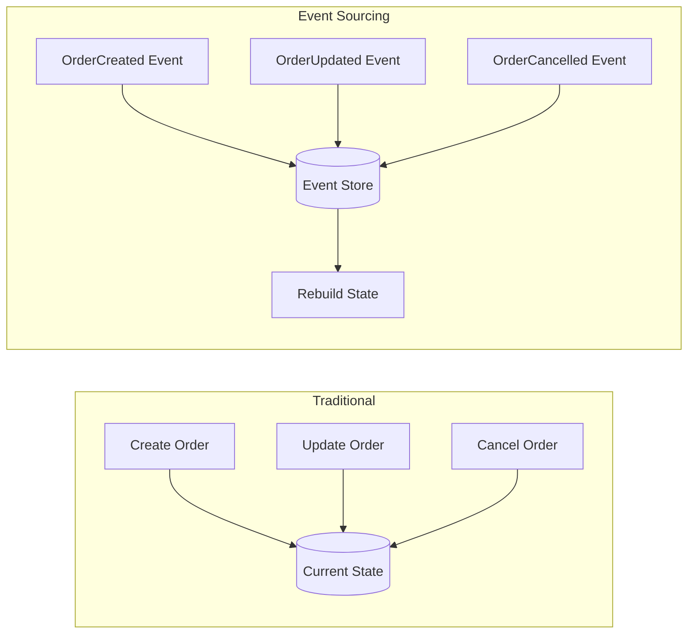
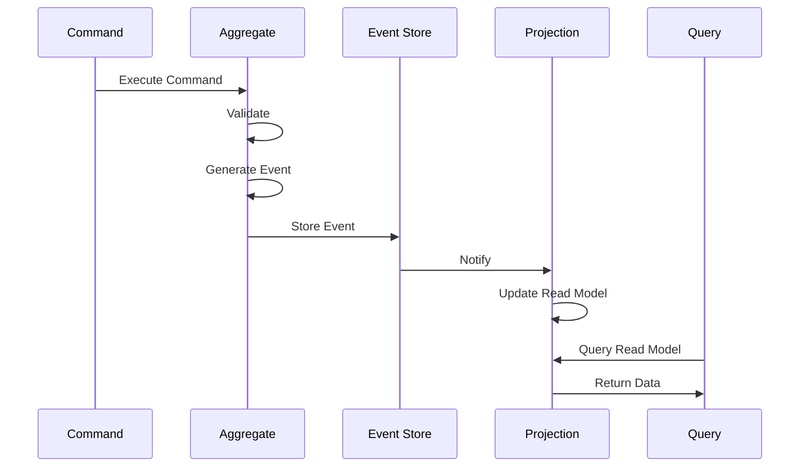

# Event Sourcing Pattern

This comprehensive guide covers Event Sourcing with NatsPubsub, enabling you to build systems that capture all state changes as a sequence of events.

## Table of Contents

- [Overview](#overview)
- [What is Event Sourcing](#what-is-event-sourcing)
- [Core Concepts](#core-concepts)
- [When to Use Event Sourcing](#when-to-use-event-sourcing)
- [Event Store Implementation](#event-store-implementation)
  - [JavaScript Event Store](#javascript-event-store)
  - [Ruby Event Store](#ruby-event-store)
- [Event Replay and Projections](#event-replay-and-projections)
  - [Building Projections](#building-projections)
  - [Replay Strategies](#replay-strategies)
- [CQRS Integration](#cqrs-integration)
  - [Command Side](#command-side)
  - [Query Side](#query-side)
- [Snapshotting](#snapshotting)
  - [When to Snapshot](#when-to-snapshot)
  - [Snapshot Strategies](#snapshot-strategies)
- [Event Versioning](#event-versioning)
  - [Schema Evolution](#schema-evolution)
  - [Upcasting](#upcasting)
- [Aggregates](#aggregates)
  - [Aggregate Design](#aggregate-design)
  - [Aggregate Root](#aggregate-root)
- [Complete Examples](#complete-examples)
  - [E-commerce Order System](#e-commerce-order-system)
  - [Banking Account System](#banking-account-system)
- [Testing Event-Sourced Systems](#testing-event-sourced-systems)
- [Best Practices](#best-practices)
- [Performance Considerations](#performance-considerations)
- [Troubleshooting](#troubleshooting)
- [Related Resources](#related-resources)

---

## Overview

Event Sourcing is a pattern where all changes to application state are stored as a sequence of events. Instead of storing just the current state, you store all the events that led to that state.

### Traditional State Storage vs Event Sourcing



### Key Benefits

- **Complete Audit Trail**: Every state change is recorded
- **Time Travel**: Reconstruct state at any point in time
- **Event Replay**: Rebuild read models from events
- **Business Intelligence**: Rich historical data for analysis
- **Debugging**: Reproduce bugs by replaying events
- **Flexibility**: Create new views without changing write side

---

## What is Event Sourcing

Event Sourcing stores all changes to application state as a sequence of events. Current state is derived by replaying these events.

### Example: Bank Account

**Traditional Approach:**

```sql
-- Current state only
accounts: id | balance
            1 | 1000
```

**Event Sourcing Approach:**

```sql
-- All events
events: id | aggregate_id | type              | data             | timestamp
        1  | account-1    | AccountOpened     | {balance: 0}     | 2025-01-01
        2  | account-1    | MoneyDeposited    | {amount: 1000}   | 2025-01-02
        3  | account-1    | MoneyWithdrawn    | {amount: 500}    | 2025-01-03
        4  | account-1    | MoneyDeposited    | {amount: 500}    | 2025-01-04

-- Current state: replay events
// balance = 0 + 1000 - 500 + 500 = 1000
```

### Event Sourcing Flow



---

## Core Concepts

### 1. Events

Immutable facts about what happened:

```typescript
interface Event {
  eventId: string;
  aggregateId: string;
  type: string;
  data: Record<string, unknown>;
  metadata: {
    timestamp: Date;
    userId?: string;
    version: number;
  };
}
```

### 2. Event Store

Append-only log of all events:

```typescript
interface EventStore {
  append(aggregateId: string, events: Event[]): Promise<void>;
  getEvents(aggregateId: string, fromVersion?: number): Promise<Event[]>;
  getAllEvents(fromTimestamp?: Date): Promise<Event[]>;
}
```

### 3. Aggregate

Entity that groups related events:

```typescript
class Order {
  private id: string;
  private state: OrderState;
  private version: number = 0;
  private uncommittedEvents: Event[] = [];

  apply(event: Event): void {
    // Update state based on event
    this.version++;
  }

  getUncommittedEvents(): Event[] {
    return this.uncommittedEvents;
  }
}
```

### 4. Projection

Read model built from events:

```typescript
class OrderProjection {
  private orders: Map<string, OrderView> = new Map();

  async handle(event: Event): Promise<void> {
    switch (event.type) {
      case "OrderCreated":
        this.orders.set(event.aggregateId, {
          id: event.aggregateId,
          status: "created",
          total: event.data.total,
        });
        break;
      case "OrderCompleted":
        const order = this.orders.get(event.aggregateId);
        if (order) {
          order.status = "completed";
        }
        break;
    }
  }
}
```

---

## When to Use Event Sourcing

### Use Event Sourcing When

1. **Audit Requirements**: Need complete audit trail
2. **Temporal Queries**: Need to query historical state
3. **Complex Business Logic**: Domain events are first-class concepts
4. **Multiple Views**: Same data viewed in different ways
5. **Debugging**: Need to reproduce issues
6. **Analytics**: Rich historical data valuable

### Don't Use Event Sourcing When

1. **Simple CRUD**: Basic create/read/update/delete operations
2. **Performance Critical**: Cannot afford replay overhead
3. **Team Unfamiliar**: Steep learning curve
4. **No Historical Value**: Only current state matters

### Decision Matrix

| Scenario             | Use Event Sourcing? | Why                        |
| -------------------- | ------------------- | -------------------------- |
| Banking transactions | ✅ Yes              | Audit trail critical       |
| Order management     | ✅ Yes              | Complex state transitions  |
| User preferences     | ❌ No               | Current state sufficient   |
| Shopping cart        | ❌ No               | Temporary data             |
| Financial reporting  | ✅ Yes              | Historical analysis needed |
| User sessions        | ❌ No               | High volume, low value     |

---

## Event Store Implementation

### JavaScript Event Store

#### Basic Event Store (PostgreSQL)

```typescript
import { Knex } from "knex";

interface Event {
  eventId: string;
  aggregateId: string;
  aggregateType: string;
  type: string;
  data: Record<string, unknown>;
  metadata: {
    timestamp: Date;
    userId?: string;
    version: number;
  };
}

class PostgresEventStore {
  constructor(private db: Knex) {}

  async append(
    aggregateId: string,
    aggregateType: string,
    events: Event[],
    expectedVersion?: number,
  ): Promise<void> {
    await this.db.transaction(async (trx) => {
      // Optimistic concurrency check
      if (expectedVersion !== undefined) {
        const currentVersion = await this.getCurrentVersion(aggregateId, trx);

        if (currentVersion !== expectedVersion) {
          throw new Error(
            `Concurrency conflict: expected version ${expectedVersion}, got ${currentVersion}`,
          );
        }
      }

      // Insert events
      await trx("events").insert(
        events.map((event) => ({
          event_id: event.eventId,
          aggregate_id: aggregateId,
          aggregate_type: aggregateType,
          type: event.type,
          data: JSON.stringify(event.data),
          metadata: JSON.stringify(event.metadata),
          version: event.metadata.version,
          created_at: event.metadata.timestamp,
        })),
      );

      // Publish to NATS for projections
      for (const event of events) {
        await this.publishEvent(event);
      }
    });
  }

  async getEvents(
    aggregateId: string,
    fromVersion: number = 0,
  ): Promise<Event[]> {
    const rows = await this.db("events")
      .where("aggregate_id", aggregateId)
      .where("version", ">=", fromVersion)
      .orderBy("version", "asc");

    return rows.map((row) => ({
      eventId: row.event_id,
      aggregateId: row.aggregate_id,
      aggregateType: row.aggregate_type,
      type: row.type,
      data: JSON.parse(row.data),
      metadata: JSON.parse(row.metadata),
    }));
  }

  async getAllEvents(fromTimestamp?: Date): Promise<Event[]> {
    let query = this.db("events").orderBy("created_at", "asc");

    if (fromTimestamp) {
      query = query.where("created_at", ">=", fromTimestamp);
    }

    const rows = await query;

    return rows.map((row) => ({
      eventId: row.event_id,
      aggregateId: row.aggregate_id,
      aggregateType: row.aggregate_type,
      type: row.type,
      data: JSON.parse(row.data),
      metadata: JSON.parse(row.metadata),
    }));
  }

  private async getCurrentVersion(
    aggregateId: string,
    trx: Knex.Transaction,
  ): Promise<number> {
    const result = await trx("events")
      .where("aggregate_id", aggregateId)
      .max("version as max_version")
      .first();

    return result?.max_version || 0;
  }

  private async publishEvent(event: Event): Promise<void> {
    // Publish to NATS for projections
    await NatsPubsub.publish(`events.${event.aggregateType}.${event.type}`, {
      eventId: event.eventId,
      aggregateId: event.aggregateId,
      type: event.type,
      data: event.data,
      metadata: event.metadata,
    });
  }
}
```

#### Event Store Schema

```sql
CREATE TABLE events (
  id BIGSERIAL PRIMARY KEY,
  event_id UUID UNIQUE NOT NULL,
  aggregate_id UUID NOT NULL,
  aggregate_type VARCHAR(255) NOT NULL,
  type VARCHAR(255) NOT NULL,
  data JSONB NOT NULL,
  metadata JSONB NOT NULL,
  version INTEGER NOT NULL,
  created_at TIMESTAMP NOT NULL DEFAULT CURRENT_TIMESTAMP
);

-- Indexes for performance
CREATE UNIQUE INDEX idx_events_aggregate_version
  ON events(aggregate_id, version);

CREATE INDEX idx_events_aggregate_id
  ON events(aggregate_id);

CREATE INDEX idx_events_type
  ON events(type);

CREATE INDEX idx_events_created_at
  ON events(created_at);

-- Prevent version conflicts
ALTER TABLE events
  ADD CONSTRAINT unique_aggregate_version
  UNIQUE (aggregate_id, version);
```

### Ruby Event Store

#### Basic Event Store (ActiveRecord)

```ruby
# app/models/event.rb
class Event < ApplicationRecord
  validates :event_id, presence: true, uniqueness: true
  validates :aggregate_id, presence: true
  validates :aggregate_type, presence: true
  validates :type, presence: true
  validates :data, presence: true
  validates :version, presence: true

  scope :for_aggregate, ->(aggregate_id) { where(aggregate_id: aggregate_id).order(:version) }
  scope :from_version, ->(version) { where('version >= ?', version) }
  scope :from_timestamp, ->(timestamp) { where('created_at >= ?', timestamp) }

  def data_hash
    JSON.parse(data)
  end

  def metadata_hash
    JSON.parse(metadata)
  end
end

# lib/event_store.rb
class EventStore
  class ConcurrencyError < StandardError; end

  def append(aggregate_id, aggregate_type, events, expected_version: nil)
    ActiveRecord::Base.transaction do
      # Optimistic concurrency check
      if expected_version
        current_version = get_current_version(aggregate_id)

        if current_version != expected_version
          raise ConcurrencyError,
                "Concurrency conflict: expected version #{expected_version}, got #{current_version}"
        end
      end

      # Insert events
      events.each do |event_data|
        Event.create!(
          event_id: event_data[:event_id],
          aggregate_id: aggregate_id,
          aggregate_type: aggregate_type,
          type: event_data[:type],
          data: event_data[:data].to_json,
          metadata: event_data[:metadata].to_json,
          version: event_data[:metadata][:version]
        )
      end

      # Publish to NATS for projections
      events.each do |event_data|
        publish_event(aggregate_type, event_data)
      end
    end
  end

  def get_events(aggregate_id, from_version: 0)
    Event.for_aggregate(aggregate_id)
         .from_version(from_version)
         .map(&:to_event_hash)
  end

  def get_all_events(from_timestamp: nil)
    query = Event.order(created_at: :asc)
    query = query.from_timestamp(from_timestamp) if from_timestamp
    query.map(&:to_event_hash)
  end

  private

  def get_current_version(aggregate_id)
    Event.where(aggregate_id: aggregate_id).maximum(:version) || 0
  end

  def publish_event(aggregate_type, event_data)
    NatsPubsub.publish(
      topic: "#{aggregate_type}.#{event_data[:type]}",
      message: {
        event_id: event_data[:event_id],
        aggregate_id: event_data[:aggregate_id],
        type: event_data[:type],
        data: event_data[:data],
        metadata: event_data[:metadata]
      }
    )
  end
end
```

#### Migration

```ruby
# db/migrate/20250117_create_events.rb
class CreateEvents < ActiveRecord::Migration[7.0]
  def change
    create_table :events do |t|
      t.uuid :event_id, null: false
      t.uuid :aggregate_id, null: false
      t.string :aggregate_type, null: false
      t.string :type, null: false
      t.jsonb :data, null: false
      t.jsonb :metadata, null: false
      t.integer :version, null: false
      t.timestamps
    end

    add_index :events, :event_id, unique: true
    add_index :events, [:aggregate_id, :version], unique: true
    add_index :events, :aggregate_id
    add_index :events, :type
    add_index :events, :created_at
  end
end
```

---

## Event Replay and Projections

### Building Projections

#### JavaScript Projection

```typescript
import { Subscriber, MessageContext } from "nats-pubsub";

class OrderProjection extends Subscriber {
  private db: Knex;

  constructor(db: Knex) {
    super("events.Order.*");
    this.db = db;
  }

  async handle(
    event: Record<string, unknown>,
    metadata: MessageContext,
  ): Promise<void> {
    const eventType = event.type as string;

    switch (eventType) {
      case "OrderCreated":
        await this.handleOrderCreated(event);
        break;
      case "OrderItemAdded":
        await this.handleOrderItemAdded(event);
        break;
      case "OrderCompleted":
        await this.handleOrderCompleted(event);
        break;
      case "OrderCancelled":
        await this.handleOrderCancelled(event);
        break;
    }
  }

  private async handleOrderCreated(event: any): Promise<void> {
    await this.db("order_views").insert({
      id: event.aggregateId,
      customer_id: event.data.customerId,
      status: "created",
      total: 0,
      created_at: event.metadata.timestamp,
      updated_at: event.metadata.timestamp,
    });
  }

  private async handleOrderItemAdded(event: any): Promise<void> {
    await this.db.transaction(async (trx) => {
      // Add item to items table
      await trx("order_items").insert({
        order_id: event.aggregateId,
        product_id: event.data.productId,
        quantity: event.data.quantity,
        price: event.data.price,
      });

      // Update order total
      await trx("order_views")
        .where("id", event.aggregateId)
        .increment("total", event.data.price * event.data.quantity);
    });
  }

  private async handleOrderCompleted(event: any): Promise<void> {
    await this.db("order_views").where("id", event.aggregateId).update({
      status: "completed",
      completed_at: event.metadata.timestamp,
      updated_at: event.metadata.timestamp,
    });
  }

  private async handleOrderCancelled(event: any): Promise<void> {
    await this.db("order_views").where("id", event.aggregateId).update({
      status: "cancelled",
      cancelled_at: event.metadata.timestamp,
      updated_at: event.metadata.timestamp,
    });
  }
}
```

#### Ruby Projection

```ruby
# app/projections/order_projection.rb
class OrderProjection < NatsPubsub::Subscriber
  subscribe_to "Order.*"

  def handle(message, context)
    case context.type
    when 'OrderCreated'
      handle_order_created(message, context)
    when 'OrderItemAdded'
      handle_order_item_added(message, context)
    when 'OrderCompleted'
      handle_order_completed(message, context)
    when 'OrderCancelled'
      handle_order_cancelled(message, context)
    end
  end

  private

  def handle_order_created(message, context)
    OrderView.create!(
      id: context.aggregate_id,
      customer_id: message['customer_id'],
      status: 'created',
      total: 0,
      created_at: context.timestamp
    )
  end

  def handle_order_item_added(message, context)
    ActiveRecord::Base.transaction do
      # Add item
      OrderItem.create!(
        order_id: context.aggregate_id,
        product_id: message['product_id'],
        quantity: message['quantity'],
        price: message['price']
      )

      # Update total
      order = OrderView.find(context.aggregate_id)
      order.increment!(:total, message['price'] * message['quantity'])
    end
  end

  def handle_order_completed(message, context)
    order = OrderView.find(context.aggregate_id)
    order.update!(
      status: 'completed',
      completed_at: context.timestamp
    )
  end

  def handle_order_cancelled(message, context)
    order = OrderView.find(context.aggregate_id)
    order.update!(
      status: 'cancelled',
      cancelled_at: context.timestamp
    )
  end
end
```

### Replay Strategies

#### Full Replay

```typescript
async function rebuildProjection(
  eventStore: EventStore,
  projection: OrderProjection,
): Promise<void> {
  console.log("Starting full replay...");

  // Clear existing projection
  await db("order_views").delete();
  await db("order_items").delete();

  // Get all events
  const events = await eventStore.getAllEvents();

  console.log(`Replaying ${events.length} events...`);

  // Replay events
  for (const event of events) {
    await projection.handle(event.data, {
      eventId: event.eventId,
      subject: `events.${event.aggregateType}.${event.type}`,
      topic: event.type,
      occurredAt: event.metadata.timestamp,
    } as MessageContext);
  }

  console.log("Replay complete!");
}
```

#### Incremental Replay

```typescript
async function incrementalReplay(
  eventStore: EventStore,
  projection: OrderProjection,
): Promise<void> {
  // Get last processed timestamp
  const lastProcessed = await getLastProcessedTimestamp();

  // Get events since last processed
  const events = await eventStore.getAllEvents(lastProcessed);

  console.log(`Replaying ${events.length} new events...`);

  for (const event of events) {
    await projection.handle(event.data, {
      eventId: event.eventId,
      subject: `events.${event.aggregateType}.${event.type}`,
      topic: event.type,
      occurredAt: event.metadata.timestamp,
    } as MessageContext);
  }

  // Update last processed timestamp
  await updateLastProcessedTimestamp(new Date());
}
```

---

## CQRS Integration

Command Query Responsibility Segregation (CQRS) separates write and read operations.

### Command Side

#### JavaScript Command Handler

```typescript
class CreateOrderCommand {
  constructor(
    public orderId: string,
    public customerId: string,
  ) {}
}

class CreateOrderHandler {
  constructor(
    private eventStore: EventStore,
    private orderRepository: OrderRepository,
  ) {}

  async handle(command: CreateOrderCommand): Promise<void> {
    // Create aggregate
    const order = Order.create(command.orderId, command.customerId);

    // Get uncommitted events
    const events = order.getUncommittedEvents();

    // Save to event store
    await this.eventStore.append(
      command.orderId,
      "Order",
      events,
      0, // Expected version for new aggregate
    );
  }
}
```

#### Ruby Command Handler

```ruby
# app/commands/create_order_command.rb
class CreateOrderCommand
  attr_reader :order_id, :customer_id

  def initialize(order_id:, customer_id:)
    @order_id = order_id
    @customer_id = customer_id
  end
end

# app/command_handlers/create_order_handler.rb
class CreateOrderHandler
  def initialize(event_store)
    @event_store = event_store
  end

  def handle(command)
    # Create aggregate
    order = Order.create(command.order_id, command.customer_id)

    # Get uncommitted events
    events = order.uncommitted_events

    # Save to event store
    @event_store.append(
      command.order_id,
      'Order',
      events,
      expected_version: 0
    )
  end
end
```

### Query Side

#### JavaScript Query Handler

```typescript
class GetOrderQuery {
  constructor(public orderId: string) {}
}

class GetOrderHandler {
  constructor(private db: Knex) {}

  async handle(query: GetOrderQuery): Promise<OrderView | null> {
    const order = await this.db("order_views")
      .where("id", query.orderId)
      .first();

    if (!order) return null;

    const items = await this.db("order_items").where("order_id", query.orderId);

    return {
      ...order,
      items,
    };
  }
}

class ListOrdersQuery {
  constructor(
    public customerId?: string,
    public status?: string,
    public page: number = 1,
    public pageSize: number = 20,
  ) {}
}

class ListOrdersHandler {
  constructor(private db: Knex) {}

  async handle(query: ListOrdersQuery): Promise<OrderView[]> {
    let queryBuilder = this.db("order_views")
      .orderBy("created_at", "desc")
      .limit(query.pageSize)
      .offset((query.page - 1) * query.pageSize);

    if (query.customerId) {
      queryBuilder = queryBuilder.where("customer_id", query.customerId);
    }

    if (query.status) {
      queryBuilder = queryBuilder.where("status", query.status);
    }

    return await queryBuilder;
  }
}
```

---

## Snapshotting

Snapshotting improves performance by caching aggregate state.

### When to Snapshot

- After every N events (e.g., every 100 events)
- When aggregate has many events
- For frequently accessed aggregates

### Snapshot Strategies

#### JavaScript Snapshotting

```typescript
interface Snapshot {
  aggregateId: string;
  aggregateType: string;
  version: number;
  state: any;
  timestamp: Date;
}

class SnapshotStore {
  constructor(private db: Knex) {}

  async save(snapshot: Snapshot): Promise<void> {
    await this.db("snapshots")
      .insert({
        aggregate_id: snapshot.aggregateId,
        aggregate_type: snapshot.aggregateType,
        version: snapshot.version,
        state: JSON.stringify(snapshot.state),
        created_at: snapshot.timestamp,
      })
      .onConflict(["aggregate_id"])
      .merge();
  }

  async get(aggregateId: string): Promise<Snapshot | null> {
    const row = await this.db("snapshots")
      .where("aggregate_id", aggregateId)
      .first();

    if (!row) return null;

    return {
      aggregateId: row.aggregate_id,
      aggregateType: row.aggregate_type,
      version: row.version,
      state: JSON.parse(row.state),
      timestamp: row.created_at,
    };
  }
}

class OrderRepository {
  constructor(
    private eventStore: EventStore,
    private snapshotStore: SnapshotStore,
  ) {}

  async load(orderId: string): Promise<Order> {
    // Try to load snapshot
    const snapshot = await this.snapshotStore.get(orderId);

    let order: Order;
    let fromVersion = 0;

    if (snapshot) {
      // Restore from snapshot
      order = Order.fromSnapshot(snapshot.state);
      fromVersion = snapshot.version + 1;
    } else {
      // Start from empty
      order = new Order(orderId);
    }

    // Load events after snapshot
    const events = await this.eventStore.getEvents(orderId, fromVersion);

    // Apply events
    for (const event of events) {
      order.apply(event);
    }

    return order;
  }

  async save(order: Order): Promise<void> {
    const events = order.getUncommittedEvents();

    if (events.length === 0) return;

    // Save events
    await this.eventStore.append(
      order.id,
      "Order",
      events,
      order.version - events.length,
    );

    // Create snapshot every 100 events
    if (order.version % 100 === 0) {
      await this.snapshotStore.save({
        aggregateId: order.id,
        aggregateType: "Order",
        version: order.version,
        state: order.getState(),
        timestamp: new Date(),
      });
    }
  }
}
```

#### Ruby Snapshotting

```ruby
# app/models/snapshot.rb
class Snapshot < ApplicationRecord
  validates :aggregate_id, presence: true, uniqueness: true
  validates :aggregate_type, presence: true
  validates :version, presence: true
  validates :state, presence: true

  def state_hash
    JSON.parse(state)
  end
end

# lib/snapshot_store.rb
class SnapshotStore
  def save(aggregate_id, aggregate_type, version, state)
    Snapshot.find_or_initialize_by(aggregate_id: aggregate_id).update!(
      aggregate_type: aggregate_type,
      version: version,
      state: state.to_json,
      created_at: Time.current
    )
  end

  def get(aggregate_id)
    snapshot = Snapshot.find_by(aggregate_id: aggregate_id)
    return nil unless snapshot

    {
      aggregate_id: snapshot.aggregate_id,
      aggregate_type: snapshot.aggregate_type,
      version: snapshot.version,
      state: snapshot.state_hash,
      timestamp: snapshot.created_at
    }
  end
end

# lib/order_repository.rb
class OrderRepository
  def initialize(event_store, snapshot_store)
    @event_store = event_store
    @snapshot_store = snapshot_store
  end

  def load(order_id)
    # Try to load snapshot
    snapshot = @snapshot_store.get(order_id)

    if snapshot
      # Restore from snapshot
      order = Order.from_snapshot(snapshot[:state])
      from_version = snapshot[:version] + 1
    else
      # Start from empty
      order = Order.new(order_id)
      from_version = 0
    end

    # Load events after snapshot
    events = @event_store.get_events(order_id, from_version: from_version)

    # Apply events
    events.each do |event|
      order.apply(event)
    end

    order
  end

  def save(order)
    events = order.uncommitted_events
    return if events.empty?

    # Save events
    @event_store.append(
      order.id,
      'Order',
      events,
      expected_version: order.version - events.length
    )

    # Create snapshot every 100 events
    if order.version % 100 == 0
      @snapshot_store.save(
        order.id,
        'Order',
        order.version,
        order.state
      )
    end
  end
end
```

---

## Event Versioning

### Schema Evolution

```typescript
// Version 1
interface OrderCreatedV1 {
  version: 1;
  orderId: string;
  total: number;
}

// Version 2 - Added customerId
interface OrderCreatedV2 {
  version: 2;
  orderId: string;
  customerId: string;
  total: number;
}

// Version 3 - Changed total to items
interface OrderCreatedV3 {
  version: 3;
  orderId: string;
  customerId: string;
  items: Array<{
    productId: string;
    quantity: number;
    price: number;
  }>;
}
```

### Upcasting

Convert old event versions to new:

```typescript
class EventUpcaster {
  upcast(event: Event): Event {
    const version = event.metadata.version;

    switch (event.type) {
      case "OrderCreated":
        return this.upcastOrderCreated(event, version);
      default:
        return event;
    }
  }

  private upcastOrderCreated(event: Event, version: number): Event {
    let data = event.data;

    // V1 -> V2: Add customerId
    if (version < 2) {
      data = {
        ...data,
        customerId: "unknown",
      };
    }

    // V2 -> V3: Convert total to items
    if (version < 3) {
      data = {
        orderId: data.orderId,
        customerId: data.customerId,
        items: [
          {
            productId: "unknown",
            quantity: 1,
            price: data.total,
          },
        ],
      };
    }

    return {
      ...event,
      data,
      metadata: {
        ...event.metadata,
        version: 3,
      },
    };
  }
}
```

---

## Aggregates

### Aggregate Design

```typescript
class Order {
  private id: string;
  private customerId: string;
  private items: OrderItem[] = [];
  private status: OrderStatus = "created";
  private version: number = 0;
  private uncommittedEvents: Event[] = [];

  constructor(id: string) {
    this.id = id;
  }

  // Factory method
  static create(id: string, customerId: string): Order {
    const order = new Order(id);
    order.raiseEvent({
      type: "OrderCreated",
      data: { orderId: id, customerId },
    });
    return order;
  }

  // Command methods
  addItem(productId: string, quantity: number, price: number): void {
    if (this.status !== "created") {
      throw new Error("Cannot add items to non-created order");
    }

    this.raiseEvent({
      type: "OrderItemAdded",
      data: { productId, quantity, price },
    });
  }

  complete(): void {
    if (this.status !== "created") {
      throw new Error("Cannot complete non-created order");
    }

    if (this.items.length === 0) {
      throw new Error("Cannot complete order with no items");
    }

    this.raiseEvent({
      type: "OrderCompleted",
      data: {},
    });
  }

  cancel(): void {
    if (this.status === "cancelled" || this.status === "completed") {
      throw new Error(`Cannot cancel ${this.status} order`);
    }

    this.raiseEvent({
      type: "OrderCancelled",
      data: {},
    });
  }

  // Event application
  apply(event: Event): void {
    switch (event.type) {
      case "OrderCreated":
        this.applyOrderCreated(event);
        break;
      case "OrderItemAdded":
        this.applyOrderItemAdded(event);
        break;
      case "OrderCompleted":
        this.applyOrderCompleted(event);
        break;
      case "OrderCancelled":
        this.applyOrderCancelled(event);
        break;
    }

    this.version++;
  }

  private applyOrderCreated(event: Event): void {
    this.customerId = event.data.customerId as string;
    this.status = "created";
  }

  private applyOrderItemAdded(event: Event): void {
    this.items.push({
      productId: event.data.productId as string,
      quantity: event.data.quantity as number,
      price: event.data.price as number,
    });
  }

  private applyOrderCompleted(event: Event): void {
    this.status = "completed";
  }

  private applyOrderCancelled(event: Event): void {
    this.status = "cancelled";
  }

  // Helpers
  private raiseEvent(eventData: { type: string; data: any }): void {
    const event: Event = {
      eventId: uuidv4(),
      aggregateId: this.id,
      type: eventData.type,
      data: eventData.data,
      metadata: {
        timestamp: new Date(),
        version: this.version + this.uncommittedEvents.length + 1,
      },
    };

    this.uncommittedEvents.push(event);
    this.apply(event);
  }

  getUncommittedEvents(): Event[] {
    return this.uncommittedEvents;
  }

  clearUncommittedEvents(): void {
    this.uncommittedEvents = [];
  }

  getState(): any {
    return {
      id: this.id,
      customerId: this.customerId,
      items: this.items,
      status: this.status,
      version: this.version,
    };
  }

  static fromSnapshot(state: any): Order {
    const order = new Order(state.id);
    order.customerId = state.customerId;
    order.items = state.items;
    order.status = state.status;
    order.version = state.version;
    return order;
  }
}
```

---

## Complete Examples

### E-commerce Order System

See the aggregate implementation above for a complete order system example.

### Banking Account System

```typescript
class BankAccount {
  private id: string;
  private balance: number = 0;
  private isOpen: boolean = false;
  private version: number = 0;
  private uncommittedEvents: Event[] = [];

  constructor(id: string) {
    this.id = id;
  }

  static open(id: string, initialDeposit: number): BankAccount {
    const account = new BankAccount(id);
    account.raiseEvent({
      type: "AccountOpened",
      data: { accountId: id, initialDeposit },
    });
    return account;
  }

  deposit(amount: number): void {
    if (!this.isOpen) {
      throw new Error("Account is not open");
    }

    if (amount <= 0) {
      throw new Error("Deposit amount must be positive");
    }

    this.raiseEvent({
      type: "MoneyDeposited",
      data: { amount },
    });
  }

  withdraw(amount: number): void {
    if (!this.isOpen) {
      throw new Error("Account is not open");
    }

    if (amount <= 0) {
      throw new Error("Withdrawal amount must be positive");
    }

    if (this.balance < amount) {
      throw new Error("Insufficient funds");
    }

    this.raiseEvent({
      type: "MoneyWithdrawn",
      data: { amount },
    });
  }

  close(): void {
    if (!this.isOpen) {
      throw new Error("Account is already closed");
    }

    if (this.balance > 0) {
      throw new Error("Cannot close account with positive balance");
    }

    this.raiseEvent({
      type: "AccountClosed",
      data: {},
    });
  }

  apply(event: Event): void {
    switch (event.type) {
      case "AccountOpened":
        this.balance = event.data.initialDeposit as number;
        this.isOpen = true;
        break;
      case "MoneyDeposited":
        this.balance += event.data.amount as number;
        break;
      case "MoneyWithdrawn":
        this.balance -= event.data.amount as number;
        break;
      case "AccountClosed":
        this.isOpen = false;
        break;
    }

    this.version++;
  }

  private raiseEvent(eventData: { type: string; data: any }): void {
    const event: Event = {
      eventId: uuidv4(),
      aggregateId: this.id,
      type: eventData.type,
      data: eventData.data,
      metadata: {
        timestamp: new Date(),
        version: this.version + this.uncommittedEvents.length + 1,
      },
    };

    this.uncommittedEvents.push(event);
    this.apply(event);
  }

  getUncommittedEvents(): Event[] {
    return this.uncommittedEvents;
  }

  getBalance(): number {
    return this.balance;
  }
}
```

---

## Testing Event-Sourced Systems

### Test Aggregate Behavior

```typescript
describe("Order", () => {
  it("creates order with OrderCreated event", () => {
    const order = Order.create("order-1", "customer-1");

    const events = order.getUncommittedEvents();

    expect(events).toHaveLength(1);
    expect(events[0].type).toBe("OrderCreated");
    expect(events[0].data).toEqual({
      orderId: "order-1",
      customerId: "customer-1",
    });
  });

  it("adds item to order", () => {
    const order = Order.create("order-1", "customer-1");
    order.clearUncommittedEvents();

    order.addItem("product-1", 2, 49.99);

    const events = order.getUncommittedEvents();

    expect(events).toHaveLength(1);
    expect(events[0].type).toBe("OrderItemAdded");
  });

  it("cannot complete order without items", () => {
    const order = Order.create("order-1", "customer-1");

    expect(() => order.complete()).toThrow(
      "Cannot complete order with no items",
    );
  });

  it("reconstructs from events", () => {
    const events: Event[] = [
      {
        eventId: "1",
        aggregateId: "order-1",
        type: "OrderCreated",
        data: { orderId: "order-1", customerId: "customer-1" },
        metadata: { timestamp: new Date(), version: 1 },
      },
      {
        eventId: "2",
        aggregateId: "order-1",
        type: "OrderItemAdded",
        data: { productId: "product-1", quantity: 2, price: 49.99 },
        metadata: { timestamp: new Date(), version: 2 },
      },
    ];

    const order = new Order("order-1");
    events.forEach((event) => order.apply(event));

    expect(order.getState().items).toHaveLength(1);
    expect(order.getState().status).toBe("created");
  });
});
```

---

## Best Practices

1. **Keep Events Small**: Store what changed, not entire state
2. **Immutable Events**: Never modify stored events
3. **Version Events**: Include version in event metadata
4. **Use Snapshots**: For aggregates with many events
5. **Idempotent Projections**: Handle duplicate events
6. **Monitor Event Store**: Track growth and performance
7. **Regular Cleanup**: Archive old events if needed
8. **Test Replay**: Regularly test projection rebuild

---

## Performance Considerations

- Use indexes on aggregate_id and version
- Implement snapshotting for large aggregates
- Cache projections
- Use read replicas for queries
- Archive old events
- Optimize event serialization

---

## Troubleshooting

### Issue: Slow Event Replay

**Solution:** Implement snapshotting or optimize projection logic

### Issue: Concurrency Conflicts

**Solution:** Use optimistic locking with version numbers

### Issue: Event Store Growth

**Solution:** Archive old events to cold storage

---

## Related Resources

- [Inbox/Outbox Patterns](inbox-outbox.md)
- [CQRS Pattern](https://martinfowler.com/bliki/CQRS.html)
- [Event Sourcing by Martin Fowler](https://martinfowler.com/eaaDev/EventSourcing.html)

---

**Navigation:**

- [← Back: Schema Validation](schema-validation.md)
- [Documentation Home](../index.md)
