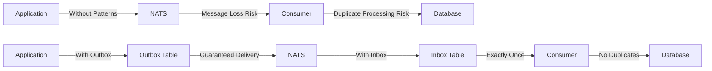
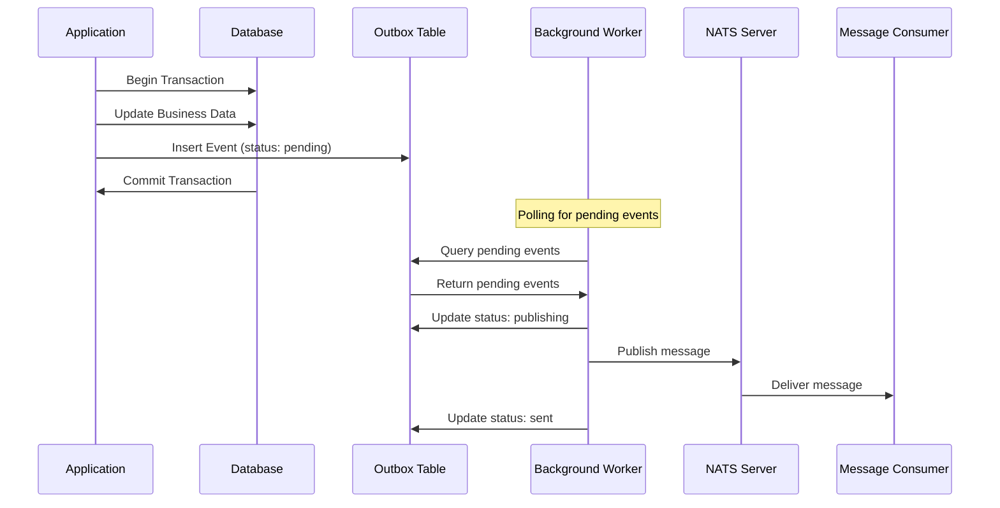
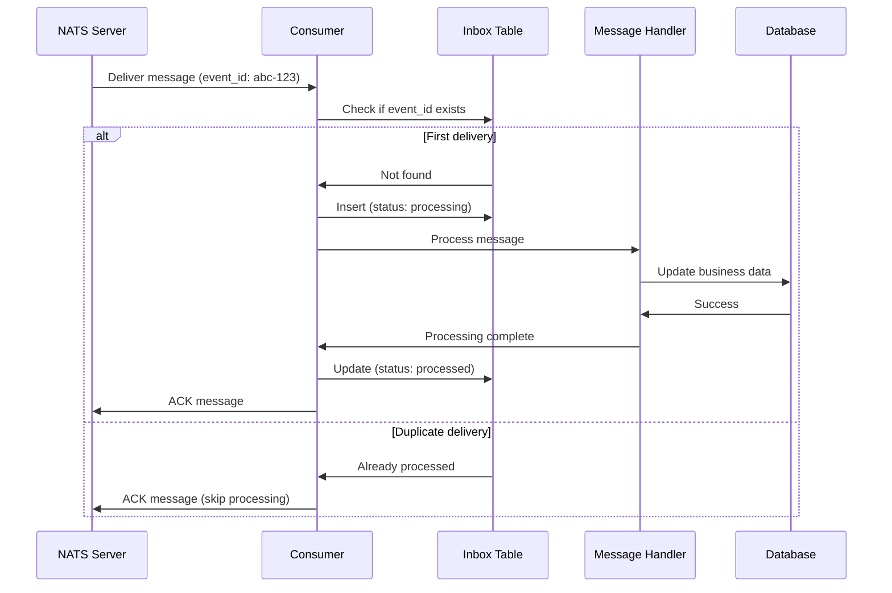

# Inbox & Outbox Patterns

This comprehensive guide covers the Inbox and Outbox patterns in NatsPubsub, providing transactional guarantees for distributed message processing.

## Table of Contents

- [Overview](#overview)
- [What are Inbox and Outbox Patterns](#what-are-inbox-and-outbox-patterns)
- [Why Use These Patterns](#why-use-these-patterns)
- [Outbox Pattern](#outbox-pattern)
  - [How It Works](#how-it-works)
  - [Configuration](#outbox-configuration)
  - [JavaScript Implementation](#outbox-javascript-implementation)
  - [Ruby Implementation](#outbox-ruby-implementation)
  - [Background Workers](#background-workers)
- [Inbox Pattern](#inbox-pattern)
  - [How It Works](#inbox-how-it-works)
  - [Configuration](#inbox-configuration)
  - [JavaScript Implementation](#inbox-javascript-implementation)
  - [Ruby Implementation](#inbox-ruby-implementation)
  - [Deduplication Strategies](#deduplication-strategies)
- [Database Setup](#database-setup)
  - [PostgreSQL](#postgresql-setup)
  - [MySQL](#mysql-setup)
  - [SQLite](#sqlite-setup)
- [Repository Implementations](#repository-implementations)
  - [In-Memory Repository](#in-memory-repository)
  - [Custom Database Repository](#custom-database-repository)
- [Monitoring and Maintenance](#monitoring-and-maintenance)
  - [Statistics and Metrics](#statistics-and-metrics)
  - [Cleanup Strategies](#cleanup-strategies)
  - [Stale Event Recovery](#stale-event-recovery)
- [Troubleshooting](#troubleshooting)
  - [Common Issues](#common-issues)
  - [Debugging Tips](#debugging-tips)
- [Best Practices](#best-practices)
- [Performance Considerations](#performance-considerations)
- [Related Resources](#related-resources)

---

## Overview

The Inbox and Outbox patterns are reliability patterns that solve two critical distributed systems challenges:

1. **Outbox Pattern**: Guarantees message delivery by persisting messages before publishing
2. **Inbox Pattern**: Ensures exactly-once message processing through deduplication

### Pattern Comparison



---

## What are Inbox and Outbox Patterns

### Outbox Pattern

The **Outbox Pattern** ensures reliable message publishing by storing messages in a database table (the "outbox") within the same transaction as business data changes. A background worker then publishes these messages to NATS.

**Key Benefits:**

- Transactional guarantee between database changes and message publishing
- No message loss even if the application crashes
- Automatic retry on publish failures
- Idempotent publishing (prevents duplicates)

### Inbox Pattern

The **Inbox Pattern** ensures exactly-once message processing by tracking processed message IDs in a database table (the "inbox"). Before processing a message, the system checks if it has already been processed.

**Key Benefits:**

- Exactly-once processing semantics
- Protection against duplicate message delivery
- Automatic deduplication
- Failed message tracking for debugging

---

## Why Use These Patterns

### Problem: The Dual Write Problem

Without these patterns, you face the **dual write problem**:

```typescript
// ❌ PROBLEM: Not atomic - can fail between steps
async function createOrder(orderData) {
  // Step 1: Save to database
  await db.orders.create(orderData);

  // ❌ App crashes here → Order saved but no event published!

  // Step 2: Publish event
  await nats.publish("order.created", orderData);
}
```

**Failure Scenarios:**

1. **Database saves, publish fails** → Order created but no notification sent
2. **Publish succeeds, app crashes** → Event sent but can't mark as sent
3. **Network partition** → Message sent multiple times (duplicates)

### Solution: Inbox/Outbox Patterns

```typescript
// ✅ SOLUTION: Transactionally safe with Outbox
async function createOrderWithOutbox(orderData) {
  await db.transaction(async (trx) => {
    // Both operations in same transaction
    await trx.orders.create(orderData);
    await outboxPublisher.publish({
      eventId: `order-${orderData.id}`,
      subject: "order.created",
      payload: JSON.stringify(orderData),
    });
  });
  // If transaction commits, message WILL be published (eventually)
  // If transaction rolls back, neither order nor message is saved
}

// ✅ SOLUTION: Exactly-once processing with Inbox
async function handleOrderCreated(message, metadata) {
  const processed = await inboxProcessor.process(
    {
      eventId: metadata.eventId,
      subject: metadata.subject,
      payload: JSON.stringify(message),
    },
    async (msg, ctx) => {
      // This will only execute once per unique eventId
      await processOrder(msg);
    },
    metadata,
  );

  if (!processed) {
    console.log("Already processed, skipped duplicate");
  }
}
```

### When to Use

| Scenario               | Pattern | Why                                    |
| ---------------------- | ------- | -------------------------------------- |
| Financial transactions | Both    | Cannot lose or duplicate payments      |
| Order processing       | Both    | Must process each order exactly once   |
| Inventory updates      | Both    | Prevent overselling or double-counting |
| Email notifications    | Outbox  | Ensure delivery, duplicates acceptable |
| Analytics events       | Neither | Loss acceptable, speed prioritized     |
| Real-time updates      | Neither | Latest value matters, history doesn't  |

---

## Outbox Pattern

### How It Works

The Outbox pattern operates in phases:



**Flow Steps:**

1. **Store Event**: Application stores event in outbox table within business transaction
2. **Commit**: Transaction commits atomically (business data + outbox event)
3. **Background Worker**: Polls for pending events
4. **Publish**: Worker publishes events to NATS
5. **Mark Sent**: Worker updates event status to "sent"
6. **Cleanup**: Old sent events are periodically cleaned up

### Outbox Configuration

#### JavaScript/TypeScript

```typescript
import { OutboxPublisher, OutboxPublisherConfig } from "nats-pubsub";

const config: OutboxPublisherConfig = {
  // Maximum number of pending events to process in one batch
  batchSize: 100,

  // Time to wait before considering an event stale (in minutes)
  staleTimeout: 5,

  // Enable detailed logging
  enableLogging: true,

  // Custom logger
  logger: console,
};

const publisher = new OutboxPublisher(repository, config);
```

#### Ruby

```ruby
# config/initializers/nats_pubsub.rb
NatsPubsub.configure do |config|
  config.outbox.enabled = true
  config.outbox.batch_size = 100
  config.outbox.stale_timeout = 5.minutes
  config.outbox.cleanup_interval = 1.hour
  config.outbox.retention_period = 7.days
end
```

### Outbox JavaScript Implementation

#### Basic Setup

```typescript
import { OutboxPublisher, MemoryOutboxRepository } from "nats-pubsub";
import { connect } from "nats";

// 1. Create repository (use database-backed in production)
const repository = new MemoryOutboxRepository();
const publisher = new OutboxPublisher(repository);

// 2. Connect to NATS
const nc = await connect({ servers: "nats://localhost:4222" });
const js = nc.jetstream();

// 3. Publish with Outbox pattern
const result = await publisher.publish(
  {
    eventId: "order-123",
    subject: "production.app.order.created",
    payload: JSON.stringify({
      event_id: "order-123",
      message: {
        orderId: "123",
        customerId: "customer-456",
        total: 99.99,
        items: [{ productId: "prod-1", quantity: 2, price: 49.99 }],
      },
    }),
    headers: JSON.stringify({
      "nats-msg-id": "order-123",
      "correlation-id": "trace-abc-123",
    }),
  },
  async () => {
    // Your NATS publish logic
    await js.publish(subject, payload, {
      msgID: eventId,
    });
  },
);

if (result.success) {
  console.log("✅ Order published successfully!");
  console.log("Event ID:", result.eventId);
}
```

#### With Database Transactions (Knex.js)

```typescript
import { OutboxPublisher, OutboxRepository, OutboxEvent } from "nats-pubsub";
import { Knex } from "knex";

// Custom repository backed by your database
class KnexOutboxRepository implements OutboxRepository {
  constructor(private db: Knex) {}

  async findOrCreate(params: Partial<OutboxEvent>): Promise<OutboxEvent> {
    const [event] = await this.db("nats_outbox_events")
      .insert({
        event_id: params.eventId,
        subject: params.subject,
        payload: params.payload,
        headers: params.headers,
        status: "pending",
        enqueued_at: new Date(),
      })
      .onConflict("event_id")
      .ignore()
      .returning("*");

    if (!event) {
      // Already exists, fetch it
      return await this.db("nats_outbox_events")
        .where("event_id", params.eventId)
        .first();
    }

    return event;
  }

  async markAsSent(eventId: string): Promise<void> {
    await this.db("nats_outbox_events").where("event_id", eventId).update({
      status: "sent",
      sent_at: new Date(),
    });
  }

  async markAsPublishing(eventId: string): Promise<void> {
    await this.db("nats_outbox_events")
      .where("event_id", eventId)
      .update({ status: "publishing" });
  }

  async markAsFailed(eventId: string, error: string): Promise<void> {
    await this.db("nats_outbox_events").where("event_id", eventId).update({
      status: "failed",
      error_message: error,
    });
  }

  async findPending(options?: { limit?: number }): Promise<OutboxEvent[]> {
    return await this.db("nats_outbox_events")
      .where("status", "pending")
      .orderBy("enqueued_at", "asc")
      .limit(options?.limit || 100);
  }

  async cleanup(olderThanDays: number): Promise<number> {
    const cutoffDate = new Date();
    cutoffDate.setDate(cutoffDate.getDate() - olderThanDays);

    const deleted = await this.db("nats_outbox_events")
      .where("status", "sent")
      .where("sent_at", "<", cutoffDate)
      .delete();

    return deleted;
  }

  async resetStale(staleMinutes: number): Promise<number> {
    const cutoffTime = new Date();
    cutoffTime.setMinutes(cutoffTime.getMinutes() - staleMinutes);

    const updated = await this.db("nats_outbox_events")
      .where("status", "publishing")
      .where("enqueued_at", "<", cutoffTime)
      .update({ status: "pending" });

    return updated;
  }
}

// Usage with transactions
const repository = new KnexOutboxRepository(db);
const publisher = new OutboxPublisher(repository);

async function createOrder(orderData: OrderData) {
  await db.transaction(async (trx) => {
    // Create order
    const [order] = await trx("orders")
      .insert({
        id: orderData.id,
        customer_id: orderData.customerId,
        total: orderData.total,
        status: "pending",
      })
      .returning("*");

    // Store event in outbox (same transaction!)
    await publisher.publish(
      {
        eventId: `order-${order.id}`,
        subject: "production.app.order.created",
        payload: JSON.stringify({
          event_id: `order-${order.id}`,
          message: order,
        }),
        headers: JSON.stringify({ "nats-msg-id": `order-${order.id}` }),
      },
      async () => {
        await js.publish(subject, payload);
      },
    );
  });
}
```

#### With TypeORM

```typescript
import { OutboxPublisher, OutboxRepository, OutboxEvent } from "nats-pubsub";
import { EntityManager, Repository } from "typeorm";

@Entity("nats_outbox_events")
class OutboxEventEntity {
  @PrimaryColumn()
  event_id: string;

  @Column()
  subject: string;

  @Column("text")
  payload: string;

  @Column("text", { nullable: true })
  headers?: string;

  @Column({ default: "pending" })
  status: string;

  @Column({ type: "timestamp", default: () => "CURRENT_TIMESTAMP" })
  enqueued_at: Date;

  @Column({ type: "timestamp", nullable: true })
  sent_at?: Date;

  @Column({ type: "text", nullable: true })
  error_message?: string;
}

class TypeOrmOutboxRepository implements OutboxRepository {
  constructor(private manager: EntityManager) {}

  async findOrCreate(params: Partial<OutboxEvent>): Promise<OutboxEvent> {
    const repo = this.manager.getRepository(OutboxEventEntity);

    let event = await repo.findOne({
      where: { event_id: params.eventId },
    });

    if (!event) {
      event = repo.create({
        event_id: params.eventId,
        subject: params.subject,
        payload: params.payload,
        headers: params.headers,
        status: "pending",
      });
      await repo.save(event);
    }

    return event as OutboxEvent;
  }

  // Implement other methods...
}

// Usage
async function createOrderWithTypeORM(orderData: OrderData) {
  await AppDataSource.transaction(async (manager) => {
    const orderRepo = manager.getRepository(Order);
    const order = await orderRepo.save(orderData);

    const outboxRepo = new TypeOrmOutboxRepository(manager);
    const publisher = new OutboxPublisher(outboxRepo);

    await publisher.publish(
      {
        eventId: `order-${order.id}`,
        subject: "order.created",
        payload: JSON.stringify(order),
      },
      async () => {
        await js.publish(subject, payload);
      },
    );
  });
}
```

### Outbox Ruby Implementation

#### Basic Setup

```ruby
# app/models/nats_outbox_event.rb
class NatsOutboxEvent < ApplicationRecord
  enum status: { pending: 0, publishing: 1, sent: 2, failed: 3 }

  validates :event_id, presence: true, uniqueness: true
  validates :subject, presence: true
  validates :payload, presence: true

  scope :pending, -> { where(status: :pending) }
  scope :stale, ->(minutes) {
    where(status: :publishing).where('enqueued_at < ?', minutes.minutes.ago)
  }
  scope :old_sent, ->(days) {
    where(status: :sent).where('sent_at < ?', days.days.ago)
  }
end
```

#### Repository Implementation

```ruby
# lib/nats_pubsub/publisher/outbox_repository.rb
module NatsPubsub
  module Publisher
    class OutboxRepository
      def initialize(model_class = NatsOutboxEvent)
        @model_class = model_class
      end

      def find_or_create(event_id:, subject:, payload:, headers: nil)
        @model_class.find_or_create_by!(event_id: event_id) do |event|
          event.subject = subject
          event.payload = payload
          event.headers = headers
          event.status = :pending
          event.enqueued_at = Time.current
        end
      end

      def mark_as_sent(event_id)
        event = @model_class.find_by(event_id: event_id)
        event&.update!(status: :sent, sent_at: Time.current)
      end

      def mark_as_publishing(event_id)
        event = @model_class.find_by(event_id: event_id)
        event&.update!(status: :publishing)
      end

      def mark_as_failed(event_id, error_message)
        event = @model_class.find_by(event_id: event_id)
        event&.update!(status: :failed, error_message: error_message)
      end

      def find_pending(limit: 100)
        @model_class.pending
                   .order(enqueued_at: :asc)
                   .limit(limit)
      end

      def cleanup(older_than_days)
        @model_class.old_sent(older_than_days).delete_all
      end

      def reset_stale(stale_minutes)
        @model_class.stale(stale_minutes).update_all(status: :pending)
      end

      def get_count_by_status
        @model_class.group(:status).count
      end
    end
  end
end
```

#### Usage with ActiveRecord

```ruby
# app/services/order_service.rb
class OrderService
  def initialize
    @repository = NatsPubsub::Publisher::OutboxRepository.new
    @publisher = NatsPubsub::Publisher::OutboxPublisher.new(@repository)
  end

  def create_order(order_params)
    ActiveRecord::Base.transaction do
      # Create order
      order = Order.create!(order_params)

      # Store event in outbox (same transaction!)
      @publisher.publish(
        event_id: "order-#{order.id}",
        subject: "production.app.order.created",
        payload: {
          event_id: "order-#{order.id}",
          message: order.as_json
        }.to_json,
        headers: { 'nats-msg-id' => "order-#{order.id}" }.to_json
      ) do
        # NATS publish logic
        NatsPubsub.publish(
          topic: 'order.created',
          message: order.as_json
        )
      end

      order
    end
  end
end
```

#### Background Worker (Sidekiq)

```ruby
# app/workers/outbox_publisher_worker.rb
class OutboxPublisherWorker
  include Sidekiq::Worker
  sidekiq_options retry: 3, queue: :outbox

  def perform
    repository = NatsPubsub::Publisher::OutboxRepository.new
    publisher = NatsPubsub::Publisher::OutboxPublisher.new(repository)

    # Process up to 100 pending events
    results = publisher.publish_pending(limit: 100) do |event|
      NatsPubsub.publish(
        topic: extract_topic(event.subject),
        message: JSON.parse(event.payload)['message'],
        headers: event.headers ? JSON.parse(event.headers) : {}
      )
    end

    Rails.logger.info "Processed #{results.length} outbox events"
  rescue StandardError => e
    Rails.logger.error "Outbox worker failed: #{e.message}"
    raise
  end

  private

  def extract_topic(subject)
    # Extract topic from subject (e.g., "production.app.order.created" -> "order.created")
    parts = subject.split('.')
    parts[2..-1].join('.')
  end
end
```

#### Rake Task

```ruby
# lib/tasks/outbox.rake
namespace :nats_pubsub do
  namespace :outbox do
    desc 'Process pending outbox events'
    task process: :environment do
      repository = NatsPubsub::Publisher::OutboxRepository.new
      publisher = NatsPubsub::Publisher::OutboxPublisher.new(repository)

      loop do
        count = publisher.publish_pending(limit: 100) do |event|
          NatsPubsub.publish(
            topic: extract_topic(event.subject),
            message: JSON.parse(event.payload)['message']
          )
        end.length

        puts "Processed #{count} events"
        break if count.zero?

        sleep 1
      end
    end

    desc 'Cleanup old sent events'
    task cleanup: :environment do
      repository = NatsPubsub::Publisher::OutboxRepository.new
      deleted = repository.cleanup(7) # Delete events older than 7 days
      puts "Cleaned up #{deleted} old events"
    end

    desc 'Reset stale events'
    task reset_stale: :environment do
      repository = NatsPubsub::Publisher::OutboxRepository.new
      reset = repository.reset_stale(5) # Reset events stuck for 5+ minutes
      puts "Reset #{reset} stale events"
    end
  end
end
```

### Background Workers

#### JavaScript Worker

```typescript
import { OutboxPublisher } from "nats-pubsub";
import { connect } from "nats";

class OutboxWorker {
  private publisher: OutboxPublisher;
  private nc: any;
  private js: any;
  private interval: NodeJS.Timeout | null = null;

  constructor(publisher: OutboxPublisher) {
    this.publisher = publisher;
  }

  async start(intervalMs: number = 5000) {
    // Connect to NATS
    this.nc = await connect({ servers: "nats://localhost:4222" });
    this.js = this.nc.jetstream();

    console.log("Outbox worker started");

    this.interval = setInterval(async () => {
      await this.processOutbox();
    }, intervalMs);

    // Handle shutdown
    process.on("SIGTERM", () => this.stop());
    process.on("SIGINT", () => this.stop());
  }

  async stop() {
    console.log("Stopping outbox worker...");

    if (this.interval) {
      clearInterval(this.interval);
      this.interval = null;
    }

    if (this.nc) {
      await this.nc.close();
    }

    console.log("Outbox worker stopped");
  }

  private async processOutbox() {
    try {
      const results = await this.publisher.publishPending(
        100, // Batch size
        async (eventId, subject, payload, headers) => {
          await this.js.publish(subject, payload, {
            msgID: eventId,
            headers: headers ? JSON.parse(headers) : undefined,
          });
        },
      );

      if (results.length > 0) {
        console.log(`Processed ${results.length} outbox events`);
      }
    } catch (error) {
      console.error("Outbox processing error:", error);
    }
  }
}

// Usage
const repository = new KnexOutboxRepository(db);
const publisher = new OutboxPublisher(repository);
const worker = new OutboxWorker(publisher);

worker.start(5000); // Process every 5 seconds
```

#### Standalone Worker Script

```typescript
// workers/outbox-worker.ts
import { OutboxPublisher, OutboxRepository } from "nats-pubsub";
import { connect } from "nats";
import { createDbConnection } from "./db";

async function main() {
  const db = await createDbConnection();
  const repository = new KnexOutboxRepository(db);
  const publisher = new OutboxPublisher(repository);

  const nc = await connect({
    servers: process.env.NATS_URL || "nats://localhost:4222",
  });
  const js = nc.jetstream();

  console.log("Outbox worker starting...");

  // Main processing loop
  while (true) {
    try {
      // Process pending events
      const results = await publisher.publishPending(
        100,
        async (eventId, subject, payload, headers) => {
          await js.publish(subject, payload, {
            msgID: eventId,
            headers: headers ? JSON.parse(headers) : undefined,
          });
        },
      );

      // Reset stale events (stuck in "publishing" state)
      const resetCount = await publisher.resetStale(5);
      if (resetCount > 0) {
        console.log(`Reset ${resetCount} stale events`);
      }

      // Cleanup old sent events
      const cleanedCount = await publisher.cleanup(7);
      if (cleanedCount > 0) {
        console.log(`Cleaned up ${cleanedCount} old events`);
      }

      if (results.length === 0) {
        // No events, wait before checking again
        await new Promise((resolve) => setTimeout(resolve, 5000));
      }
    } catch (error) {
      console.error("Worker error:", error);
      await new Promise((resolve) => setTimeout(resolve, 10000)); // Wait 10s on error
    }
  }
}

main().catch(console.error);
```

---

## Inbox Pattern

### Inbox How It Works

The Inbox pattern prevents duplicate processing:



**Flow Steps:**

1. **Receive Message**: Consumer receives message from NATS
2. **Check Inbox**: Query inbox table for event_id
3. **First Time**: Insert record with status "processing"
4. **Process**: Execute message handler
5. **Mark Processed**: Update status to "processed"
6. **ACK**: Acknowledge message to NATS
7. **Duplicate**: If event_id exists, skip processing and ACK

### Inbox Configuration

#### JavaScript/TypeScript

```typescript
import { InboxProcessor, InboxProcessorConfig } from "nats-pubsub";

const config: InboxProcessorConfig = {
  // Time to wait before considering an event stale (in minutes)
  staleTimeout: 5,

  // Enable detailed logging
  enableLogging: true,

  // Custom logger
  logger: console,
};

const processor = new InboxProcessor(repository, config);
```

#### Ruby

```ruby
# config/initializers/nats_pubsub.rb
NatsPubsub.configure do |config|
  config.inbox.enabled = true
  config.inbox.stale_timeout = 5.minutes
  config.inbox.cleanup_interval = 1.hour
  config.inbox.retention_period = 30.days
end
```

### Inbox JavaScript Implementation

#### Basic Setup

```typescript
import {
  InboxProcessor,
  MemoryInboxRepository,
  MessageContext,
} from "nats-pubsub";

// 1. Create repository (use database-backed in production)
const repository = new MemoryInboxRepository();
const processor = new InboxProcessor(repository);

// 2. Process with Inbox pattern
const context: MessageContext = {
  eventId: "payment-789",
  subject: "production.app.payment.completed",
  topic: "payment.completed",
  occurredAt: new Date(),
  deliveries: 1,
};

const processed = await processor.process(
  {
    eventId: "payment-789",
    subject: "production.app.payment.completed",
    payload: JSON.stringify({
      paymentId: "789",
      orderId: "123",
      amount: 99.99,
      status: "completed",
    }),
    headers: JSON.stringify({ "nats-msg-id": "payment-789" }),
    deliveries: 1,
  },
  async (message, ctx) => {
    // Your processing logic (will only run once!)
    console.log("Processing payment:", message);
    await updateOrderStatus(message.orderId, "paid");
    await sendPaymentConfirmation(message);
  },
  context,
);

if (!processed) {
  console.log("Payment already processed, skipping duplicate");
}
```

#### With Subscriber Integration

```typescript
import { Subscriber, InboxProcessor, MessageContext } from "nats-pubsub";

class PaymentSubscriber extends Subscriber {
  private inboxProcessor: InboxProcessor;

  constructor(inboxProcessor: InboxProcessor) {
    super("production.*.payment.*");
    this.inboxProcessor = inboxProcessor;
  }

  async handle(
    message: Record<string, unknown>,
    metadata: MessageContext,
  ): Promise<void> {
    // Use Inbox pattern for idempotent processing
    const processed = await this.inboxProcessor.process(
      {
        eventId: metadata.eventId,
        subject: metadata.subject,
        payload: JSON.stringify(message),
        headers: JSON.stringify(metadata.headers || {}),
        stream: metadata.stream,
        streamSeq: metadata.streamSeq,
        deliveries: metadata.deliveries,
      },
      async (msg, ctx) => {
        // This logic will only run once per unique event_id
        await this.processPayment(msg);
      },
      metadata,
    );

    if (!processed) {
      console.log(`Payment ${metadata.eventId} already processed`);
    }
  }

  private async processPayment(
    message: Record<string, unknown>,
  ): Promise<void> {
    const { paymentId, orderId, amount } = message;

    // Update order
    await db("orders")
      .where("id", orderId)
      .update({ status: "paid", paid_at: new Date() });

    // Send confirmation
    await emailService.sendPaymentConfirmation(orderId);

    console.log(`Payment ${paymentId} processed successfully`);
  }
}

// Register subscriber
const inboxProcessor = new InboxProcessor(repository);
const subscriber = new PaymentSubscriber(inboxProcessor);
```

#### Custom Repository (Knex.js)

```typescript
import { InboxRepository, InboxEvent } from "nats-pubsub";
import { Knex } from "knex";

class KnexInboxRepository implements InboxRepository {
  constructor(private db: Knex) {}

  async findOrCreate(params: Partial<InboxEvent>): Promise<InboxEvent> {
    const [event] = await this.db("nats_inbox_events")
      .insert({
        event_id: params.eventId,
        subject: params.subject,
        payload: params.payload,
        headers: params.headers,
        stream: params.stream,
        stream_seq: params.streamSeq,
        status: "processing",
        received_at: new Date(),
        deliveries: params.deliveries || 1,
      })
      .onConflict("event_id")
      .ignore()
      .returning("*");

    if (!event) {
      // Already exists, fetch it
      return await this.db("nats_inbox_events")
        .where("event_id", params.eventId)
        .first();
    }

    return event;
  }

  async markAsProcessed(eventId: string): Promise<void> {
    await this.db("nats_inbox_events").where("event_id", eventId).update({
      status: "processed",
      processed_at: new Date(),
    });
  }

  async markAsFailed(eventId: string, error: string): Promise<void> {
    await this.db("nats_inbox_events").where("event_id", eventId).update({
      status: "failed",
      error_message: error,
    });
  }

  async isProcessed(eventId: string): Promise<boolean> {
    const event = await this.db("nats_inbox_events")
      .where("event_id", eventId)
      .where("status", "processed")
      .first();

    return !!event;
  }

  async cleanup(olderThanDays: number): Promise<number> {
    const cutoffDate = new Date();
    cutoffDate.setDate(cutoffDate.getDate() - olderThanDays);

    const deleted = await this.db("nats_inbox_events")
      .where("status", "processed")
      .where("processed_at", "<", cutoffDate)
      .delete();

    return deleted;
  }

  async resetStale(staleMinutes: number): Promise<number> {
    const cutoffTime = new Date();
    cutoffTime.setMinutes(cutoffTime.getMinutes() - staleMinutes);

    const updated = await this.db("nats_inbox_events")
      .where("status", "processing")
      .where("received_at", "<", cutoffTime)
      .update({ status: "failed", error_message: "Processing timeout" });

    return updated;
  }
}
```

### Inbox Ruby Implementation

#### Model Setup

```ruby
# app/models/nats_inbox_event.rb
class NatsInboxEvent < ApplicationRecord
  enum status: { processing: 0, processed: 1, failed: 2 }

  validates :event_id, presence: true, uniqueness: true
  validates :subject, presence: true
  validates :payload, presence: true

  scope :stale, ->(minutes) {
    where(status: :processing).where('received_at < ?', minutes.minutes.ago)
  }
  scope :old_processed, ->(days) {
    where(status: :processed).where('processed_at < ?', days.days.ago)
  }
  scope :failed, -> { where(status: :failed) }
end
```

#### Repository Implementation

```ruby
# lib/nats_pubsub/inbox/inbox_repository.rb
module NatsPubsub
  module Inbox
    class InboxRepository
      def initialize(model_class = NatsInboxEvent)
        @model_class = model_class
      end

      def find_or_create(event_id:, subject:, payload:, headers: nil, stream: nil, stream_seq: nil, deliveries: 1)
        @model_class.find_or_create_by!(event_id: event_id) do |event|
          event.subject = subject
          event.payload = payload
          event.headers = headers
          event.stream = stream
          event.stream_seq = stream_seq
          event.status = :processing
          event.received_at = Time.current
          event.deliveries = deliveries
        end
      end

      def mark_as_processed(event_id)
        event = @model_class.find_by(event_id: event_id)
        event&.update!(status: :processed, processed_at: Time.current)
      end

      def mark_as_failed(event_id, error_message)
        event = @model_class.find_by(event_id: event_id)
        event&.update!(status: :failed, error_message: error_message)
      end

      def processed?(event_id)
        @model_class.exists?(event_id: event_id, status: :processed)
      end

      def cleanup(older_than_days)
        @model_class.old_processed(older_than_days).delete_all
      end

      def reset_stale(stale_minutes)
        @model_class.stale(stale_minutes).update_all(
          status: :failed,
          error_message: 'Processing timeout'
        )
      end

      def get_count_by_status
        @model_class.group(:status).count
      end

      def get_failed_events(limit: 100)
        @model_class.failed.order(received_at: :desc).limit(limit)
      end
    end
  end
end
```

#### Subscriber Integration

```ruby
# app/subscribers/payment_subscriber.rb
class PaymentSubscriber < NatsPubsub::Subscriber
  subscribe_to "payment.*"

  def initialize
    super
    @repository = NatsPubsub::Inbox::InboxRepository.new
    @processor = NatsPubsub::Inbox::InboxProcessor.new(@repository)
  end

  def handle(message, context)
    # Use Inbox pattern for idempotent processing
    processed = @processor.process(
      event_id: context.event_id,
      subject: context.subject,
      payload: message.to_json,
      headers: context.headers&.to_json,
      stream: context.stream,
      stream_seq: context.stream_seq,
      deliveries: context.deliveries
    ) do |msg, ctx|
      # This block will only execute once per unique event_id
      process_payment(JSON.parse(msg))
    end

    unless processed
      Rails.logger.info "Payment #{context.event_id} already processed, skipping"
    end
  end

  private

  def process_payment(payment_data)
    payment_id = payment_data['payment_id']
    order_id = payment_data['order_id']
    amount = payment_data['amount']

    # Update order
    order = Order.find(order_id)
    order.update!(status: 'paid', paid_at: Time.current)

    # Send confirmation
    PaymentMailer.confirmation(order).deliver_later

    Rails.logger.info "Payment #{payment_id} processed successfully"
  end
end
```

### Deduplication Strategies

The Inbox pattern supports multiple deduplication strategies:

#### Strategy 1: Event ID (Primary)

```typescript
// Deduplicate by unique event ID
const processed = await inboxProcessor.process(
  {
    eventId: "unique-event-123", // Primary key for deduplication
    subject: "test.subject",
    payload: JSON.stringify({ data: "test" }),
    headers: JSON.stringify({}),
    deliveries: 1,
  },
  async (message, context) => {
    // Process once per eventId
    await handleMessage(message);
  },
  context,
);
```

#### Strategy 2: JetStream Sequence (Secondary)

```typescript
// Deduplicate by stream + sequence number
const processed = await inboxProcessor.process(
  {
    eventId: "event-123",
    subject: "test.subject",
    payload: JSON.stringify({ data: "test" }),
    headers: JSON.stringify({}),
    stream: "MY_STREAM",
    streamSeq: 12345, // JetStream sequence number
    deliveries: 1,
  },
  async (message, context) => {
    // Process once per stream sequence
    await handleMessage(message);
  },
  context,
);
```

#### Combined Strategy

```typescript
// Use both for maximum reliability
const processed = await inboxProcessor.process(
  {
    eventId: metadata.eventId || `${metadata.stream}-${metadata.streamSeq}`,
    subject: metadata.subject,
    payload: JSON.stringify(message),
    headers: JSON.stringify(metadata.headers),
    stream: metadata.stream,
    streamSeq: metadata.streamSeq,
    deliveries: metadata.deliveries,
  },
  async (msg, ctx) => {
    // Guaranteed to process exactly once
    await handleMessage(msg);
  },
  metadata,
);
```

---

## Database Setup

### PostgreSQL Setup

#### Schema

```sql
-- Outbox table
CREATE TABLE nats_outbox_events (
  event_id VARCHAR(255) PRIMARY KEY,
  subject VARCHAR(500) NOT NULL,
  payload TEXT NOT NULL,
  headers TEXT,
  status VARCHAR(50) NOT NULL DEFAULT 'pending',
  enqueued_at TIMESTAMP NOT NULL DEFAULT CURRENT_TIMESTAMP,
  sent_at TIMESTAMP,
  error_message TEXT,
  created_at TIMESTAMP NOT NULL DEFAULT CURRENT_TIMESTAMP,
  updated_at TIMESTAMP NOT NULL DEFAULT CURRENT_TIMESTAMP
);

-- Indexes for performance
CREATE INDEX idx_outbox_status_enqueued ON nats_outbox_events(status, enqueued_at);
CREATE INDEX idx_outbox_sent_at ON nats_outbox_events(sent_at);

-- Inbox table
CREATE TABLE nats_inbox_events (
  event_id VARCHAR(255) PRIMARY KEY,
  subject VARCHAR(500) NOT NULL,
  payload TEXT NOT NULL,
  headers TEXT,
  stream VARCHAR(255),
  stream_seq BIGINT,
  status VARCHAR(50) NOT NULL DEFAULT 'processing',
  received_at TIMESTAMP NOT NULL DEFAULT CURRENT_TIMESTAMP,
  processed_at TIMESTAMP,
  deliveries INTEGER DEFAULT 1,
  error_message TEXT,
  created_at TIMESTAMP NOT NULL DEFAULT CURRENT_TIMESTAMP,
  updated_at TIMESTAMP NOT NULL DEFAULT CURRENT_TIMESTAMP
);

-- Indexes for performance
CREATE UNIQUE INDEX idx_inbox_stream_seq ON nats_inbox_events(stream, stream_seq) WHERE stream IS NOT NULL;
CREATE INDEX idx_inbox_status_processed ON nats_inbox_events(status, processed_at);
CREATE INDEX idx_inbox_received_at ON nats_inbox_events(received_at);
```

#### Knex.js Migration

```typescript
// migrations/20250117_create_inbox_outbox_tables.ts
import { Knex } from "knex";

export async function up(knex: Knex): Promise<void> {
  // Outbox table
  await knex.schema.createTable("nats_outbox_events", (table) => {
    table.string("event_id", 255).primary();
    table.string("subject", 500).notNullable();
    table.text("payload").notNullable();
    table.text("headers");
    table.string("status", 50).notNullable().defaultTo("pending");
    table.timestamp("enqueued_at").notNullable().defaultTo(knex.fn.now());
    table.timestamp("sent_at");
    table.text("error_message");
    table.timestamps(true, true);

    table.index(["status", "enqueued_at"], "idx_outbox_status_enqueued");
    table.index("sent_at", "idx_outbox_sent_at");
  });

  // Inbox table
  await knex.schema.createTable("nats_inbox_events", (table) => {
    table.string("event_id", 255).primary();
    table.string("subject", 500).notNullable();
    table.text("payload").notNullable();
    table.text("headers");
    table.string("stream", 255);
    table.bigInteger("stream_seq");
    table.string("status", 50).notNullable().defaultTo("processing");
    table.timestamp("received_at").notNullable().defaultTo(knex.fn.now());
    table.timestamp("processed_at");
    table.integer("deliveries").defaultTo(1);
    table.text("error_message");
    table.timestamps(true, true);

    table.unique(["stream", "stream_seq"], {
      indexName: "idx_inbox_stream_seq",
      predicate: knex.whereNotNull("stream"),
    });
    table.index(["status", "processed_at"], "idx_inbox_status_processed");
    table.index("received_at", "idx_inbox_received_at");
  });
}

export async function down(knex: Knex): Promise<void> {
  await knex.schema.dropTableIfExists("nats_inbox_events");
  await knex.schema.dropTableIfExists("nats_outbox_events");
}
```

### MySQL Setup

#### Schema

```sql
-- Outbox table
CREATE TABLE nats_outbox_events (
  event_id VARCHAR(255) PRIMARY KEY,
  subject VARCHAR(500) NOT NULL,
  payload LONGTEXT NOT NULL,
  headers TEXT,
  status VARCHAR(50) NOT NULL DEFAULT 'pending',
  enqueued_at TIMESTAMP NOT NULL DEFAULT CURRENT_TIMESTAMP,
  sent_at TIMESTAMP NULL,
  error_message TEXT,
  created_at TIMESTAMP NOT NULL DEFAULT CURRENT_TIMESTAMP,
  updated_at TIMESTAMP NOT NULL DEFAULT CURRENT_TIMESTAMP ON UPDATE CURRENT_TIMESTAMP,
  INDEX idx_outbox_status_enqueued (status, enqueued_at),
  INDEX idx_outbox_sent_at (sent_at)
) ENGINE=InnoDB DEFAULT CHARSET=utf8mb4 COLLATE=utf8mb4_unicode_ci;

-- Inbox table
CREATE TABLE nats_inbox_events (
  event_id VARCHAR(255) PRIMARY KEY,
  subject VARCHAR(500) NOT NULL,
  payload LONGTEXT NOT NULL,
  headers TEXT,
  stream VARCHAR(255),
  stream_seq BIGINT,
  status VARCHAR(50) NOT NULL DEFAULT 'processing',
  received_at TIMESTAMP NOT NULL DEFAULT CURRENT_TIMESTAMP,
  processed_at TIMESTAMP NULL,
  deliveries INT DEFAULT 1,
  error_message TEXT,
  created_at TIMESTAMP NOT NULL DEFAULT CURRENT_TIMESTAMP,
  updated_at TIMESTAMP NOT NULL DEFAULT CURRENT_TIMESTAMP ON UPDATE CURRENT_TIMESTAMP,
  UNIQUE KEY idx_inbox_stream_seq (stream, stream_seq),
  INDEX idx_inbox_status_processed (status, processed_at),
  INDEX idx_inbox_received_at (received_at)
) ENGINE=InnoDB DEFAULT CHARSET=utf8mb4 COLLATE=utf8mb4_unicode_ci;
```

### SQLite Setup

#### Schema

```sql
-- Outbox table
CREATE TABLE nats_outbox_events (
  event_id TEXT PRIMARY KEY,
  subject TEXT NOT NULL,
  payload TEXT NOT NULL,
  headers TEXT,
  status TEXT NOT NULL DEFAULT 'pending',
  enqueued_at TEXT NOT NULL DEFAULT (datetime('now')),
  sent_at TEXT,
  error_message TEXT,
  created_at TEXT NOT NULL DEFAULT (datetime('now')),
  updated_at TEXT NOT NULL DEFAULT (datetime('now'))
);

CREATE INDEX idx_outbox_status_enqueued ON nats_outbox_events(status, enqueued_at);
CREATE INDEX idx_outbox_sent_at ON nats_outbox_events(sent_at);

-- Inbox table
CREATE TABLE nats_inbox_events (
  event_id TEXT PRIMARY KEY,
  subject TEXT NOT NULL,
  payload TEXT NOT NULL,
  headers TEXT,
  stream TEXT,
  stream_seq INTEGER,
  status TEXT NOT NULL DEFAULT 'processing',
  received_at TEXT NOT NULL DEFAULT (datetime('now')),
  processed_at TEXT,
  deliveries INTEGER DEFAULT 1,
  error_message TEXT,
  created_at TEXT NOT NULL DEFAULT (datetime('now')),
  updated_at TEXT NOT NULL DEFAULT (datetime('now'))
);

CREATE UNIQUE INDEX idx_inbox_stream_seq ON nats_inbox_events(stream, stream_seq)
  WHERE stream IS NOT NULL;
CREATE INDEX idx_inbox_status_processed ON nats_inbox_events(status, processed_at);
CREATE INDEX idx_inbox_received_at ON nats_inbox_events(received_at);
```

### Rails Migration

```ruby
# db/migrate/20250117_create_nats_inbox_outbox_tables.rb
class CreateNatsInboxOutboxTables < ActiveRecord::Migration[7.0]
  def change
    # Outbox table
    create_table :nats_outbox_events, id: false, primary_key: :event_id do |t|
      t.string :event_id, null: false, limit: 255
      t.string :subject, null: false, limit: 500
      t.text :payload, null: false
      t.text :headers
      t.string :status, null: false, default: 'pending', limit: 50
      t.timestamp :enqueued_at, null: false, default: -> { 'CURRENT_TIMESTAMP' }
      t.timestamp :sent_at
      t.text :error_message
      t.timestamps
    end

    add_index :nats_outbox_events, [:status, :enqueued_at], name: 'idx_outbox_status_enqueued'
    add_index :nats_outbox_events, :sent_at, name: 'idx_outbox_sent_at'

    # Inbox table
    create_table :nats_inbox_events, id: false, primary_key: :event_id do |t|
      t.string :event_id, null: false, limit: 255
      t.string :subject, null: false, limit: 500
      t.text :payload, null: false
      t.text :headers
      t.string :stream, limit: 255
      t.bigint :stream_seq
      t.string :status, null: false, default: 'processing', limit: 50
      t.timestamp :received_at, null: false, default: -> { 'CURRENT_TIMESTAMP' }
      t.timestamp :processed_at
      t.integer :deliveries, default: 1
      t.text :error_message
      t.timestamps
    end

    add_index :nats_inbox_events, [:stream, :stream_seq],
              unique: true,
              name: 'idx_inbox_stream_seq',
              where: 'stream IS NOT NULL'
    add_index :nats_inbox_events, [:status, :processed_at], name: 'idx_inbox_status_processed'
    add_index :nats_inbox_events, :received_at, name: 'idx_inbox_received_at'
  end
end
```

---

## Repository Implementations

### In-Memory Repository

Perfect for development and testing:

#### JavaScript

```typescript
import {
  OutboxRepository,
  InboxRepository,
  OutboxEvent,
  InboxEvent,
} from "nats-pubsub";

// Already provided by the library
import { MemoryOutboxRepository, MemoryInboxRepository } from "nats-pubsub";

// Usage
const outboxRepo = new MemoryOutboxRepository();
const inboxRepo = new MemoryInboxRepository();
```

#### Ruby

```ruby
# spec/support/memory_repositories.rb
module NatsPubsub
  class MemoryOutboxRepository
    def initialize
      @events = {}
    end

    def find_or_create(event_id:, subject:, payload:, headers: nil)
      @events[event_id] ||= {
        event_id: event_id,
        subject: subject,
        payload: payload,
        headers: headers,
        status: 'pending',
        enqueued_at: Time.current
      }
    end

    def mark_as_sent(event_id)
      return unless @events[event_id]
      @events[event_id][:status] = 'sent'
      @events[event_id][:sent_at] = Time.current
    end

    def find_pending(limit: 100)
      @events.values.select { |e| e[:status] == 'pending' }.first(limit)
    end

    def cleanup(older_than_days)
      cutoff = older_than_days.days.ago
      @events.delete_if do |_, event|
        event[:status] == 'sent' && event[:sent_at] && event[:sent_at] < cutoff
      end.length
    end

    def get_count_by_status
      @events.values.group_by { |e| e[:status] }.transform_values(&:count)
    end
  end
end
```

### Custom Database Repository

See [Outbox JavaScript Implementation](#outbox-javascript-implementation) and [Inbox JavaScript Implementation](#inbox-javascript-implementation) sections above for complete Knex.js and TypeORM examples.

---

## Monitoring and Maintenance

### Statistics and Metrics

#### JavaScript

```typescript
// Get Outbox statistics
const outboxStats = await repository.getCountByStatus();
console.log("Outbox Statistics:", {
  pending: outboxStats.pending || 0,
  publishing: outboxStats.publishing || 0,
  sent: outboxStats.sent || 0,
  failed: outboxStats.failed || 0,
});

// Get Inbox statistics
const inboxStats = await repository.getCountByStatus();
console.log("Inbox Statistics:", {
  processing: inboxStats.processing || 0,
  processed: inboxStats.processed || 0,
  failed: inboxStats.failed || 0,
});

// Alert on high failure rate
if (outboxStats.failed > 100) {
  await alerting.send("High number of failed outbox events!");
}
```

#### Ruby

```ruby
# app/services/inbox_outbox_monitoring.rb
class InboxOutboxMonitoring
  def self.check_health
    outbox_stats = NatsOutboxEvent.group(:status).count
    inbox_stats = NatsInboxEvent.group(:status).count

    {
      outbox: outbox_stats,
      inbox: inbox_stats,
      alerts: generate_alerts(outbox_stats, inbox_stats)
    }
  end

  def self.generate_alerts(outbox_stats, inbox_stats)
    alerts = []

    if outbox_stats['failed'] && outbox_stats['failed'] > 100
      alerts << 'High number of failed outbox events'
    end

    if inbox_stats['failed'] && inbox_stats['failed'] > 100
      alerts << 'High number of failed inbox events'
    end

    if outbox_stats['pending'] && outbox_stats['pending'] > 1000
      alerts << 'Large backlog of pending outbox events'
    end

    alerts
  end
end
```

### Cleanup Strategies

#### Automatic Cleanup Worker

```typescript
// workers/cleanup-worker.ts
import { OutboxPublisher, InboxProcessor } from "nats-pubsub";

class CleanupWorker {
  constructor(
    private outboxPublisher: OutboxPublisher,
    private inboxProcessor: InboxProcessor,
  ) {}

  async start() {
    // Run cleanup every hour
    setInterval(async () => {
      await this.runCleanup();
    }, 3600000); // 1 hour

    // Run immediately on start
    await this.runCleanup();
  }

  private async runCleanup() {
    try {
      // Cleanup old outbox events (7 days)
      const outboxCleaned = await this.outboxPublisher.cleanup(7);
      console.log(`Cleaned ${outboxCleaned} old outbox events`);

      // Cleanup old inbox events (30 days)
      const inboxCleaned = await this.inboxProcessor.cleanup(30);
      console.log(`Cleaned ${inboxCleaned} old inbox events`);

      // Reset stale events
      const outboxReset = await this.outboxPublisher.resetStale(5);
      const inboxReset = await this.inboxProcessor.resetStale(5);

      console.log(`Reset ${outboxReset} stale outbox events`);
      console.log(`Reset ${inboxReset} stale inbox events`);
    } catch (error) {
      console.error("Cleanup failed:", error);
    }
  }
}
```

#### Scheduled Cleanup (Ruby)

```ruby
# config/schedule.rb (with whenever gem)
every 1.hour do
  runner "InboxOutboxCleanup.run"
end

# app/services/inbox_outbox_cleanup.rb
class InboxOutboxCleanup
  def self.run
    # Cleanup old sent outbox events (7 days)
    deleted_outbox = NatsOutboxEvent.old_sent(7).delete_all
    Rails.logger.info "Cleaned up #{deleted_outbox} old outbox events"

    # Cleanup old processed inbox events (30 days)
    deleted_inbox = NatsInboxEvent.old_processed(30).delete_all
    Rails.logger.info "Cleaned up #{deleted_inbox} old inbox events"

    # Reset stale events
    reset_outbox = NatsOutboxEvent.stale(5).update_all(status: :pending)
    reset_inbox = NatsInboxEvent.stale(5).update_all(
      status: :failed,
      error_message: 'Processing timeout'
    )

    Rails.logger.info "Reset #{reset_outbox} stale outbox events"
    Rails.logger.info "Reset #{reset_inbox} stale inbox events"
  end
end
```

### Stale Event Recovery

#### Detect and Reset Stale Events

```typescript
// Detect events stuck in "publishing" or "processing" state
async function resetStaleEvents() {
  const staleMinutes = 5;

  // Reset outbox events stuck in "publishing"
  const outboxReset = await outboxPublisher.resetStale(staleMinutes);
  console.log(`Reset ${outboxReset} stale outbox events`);

  // Reset inbox events stuck in "processing"
  const inboxReset = await inboxProcessor.resetStale(staleMinutes);
  console.log(`Reset ${inboxReset} stale inbox events`);
}

// Run periodically
setInterval(resetStaleEvents, 300000); // Every 5 minutes
```

---

## Troubleshooting

### Common Issues

#### Issue 1: Events Stuck in "Publishing" Status

**Symptoms:**

- Events remain in "publishing" status
- No progress in event processing

**Causes:**

- Application crashed during publishing
- NATS connection lost
- Database connection lost

**Solution:**

```typescript
// Reset stale events
await outboxPublisher.resetStale(5); // Reset events older than 5 minutes
```

#### Issue 2: Duplicate Processing Despite Inbox

**Symptoms:**

- Messages processed multiple times
- Duplicate database records

**Causes:**

- Missing event_id in message
- Database constraints not enforced
- Transaction not committed before ACK

**Solution:**

```typescript
// Ensure event_id is always provided
const processed = await inboxProcessor.process(
  {
    eventId: metadata.eventId || `${metadata.stream}-${metadata.streamSeq}`,
    // ... other params
  },
  handler,
  context
);

// Always commit transaction before ACKing
await db.transaction(async (trx) => {
  await inboxProcessor.process(...);
  // Transaction commits here
});
// ACK happens after transaction commit
```

#### Issue 3: High Database Load

**Symptoms:**

- Slow message processing
- Database CPU/memory high
- Connection pool exhausted

**Causes:**

- Missing indexes
- Too frequent cleanup
- Large batch sizes

**Solution:**

```sql
-- Add missing indexes
CREATE INDEX idx_outbox_status_enqueued ON nats_outbox_events(status, enqueued_at);
CREATE INDEX idx_inbox_status_processed ON nats_inbox_events(status, processed_at);

-- Reduce batch size
const publisher = new OutboxPublisher(repository, { batchSize: 50 });

-- Less frequent cleanup
setInterval(cleanup, 3600000); // Every hour instead of every minute
```

### Debugging Tips

#### Enable Debug Logging

```typescript
// JavaScript
const publisher = new OutboxPublisher(repository, {
  enableLogging: true,
  logger: {
    log: (msg) => console.log("[OUTBOX]", msg),
    error: (msg) => console.error("[OUTBOX ERROR]", msg),
  },
});
```

```ruby
# Ruby
Rails.logger.level = :debug

# In your code
Rails.logger.debug "Outbox event: #{event.inspect}"
```

#### Query Stuck Events

```sql
-- Find outbox events stuck in publishing
SELECT * FROM nats_outbox_events
WHERE status = 'publishing'
  AND enqueued_at < NOW() - INTERVAL '5 minutes'
ORDER BY enqueued_at ASC;

-- Find inbox events stuck in processing
SELECT * FROM nats_inbox_events
WHERE status = 'processing'
  AND received_at < NOW() - INTERVAL '5 minutes'
ORDER BY received_at ASC;

-- Check failed events
SELECT subject, error_message, COUNT(*) as count
FROM nats_outbox_events
WHERE status = 'failed'
GROUP BY subject, error_message
ORDER BY count DESC;
```

#### Monitor Event Flow

```typescript
// Add monitoring middleware
class InboxOutboxMonitor {
  async call(event: any, metadata: any, next: () => Promise<void>) {
    const start = Date.now();

    try {
      await next();
      const duration = Date.now() - start;

      // Log slow processing
      if (duration > 5000) {
        console.warn(`Slow processing: ${metadata.subject} took ${duration}ms`);
      }
    } catch (error) {
      console.error(`Processing failed: ${metadata.subject}`, error);
      throw error;
    }
  }
}
```

---

## Best Practices

### 1. Always Use Unique Event IDs

```typescript
// ✅ GOOD: Unique, deterministic ID
const eventId = `order-${order.id}-created`;

// ❌ BAD: Random ID (can't deduplicate retries)
const eventId = uuidv4();
```

### 2. Keep Payloads Small

```typescript
// ✅ GOOD: Reference to data
await publisher.publish({
  eventId: `order-${orderId}`,
  payload: JSON.stringify({
    event_id: `order-${orderId}`,
    message: { orderId, customerId },
  }),
});

// ❌ BAD: Entire object embedded
await publisher.publish({
  eventId: `order-${orderId}`,
  payload: JSON.stringify({
    event_id: `order-${orderId}`,
    message: { ...order, ...customer, ...items, ...shipping },
  }),
});
```

### 3. Use Transactions

```typescript
// ✅ GOOD: Atomic operation
await db.transaction(async (trx) => {
  await trx.orders.create(order);
  await outboxPublisher.publish(...);
});

// ❌ BAD: Separate operations
await db.orders.create(order);
await outboxPublisher.publish(...); // Can fail separately
```

### 4. Set Appropriate Retention Periods

```typescript
// Outbox: Short retention (7 days)
await outboxPublisher.cleanup(7);

// Inbox: Longer retention for audit (30-90 days)
await inboxProcessor.cleanup(30);
```

### 5. Monitor Metrics

```typescript
// Track key metrics
setInterval(async () => {
  const stats = await repository.getCountByStatus();

  // Send to metrics service
  metrics.gauge("outbox.pending", stats.pending);
  metrics.gauge("outbox.failed", stats.failed);

  // Alert on thresholds
  if (stats.failed > 100) {
    alerting.send("High outbox failure rate");
  }
}, 60000);
```

### 6. Handle Failures Gracefully

```typescript
try {
  await inboxProcessor.process(..., async (message, ctx) => {
    // Your logic
    await processMessage(message);
  }, context);
} catch (error) {
  // Log error with context
  logger.error('Processing failed', {
    eventId: context.eventId,
    subject: context.subject,
    error: error.message,
    stack: error.stack,
  });

  // Mark as failed for debugging
  await repository.markAsFailed(context.eventId, error.message);

  // Don't throw - let message go to DLQ
}
```

### 7. Use Background Workers

```typescript
// Don't rely on inline publishing for pending events
// ❌ BAD: Inline processing on every publish
await outboxPublisher.publish(...);
await outboxPublisher.publishPending(); // Slow!

// ✅ GOOD: Separate background worker
await outboxPublisher.publish(...); // Fast!
// Separate worker handles publishPending()
```

### 8. Test with In-Memory Repository

```typescript
// In tests, use fast in-memory repository
const repository = new MemoryOutboxRepository();
const publisher = new OutboxPublisher(repository);

// Run your test
await publisher.publish(...);

// Verify
const stats = repository.getCountByStatus();
expect(stats.sent).toBe(1);
```

---

## Performance Considerations

### Database Performance

**Index Optimization:**

```sql
-- Essential indexes
CREATE INDEX idx_outbox_status_enqueued ON nats_outbox_events(status, enqueued_at);
CREATE INDEX idx_inbox_event_id ON nats_inbox_events(event_id);

-- Optional indexes for queries
CREATE INDEX idx_outbox_subject ON nats_outbox_events(subject);
CREATE INDEX idx_inbox_stream_seq ON nats_inbox_events(stream, stream_seq);
```

**Query Optimization:**

```typescript
// ✅ GOOD: Limit batch size
await publisher.publishPending(100);

// ❌ BAD: Process all at once
await publisher.publishPending(10000);
```

### Memory Management

```typescript
// Cleanup regularly to prevent table growth
setInterval(async () => {
  await outboxPublisher.cleanup(7);
  await inboxProcessor.cleanup(30);
}, 3600000); // Every hour
```

### Concurrency

```typescript
// Process multiple events concurrently
const pending = await repository.findPending({ limit: 100 });

await Promise.all(
  pending.map(async (event) => {
    await processEvent(event);
  }),
);
```

### Benchmarks

| Operation                | Latency  | Throughput      |
| ------------------------ | -------- | --------------- |
| Outbox publish (with DB) | 5-10ms   | 100-200/sec     |
| Inbox check (with DB)    | 2-5ms    | 200-500/sec     |
| In-memory repository     | &lt;1ms  | 10,000+/sec     |
| Background worker batch  | 50-100ms | 1,000-2,000/sec |

---

## Related Resources

### Documentation

-- [Publishing Guide](../guides/publishing.md) - Message publishing patterns
-- [Subscribing Guide](../guides/subscribing.md) - Message consumption patterns
-- [Testing Guide](../guides/testing.md) - Testing inbox/outbox implementations
-- [Performance Guide](../guides/performance.md) - Performance optimization

### Pattern Documentation

-- [Dead Letter Queue (DLQ)](dlq.md) - Failed message handling
-- [Schema Validation](schema-validation.md) - Message validation
-- [Event Sourcing](event-sourcing.md) - Event-driven architecture

### External Resources

- [Transactional Outbox Pattern (Microsoft)](https://microservices.io/patterns/data/transactional-outbox.html)
- [Inbox Pattern for Idempotent Processing](https://event-driven.io/en/inbox_pattern_explained/)
- [NATS JetStream Documentation](https://docs.nats.io/nats-concepts/jetstream)

---

**Navigation:**

- [← Back to Patterns](index.md)
- [Next: DLQ Pattern →](dlq.md)
- [Documentation Home](../index.md)
