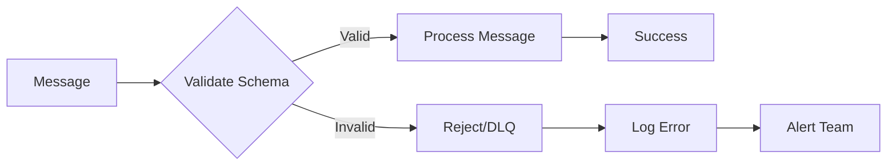

# Schema Validation Pattern

This comprehensive guide covers message schema validation in NatsPubsub, ensuring data quality and type safety across your distributed system.

## Table of Contents

- [Overview](#overview)
- [Why Validate Messages](#why-validate-messages)
- [Validation Approaches](#validation-approaches)
- [Zod Integration (JavaScript)](#zod-integration-javascript)
  - [Basic Validation](#basic-validation)
  - [Advanced Schemas](#advanced-schemas)
  - [Schema Composition](#schema-composition)
- [JSON Schema Validation](#json-schema-validation)
  - [JavaScript Implementation](#javascript-implementation)
  - [Ruby Implementation](#ruby-implementation)
- [Custom Validators](#custom-validators)
  - [JavaScript Validators](#javascript-validators)
  - [Ruby Validators](#ruby-validators)
- [Versioned Schemas](#versioned-schemas)
  - [Schema Evolution](#schema-evolution)
  - [Backward Compatibility](#backward-compatibility)
  - [Version Management](#version-management)
- [Validation Error Handling](#validation-error-handling)
  - [Error Messages](#error-messages)
  - [Error Recovery](#error-recovery)
- [Validation Middleware](#validation-middleware)
- [Performance Optimization](#performance-optimization)
- [Testing Validation](#testing-validation)
- [Best Practices](#best-practices)
- [Common Patterns](#common-patterns)
- [Troubleshooting](#troubleshooting)
- [Related Resources](#related-resources)

---

## Overview

Schema validation ensures messages conform to expected structures before processing, preventing errors and data corruption in distributed systems.

### Benefits

- **Type Safety**: Catch type errors at runtime
- **Data Quality**: Ensure valid, complete data
- **Documentation**: Schemas serve as contracts
- **Error Prevention**: Fail fast on invalid data
- **API Stability**: Enforce message contracts between services



---

## Why Validate Messages

### Problem: Invalid Messages

Without validation, invalid messages can cause:

```typescript
// ❌ No validation - runtime errors
async function processOrder(message: any) {
  // Crashes if orderId is missing
  const order = await db.orders.find(message.orderId);

  // Crashes if total is not a number
  const tax = message.total * 0.1;

  // Crashes if items is not an array
  message.items.forEach((item) => processItem(item));
}
```

### Solution: Schema Validation

```typescript
// ✅ With validation - safe processing
const OrderSchema = z.object({
  orderId: z.string().uuid(),
  customerId: z.string().uuid(),
  total: z.number().positive(),
  items: z
    .array(
      z.object({
        productId: z.string(),
        quantity: z.number().int().positive(),
        price: z.number().positive(),
      }),
    )
    .min(1),
});

async function processOrder(message: unknown) {
  // Validate first
  const result = OrderSchema.safeParse(message);

  if (!result.success) {
    throw new ValidationError("Invalid order", result.error);
  }

  // Now safe to process
  const order = result.data;
  // TypeScript knows the exact shape!
}
```

### When to Validate

| Location          | When              | Why                                       |
| ----------------- | ----------------- | ----------------------------------------- |
| **Publisher**     | Before publishing | Prevent invalid data from entering system |
| **Subscriber**    | After receiving   | Defensive programming, trust no one       |
| **API Gateway**   | At entry point    | Validate external inputs                  |
| **Serialization** | Before storing    | Ensure data integrity                     |

---

## Validation Approaches

### 1. Runtime Validation (Recommended)

Validate at runtime using libraries like Zod or JSON Schema:

```typescript
// Zod (JavaScript/TypeScript)
const schema = z.object({ name: z.string() });
const result = schema.safeParse(data);

// JSON Schema (Universal)
const validate = ajv.compile(schema);
const valid = validate(data);
```

### 2. Static Type Checking

Use TypeScript for compile-time validation:

```typescript
interface Order {
  orderId: string;
  total: number;
}

// Type error caught at compile time
const order: Order = {
  orderId: "123",
  total: "99.99", // ❌ Type error: string not assignable to number
};
```

### 3. Hybrid Approach (Best)

Combine static and runtime validation:

```typescript
// Static types for development
interface Order {
  orderId: string;
  total: number;
}

// Runtime validation for production
const OrderSchema = z.object({
  orderId: z.string().uuid(),
  total: z.number().positive(),
});

type Order = z.infer<typeof OrderSchema>; // Types from schema
```

---

## Zod Integration (JavaScript)

Zod is a TypeScript-first schema validation library with excellent type inference.

### Basic Validation

```typescript
import { z } from "zod";
import { SchemaValidator } from "nats-pubsub";

// Define schema
const UserSchema = z.object({
  id: z.string().uuid(),
  email: z.string().email(),
  name: z.string().min(1).max(100),
  age: z.number().int().positive().optional(),
  role: z.enum(["admin", "user", "guest"]),
  createdAt: z.date(),
});

// Create validator
const validator = new SchemaValidator(UserSchema);

// Validate data
const result = validator.validate({
  id: "550e8400-e29b-41d4-a716-446655440000",
  email: "user@example.com",
  name: "John Doe",
  role: "user",
  createdAt: new Date(),
});

if (result.success) {
  console.log("Valid user:", result.data);
  // result.data has full type inference!
} else {
  console.error("Validation errors:", result.errors);
}
```

### Advanced Schemas

#### Nested Objects

```typescript
const AddressSchema = z.object({
  street: z.string(),
  city: z.string(),
  state: z.string().length(2),
  zipCode: z.string().regex(/^\d{5}(-\d{4})?$/),
});

const CustomerSchema = z.object({
  id: z.string().uuid(),
  name: z.string(),
  email: z.string().email(),
  address: AddressSchema,
  billingAddress: AddressSchema.optional(),
});
```

#### Arrays and Collections

```typescript
const OrderItemSchema = z.object({
  productId: z.string().uuid(),
  quantity: z.number().int().positive(),
  price: z.number().positive(),
});

const OrderSchema = z.object({
  orderId: z.string().uuid(),
  customerId: z.string().uuid(),
  items: z
    .array(OrderItemSchema)
    .min(1, "Order must have at least one item")
    .max(100, "Order cannot have more than 100 items"),
  total: z.number().positive(),
  status: z.enum(["pending", "processing", "completed", "cancelled"]),
});
```

#### Custom Validations

```typescript
const OrderSchema = z
  .object({
    orderId: z.string().uuid(),
    items: z.array(OrderItemSchema),
    total: z.number().positive(),
  })
  .refine(
    (order) => {
      // Custom validation: total must match sum of items
      const itemsTotal = order.items.reduce(
        (sum, item) => sum + item.price * item.quantity,
        0,
      );
      return Math.abs(order.total - itemsTotal) < 0.01; // Allow floating point error
    },
    {
      message: "Order total must match sum of item prices",
      path: ["total"],
    },
  );
```

#### Transformations

```typescript
const DateStringSchema = z
  .string()
  .datetime()
  .transform((str) => new Date(str));

const OrderSchema = z.object({
  orderId: z.string().uuid(),
  createdAt: DateStringSchema, // Transforms string to Date
  total: z.string().transform((val) => parseFloat(val)), // String to number
});

// Input: { orderId: '...', createdAt: '2025-01-17T12:00:00Z', total: '99.99' }
// Output: { orderId: '...', createdAt: Date object, total: 99.99 }
```

### Schema Composition

#### Extending Schemas

```typescript
const BaseEventSchema = z.object({
  eventId: z.string().uuid(),
  occurredAt: z.date(),
  version: z.string(),
});

const OrderCreatedEventSchema = BaseEventSchema.extend({
  eventType: z.literal("order.created"),
  orderId: z.string().uuid(),
  customerId: z.string().uuid(),
  total: z.number().positive(),
});

const OrderCancelledEventSchema = BaseEventSchema.extend({
  eventType: z.literal("order.cancelled"),
  orderId: z.string().uuid(),
  reason: z.string(),
});
```

#### Union Types

```typescript
const OrderEventSchema = z.discriminatedUnion("eventType", [
  OrderCreatedEventSchema,
  OrderUpdatedEventSchema,
  OrderCancelledEventSchema,
]);

// Validates any order event type
const result = OrderEventSchema.safeParse(data);

if (result.success) {
  // TypeScript knows which event type based on eventType field
  switch (result.data.eventType) {
    case "order.created":
      // result.data.orderId available
      break;
    case "order.cancelled":
      // result.data.reason available
      break;
  }
}
```

#### Partial Schemas

```typescript
const UserSchema = z.object({
  id: z.string().uuid(),
  email: z.string().email(),
  name: z.string(),
});

// For updates - all fields optional
const UserUpdateSchema = UserSchema.partial();

// For specific fields - only some required
const UserProfileSchema = UserSchema.pick({
  name: true,
  email: true,
});
```

### Integration with Subscribers

```typescript
import { Subscriber, MessageContext } from "nats-pubsub";
import { SchemaValidator } from "nats-pubsub";
import { z } from "zod";

const OrderSchema = z.object({
  orderId: z.string().uuid(),
  customerId: z.string().uuid(),
  total: z.number().positive(),
  items: z.array(
    z.object({
      productId: z.string(),
      quantity: z.number().int().positive(),
      price: z.number().positive(),
    }),
  ),
});

class OrderSubscriber extends Subscriber {
  private validator = new SchemaValidator(OrderSchema);

  constructor() {
    super("production.*.order.created");
  }

  async handle(
    message: Record<string, unknown>,
    metadata: MessageContext,
  ): Promise<void> {
    // Validate message
    const result = this.validator.validate(message);

    if (!result.success) {
      throw new Error(
        `Invalid order message: ${result.errors.map((e) => `${e.path}: ${e.message}`).join(", ")}`,
      );
    }

    // Process validated message
    const order = result.data;
    await this.processOrder(order);
  }

  private async processOrder(
    order: z.infer<typeof OrderSchema>,
  ): Promise<void> {
    // TypeScript knows exact shape of order
    console.log("Processing order:", order.orderId);
  }
}
```

### Common Schemas

```typescript
import { CommonSchemas, createMessageSchema } from "nats-pubsub";

// Use built-in common schemas
const UserSchema = z.object({
  id: CommonSchemas.uuid,
  email: CommonSchemas.email,
  website: CommonSchemas.url,
  createdAt: CommonSchemas.isoDate,
});

// Create message schema with metadata
const UserCreatedMessageSchema = createMessageSchema(
  z.object({
    userId: CommonSchemas.uuid,
    email: CommonSchemas.email,
    name: CommonSchemas.nonEmptyString,
  }),
);

// Result includes payload and metadata fields
type UserCreatedMessage = z.infer<typeof UserCreatedMessageSchema>;
// {
//   payload: { userId: string, email: string, name: string },
//   metadata?: { eventId?: string, traceId?: string, ... }
// }
```

---

## JSON Schema Validation

JSON Schema is a language-agnostic schema format supported across all platforms.

### JavaScript Implementation

```typescript
import Ajv from "ajv";
import addFormats from "ajv-formats";

// Create validator
const ajv = new Ajv({ allErrors: true });
addFormats(ajv); // Add format validation (email, uri, etc.)

// Define schema
const orderSchema = {
  type: "object",
  required: ["orderId", "customerId", "total", "items"],
  properties: {
    orderId: {
      type: "string",
      format: "uuid",
    },
    customerId: {
      type: "string",
      format: "uuid",
    },
    total: {
      type: "number",
      minimum: 0,
    },
    items: {
      type: "array",
      minItems: 1,
      items: {
        type: "object",
        required: ["productId", "quantity", "price"],
        properties: {
          productId: { type: "string" },
          quantity: { type: "integer", minimum: 1 },
          price: { type: "number", minimum: 0 },
        },
      },
    },
    status: {
      type: "string",
      enum: ["pending", "processing", "completed", "cancelled"],
    },
  },
};

// Compile schema
const validate = ajv.compile(orderSchema);

// Validate data
const valid = validate(orderData);

if (!valid) {
  console.error("Validation errors:", validate.errors);
}
```

### Ruby Implementation

```ruby
require 'json-schema'

# Define schema
order_schema = {
  type: 'object',
  required: ['order_id', 'customer_id', 'total', 'items'],
  properties: {
    order_id: {
      type: 'string',
      pattern: '^[0-9a-f]{8}-[0-9a-f]{4}-[0-9a-f]{4}-[0-9a-f]{4}-[0-9a-f]{12}$'
    },
    customer_id: {
      type: 'string',
      pattern: '^[0-9a-f]{8}-[0-9a-f]{4}-[0-9a-f]{4}-[0-9a-f]{4}-[0-9a-f]{12}$'
    },
    total: {
      type: 'number',
      minimum: 0
    },
    items: {
      type: 'array',
      minItems: 1,
      items: {
        type: 'object',
        required: ['product_id', 'quantity', 'price'],
        properties: {
          product_id: { type: 'string' },
          quantity: { type: 'integer', minimum: 1 },
          price: { type: 'number', minimum: 0 }
        }
      }
    },
    status: {
      type: 'string',
      enum: ['pending', 'processing', 'completed', 'cancelled']
    }
  }
}

# Validate
begin
  JSON::Validator.validate!(order_schema, order_data)
  puts 'Valid order'
rescue JSON::Schema::ValidationError => e
  puts "Invalid order: #{e.message}"
end
```

### Subscriber with JSON Schema

```ruby
# app/subscribers/order_subscriber.rb
class OrderSubscriber < NatsPubsub::Subscriber
  subscribe_to "order.*"

  ORDER_SCHEMA = {
    type: 'object',
    required: ['order_id', 'customer_id', 'total'],
    properties: {
      order_id: { type: 'string' },
      customer_id: { type: 'string' },
      total: { type: 'number', minimum: 0 }
    }
  }

  def handle(message, context)
    # Validate message
    begin
      JSON::Validator.validate!(ORDER_SCHEMA, message)
    rescue JSON::Schema::ValidationError => e
      Rails.logger.error "Invalid order message: #{e.message}"
      raise NatsPubsub::ValidationError, e.message
    end

    # Process validated message
    process_order(message)
  end

  private

  def process_order(order)
    Order.create!(
      id: order['order_id'],
      customer_id: order['customer_id'],
      total: order['total']
    )
  end
end
```

---

## Custom Validators

### JavaScript Validators

#### Custom Validation Class

```typescript
import { ValidationError } from "nats-pubsub";

class OrderValidator {
  validate(order: any): void {
    const errors: string[] = [];

    // Validate order ID
    if (!order.orderId || typeof order.orderId !== "string") {
      errors.push("orderId is required and must be a string");
    }

    // Validate total
    if (typeof order.total !== "number" || order.total <= 0) {
      errors.push("total must be a positive number");
    }

    // Validate items
    if (!Array.isArray(order.items) || order.items.length === 0) {
      errors.push("items must be a non-empty array");
    } else {
      order.items.forEach((item: any, index: number) => {
        if (!item.productId) {
          errors.push(`items[${index}].productId is required`);
        }
        if (typeof item.quantity !== "number" || item.quantity < 1) {
          errors.push(`items[${index}].quantity must be a positive number`);
        }
      });
    }

    // Validate total matches items
    if (Array.isArray(order.items)) {
      const calculatedTotal = order.items.reduce(
        (sum: number, item: any) => sum + item.price * item.quantity,
        0,
      );

      if (Math.abs(order.total - calculatedTotal) > 0.01) {
        errors.push("total does not match sum of item prices");
      }
    }

    if (errors.length > 0) {
      throw new ValidationError("Order validation failed", errors);
    }
  }
}

// Usage
const validator = new OrderValidator();
try {
  validator.validate(orderData);
} catch (error) {
  if (error instanceof ValidationError) {
    console.error("Validation errors:", error.errors);
  }
}
```

#### Decorator-Based Validation

```typescript
import { Subscriber, MessageContext } from "nats-pubsub";

function ValidateSchema(schema: any) {
  return function (
    target: any,
    propertyName: string,
    descriptor: PropertyDescriptor,
  ) {
    const method = descriptor.value;

    descriptor.value = async function (message: any, metadata: MessageContext) {
      // Validate before calling method
      const result = schema.safeParse(message);

      if (!result.success) {
        throw new Error(`Validation failed: ${JSON.stringify(result.error)}`);
      }

      // Call original method with validated data
      return method.call(this, result.data, metadata);
    };

    return descriptor;
  };
}

// Usage
class OrderSubscriber extends Subscriber {
  @ValidateSchema(OrderSchema)
  async handle(message: Order, metadata: MessageContext): Promise<void> {
    // message is guaranteed to be valid Order type
    await this.processOrder(message);
  }

  private async processOrder(order: Order): Promise<void> {
    console.log("Processing order:", order.orderId);
  }
}
```

### Ruby Validators

#### Custom Validator Class

```ruby
# app/validators/order_validator.rb
class OrderValidator
  def self.validate!(order)
    errors = []

    # Validate order_id
    errors << 'order_id is required' unless order['order_id'].present?

    # Validate total
    unless order['total'].is_a?(Numeric) && order['total'] > 0
      errors << 'total must be a positive number'
    end

    # Validate items
    if order['items'].blank? || !order['items'].is_a?(Array)
      errors << 'items must be a non-empty array'
    else
      order['items'].each_with_index do |item, index|
        errors << "items[#{index}].product_id is required" unless item['product_id'].present?
        unless item['quantity'].is_a?(Integer) && item['quantity'] > 0
          errors << "items[#{index}].quantity must be a positive integer"
        end
      end
    end

    # Validate total matches items
    if order['items'].is_a?(Array)
      calculated_total = order['items'].sum { |item| item['price'] * item['quantity'] }
      if (order['total'] - calculated_total).abs > 0.01
        errors << 'total does not match sum of item prices'
      end
    end

    raise ValidationError, errors.join(', ') if errors.any?
  end
end

# Usage
begin
  OrderValidator.validate!(order_data)
  puts 'Valid order'
rescue ValidationError => e
  puts "Invalid order: #{e.message}"
end
```

#### ActiveModel Validations

```ruby
# app/models/order_message.rb
class OrderMessage
  include ActiveModel::Model
  include ActiveModel::Validations

  attr_accessor :order_id, :customer_id, :total, :items, :status

  validates :order_id, presence: true, format: { with: /\A[0-9a-f-]{36}\z/ }
  validates :customer_id, presence: true, format: { with: /\A[0-9a-f-]{36}\z/ }
  validates :total, presence: true, numericality: { greater_than: 0 }
  validates :items, presence: true
  validates :status, inclusion: { in: %w[pending processing completed cancelled] }

  validate :items_must_be_valid

  private

  def items_must_be_valid
    return if items.blank?

    unless items.is_a?(Array)
      errors.add(:items, 'must be an array')
      return
    end

    items.each_with_index do |item, index|
      errors.add(:items, "[#{index}] must have product_id") unless item['product_id'].present?
      unless item['quantity'].is_a?(Integer) && item['quantity'] > 0
        errors.add(:items, "[#{index}] quantity must be positive integer")
      end
    end
  end
end

# Usage in subscriber
class OrderSubscriber < NatsPubsub::Subscriber
  subscribe_to "order.*"

  def handle(message, context)
    order = OrderMessage.new(message)

    unless order.valid?
      raise ValidationError, order.errors.full_messages.join(', ')
    end

    process_order(order)
  end

  private

  def process_order(order)
    Order.create!(
      id: order.order_id,
      customer_id: order.customer_id,
      total: order.total
    )
  end
end
```

---

## Versioned Schemas

### Schema Evolution

```typescript
// Version 1
const OrderSchemaV1 = z.object({
  orderId: z.string(),
  total: z.number(),
});

// Version 2 - Added customerId
const OrderSchemaV2 = z.object({
  orderId: z.string(),
  customerId: z.string(), // New required field
  total: z.number(),
});

// Version 3 - Added items array
const OrderSchemaV3 = z.object({
  orderId: z.string(),
  customerId: z.string(),
  total: z.number(),
  items: z.array(
    z.object({
      productId: z.string(),
      quantity: z.number(),
    }),
  ),
});
```

### Backward Compatibility

```typescript
// Make new fields optional for backward compatibility
const OrderSchemaV2Compatible = z.object({
  orderId: z.string(),
  customerId: z.string().optional(), // Optional for v1 messages
  total: z.number(),
});

// Transform old format to new format
const OrderSchema = z
  .object({
    orderId: z.string(),
    customerId: z.string().optional(),
    total: z.number(),
  })
  .transform((data) => ({
    ...data,
    customerId: data.customerId || "unknown", // Default for v1 messages
  }));
```

### Version Management

```typescript
interface VersionedMessage<T> {
  version: string;
  data: T;
}

const OrderSchemaV1 = z.object({
  orderId: z.string(),
  total: z.number(),
});

const OrderSchemaV2 = z.object({
  orderId: z.string(),
  customerId: z.string(),
  total: z.number(),
});

const schemas = {
  "1.0": OrderSchemaV1,
  "2.0": OrderSchemaV2,
};

function validateVersionedMessage(message: VersionedMessage<unknown>) {
  const schema = schemas[message.version];

  if (!schema) {
    throw new Error(`Unsupported schema version: ${message.version}`);
  }

  return schema.parse(message.data);
}

// Usage
const message = {
  version: "2.0",
  data: {
    orderId: "123",
    customerId: "456",
    total: 99.99,
  },
};

const validatedData = validateVersionedMessage(message);
```

#### Ruby Version Management

```ruby
# app/services/schema_validator.rb
class SchemaValidator
  SCHEMAS = {
    '1.0' => {
      type: 'object',
      required: ['order_id', 'total'],
      properties: {
        order_id: { type: 'string' },
        total: { type: 'number' }
      }
    },
    '2.0' => {
      type: 'object',
      required: ['order_id', 'customer_id', 'total'],
      properties: {
        order_id: { type: 'string' },
        customer_id: { type: 'string' },
        total: { type: 'number' }
      }
    }
  }

  def self.validate!(message, version)
    schema = SCHEMAS[version]

    raise "Unsupported schema version: #{version}" unless schema

    JSON::Validator.validate!(schema, message)
  end
end

# Usage in subscriber
class OrderSubscriber < NatsPubsub::Subscriber
  subscribe_to "order.*"

  def handle(message, context)
    version = context.headers['schema-version'] || '1.0'

    begin
      SchemaValidator.validate!(message, version)
    rescue => e
      Rails.logger.error "Schema validation failed: #{e.message}"
      raise
    end

    process_order(message, version)
  end

  private

  def process_order(message, version)
    case version
    when '1.0'
      # Handle v1 format
      process_order_v1(message)
    when '2.0'
      # Handle v2 format
      process_order_v2(message)
    end
  end
end
```

---

## Validation Error Handling

### Error Messages

```typescript
import { ValidationError } from "nats-pubsub";

class ValidationMiddleware {
  async call(
    event: Record<string, unknown>,
    metadata: any,
    next: () => Promise<void>,
  ): Promise<void> {
    try {
      await next();
    } catch (error) {
      if (error instanceof ValidationError) {
        // Format validation errors
        const formattedErrors = error.errors.map((e) => ({
          field: e.path,
          message: e.message,
          code: e.code,
        }));

        console.error("Validation failed:", {
          eventId: metadata.eventId,
          subject: metadata.subject,
          errors: formattedErrors,
        });

        // Send to DLQ with error details
        throw new Error(
          JSON.stringify({
            type: "validation_error",
            errors: formattedErrors,
            original: event,
          }),
        );
      }

      throw error;
    }
  }
}
```

### Error Recovery

```typescript
class ValidationErrorRecovery {
  async handleValidationError(
    message: any,
    error: ValidationError,
    metadata: MessageContext,
  ): Promise<void> {
    // Log detailed error
    console.error("Validation error:", {
      eventId: metadata.eventId,
      subject: metadata.subject,
      errors: error.errors,
      message,
    });

    // Try to fix common issues
    const fixed = this.attemptAutoFix(message, error);

    if (fixed) {
      console.log("Auto-fixed validation errors, retrying");
      return this.retryWithFixedMessage(fixed, metadata);
    }

    // Cannot auto-fix, send to DLQ
    await this.sendToDLQ(message, error, metadata);
  }

  private attemptAutoFix(message: any, error: ValidationError): any | null {
    // Try to fix common issues
    const fixed = { ...message };
    let canFix = true;

    for (const err of error.errors) {
      if (err.path === "customerId" && !message.customerId) {
        // Add default customerId
        fixed.customerId = "unknown";
      } else if (err.path === "items" && !Array.isArray(message.items)) {
        // Convert single item to array
        fixed.items = [message.items];
      } else {
        canFix = false;
        break;
      }
    }

    return canFix ? fixed : null;
  }
}
```

---

## Validation Middleware

### JavaScript Validation Middleware

```typescript
import { Middleware, EventMetadata } from "nats-pubsub";
import { z } from "zod";

class SchemaValidationMiddleware implements Middleware {
  constructor(private schemas: Map<string, z.ZodType>) {}

  async call(
    event: Record<string, unknown>,
    metadata: EventMetadata,
    next: () => Promise<void>,
  ): Promise<void> {
    // Find schema for this subject
    const schema = this.findSchema(metadata.subject);

    if (schema) {
      // Validate message
      const result = schema.safeParse(event);

      if (!result.success) {
        throw new Error(
          `Schema validation failed for ${metadata.subject}: ${JSON.stringify(result.error.errors)}`,
        );
      }

      // Replace event with validated data
      Object.assign(event, result.data);
    }

    await next();
  }

  private findSchema(subject: string): z.ZodType | undefined {
    // Exact match
    if (this.schemas.has(subject)) {
      return this.schemas.get(subject);
    }

    // Pattern match (e.g., "order.*" matches "order.created")
    for (const [pattern, schema] of this.schemas) {
      if (this.matchesPattern(subject, pattern)) {
        return schema;
      }
    }

    return undefined;
  }

  private matchesPattern(subject: string, pattern: string): boolean {
    const regex = new RegExp(
      "^" + pattern.replace(/\*/g, "[^.]+").replace(/>/g, ".+") + "$",
    );
    return regex.test(subject);
  }
}

// Register globally
const schemas = new Map([
  ["production.*.order.created", OrderCreatedSchema],
  ["production.*.order.updated", OrderUpdatedSchema],
  ["production.*.payment.*", PaymentSchema],
]);

NatsPubsub.use(new SchemaValidationMiddleware(schemas));
```

### Ruby Validation Middleware

```ruby
# app/middleware/schema_validation_middleware.rb
class SchemaValidationMiddleware
  def initialize(schemas = {})
    @schemas = schemas
  end

  def call(message, context)
    schema = find_schema(context.subject)

    if schema
      begin
        JSON::Validator.validate!(schema, message)
      rescue JSON::Schema::ValidationError => e
        Rails.logger.error "Schema validation failed for #{context.subject}: #{e.message}"
        raise NatsPubsub::ValidationError, e.message
      end
    end

    yield
  end

  private

  def find_schema(subject)
    # Exact match
    return @schemas[subject] if @schemas.key?(subject)

    # Pattern match
    @schemas.each do |pattern, schema|
      return schema if matches_pattern?(subject, pattern)
    end

    nil
  end

  def matches_pattern?(subject, pattern)
    regex_pattern = "^#{pattern.gsub('*', '[^.]+').gsub('>', '.+')}$"
    Regexp.new(regex_pattern).match?(subject)
  end
end

# Register globally
NatsPubsub.configure do |config|
  schemas = {
    'production.*.order.created' => ORDER_CREATED_SCHEMA,
    'production.*.order.updated' => ORDER_UPDATED_SCHEMA,
    'production.*.payment.*' => PAYMENT_SCHEMA
  }

  config.middleware.use SchemaValidationMiddleware.new(schemas)
end
```

---

## Performance Optimization

### Schema Caching

```typescript
class CachedSchemaValidator {
  private validators = new Map<string, z.ZodType>();

  getValidator(schemaKey: string, schemaFn: () => z.ZodType): z.ZodType {
    if (!this.validators.has(schemaKey)) {
      this.validators.set(schemaKey, schemaFn());
    }
    return this.validators.get(schemaKey)!;
  }
}

const cache = new CachedSchemaValidator();

// Use cached validator
const validator = cache.getValidator("order", () => OrderSchema);
```

### Lazy Validation

```typescript
// Only validate if needed
class LazyValidator {
  private validated = false;
  private validationResult: any = null;

  constructor(
    private data: any,
    private schema: z.ZodType,
  ) {}

  get isValid(): boolean {
    if (!this.validated) {
      this.validate();
    }
    return this.validationResult.success;
  }

  get data(): any {
    if (!this.validated) {
      this.validate();
    }
    if (!this.validationResult.success) {
      throw new Error("Data is invalid");
    }
    return this.validationResult.data;
  }

  private validate(): void {
    this.validationResult = this.schema.safeParse(this.data);
    this.validated = true;
  }
}
```

### Partial Validation

```typescript
// Only validate changed fields
function validatePartial<T>(schema: z.ZodType<T>, data: Partial<T>): boolean {
  const partialSchema = schema.partial();
  const result = partialSchema.safeParse(data);
  return result.success;
}
```

---

## Testing Validation

### JavaScript Tests

```typescript
import { describe, it, expect } from "@jest/globals";
import { OrderSchema } from "./schemas";

describe("OrderSchema", () => {
  it("validates valid order", () => {
    const validOrder = {
      orderId: "550e8400-e29b-41d4-a716-446655440000",
      customerId: "550e8400-e29b-41d4-a716-446655440001",
      total: 99.99,
      items: [{ productId: "prod-1", quantity: 2, price: 49.99 }],
    };

    const result = OrderSchema.safeParse(validOrder);
    expect(result.success).toBe(true);
  });

  it("rejects order with negative total", () => {
    const invalidOrder = {
      orderId: "550e8400-e29b-41d4-a716-446655440000",
      customerId: "550e8400-e29b-41d4-a716-446655440001",
      total: -10,
      items: [],
    };

    const result = OrderSchema.safeParse(invalidOrder);
    expect(result.success).toBe(false);
    if (!result.success) {
      expect(result.error.errors[0].path).toContain("total");
    }
  });

  it("rejects order with empty items", () => {
    const invalidOrder = {
      orderId: "550e8400-e29b-41d4-a716-446655440000",
      customerId: "550e8400-e29b-41d4-a716-446655440001",
      total: 99.99,
      items: [],
    };

    const result = OrderSchema.safeParse(invalidOrder);
    expect(result.success).toBe(false);
  });
});
```

### Ruby Tests

```ruby
# spec/validators/order_validator_spec.rb
RSpec.describe OrderValidator do
  describe '.validate!' do
    it 'validates valid order' do
      valid_order = {
        'order_id' => SecureRandom.uuid,
        'customer_id' => SecureRandom.uuid,
        'total' => 99.99,
        'items' => [
          { 'product_id' => 'prod-1', 'quantity' => 2, 'price' => 49.99 }
        ]
      }

      expect { OrderValidator.validate!(valid_order) }.not_to raise_error
    end

    it 'rejects order with negative total' do
      invalid_order = {
        'order_id' => SecureRandom.uuid,
        'customer_id' => SecureRandom.uuid,
        'total' => -10,
        'items' => []
      }

      expect { OrderValidator.validate!(invalid_order) }.to raise_error(ValidationError)
    end

    it 'rejects order with empty items' do
      invalid_order = {
        'order_id' => SecureRandom.uuid,
        'customer_id' => SecureRandom.uuid,
        'total' => 99.99,
        'items' => []
      }

      expect { OrderValidator.validate!(invalid_order) }.to raise_error(ValidationError, /items/)
    end
  end
end
```

---

## Best Practices

### 1. Validate at Boundaries

```typescript
// ✅ GOOD: Validate at system boundaries
// Publisher validates before sending
await publisher.publish(OrderSchema.parse(order));

// Subscriber validates after receiving
const validated = OrderSchema.parse(message);

// ❌ BAD: No validation
await publisher.publish(order); // Hope it's valid!
```

### 2. Use Strict Schemas

```typescript
// ✅ GOOD: Strict schema, no extra fields
const OrderSchema = z
  .object({
    orderId: z.string(),
    total: z.number(),
  })
  .strict();

// ❌ BAD: Allows any extra fields
const OrderSchema = z
  .object({
    orderId: z.string(),
    total: z.number(),
  })
  .passthrough();
```

### 3. Version Your Schemas

```typescript
// ✅ GOOD: Include version in message
const message = {
  version: "2.0",
  data: order,
};

// Validate based on version
const schema = schemas[message.version];
```

### 4. Document Schemas

```typescript
// ✅ GOOD: Well-documented schema
const OrderSchema = z.object({
  /** Unique order identifier (UUID v4) */
  orderId: z.string().uuid(),

  /** Customer identifier */
  customerId: z.string().uuid(),

  /** Total order amount in USD, must be positive */
  total: z.number().positive(),

  /** Order line items, at least one required */
  items: z.array(OrderItemSchema).min(1),
});
```

### 5. Handle Errors Gracefully

```typescript
// ✅ GOOD: Detailed error handling
const result = OrderSchema.safeParse(data);
if (!result.success) {
  console.error("Validation failed:", {
    errors: result.error.errors,
    data,
  });
  throw new ValidationError("Invalid order", result.error);
}

// ❌ BAD: Silent failure
try {
  OrderSchema.parse(data);
} catch (e) {
  // Ignore
}
```

---

## Common Patterns

### Pattern 1: Envelope Validation

```typescript
const EnvelopeSchema = z.object({
  metadata: z.object({
    eventId: z.string().uuid(),
    occurredAt: z.date(),
    version: z.string(),
  }),
  payload: z.unknown(), // Validated separately based on type
});

// Validate envelope, then payload
const envelope = EnvelopeSchema.parse(message);
const payload = getSchemaForType(envelope.metadata.type).parse(
  envelope.payload,
);
```

### Pattern 2: Discriminated Unions

```typescript
const EventSchema = z.discriminatedUnion("type", [
  z.object({
    type: z.literal("order.created"),
    orderId: z.string(),
    total: z.number(),
  }),
  z.object({
    type: z.literal("order.cancelled"),
    orderId: z.string(),
    reason: z.string(),
  }),
]);
```

### Pattern 3: Transform and Validate

```typescript
const OrderSchema = z.object({
  orderId: z.string(),
  createdAt: z.string().transform((str) => new Date(str)),
  total: z.string().transform((str) => parseFloat(str)),
});

// Input: { orderId: '123', createdAt: '2025-01-17', total: '99.99' }
// Output: { orderId: '123', createdAt: Date object, total: 99.99 }
```

---

## Troubleshooting

### Issue: Schema Validation Failures

**Solution:**

```typescript
// Add detailed logging
const result = schema.safeParse(data);
if (!result.success) {
  console.error("Schema:", schema);
  console.error("Data:", JSON.stringify(data, null, 2));
  console.error("Errors:", result.error.errors);
}
```

### Issue: Performance Degradation

**Solution:**

```typescript
// Cache compiled schemas
const schemaCache = new Map();

function getSchema(key: string) {
  if (!schemaCache.has(key)) {
    schemaCache.set(key, compileSchema(key));
  }
  return schemaCache.get(key);
}
```

---

## Related Resources

### Documentation

- [Inbox/Outbox Patterns](inbox-outbox.md) - Message reliability
- [DLQ Pattern](dlq.md) - Failed message handling
- [Middleware Guide](../guides/middleware.md) - Validation middleware

### External Resources

- [Zod Documentation](https://zod.dev/)
- [JSON Schema](https://json-schema.org/)
- [TypeScript Handbook](https://www.typescriptlang.org/docs/handbook/intro.html)

---

**Navigation:**

- [← Back: DLQ](dlq.md)
- [Next: Event Sourcing →](event-sourcing.md)
- [Documentation Home](../index.md)
